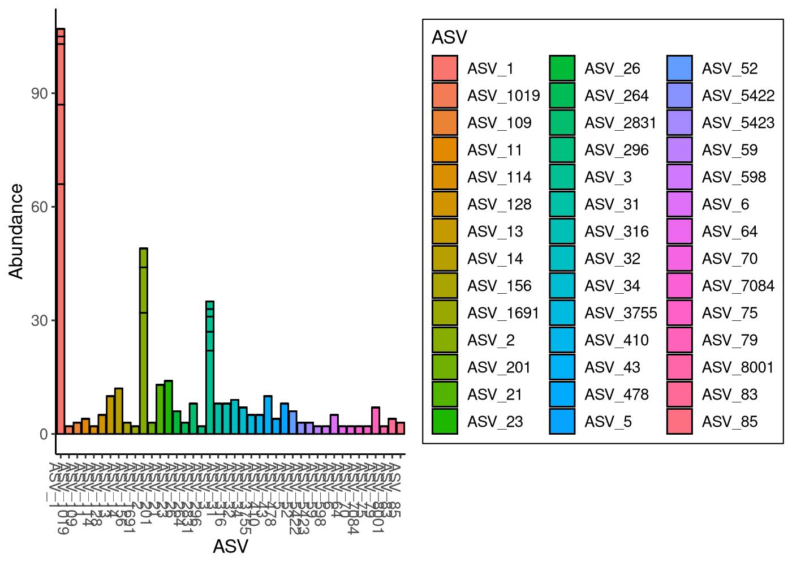
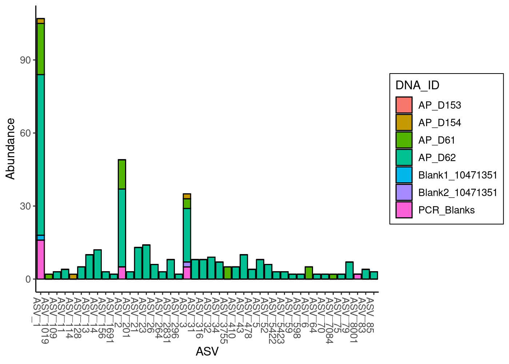
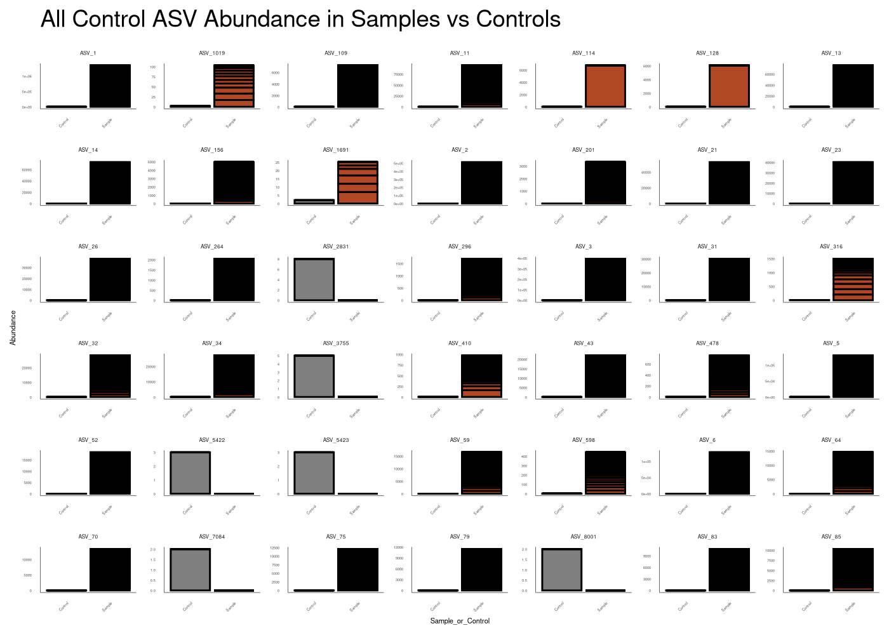
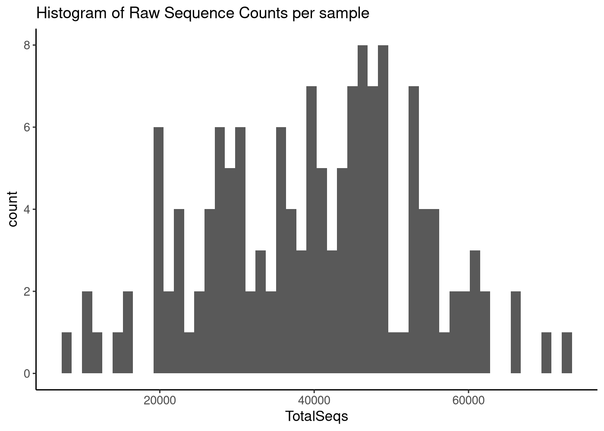
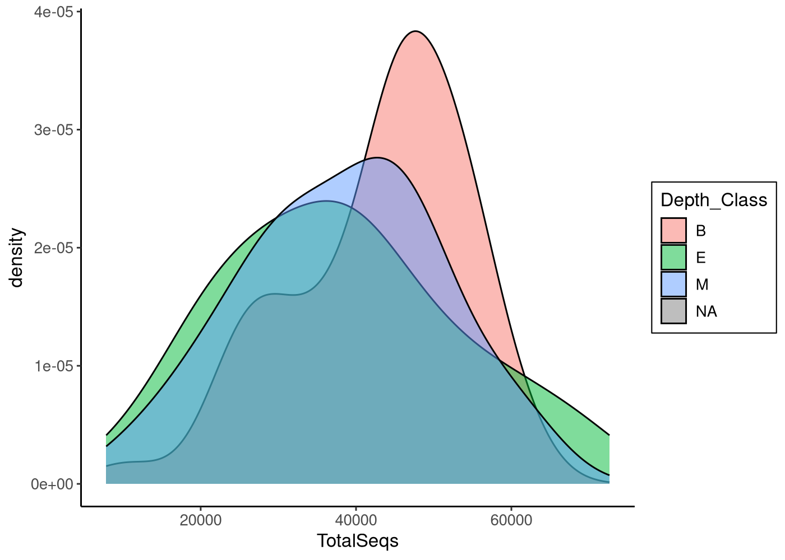
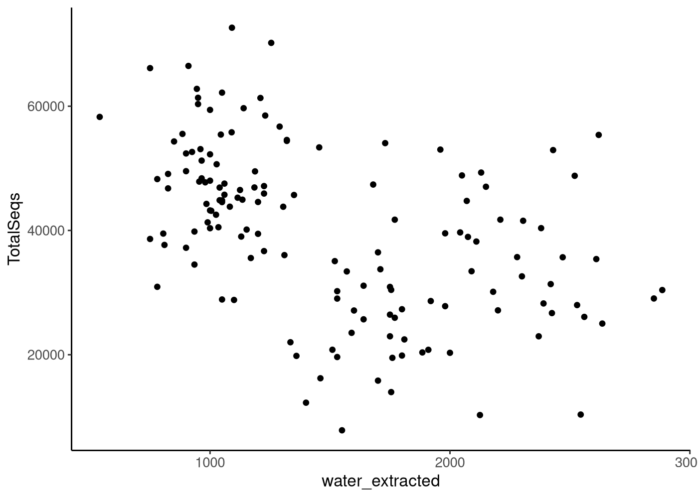

# Goals of our Pre-Processing File

We will work here in this document to remove any unncessary ASVs or samples, such as: 

1. Mitochondria ASVs. 
2. Chloroplast ASVs.  
3. Deal with the controls:  
    a. ASVs found in the controls.  
    b. Control samples themselves.  
4. Mock ASVs/Mock Community.  
5. Samples that have too few reads for reasonable ecological analysis.


## Load Packages and Functions


```r
# Load Packages
pacman::p_load(tidyverse, phyloseq, microViz, Biostrings, dada2, install = FALSE)

knitr::write_bib(file = "data/03_preprocessing_exports/packages.bib")

source("code/R/plotting_aesthetics.R")
```

## Load the data!


```r
# Load in the raw_phyloseq data from DADA2_workflow.Rmd
load("data/02_taxonomy_exports/Raw_Physeq.RData")

raw_physeq
```

```
## phyloseq-class experiment-level object
## otu_table()   OTU Table:         [ 8772 taxa and 151 samples ]
## sample_data() Sample Data:       [ 151 samples by 47 sample variables ]
## tax_table()   Taxonomy Table:    [ 8772 taxa by 9 taxonomic ranks ]
```

```r
load("data/01_dada2_exports/meta_track.RData")
```


# Remove unnecessary taxa

We will need to remove the ASVs that are mitochondria, chloroplast or within the mock community. 


```r
# Make a new phyloseq object without the mitochondria, chloroplast or mock community

noMitoChloroCJMock_physeq <- 
  raw_physeq %>%
  # Remove the mitochondria ASVs.  #NOTE THERE WAS A TYPO HERE IN CLASS! 
  subset_taxa(Family != "Mitochondria" | is.na(Family)) %>%
  # Remove the chloroplast ASVs 
  subset_taxa( Order !="Chloroplast" | is.na(Order)) %>%
  # # remove the mock community and its ASVs 
  # prune_samples(!sample_names(.) %in% c("Zymo_Mock"), .) %>%
  # Now we will remove any ASVs of count 0
  prune_taxa(taxa_sums(.) > 0, .)

# Let's take a look 
noMitoChloroCJMock_physeq
```

```
## phyloseq-class experiment-level object
## otu_table()   OTU Table:         [ 7680 taxa and 151 samples ]
## sample_data() Sample Data:       [ 151 samples by 47 sample variables ]
## tax_table()   Taxonomy Table:    [ 7680 taxa by 9 taxonomic ranks ]
```

```r
# How many taxa have we removed so far? 
num_ASVs_rm <- ntaxa(raw_physeq) - ntaxa(noMitoChloroCJMock_physeq)
cat("We removed ", num_ASVs_rm, " ASVs")
```

```
## We removed  1092  ASVs
```

```r
# Proportion of original data maintained
prop_ASV_rm <- 100* ntaxa(noMitoChloroCJMock_physeq)/ntaxa(raw_physeq)
cat("We retained ", prop_ASV_rm, "% of taxa")
```

```
## We retained  87.5513 % of taxa
```


## Remove Control samples 

Next, we will need to remove ASVs that seem to be contamination based on our controls


```r
#3. Control samples.  
# Create a vector with the control samples 
control_samples <- c("PCR_Blanks","AP_D61","AP_D62","AP_D153","AP_D154", "Blank1_10471351", "Blank2_10471351")

# Which taxa are in the control samples? 
control_physeq <- 
  noMitoChloroCJMock_physeq %>%
  # Identify control samples
  subset_samples(., (DNA_ID %in% control_samples)) %>%
  # make sure to remove the ASVs that were not in the controls 
  prune_taxa(taxa_sums(.) > 0, .)

# Check out the phyloseq object 
control_physeq
```

```
## phyloseq-class experiment-level object
## otu_table()   OTU Table:         [ 42 taxa and 7 samples ]
## sample_data() Sample Data:       [ 7 samples by 47 sample variables ]
## tax_table()   Taxonomy Table:    [ 42 taxa by 9 taxonomic ranks ]
```

```r
# vector of control ASVs
control_ASVs <- 
  data.frame(control_physeq@tax_table)$ASV

# Plot the abundance of control ASVs across the 4 samples 
control_physeq %>%
  plot_bar(., "ASV", fill = "ASV")
```



```r
# Plot the abundance of control ASVs across the 4 samples 
control_physeq %>%
  plot_bar(., "ASV", fill = "DNA_ID")
```



```r
# They are almost ALL in AP_D62

 # Make a phyloseq object with only the control ASVs in it 
 controlASVs_physeq <- 
   noMitoChloroCJMock_physeq %>%
   subset_taxa(., ASV %in% control_ASVs)
 
 # Check it out
 controlASVs_physeq
```

```
## phyloseq-class experiment-level object
## otu_table()   OTU Table:         [ 42 taxa and 151 samples ]
## sample_data() Sample Data:       [ 151 samples by 47 sample variables ]
## tax_table()   Taxonomy Table:    [ 42 taxa by 9 taxonomic ranks ]
```

```r
 # Let's take a look at the plot 
  controlASVs_physeq %>%
   ps_mutate(Sample_or_Control = ifelse(DNA_ID%in%control_samples, "Control","Sample")) %>%
   plot_bar(., "Sample_or_Control", fill="Sample_or_Control")+ 
  facet_wrap(~ASV, scales = "free") + 
   labs(title = "All Control ASV Abundance in Samples vs Controls") + 
   theme(legend.position = "none",
         axis.text.x = element_text(angle = 45, vjust = 1, hjust = 1),
         axis.title = element_text(size = 4),
         axis.text = element_text(size=2),
         strip.text = element_text(size=3),
         axis.ticks = element_blank(),
         axis.line = element_line(linewidth=0.1)) + 
     scale_fill_manual(values = sampletype_colors)
```



```r
control_table <- controlASVs_physeq %>%
  ps_mutate(Sample_or_Control = ifelse(DNA_ID%in%control_samples, "Control","Sample")) %>%
  psmelt() %>% 
  select(ASV, Sample, Abundance, Sample_or_Control, Family, Genus)

control_num <- length(control_ASVs)
sample_num <- nsamples(noMitoChloroCJMock_physeq) - control_num

sam_con_abun <- control_table %>% 
  group_by(ASV, Sample_or_Control) %>%
  summarize(abund = sum(Abundance)) %>%
  mutate(rel_abund = ifelse(Sample_or_Control == "Sample", abund/sample_num, abund/control_num))

# add taxa info
taxa_abund <- left_join(sam_con_abun, as.data.frame(controlASVs_physeq@tax_table), by = "ASV")

ASVs_to_remove <- taxa_abund %>% 
  group_by(ASV) %>%
  slice_max(rel_abund) %>%
  filter(Sample_or_Control == "Control") %>%
  pull(ASV)

# ASVs that we are dropping:
ASVs_to_remove
```

```
## [1] "ASV_2831" "ASV_3755" "ASV_5422" "ASV_5423" "ASV_7084" "ASV_8001"
```

```r
# add column indicating whether I am keeping it to visualize

## Actually remove the ASVs! 
# Create Phyloseq object that has control samples removed. 
noCONTROLSMitoChloroCJMock_physeq <- 
  noMitoChloroCJMock_physeq %>%
  subset_taxa(., !(ASV %in% ASVs_to_remove))%>%
  # Now remove control samples
  subset_samples(., (!DNA_ID %in% control_samples)) %>%
  # Remove ASVs with 0 counts. 
  prune_taxa(taxa_sums(.) > 0, .) 

# Check out the phyloseq object 
noCONTROLSMitoChloroCJMock_physeq
```

```
## phyloseq-class experiment-level object
## otu_table()   OTU Table:         [ 7674 taxa and 144 samples ]
## sample_data() Sample Data:       [ 144 samples by 47 sample variables ]
## tax_table()   Taxonomy Table:    [ 7674 taxa by 9 taxonomic ranks ]
```

```r
# After filtering we have removed a total of how many ASVs? 
total_ASVs_rm <- ntaxa(raw_physeq) - ntaxa(noCONTROLSMitoChloroCJMock_physeq)
total_ASVs_rm
```

```
## [1] 1098
```


**Removing ASVs!**  

- There were 8772 ASVs in our raw physeq

- A total of 1098 were removed in our filtering steps.

- Now, we have a total of 7674

# Evaluating reverse complements


```r
# Pull out Taxa Table
tax_table <- tax_table(noCONTROLSMitoChloroCJMock_physeq) %>% as.data.frame()

# Grab ASV Sequences and Names
asv_names <- tax_table$ASV
asv_seqs <- tax_table$ASVseqs

asv_rev_comp <- matrix(nrow=length(asv_seqs), ncol = length(asv_seqs)) # Create empty comparison matrix

rownames(asv_rev_comp) <- asv_names
colnames(asv_rev_comp) <- asv_names

asv_dna <- DNAStringSet(asv_seqs) # Convert sequences to Biostrings

asv_rev_dna <- reverseComplement(asv_dna) # Construct reverse complement

for(i in 1:length(asv_seqs)){ # For each asv sequence...
  match_vec <- asv_dna[i] == asv_rev_dna # Compare it to the reverse complement of every other sequence...
  asv_rev_comp[,i] <- match_vec # Write that logical vector as a new column 
}


cat("For",sum(asv_rev_comp) / 2,"ASVs, the reverse complement will need to be removed") # Find how many TRUEs (matches) we have, divide by 2 because each pair occurs twice
```

```
## For 0 ASVs, the reverse complement will need to be removed
```

# Evaluate the Sequencing Depth 

```r
# Calcuate the sum of the seqs in each sample
seqSums_df <- 
  noCONTROLSMitoChloroCJMock_physeq %>%
  otu_table() %>%
  # Take the sum of each column of the ASV matrix 
  colSums() %>%
  data.frame() %>%
  rownames_to_column(var = "DNA_ID")
  
# Fix column name in 2nd column 
colnames(seqSums_df)[2] <- "TotalSeqs"

seqSums_df_meta <- seqSums_df %>%
  left_join(meta_track)

# Plot it 
# histogram plot 
seqSums_df_meta %>%
  ggplot(aes(x = TotalSeqs)) + 
  geom_histogram(bins = 50) + 
  labs(title = "Histogram of Raw Sequence Counts per sample")
```



```r
seqSums_df_meta %>%
  ggplot(aes(x = TotalSeqs, fill = Depth_Class)) + 
  geom_density(alpha = 0.5)
```



```r
seqSums_df_meta %>%
  ggplot(aes(x = water_extracted, y = TotalSeqs)) + 
  geom_point()
```



```r
min <- min(seqSums_df$TotalSeqs)

min_sample <- seqSums_df$DNA_ID[seqSums_df$TotalSeqs==min]
```

# Evaluating Accuracy
 
Here, I compare which ASVs are present in our mock community, versus which ones should be:

```r
# Check the mock commmunity 
mock_physeq <- noCONTROLSMitoChloroCJMock_physeq %>%
  subset_samples(.,(DNA_ID=="Zymo_Mock")) %>%
  prune_taxa(taxa_sums(.) > 0, .)

tax_table(mock_physeq) # Look at what taxa are there
```

```
## Taxonomy Table:     [12 taxa by 9 taxonomic ranks]:
##          ASV        Kingdom    Phylum              Class                
## ASV_17   "ASV_17"   "Bacteria" "Verrucomicrobiota" "Verrucomicrobiae"   
## ASV_98   "ASV_98"   "Bacteria" "Firmicutes"        "Bacilli"            
## ASV_114  "ASV_114"  "Bacteria" "Firmicutes"        "Bacilli"            
## ASV_128  "ASV_128"  "Bacteria" "Proteobacteria"    "Gammaproteobacteria"
## ASV_130  "ASV_130"  "Bacteria" "Firmicutes"        "Bacilli"            
## ASV_148  "ASV_148"  "Bacteria" "Proteobacteria"    "Gammaproteobacteria"
## ASV_160  "ASV_160"  "Bacteria" "Firmicutes"        "Bacilli"            
## ASV_176  "ASV_176"  "Bacteria" "Firmicutes"        "Bacilli"            
## ASV_204  "ASV_204"  "Bacteria" "Proteobacteria"    "Gammaproteobacteria"
## ASV_435  "ASV_435"  "Bacteria" "Proteobacteria"    "Gammaproteobacteria"
## ASV_2504 "ASV_2504" NA         NA                  NA                   
## ASV_8487 "ASV_8487" "Bacteria" "Firmicutes"        "Bacilli"            
##          Order              Family               Genus                 
## ASV_17   "Pedosphaerales"   "Pedosphaeraceae"    "SH3-11"              
## ASV_98   "Staphylococcales" "Staphylococcaceae"  "Staphylococcus"      
## ASV_114  "Lactobacillales"  "Listeriaceae"       "Listeria"            
## ASV_128  "Enterobacterales" "Enterobacteriaceae" "Escherichia-Shigella"
## ASV_130  "Bacillales"       "Bacillaceae"        "Bacillus"            
## ASV_148  "Enterobacterales" "Enterobacteriaceae" "Salmonella"          
## ASV_160  "Lactobacillales"  "Enterococcaceae"    "Enterococcus"        
## ASV_176  "Lactobacillales"  "Lactobacillaceae"   "Limosilactobacillus" 
## ASV_204  "Pseudomonadales"  "Pseudomonadaceae"   "Pseudomonas"         
## ASV_435  "Enterobacterales" "Enterobacteriaceae" "Salmonella"          
## ASV_2504 NA                 NA                   NA                    
## ASV_8487 "Staphylococcales" "Staphylococcaceae"  "Staphylococcus"      
##          Species   
## ASV_17   NA        
## ASV_98   NA        
## ASV_114  NA        
## ASV_128  NA        
## ASV_130  NA        
## ASV_148  NA        
## ASV_160  NA        
## ASV_176  NA        
## ASV_204  NA        
## ASV_435  "enterica"
## ASV_2504 NA        
## ASV_8487 NA        
##          ASVseqs                                                                                                                                                                                                                                                       
## ASV_17   "ACAGAGGTCCCGAGCGTTGTTCGGATTCACTGGGCGTAAAGGGTGCGTAGGTGGTTGGTTAAGTTTGAGGTGAAAGCTCCGAGCTCAACTCGGAAAATGCCTTGAAGACTATCTGACTAGAGGATTGGAGGGGAGATTGGAATTCTCGGTGTAGCAGTGAAATGCGTAGATATCGAGAGGAACACCAGTGGCGAAGGCGAATCTCTGGACAATTCCTGACACTGAGGCACGAAAGCCAAGGGAGCAAACGGG"
## ASV_98   "ACGTAGGTGGCAAGCGTTATCCGGAATTATTGGGCGTAAAGCGCGCGTAGGCGGTTTTTTAAGTCTGATGTGAAAGCCCACGGCTCAACCGTGGAGGGTCATTGGAAACTGGAAAACTTGAGTGCAGAAGAGGAAAGTGGAATTCCATGTGTAGCGGTGAAATGCGCAGAGATATGGAGGAACACCAGTGGCGAAGGCGACTTTCTGGTCTGTAACTGACGCTGATGTGCGAAAGCGTGGGGATCAAACAGG"
## ASV_114  "ACGTAGGTGGCAAGCGTTGTCCGGATTTATTGGGCGTAAAGCGCGCGCAGGCGGTCTTTTAAGTCTGATGTGAAAGCCCCCGGCTTAACCGGGGAGGGTCATTGGAAACTGGAAGACTGGAGTGCAGAAGAGGAGAGTGGAATTCCACGTGTAGCGGTGAAATGCGTAGATATGTGGAGGAACACCAGTGGCGAAGGCGACTCTCTGGTCTGTAACTGACGCTGAGGCGCGAAAGCGTGGGGAGCAAACAGG"
## ASV_128  "ACGGAGGGTGCAAGCGTTAATCGGAATTACTGGGCGTAAAGCGCACGCAGGCGGTTTGTTAAGTCAGATGTGAAATCCCCGGGCTCAACCTGGGAACTGCATCTGATACTGGCAAGCTTGAGTCTCGTAGAGGGGGGTAGAATTCCAGGTGTAGCGGTGAAATGCGTAGAGATCTGGAGGAATACCGGTGGCGAAGGCGGCCCCCTGGACGAAGACTGACGCTCAGGTGCGAAAGCGTGGGGAGCAAACAGG"
## ASV_130  "ACGTAGGTGGCAAGCGTTGTCCGGAATTATTGGGCGTAAAGGGCTCGCAGGCGGTTCCTTAAGTCTGATGTGAAAGCCCCCGGCTCAACCGGGGAGGGTCATTGGAAACTGGGGAACTTGAGTGCAGAAGAGGAGAGTGGAATTCCACGTGTAGCGGTGAAATGCGTAGAGATGTGGAGGAACACCAGTGGCGAAGGCGACTCTCTGGTCTGTAACTGACGCTGAGGAGCGAAAGCGTGGGGAGCGAACAGG"
## ASV_148  "ACGGAGGGTGCAAGCGTTAATCGGAATTACTGGGCGTAAAGCGCACGCAGGCGGTCTGTCAAGTCGGATGTGAAATCCCCGGGCTCAACCTGGGAACTGCATTCGAAACTGGCAGGCTTGAGTCTTGTAGAGGGGGGTAGAATTCCAGGTGTAGCGGTGAAATGCGTAGAGATCTGGAGGAATACCGGTGGCGAAGGCGGCCCCCTGGACAAAGACTGACGCTCAGGTGCGAAAGCGTGGGGAGCAAACAGG"
## ASV_160  "ACGTAGGTGGCAAGCGTTGTCCGGATTTATTGGGCGTAAAGCGAGCGCAGGCGGTTTCTTAAGTCTGATGTGAAAGCCCCCGGCTCAACCGGGGAGGGTCATTGGAAACTGGGAGACTTGAGTGCAGAAGAGGAGAGTGGAATTCCATGTGTAGCGGTGAAATGCGTAGATATATGGAGGAACACCAGTGGCGAAGGCGGCTCTCTGGTCTGTAACTGACGCTGAGGCTCGAAAGCGTGGGGAGCAAACAGG"
## ASV_176  "ACGTAGGTGGCAAGCGTTATCCGGATTTATTGGGCGTAAAGAGAGTGCAGGCGGTTTTCTAAGTCTGATGTGAAAGCCTTCGGCTTAACCGGAGAAGTGCATCGGAAACTGGATAACTTGAGTGCAGAAGAGGGTAGTGGAACTCCATGTGTAGCGGTGGAATGCGTAGATATATGGAAGAACACCAGTGGCGAAGGCGGCTACCTGGTCTGCAACTGACGCTGAGACTCGAAAGCATGGGTAGCGAACAGG"
## ASV_204  "ACGAAGGGTGCAAGCGTTAATCGGAATTACTGGGCGTAAAGCGCGCGTAGGTGGTTCAGCAAGTTGGATGTGAAATCCCCGGGCTCAACCTGGGAACTGCATCCAAAACTACTGAGCTAGAGTACGGTAGAGGGTGGTGGAATTTCCTGTGTAGCGGTGAAATGCGTAGATATAGGAAGGAACACCAGTGGCGAAGGCGACCACCTGGACTGATACTGACACTGAGGTGCGAAAGCGTGGGGAGCAAACAGG"
## ASV_435  "ACGGAGGGTGCAAGCGTTAATCGGAATTACTGGGCGTAAAGCGCACGCAGGCGGTCTGTCAAGTCGGATGTGAAATCCCCGGGCTCAACCTGGGAACTGCATTCGAAACTGGCAGGCTTGAGTCTTGTAGAGGGGGGGAGAATTCCAGGTGTAGCGGTGAAATGCGTAGAGATCTGGAGGAATACCGGTGGCGAAGGCGGCCCCCTGGACAAAGACTGACGCTCAGGTGCGAAAGCGTGGGGAGCAAACAGG"
## ASV_2504 "TATAAGAGACAGGTGTCAGCAGCCGCGAATCGGTACGCGTAAACTGCACTATCTGCTGAACATGCAGGCCGATAAAACGCTGAATATCGGACGGGACCGTCTGTTTAATCTGCTGGGTGAATACCGGCTCCTGGTACCCGTGAAACGGGCATATCACAAAACCACCAACAGCCATCATCGCTTTTACCGGCATCCTAATCTGCTGAAACCCCCGTAGTCCCTGTCTCTTATACACATCTCCGAGCCCACGAG"
## ASV_8487 "CCGTCTTTTTCCCTCTTTCTCCTTCCTTCTTTTTCTTCCCTCTCTCGTAGTCGGTTTTTTAAGTCTGATGTGAAAGCCCACGGCTCAACCGTGGAGGGTCATTGGAAACTGGAAAACTTGAGTGCAGAAGAGGAAAGTGGAATTCCATGTGTAGCGGTGAAATGCGCAGAGATATGGAGGAACACCAGTGGCGAAGGCGACTTTCTGGTCTGTAACTGACGCTGATGTGCGAAAGCGTGGGGATCAAACAGG"
```

```r
otu_matrix <- otu_table(mock_physeq) %>% as.matrix() # Will use this matrix later

cat("DADA2 inferred", ntaxa(mock_physeq), "ASVs present in the Mock Community.")
```

```
## DADA2 inferred 12 ASVs present in the Mock Community.
```

```r
#Who are they in the mock community? 

mock_seqs <- tax_table(mock_physeq) %>%
  as.data.frame() %>%
  select(ASV, ASVseqs)


#### Compare our ASVs from the mock community to the reference fasta!
mock_reference <- getSequences("data/03_preprocessing_exports/mock_amplicons.fasta")

matches <- mock_seqs %>%
  rowwise() %>%
  mutate(Match = any(grepl(ASVseqs, mock_reference))) # Check each asv to the mock references

match_asv <- matches %>%
  filter(Match) %>%
  pull(ASV) # Pull out asvs that did match reference

nonmatch_asv <- matches %>%
  filter(!Match) %>%
  pull(ASV) # Pull out asvs that didn't match reference

total_mock_reads <- sum(otu_matrix)
matched_reads <- sum(otu_matrix[match_asv])
err_reads <- sum(otu_matrix[nonmatch_asv])


cat("DADA2 inferred ", length(nonmatch_asv), "erroneous ASVs out of the mock community")
```

```
## DADA2 inferred  3 erroneous ASVs out of the mock community
```

```r
cat("Erroneous matches represented ", 100*err_reads/total_mock_reads, "% of total reads in the mock")
```

```
## Erroneous matches represented  0.03214125 % of total reads in the mock
```

There were 3 erroneous ASVs inferred, including a fairly abundant Verruco (contamination, maybe) and then a low abundance unassigned (sequencing error, perhaps) and a staphylococcal ASV that may have been contamination from processing

See if the Verruco ASV gets removed

Our minimum number of seqs is 7837, which occurs in sample AP_D33. Our maximum is 7.2633\times 10^{4}


# Save preprocessed phyloseq!

```r
preprocessed_physeq <- noCONTROLSMitoChloroCJMock_physeq %>%
  subset_samples(.,(DNA_ID!="Zymo_Mock"))
save(preprocessed_physeq, file = "data/03_preprocessing_exports/preprocessed_physeq.RData")
```


# Session Information 

```r
# Reproducibility
devtools::session_info()
```

```
## ─ Session info ───────────────────────────────────────────────────────────────
##  setting  value
##  version  R version 4.3.3 (2024-02-29)
##  os       Rocky Linux 9.5 (Blue Onyx)
##  system   x86_64, linux-gnu
##  ui       X11
##  language (EN)
##  collate  en_US.UTF-8
##  ctype    en_US.UTF-8
##  tz       America/New_York
##  date     2025-06-26
##  pandoc   3.1.1 @ /usr/lib/rstudio-server/bin/quarto/bin/tools/ (via rmarkdown)
## 
## ─ Packages ───────────────────────────────────────────────────────────────────
##  ! package              * version   date (UTC) lib source
##  P abind                  1.4-5     2016-07-21 [?] CRAN (R 4.3.2)
##  P ade4                   1.7-22    2023-02-06 [?] CRAN (R 4.3.2)
##  P ape                    5.7-1     2023-03-13 [?] CRAN (R 4.3.2)
##  P Biobase                2.62.0    2023-10-24 [?] Bioconductor
##  P BiocGenerics         * 0.48.1    2023-11-01 [?] Bioconductor
##  P BiocManager            1.30.22   2023-08-08 [?] CRAN (R 4.3.2)
##  P BiocParallel           1.36.0    2023-10-24 [?] Bioconductor
##  P biomformat             1.30.0    2023-10-24 [?] Bioconductor
##  P Biostrings           * 2.70.1    2023-10-25 [?] Bioconductor
##  P bitops                 1.0-7     2021-04-24 [?] CRAN (R 4.3.2)
##  P bslib                  0.5.1     2023-08-11 [?] CRAN (R 4.3.2)
##  P cachem                 1.0.8     2023-05-01 [?] CRAN (R 4.3.2)
##  P callr                  3.7.3     2022-11-02 [?] CRAN (R 4.3.2)
##  P cli                    3.6.1     2023-03-23 [?] CRAN (R 4.3.2)
##  P cluster                2.1.4     2022-08-22 [?] CRAN (R 4.3.2)
##  P codetools              0.2-19    2023-02-01 [?] CRAN (R 4.3.3)
##  P colorspace             2.1-0     2023-01-23 [?] CRAN (R 4.3.2)
##  P crayon                 1.5.2     2022-09-29 [?] CRAN (R 4.3.2)
##  P dada2                * 1.30.0    2023-10-24 [?] Bioconductor
##  P data.table             1.15.2    2024-02-29 [?] CRAN (R 4.3.2)
##  P DelayedArray           0.28.0    2023-10-24 [?] Bioconductor
##  P deldir                 2.0-4     2024-02-28 [?] CRAN (R 4.3.2)
##  P devtools               2.4.4     2022-07-20 [?] CRAN (R 4.2.1)
##  P digest                 0.6.33    2023-07-07 [?] CRAN (R 4.3.2)
##  P dplyr                * 1.1.3     2023-09-03 [?] CRAN (R 4.3.2)
##  P ellipsis               0.3.2     2021-04-29 [?] CRAN (R 4.3.2)
##  P evaluate               0.23      2023-11-01 [?] CRAN (R 4.3.2)
##  P fansi                  1.0.5     2023-10-08 [?] CRAN (R 4.3.2)
##  P farver                 2.1.1     2022-07-06 [?] CRAN (R 4.3.2)
##  P fastmap                1.1.1     2023-02-24 [?] CRAN (R 4.3.2)
##  P forcats              * 1.0.0     2023-01-29 [?] CRAN (R 4.3.2)
##  P foreach                1.5.2     2022-02-02 [?] CRAN (R 4.3.2)
##  P fs                     1.6.3     2023-07-20 [?] CRAN (R 4.3.2)
##  P generics               0.1.3     2022-07-05 [?] CRAN (R 4.3.2)
##  P GenomeInfoDb         * 1.38.0    2023-10-24 [?] Bioconductor
##  P GenomeInfoDbData       1.2.11    2023-11-07 [?] Bioconductor
##  P GenomicAlignments      1.38.2    2024-01-16 [?] Bioconduc~
##  P GenomicRanges          1.54.1    2023-10-29 [?] Bioconductor
##  P ggplot2              * 3.5.0     2024-02-23 [?] CRAN (R 4.3.2)
##  P glue                   1.6.2     2022-02-24 [?] CRAN (R 4.3.2)
##  P gtable                 0.3.4     2023-08-21 [?] CRAN (R 4.3.2)
##  P highr                  0.10      2022-12-22 [?] CRAN (R 4.3.2)
##  P hms                    1.1.3     2023-03-21 [?] CRAN (R 4.3.2)
##  P htmltools              0.5.7     2023-11-03 [?] CRAN (R 4.3.2)
##  P htmlwidgets            1.6.2     2023-03-17 [?] CRAN (R 4.3.2)
##  P httpuv                 1.6.12    2023-10-23 [?] CRAN (R 4.3.2)
##  P hwriter                1.3.2.1   2022-04-08 [?] CRAN (R 4.3.2)
##  P igraph                 1.5.1     2023-08-10 [?] CRAN (R 4.3.2)
##  P interp                 1.1-6     2024-01-26 [?] CRAN (R 4.3.2)
##  P IRanges              * 2.36.0    2023-10-24 [?] Bioconductor
##  P iterators              1.0.14    2022-02-05 [?] CRAN (R 4.3.2)
##  P jpeg                   0.1-10    2022-11-29 [?] CRAN (R 4.3.2)
##  P jquerylib              0.1.4     2021-04-26 [?] CRAN (R 4.3.2)
##  P jsonlite               1.8.7     2023-06-29 [?] CRAN (R 4.3.2)
##  P knitr                  1.45      2023-10-30 [?] CRAN (R 4.3.2)
##  P labeling               0.4.3     2023-08-29 [?] CRAN (R 4.3.2)
##  P later                  1.3.1     2023-05-02 [?] CRAN (R 4.3.2)
##  P lattice                0.21-9    2023-10-01 [?] CRAN (R 4.3.2)
##  P latticeExtra           0.6-30    2022-07-04 [?] CRAN (R 4.3.2)
##  P lifecycle              1.0.3     2022-10-07 [?] CRAN (R 4.3.2)
##  P lubridate            * 1.9.3     2023-09-27 [?] CRAN (R 4.3.2)
##  P magrittr               2.0.3     2022-03-30 [?] CRAN (R 4.3.2)
##  P MASS                   7.3-60    2023-05-04 [?] CRAN (R 4.3.2)
##  P Matrix                 1.6-1.1   2023-09-18 [?] CRAN (R 4.3.2)
##  P MatrixGenerics         1.14.0    2023-10-24 [?] Bioconductor
##  P matrixStats            1.2.0     2023-12-11 [?] CRAN (R 4.3.2)
##  P memoise                2.0.1     2021-11-26 [?] CRAN (R 4.3.2)
##  P mgcv                   1.9-0     2023-07-11 [?] CRAN (R 4.3.2)
##  P microViz             * 0.12.1    2024-03-05 [?] https://d~
##  P mime                   0.12      2021-09-28 [?] CRAN (R 4.3.2)
##  P miniUI                 0.1.1.1   2018-05-18 [?] CRAN (R 4.3.2)
##  P multtest               2.58.0    2023-10-24 [?] Bioconductor
##  P munsell                0.5.0     2018-06-12 [?] CRAN (R 4.3.2)
##  P NatParksPalettes     * 0.2.0     2022-10-09 [?] CRAN (R 4.3.2)
##  P nlme                   3.1-163   2023-08-09 [?] CRAN (R 4.3.2)
##  P pacman                 0.5.1     2019-03-11 [?] CRAN (R 4.3.2)
##  P permute                0.9-7     2022-01-27 [?] CRAN (R 4.3.2)
##  P phyloseq             * 1.46.0    2023-10-24 [?] Bioconductor
##  P pillar                 1.9.0     2023-03-22 [?] CRAN (R 4.3.2)
##  P pkgbuild               1.4.2     2023-06-26 [?] CRAN (R 4.3.2)
##  P pkgconfig              2.0.3     2019-09-22 [?] CRAN (R 4.3.2)
##  P pkgload                1.3.3     2023-09-22 [?] CRAN (R 4.3.2)
##  P plyr                   1.8.9     2023-10-02 [?] CRAN (R 4.3.2)
##  P png                    0.1-8     2022-11-29 [?] CRAN (R 4.3.2)
##  P prettyunits            1.2.0     2023-09-24 [?] CRAN (R 4.3.2)
##  P processx               3.8.2     2023-06-30 [?] CRAN (R 4.3.2)
##  P profvis                0.3.8     2023-05-02 [?] CRAN (R 4.3.2)
##  P promises               1.2.1     2023-08-10 [?] CRAN (R 4.3.2)
##  P ps                     1.7.5     2023-04-18 [?] CRAN (R 4.3.2)
##  P purrr                * 1.0.2     2023-08-10 [?] CRAN (R 4.3.2)
##  P R6                     2.5.1     2021-08-19 [?] CRAN (R 4.3.2)
##  P RColorBrewer           1.1-3     2022-04-03 [?] CRAN (R 4.3.2)
##  P Rcpp                 * 1.0.11    2023-07-06 [?] CRAN (R 4.3.2)
##  P RcppParallel           5.1.7     2023-02-27 [?] CRAN (R 4.3.2)
##  P RCurl                  1.98-1.13 2023-11-02 [?] CRAN (R 4.3.2)
##  P readr                * 2.1.5     2024-01-10 [?] CRAN (R 4.3.2)
##  P remotes                2.4.2.1   2023-07-18 [?] CRAN (R 4.3.2)
##    renv                   1.0.5     2024-02-29 [1] CRAN (R 4.3.2)
##  P reshape2               1.4.4     2020-04-09 [?] CRAN (R 4.3.2)
##  P rhdf5                  2.46.1    2023-11-29 [?] Bioconduc~
##  P rhdf5filters           1.14.1    2023-11-06 [?] Bioconductor
##  P Rhdf5lib               1.24.2    2024-02-07 [?] Bioconduc~
##  P rlang                  1.1.2     2023-11-04 [?] CRAN (R 4.3.2)
##  P rmarkdown              2.25      2023-09-18 [?] CRAN (R 4.3.2)
##  P Rsamtools              2.18.0    2023-10-24 [?] Bioconductor
##  P rstudioapi             0.15.0    2023-07-07 [?] CRAN (R 4.3.2)
##  P S4Arrays               1.2.0     2023-10-24 [?] Bioconductor
##  P S4Vectors            * 0.40.1    2023-10-26 [?] Bioconductor
##  P sass                   0.4.7     2023-07-15 [?] CRAN (R 4.3.2)
##  P scales                 1.3.0     2023-11-28 [?] CRAN (R 4.3.2)
##  P sessioninfo            1.2.2     2021-12-06 [?] CRAN (R 4.3.2)
##  P shiny                  1.7.5.1   2023-10-14 [?] CRAN (R 4.3.2)
##  P ShortRead              1.60.0    2023-10-24 [?] Bioconductor
##  P SparseArray            1.2.4     2024-02-11 [?] Bioconduc~
##  P stringi                1.7.12    2023-01-11 [?] CRAN (R 4.3.2)
##  P stringr              * 1.5.0     2022-12-02 [?] CRAN (R 4.3.2)
##  P SummarizedExperiment   1.32.0    2023-10-24 [?] Bioconductor
##  P survival               3.5-8     2024-02-14 [?] CRAN (R 4.3.3)
##  P tibble               * 3.2.1     2023-03-20 [?] CRAN (R 4.3.2)
##  P tidyr                * 1.3.1     2024-01-24 [?] CRAN (R 4.3.2)
##  P tidyselect             1.2.0     2022-10-10 [?] CRAN (R 4.3.2)
##  P tidyverse            * 2.0.0     2023-02-22 [?] CRAN (R 4.3.2)
##  P timechange             0.3.0     2024-01-18 [?] CRAN (R 4.3.2)
##  P tzdb                   0.4.0     2023-05-12 [?] CRAN (R 4.3.2)
##  P urlchecker             1.0.1     2021-11-30 [?] CRAN (R 4.3.2)
##  P usethis                2.2.2     2023-07-06 [?] CRAN (R 4.3.2)
##  P utf8                   1.2.4     2023-10-22 [?] CRAN (R 4.3.2)
##  P vctrs                  0.6.4     2023-10-12 [?] CRAN (R 4.3.2)
##  P vegan                  2.6-4     2022-10-11 [?] CRAN (R 4.3.2)
##  P withr                  2.5.2     2023-10-30 [?] CRAN (R 4.3.2)
##  P xfun                   0.52      2025-04-02 [?] CRAN (R 4.3.3)
##  P xtable                 1.8-4     2019-04-21 [?] CRAN (R 4.3.2)
##  P XVector              * 0.42.0    2023-10-24 [?] Bioconductor
##  P yaml                   2.3.7     2023-01-23 [?] CRAN (R 4.3.2)
##  P zlibbioc               1.48.0    2023-10-24 [?] Bioconductor
## 
##  [1] /local/workdir/arp277/Pendleton_2025_Ontario_Publication_Repo/renv/library/R-4.3/x86_64-pc-linux-gnu
##  [2] /home/arp277/.cache/R/renv/sandbox/R-4.3/x86_64-pc-linux-gnu/fd835031
## 
##  P ── Loaded and on-disk path mismatch.
## 
## ──────────────────────────────────────────────────────────────────────────────
```

