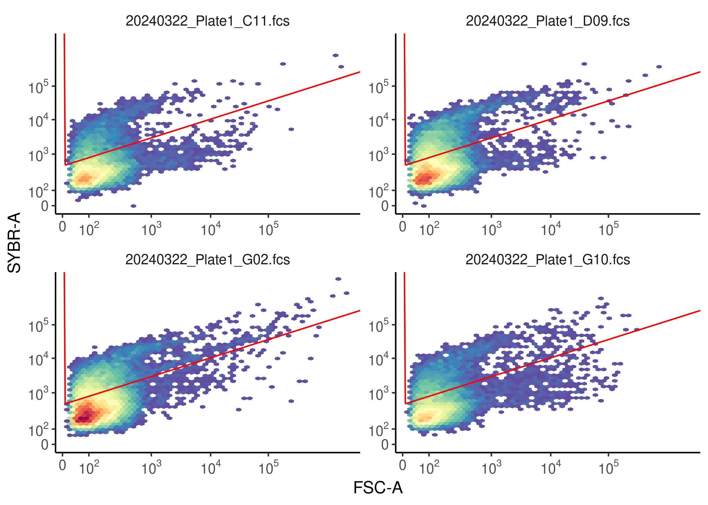
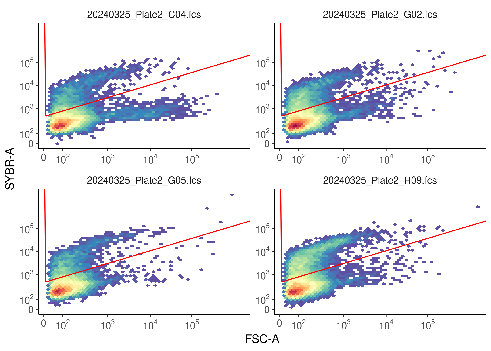
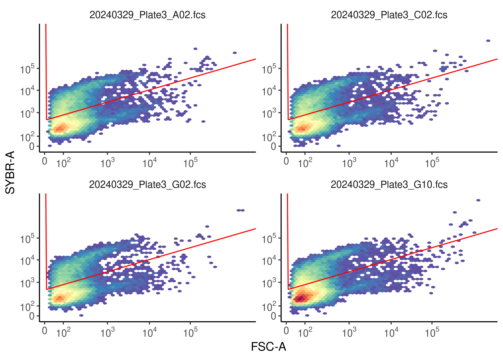
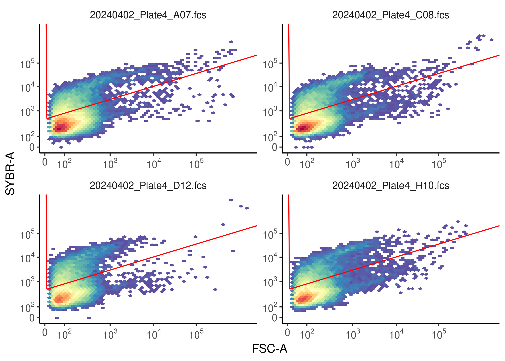
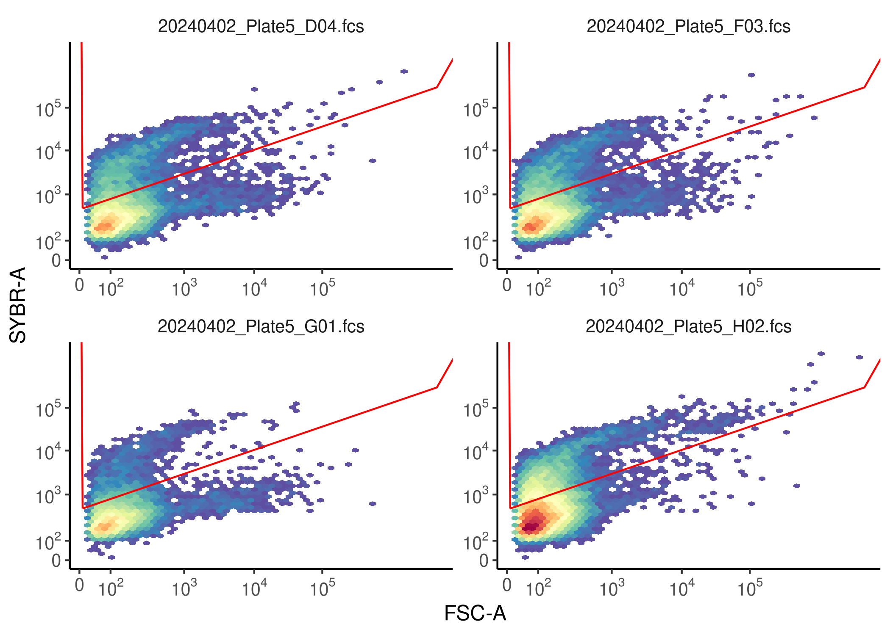
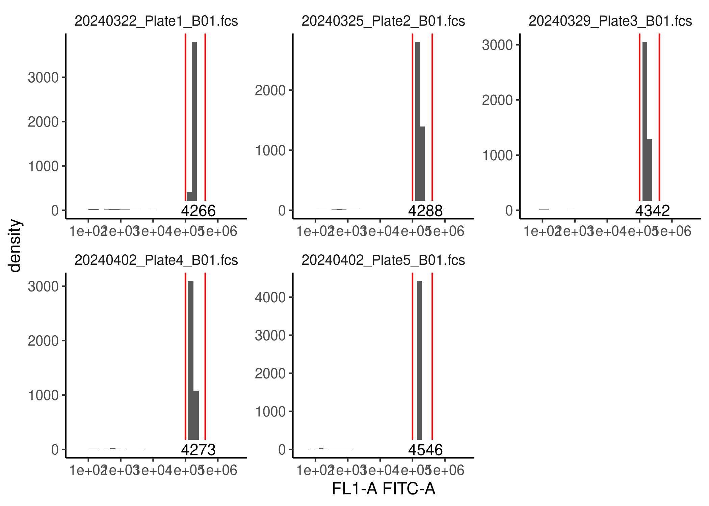
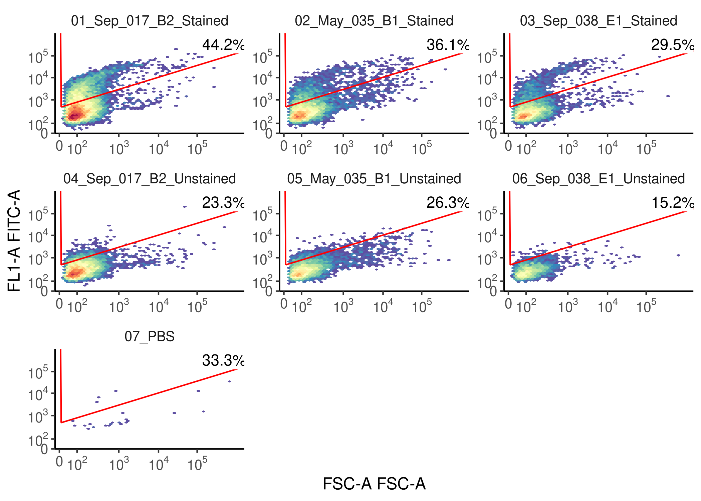

<style>
pre code, pre, code {
  white-space: pre !important;
  overflow-x: scroll !important;
  word-break: keep-all !important;
  word-wrap: initial !important;
}
</style>


## Purpose of this document

To analyze flow cytometry data so as to provide absolute abundance estimation for Lake Ontario samples. Note that in our original project layout, these files were in separate folders (labeled as Date_Plate) and then within each folder was data from that run. In the future, this is incompatible with uploads to FlowRepository, or other storage. So now I've switched the analyses to reference those FlowRepository files directly. I have more ideas as to how to make this less painful for our lab in the future.

First, let's load packages and previous data:


```r
pacman::p_load(tidyverse, patchwork, flowCore, ggcyto, fun.gus, flow.gus, ggpubr, install = FALSE)

knitr::write_bib(file = "data/04_cytometry_exports/packages.bib")

source("code/R/plotting_aesthetics.R")

load("data/01_dada2_exports/meta_track.RData")
```


## Finding FCS files:

This assumes you have downloaded the files from FlowRepository (#FR-FCM-Z8SJ) into data/04_cytometry_exports/fcs_files/


```r
flow_files <- list.files("data/04_cytometry_exports/fcs_files", ".fcs", full.names = T)

well_files <- list.files("data/04_cytometry_exports/fcs_files", "WellMap.csv",  full.names = T)

well_plates <- basename(well_files) %>%
  str_extract("Plate.")

well_maps <- map(well_files, read_csv)

names(well_maps) <- well_plates

beads <- flow_files[str_detect(flow_files, "B01.fcs")]

pbs_bead_wells <- map(well_maps, \(x){
  x %>%
    dplyr::filter(str_detect(Sample_ID, "(?i)PBS|BEADS")) %>%
    pull(Well)
})

pbs_bead_files <- map2(pbs_bead_wells, well_plates, \(x,y)paste(y,x, sep = "_")) %>%
  unlist() %>%
  str_flatten(collapse = "|")

drop_pbs_and_beads <- flow_files[-str_which(flow_files, pbs_bead_files)]

plates <- drop_pbs_and_beads %>%
  basename() %>%
  str_extract("Plate.")

grouped_plates <- data.frame(file = drop_pbs_and_beads,
           plate = plates) %>%
  group_by(plate)

split_flowsets <- grouped_plates %>%
  group_split()

names(split_flowsets) <- unlist(group_keys(grouped_plates))

flowsets <- map(split_flowsets, \(x)read.flowSet(x$file))
```


## Specifying experiment-wide variables


```r
load("data/04_cytometry_exports/fcs_files/g1_FL1_v_FSC.RData")

glut_dilution <- 1002.5/1000

sybr_dilution <- 204/200

manual_dilution <- 20
```

This gate selects the stained region of cells which excluded most unstained cells, and was well above noise in the blank samples

## Plotting a random subset


```r
set.seed(31491)

rand_flows <- map(flowsets, sample, size = 4)

map(rand_flows, \(f){
  ggcyto(f, aes(x = "FSC-A", y = "FL1-A")) + 
    geom_hex(bins = 50) + 
    scale_x_logicle() + 
    scale_y_logicle() + 
    geom_gate(g1_FL1_v_FSC) + 
    labs(x = "FSC-A", y = "SYBR-A")
})
```

```
## $Plate1
```



```
## 
## $Plate2
```



```
## 
## $Plate3
```



```
## 
## $Plate4
```



```
## 
## $Plate5
```



## Working with beads


```r
bead_flowset <- read.flowSet(beads)

load("data/04_cytometry_exports/fcs_files/g2_beads_FL1.RData")

ggcyto(bead_flowset, aes(x = "FL1-A")) + 
  geom_histogram() + 
  scale_x_log10() + 
  geom_gate(g2_beads_FL1) + 
  geom_stats(type = "count")
```



```r
# Let's calculate counts

bead_events <- count_gated_events(bead_flowset, g2_beads_FL1)
```

```
## filter summary for frame '20240322_Plate1_B01.fcs'
##  g2_beads_FL1+: 4266 of 4516 events (94.46%)
## 
## filter summary for frame '20240325_Plate2_B01.fcs'
##  g2_beads_FL1+: 4288 of 4417 events (97.08%)
## 
## filter summary for frame '20240329_Plate3_B01.fcs'
##  g2_beads_FL1+: 4342 of 4416 events (98.32%)
## 
## filter summary for frame '20240402_Plate4_B01.fcs'
##  g2_beads_FL1+: 4273 of 4406 events (96.98%)
## 
## filter summary for frame '20240402_Plate5_B01.fcs'
##  g2_beads_FL1+: 4546 of 4706 events (96.60%)
```

```r
beads_per_50ul <- bead_events$gated * 10

actual_beads <- 0.51*10^5

error_rate <- round((beads_per_50ul - actual_beads) / actual_beads, 3) * 100

volume_sampled <- beads_per_50ul / (actual_beads / 50)

mean_volume_sampled <- mean(volume_sampled)

sem <- sd(volume_sampled) / sqrt(length(volume_sampled))
```

Our error rates for bead counts are -16.4, -15.9, -14.9, -16.2, -10.9%. This is within the level of error the machine recommends. This means we are only sampling 41.8235294, 42.0392157, 42.5686275, 41.8921569, 44.5686275uL in each well. So we'll assume an average sampling volume of 42.5784314uL +/- 0.514421

# Calculating cell counts


```r
event_counts <- map(flowsets, flow.gus::count_gated_events, g1_FL1_v_FSC)

cell_counts <- map2_dfr(event_counts, well_maps[names(event_counts)], \(flo, wm){
  flo %>%
    mutate(Well = str_remove(sample, ".fcs"),
           Well = str_remove(Well, "2024...._Plate..")) %>%
    left_join(wm) %>%
    mutate(cells_per_uL = gated / mean_volume_sampled * sybr_dilution * manual_dilution * glut_dilution,
           cells_per_ml = cells_per_uL * 1000,
           cell_per_uL_ungated = initial / mean_volume_sampled * sybr_dilution * manual_dilution * glut_dilution)
})

write_csv(cell_counts, file = "data/04_cytometry_exports/cell_counts.csv")
```

# Matching cell counts to metadata


```r
# Read in some metadata for flow samples
samp_to_deploy <- read_csv("data/04_cytometry_exports/samp_to_deploy.csv")

counts_with_deploy <- cell_counts %>%
  group_by(Sample_ID) %>%
  summarize(avg_cells_per_ml = mean(cells_per_ml)) %>%
  left_join(samp_to_deploy, na_matches = "never") %>%
  mutate(Replicate = as.numeric(str_sub(Sample_ID, -1)),
         Replicate = case_when(Sample_ID == "AAH_ONT_20230519_017_FC_E1" ~ 3, # These had four replicates technicall, so need to do a bit of tweaking
                                Sample_ID == "AAH_ONT_20230519_017_FC_E2" ~ 4,
                                TRUE ~ Replicate)) %>%
  select(-Sample_ID)


meta_with_ccs <- meta_track %>%
  left_join(counts_with_deploy, na_matches = "never")
```

## Saving data


```r
save(meta_with_ccs, file = "data/04_cytometry_exports/meta_with_ccs.RData")
```

# Background Work

## Determining FSC-A vs FITC-A gate


```r
all_files <- list.files("data/04_cytometry_exports/unstained_vs_stained/", ".fcs")

relevant_files <- all_files[all_files %in% c("D01.fcs","D02.fcs","D03.fcs", "C02.fcs","C05.fcs","C08.fcs", "A02.fcs")]

f_set <- read.flowSet(paste0("data/04_cytometry_exports/unstained_vs_stained/",relevant_files))

f_set_renamed <- flow.gus::rename_flowset_samples(f_set, c("07_PBS","01_Sep_017_B2_Stained","02_May_035_B1_Stained","03_Sep_038_E1_Stained",
                                         "04_Sep_017_B2_Unstained","05_May_035_B1_Unstained","06_Sep_038_E1_Unstained"))


ggcyto(f_set_renamed, aes(x = "FSC-A",y = "FL1-A")) + 
  geom_hex(bins = 50) +
  scale_x_logicle() + 
  scale_y_logicle()+
  geom_gate(g1_FL1_v_FSC) + 
  geom_stats(type = "percent")
```



# Session Info


```r
sessioninfo::session_info()
```

```
## ─ Session info ─────────────────────────────────────────────────────────────────────────────────────────────────────────────────────────────────────────────────────────────────────────────────────────────────────────────────────────────────────────
##  setting  value
##  version  R version 4.3.3 (2024-02-29)
##  os       Rocky Linux 9.5 (Blue Onyx)
##  system   x86_64, linux-gnu
##  ui       X11
##  language (EN)
##  collate  en_US.UTF-8
##  ctype    en_US.UTF-8
##  tz       America/New_York
##  date     2025-07-01
##  pandoc   3.1.1 @ /usr/lib/rstudio-server/bin/quarto/bin/tools/ (via rmarkdown)
## 
## ─ Packages ─────────────────────────────────────────────────────────────────────────────────────────────────────────────────────────────────────────────────────────────────────────────────────────────────────────────────────────────────────────────
##  ! package          * version     date (UTC) lib source
##  P abind              1.4-5       2016-07-21 [?] CRAN (R 4.3.2)
##  P ade4               1.7-22      2023-02-06 [?] CRAN (R 4.3.2)
##  P ape                5.7-1       2023-03-13 [?] CRAN (R 4.3.2)
##  P backports          1.4.1       2021-12-13 [?] CRAN (R 4.3.2)
##  P BH               * 1.84.0-0    2024-01-10 [?] CRAN (R 4.3.2)
##  P Biobase            2.62.0      2023-10-24 [?] Bioconductor
##  P BiocGenerics       0.48.1      2023-11-01 [?] Bioconductor
##  P BiocManager        1.30.22     2023-08-08 [?] CRAN (R 4.3.2)
##  P biomformat         1.30.0      2023-10-24 [?] Bioconductor
##  P Biostrings         2.70.1      2023-10-25 [?] Bioconductor
##  P bit                4.0.5       2022-11-15 [?] CRAN (R 4.3.2)
##  P bit64              4.0.5       2020-08-30 [?] CRAN (R 4.3.2)
##  P bitops             1.0-7       2021-04-24 [?] CRAN (R 4.3.2)
##  P broom              1.0.5       2023-06-09 [?] CRAN (R 4.3.2)
##  P bslib              0.5.1       2023-08-11 [?] CRAN (R 4.3.2)
##  P cachem             1.0.8       2023-05-01 [?] CRAN (R 4.3.2)
##  P car                3.1-2       2023-03-30 [?] CRAN (R 4.3.2)
##  P carData            3.0-5       2022-01-06 [?] CRAN (R 4.3.2)
##  P cli                3.6.1       2023-03-23 [?] CRAN (R 4.3.2)
##  P cluster            2.1.4       2022-08-22 [?] CRAN (R 4.3.2)
##  P codetools          0.2-19      2023-02-01 [?] CRAN (R 4.3.3)
##  P colorspace         2.1-0       2023-01-23 [?] CRAN (R 4.3.2)
##  P crayon             1.5.2       2022-09-29 [?] CRAN (R 4.3.2)
##  P cytolib            2.14.1      2024-01-18 [?] Bioconduc~
##  P data.table         1.15.2      2024-02-29 [?] CRAN (R 4.3.2)
##  P digest             0.6.33      2023-07-07 [?] CRAN (R 4.3.2)
##  P dplyr            * 1.1.3       2023-09-03 [?] CRAN (R 4.3.2)
##  P ellipsis           0.3.2       2021-04-29 [?] CRAN (R 4.3.2)
##  P evaluate           0.23        2023-11-01 [?] CRAN (R 4.3.2)
##  P fansi              1.0.5       2023-10-08 [?] CRAN (R 4.3.2)
##  P farver             2.1.1       2022-07-06 [?] CRAN (R 4.3.2)
##  P fastmap            1.1.1       2023-02-24 [?] CRAN (R 4.3.2)
##  P flow.gus         * 0.1.2       2025-04-30 [?] Github (MarschmiLab/flow.gus@445fd2d)
##  P flowCore         * 2.14.2      2024-03-18 [?] Bioconduc~
##  P flowWorkspace    * 4.14.3      2024-03-18 [?] Bioconductor 3.18 (R 4.3.2)
##  P forcats          * 1.0.0       2023-01-29 [?] CRAN (R 4.3.2)
##  P foreach            1.5.2       2022-02-02 [?] CRAN (R 4.3.2)
##  P fun.gus          * 0.3.1       2025-06-26 [?] Github (MarschmiLab/fun.gus@7daa3fa)
##  P furrr              0.3.1       2022-08-15 [?] CRAN (R 4.3.2)
##  P future             1.33.1      2023-12-22 [?] CRAN (R 4.3.3)
##  P generics           0.1.3       2022-07-05 [?] CRAN (R 4.3.2)
##  P GenomeInfoDb       1.38.0      2023-10-24 [?] Bioconductor
##  P GenomeInfoDbData   1.2.11      2023-11-07 [?] Bioconductor
##  P ggcyto           * 1.30.2      2024-03-03 [?] Bioconductor 3.18 (R 4.3.2)
##  P ggplot2          * 3.5.0       2024-02-23 [?] CRAN (R 4.3.2)
##  P ggpubr           * 0.6.0       2023-02-10 [?] CRAN (R 4.3.2)
##  P ggsignif           0.6.4       2022-10-13 [?] CRAN (R 4.3.2)
##  P globals            0.16.2      2022-11-21 [?] CRAN (R 4.3.3)
##  P glue               1.6.2       2022-02-24 [?] CRAN (R 4.3.2)
##  P graph              1.80.0      2023-10-24 [?] Bioconductor
##  P gridExtra          2.3         2017-09-09 [?] CRAN (R 4.3.2)
##  P gtable             0.3.4       2023-08-21 [?] CRAN (R 4.3.2)
##  P hexbin             1.28.3      2023-03-21 [?] CRAN (R 4.3.3)
##  P highr              0.10        2022-12-22 [?] CRAN (R 4.3.2)
##  P hms                1.1.3       2023-03-21 [?] CRAN (R 4.3.2)
##  P htmltools          0.5.7       2023-11-03 [?] CRAN (R 4.3.2)
##  P httpuv             1.6.12      2023-10-23 [?] CRAN (R 4.3.2)
##  P igraph             1.5.1       2023-08-10 [?] CRAN (R 4.3.2)
##  P IRanges            2.36.0      2023-10-24 [?] Bioconductor
##  P iterators          1.0.14      2022-02-05 [?] CRAN (R 4.3.2)
##  P jquerylib          0.1.4       2021-04-26 [?] CRAN (R 4.3.2)
##  P jsonlite           1.8.7       2023-06-29 [?] CRAN (R 4.3.2)
##  P knitr              1.45        2023-10-30 [?] CRAN (R 4.3.2)
##  P labeling           0.4.3       2023-08-29 [?] CRAN (R 4.3.2)
##  P later              1.3.1       2023-05-02 [?] CRAN (R 4.3.2)
##  P lattice            0.21-9      2023-10-01 [?] CRAN (R 4.3.2)
##  P lifecycle          1.0.3       2022-10-07 [?] CRAN (R 4.3.2)
##  P listenv            0.9.1       2024-01-29 [?] CRAN (R 4.3.2)
##  P lubridate        * 1.9.3       2023-09-27 [?] CRAN (R 4.3.2)
##  P magrittr           2.0.3       2022-03-30 [?] CRAN (R 4.3.2)
##  P MASS               7.3-60      2023-05-04 [?] CRAN (R 4.3.2)
##  P Matrix             1.6-1.1     2023-09-18 [?] CRAN (R 4.3.2)
##  P matrixStats        1.2.0       2023-12-11 [?] CRAN (R 4.3.2)
##  P mgcv               1.9-0       2023-07-11 [?] CRAN (R 4.3.2)
##  P mime               0.12        2021-09-28 [?] CRAN (R 4.3.2)
##  P multtest           2.58.0      2023-10-24 [?] Bioconductor
##  P munsell            0.5.0       2018-06-12 [?] CRAN (R 4.3.2)
##  P NatParksPalettes * 0.2.0       2022-10-09 [?] CRAN (R 4.3.2)
##  P ncdfFlow         * 2.48.0      2023-10-24 [?] Bioconductor
##  P nlme               3.1-163     2023-08-09 [?] CRAN (R 4.3.2)
##  P pacman             0.5.1       2019-03-11 [?] CRAN (R 4.3.2)
##  P parallelly         1.37.1      2024-02-29 [?] CRAN (R 4.3.3)
##  P patchwork        * 1.2.0.9000  2025-06-26 [?] Github (thomasp85/patchwork@d943757)
##  P permute            0.9-7       2022-01-27 [?] CRAN (R 4.3.2)
##  P phyloseq           1.46.0      2023-10-24 [?] Bioconductor
##  P pillar             1.9.0       2023-03-22 [?] CRAN (R 4.3.2)
##  P pkgconfig          2.0.3       2019-09-22 [?] CRAN (R 4.3.2)
##  P plyr               1.8.9       2023-10-02 [?] CRAN (R 4.3.2)
##  P promises           1.2.1       2023-08-10 [?] CRAN (R 4.3.2)
##  P purrr            * 1.0.2       2023-08-10 [?] CRAN (R 4.3.2)
##  P R6                 2.5.1       2021-08-19 [?] CRAN (R 4.3.2)
##  P RColorBrewer       1.1-3       2022-04-03 [?] CRAN (R 4.3.2)
##  P Rcpp               1.0.11      2023-07-06 [?] CRAN (R 4.3.2)
##  P RCurl              1.98-1.13   2023-11-02 [?] CRAN (R 4.3.2)
##  P readr            * 2.1.5       2024-01-10 [?] CRAN (R 4.3.2)
##    renv               1.0.5       2024-02-29 [1] CRAN (R 4.3.2)
##  P reshape2           1.4.4       2020-04-09 [?] CRAN (R 4.3.2)
##  P Rgraphviz          2.46.0      2023-10-24 [?] Bioconductor
##  P rhdf5              2.46.1      2023-11-29 [?] Bioconduc~
##  P rhdf5filters       1.14.1      2023-11-06 [?] Bioconductor
##  P Rhdf5lib           1.24.2      2024-02-07 [?] Bioconduc~
##  P rlang              1.1.2       2023-11-04 [?] CRAN (R 4.3.2)
##  P rmarkdown          2.25        2023-09-18 [?] CRAN (R 4.3.2)
##  P RProtoBufLib       2.14.1      2024-03-18 [?] Bioconduc~
##  P rstatix            0.7.2       2023-02-01 [?] CRAN (R 4.3.2)
##  P rstudioapi         0.15.0      2023-07-07 [?] CRAN (R 4.3.2)
##  P S4Vectors          0.40.1      2023-10-26 [?] Bioconductor
##  P sass               0.4.7       2023-07-15 [?] CRAN (R 4.3.2)
##  P scales             1.3.0       2023-11-28 [?] CRAN (R 4.3.2)
##  P sessioninfo        1.2.2       2021-12-06 [?] CRAN (R 4.3.2)
##  P shiny              1.7.5.1     2023-10-14 [?] CRAN (R 4.3.2)
##  P stringi            1.7.12      2023-01-11 [?] CRAN (R 4.3.2)
##  P stringr          * 1.5.0       2022-12-02 [?] CRAN (R 4.3.2)
##  P survival           3.5-8       2024-02-14 [?] CRAN (R 4.3.3)
##  P tibble           * 3.2.1       2023-03-20 [?] CRAN (R 4.3.2)
##  P tidyr            * 1.3.1       2024-01-24 [?] CRAN (R 4.3.2)
##  P tidyselect         1.2.0       2022-10-10 [?] CRAN (R 4.3.2)
##  P tidyverse        * 2.0.0       2023-02-22 [?] CRAN (R 4.3.2)
##  P timechange         0.3.0       2024-01-18 [?] CRAN (R 4.3.2)
##  P tzdb               0.4.0       2023-05-12 [?] CRAN (R 4.3.2)
##  P utf8               1.2.4       2023-10-22 [?] CRAN (R 4.3.2)
##  P vctrs              0.6.4       2023-10-12 [?] CRAN (R 4.3.2)
##  P vegan              2.6-4       2022-10-11 [?] CRAN (R 4.3.2)
##  P vroom              1.6.5       2023-12-05 [?] CRAN (R 4.3.2)
##  P withr              2.5.2       2023-10-30 [?] CRAN (R 4.3.2)
##  P xfun               0.52        2025-04-02 [?] CRAN (R 4.3.3)
##  P XML                3.99-0.16.1 2024-01-22 [?] CRAN (R 4.3.2)
##  P xtable             1.8-4       2019-04-21 [?] CRAN (R 4.3.2)
##  P XVector            0.42.0      2023-10-24 [?] Bioconductor
##  P yaml               2.3.7       2023-01-23 [?] CRAN (R 4.3.2)
##  P zlibbioc           1.48.0      2023-10-24 [?] Bioconductor
## 
##  [1] /local/workdir/arp277/Pendleton_2025_Ontario_Publication_Repo/renv/library/R-4.3/x86_64-pc-linux-gnu
##  [2] /home/arp277/.cache/R/renv/sandbox/R-4.3/x86_64-pc-linux-gnu/fd835031
## 
##  P ── Loaded and on-disk path mismatch.
## 
## ────────────────────────────────────────────────────────────────────────────────────────────────────────────────────────────────────────────────────────────────────────────────────────────────────────────────────────────────────────────────────────
```
