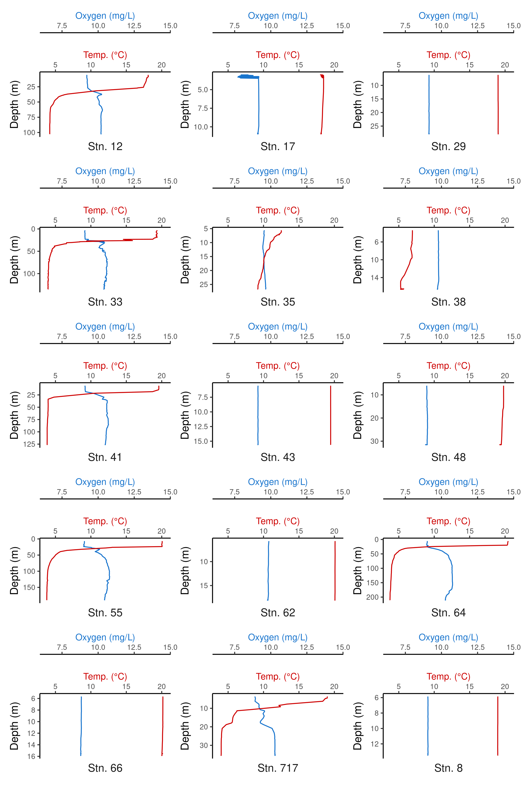

<style>
pre code, pre, code {
  white-space: pre !important;
  overflow-x: scroll !important;
  word-break: keep-all !important;
  word-wrap: initial !important;
}
</style>


# Purpose of this document

The previous three steps worked to clean our 16S data, assign taxonomy, remove contamination and assess accuracy. In the next steps, we start generating actual "results", including measures of alpha diversity and beta diversity. It will be necessary for us to correlate these measures to metadata we've collected (stored in our centralized metadata logs) as well as the various chemical and physical measures collected by the EPA. This will require the curation, cleaning, and joining of numerous data streams, and will also result in figures relevant to the paper, including CTD profiles, PCAs between sites, and mapping set-ups. 


## Loading our current metadata


```r
# Efficiently load packages 
pacman::p_load(phyloseq, iNEXT, tidyverse, readxl, ggpubr, scales, patchwork, install = FALSE)

knitr::write_bib(file = "data/05_metadata_exports/packages.bib")

source("code/R/plotting_aesthetics.R")

load("data/04_cytometry_exports/meta_with_ccs.RData")

meta_track2 <- meta_with_ccs %>%
    mutate(Depth_Class = factor(Depth_Class, levels = c("E","M","B")),
         Depth_Range = case_when(Deployment_Depth_m <=10 ~ "< 10 m",
                               Deployment_Depth_m <=20 ~ "10-20 m",
                               Deployment_Depth_m <=30 ~ "20-30 m",
                               Deployment_Depth_m <=40 ~ "30-40 m",
                               Deployment_Depth_m <=100 ~ "40-100 m",
                               Deployment_Depth_m >100 ~ ">100 m"),
         Depth_Range = factor(Depth_Range, levels = c("< 10 m", "10-20 m","20-30 m", "30-40 m", "40-100 m",">100 m")))
```

## Bringing in SeaBird CTD Data

CTD data was shared with us from the EPA and the raw files live in AAH_ONT_2023/External_Data/202305_SeabirdData and AAH_ONT_2023/External_Data/202310_SeabirdData. Descriptions of how those data were accessed, cleaned, and converted to dataframe compatible csvs are described in AAH_ONT_2023/External_Data/Cleaning_CNV_Files.R. Note that anomalous and extreme negative conductivity values at one or two depths would cause parsing issues for each sample; as such, these values were manually removed in a text editor before being read into R. 


```r
may_ctd <- read_csv("data/05_metadata_exports/SeabirdData/202305_SeabirdData/Combined_CTD_Data_OurStations.csv")

sep_ctd <- read_csv("data/05_metadata_exports/SeabirdData/202310_SeabirdData/Combined_CTD_Data_OurStations.csv")

may_other_ctd <- read_csv("data/05_metadata_exports/SeabirdData/202305_SeabirdData/Combined_CTD_Data_OtherStations.csv")

sep_other_ctd <- read_csv("data/05_metadata_exports/SeabirdData/202310_SeabirdData/Combined_CTD_Data_OtherStations.csv")
```

## Bringing in EPA Chem Analyses


```r
minimum_detection_limits <- read_excel("data/05_metadata_exports/2023_LakeOntario_ChemWQ_Final.xlsx", sheet = "detection limits") %>%
  slice_head(n = 1) %>%
  select(where(is.numeric)) %>%
  pivot_longer(everything(), names_to = "Variable", values_to = "MDL") %>%
  separate_wider_delim(Variable, names = c("Variable", "Unit"), delim = " ", too_many = "merge") %>%
  mutate(Unit = str_trim(Unit))

epa_chem <- read_excel("data/05_metadata_exports/2023_LakeOntario_ChemWQ_Final.xlsx", sheet = "DetLimitCorr") %>%
  mutate(Depth_Class = case_when(`Depth Strata` == "Epi" ~ "E",
                                 `Depth Strata` == "Hypo/B2" ~ "B",
                                 `Depth Strata`%in%c("Fmax","Mid") ~ "M"), # Convert their Depth Strata to our Depth classes
         Depth_Class = factor(Depth_Class, levels = c("E","M","B")),
         Site = as.character(Site)) %>% # Convert station to character
  select(month = Month, Station_ID = Site, Chem_Depth = `Separate depths (m)`, Depth_Class, is_Fmax = `Fmax seen?`, is_stratified = `Stratified/ Unstratified?`, `NH4 ug N/L`:`chl-a    ug/L`, EPA_Comments = Comments) %>%
  filter(!is.na(Station_ID)) %>%
  mutate(across(`NH4 ug N/L`:`chl-a    ug/L`, as.numeric)) %>%
  pivot_longer(`NH4 ug N/L`:`chl-a    ug/L`, names_to = "Variable", values_to = "Variable_Value") %>%
   filter(!is.na(Variable_Value)) %>%
   separate_wider_delim(Variable, names = c("Variable", "Unit"), delim = " ", too_many = "merge") %>%
  mutate(Unit = str_trim(Unit)) 

epa_units <- epa_chem %>%
  select(Variable, Unit) %>%
  unique()

write_csv(epa_units, file = "data/05_metadata_exports/units.csv")

clean_epa_chem <- epa_chem %>%
  select(-Unit) %>%
  pivot_wider(names_from = "Variable", values_from = "Variable_Value") %>%
  janitor::clean_names(case = "none") %>%
  mutate(Station_ID = as.numeric(Station_ID)) %>%
  mutate(SRP = ifelse(SRP < 30, SRP, NA))


epa_chem_for_microbe_mapper <- clean_epa_chem %>%
  filter(month != "July", Depth_Class != "M") %>%
  mutate(Depth_Class = ifelse(Depth_Class == "E", "Surface","Bottom")) %>%
  select(month, Station_ID, Depth_Class, NH4:chl_a)

save(clean_epa_chem, file = "data/05_metadata_exports/clean_epa_chem.RData")

# There was one NA from MAy St. 42 for chlorophyll - in the data log, it's annotated as "broken"

# Join with metatrack2
meta_track3 <- meta_track2 %>%
  left_join(clean_epa_chem) # Join chlorophyll and doc

# Make sure chlorophyll depth matches
meta_track3 %>%
  mutate(average_depth_diff = Chem_Depth - Deployment_Depth_m) %>% # Check how far off their recorded depth was to ours
  ggplot(aes(x = average_depth_diff)) + 
  geom_histogram()
```


```r
# There are a few weird ones
meta_track3 %>%
   mutate(average_depth_diff = Chem_Depth - Deployment_Depth_m) %>%
  arrange(average_depth_diff) %>% head()
```

```
##    DNA_ID input filtered denoisedF denoisedR merged nochim perc_reads_retained                   Sample_ID Concentration_ng_ul Filter_Extracted Extraction_Date  Lot_Number Project_ID Location_ID Date_Collected Station_ID          Deployment_ID
## 1  AP_D11 45115    31422     30465     30463  29415  28684            63.57974 AAH_ONT_20230516_064_FP_BW1                 8.2             0.50        20230616   172033163        AAH         ONT       20230516         64 AAH_ONT_20230516_064_3
## 2  AP_D12 46807    32523     31560     31559  30501  29692            63.43496 AAH_ONT_20230516_064_FP_BW2                13.6             0.50        20230615   172033163        AAH         ONT       20230516         64 AAH_ONT_20230516_064_3
## 3 AP_D123 71005    47399     46326     46443  45201  43970            61.92522 AAH_ONT_20230925_055_FP_MW1                18.8             0.25        20231016 175026656_1        AAH         ONT       20230925         55 AAH_ONT_20230925_055_2
## 4 AP_D124 77916    50314     49261     49253  48042  46764            60.01848 AAH_ONT_20230925_055_FP_MW2                11.9             0.25        20231017 175026656_1        AAH         ONT       20230925         55 AAH_ONT_20230925_055_2
## 5  AP_D75 59135    40333     39326     39358  38433  36725            62.10366 AAH_ONT_20230927_012_FP_MW1                21.2             0.50        20231011 175026656_1        AAH         ONT       20230927         12 AAH_ONT_20230927_012_2
## 6  AP_D76 80438    53535     52272     52227  50558  48089            59.78393 AAH_ONT_20230927_012_FP_MW2                18.2             0.50        20231009   172033163        AAH         ONT       20230927         12 AAH_ONT_20230927_012_2
##   FP_or_PT_Sample_Remaining_fraction SD_remaining_est Freezer_Temp_NegDegrees Notes     Date D_Number Deployment_Type Niskin_bottles Deployment_Depth_m Integrated_Depths_m Depth_Class Max_Depth Temp_at_Deployment   Deployment_Time
## 1                               0.50               NA                      NA  <NA> 20230516        3    Rosette Cast              2                224                  NA           B        NA                 NA 0-01-01T02:15:00Z
## 2                               0.50               NA                      NA  <NA> 20230516        3    Rosette Cast              2                224                  NA           B        NA                 NA 0-01-01T02:15:00Z
## 3                               0.75               NA                      NA  <NA> 20230925        2    Rosette Cast              3                 96                  NA           M        NA                 NA 0-01-01T19:30:00Z
## 4                               0.75               NA                      NA  <NA> 20230925        2    Rosette Cast              3                 96                  NA           M        NA                 NA 0-01-01T19:30:00Z
## 5                               0.75               NA                      NA  <NA> 20230927        2    Rosette Cast              3                 52                  NA           M        NA                 NA 0-01-01T23:32:00Z
## 6                               0.75               NA                      NA  <NA> 20230927        2    Rosette Cast              3                 52                  NA           M        NA                 NA 0-01-01T23:32:00Z
##   Total_Filtration_Time_min Volume_Filtered_mL Storage_Code Fraction Replicate Upper_Size_um Lower_Size_um NOTES Start_Filtration_Time End_Filtration_Time Latitude Longitude lag water_extracted     month avg_cells_per_ml Depth_Range Chem_Depth
## 1                        NA               5060           FF    Whole         1            20          0.22  <NA>     0-01-01T02:22:00Z   0-01-01T02:40:00Z 43.51975 -76.91837  25            2530       May          1604568      >100 m      209.0
## 2                        NA               5700           FF    Whole         2            20          0.22  <NA>     0-01-01T03:08:00Z   0-01-01T03:27:00Z 43.51975 -76.91837  72            2850       May          1657562      >100 m      209.0
## 3                        NA               5220           FF    Whole         1            20          0.22  <NA>     0-01-01T19:46:00Z   0-01-01T20:09:00Z 43.44283 -77.43980  39            1305 September          2247227    40-100 m       95.6
## 4                        NA               4500           FF    Whole         2            20          0.22  <NA>     0-01-01T20:26:00Z   0-01-01T20:45:00Z 43.44283 -77.43980  75            1125 September          1769635    40-100 m       95.6
## 5                        NA               5220           FF    Whole         1            20          0.22  <NA>     0-01-01T23:45:00Z   0-01-01T00:11:00Z 43.50345 -79.35313  39            2610 September          2157889    40-100 m       51.9
## 6                        NA               4300           FF    Whole         2            20          0.22  <NA>     0-01-01T00:26:00Z   0-01-01T00:47:00Z 43.50345 -79.35313  75            2150 September          2451200    40-100 m       51.9
##   is_Fmax is_stratified EPA_Comments  NH4 NOx   SRP  TN   TP        K     Na    Ca    Mg      Cl     SO4   DOC   Si chl_a average_depth_diff
## 1     yes    stratified         <NA> 14.0 331 2.490 488 8.19 1.738275 13.494 31.90 8.712 23.8180 23.5845 2.436 1.31  0.05              -15.0
## 2     yes    stratified         <NA> 14.0 331 2.490 488 8.19 1.738275 13.494 31.90 8.712 23.8180 23.5845 2.436 1.31  0.05              -15.0
## 3      no  unstratified         <NA>  5.5 332 0.823 464 6.11 1.553000 12.912 29.90 8.562 23.9283 23.6881 2.395 1.21  0.11               -0.4
## 4      no  unstratified         <NA>  5.5 332 0.823 464 6.11 1.553000 12.912 29.90 8.562 23.9283 23.6881 2.395 1.21  0.11               -0.4
## 5      no  unstratified         <NA> 13.6 367 1.680 517 2.25 1.468000 13.314 29.86 8.640 23.6963 23.2952 2.584 1.33  0.37               -0.1
## 6      no  unstratified         <NA> 13.6 367 1.680 517 2.25 1.468000 13.314 29.86 8.640 23.6963 23.2952 2.584 1.33  0.37               -0.1
```

```r
# Station 64, which is our deepest station, we took our sample 15 meters deeper supposedly than the chlorophyll samples. 
# Because it is so deep and we know the water body in the bottom of the lake is pretty homogenous, I'm not gonna worry about it

meta_track3 %>%
   mutate(average_depth_diff = Chem_Depth - Deployment_Depth_m) %>%
  arrange(desc(average_depth_diff)) %>% head()
```

```
##   DNA_ID input filtered denoisedF denoisedR merged nochim perc_reads_retained                   Sample_ID Concentration_ng_ul Filter_Extracted Extraction_Date Lot_Number Project_ID Location_ID Date_Collected Station_ID          Deployment_ID
## 1 AP_D23 60541    40865     40052     39966  38743  37640            62.17274 AAH_ONT_20230517_041_FP_MW1                43.4              0.5        20230616  172033163        AAH         ONT       20230517         41 AAH_ONT_20230517_041_2
## 2 AP_D24 60258    39359     38367     38324  37199  36045            59.81778 AAH_ONT_20230517_041_FP_MW2                30.0              0.5        20230515  172033163        AAH         ONT       20230517         41 AAH_ONT_20230517_041_2
## 3 AP_D19 50297    35794     34958     34913  34034  33311            66.22860 AAH_ONT_20230517_041_FP_BW1                16.9              0.5        20230615  172033163        AAH         ONT       20230517         41 AAH_ONT_20230517_041_3
## 4 AP_D20 42975    29796     29115     29158  28396  27828            64.75393 AAH_ONT_20230517_041_FP_BW2                18.2              0.5        20230613  172033163        AAH         ONT       20230517         41 AAH_ONT_20230517_041_3
## 5 AP_D15 41436    25833     25158     25169  24444  23574            56.89256 AAH_ONT_20230516_064_FP_MW1                97.7              0.5        20230614  172033163        AAH         ONT       20230516         64 AAH_ONT_20230516_064_2
## 6 AP_D16 31198    14375     14004     13941  13345  12903            41.35842 AAH_ONT_20230516_064_FP_MW2               101.0              0.5        20230614  172033163        AAH         ONT       20230516         64 AAH_ONT_20230516_064_2
##   FP_or_PT_Sample_Remaining_fraction SD_remaining_est Freezer_Temp_NegDegrees Notes     Date D_Number Deployment_Type Niskin_bottles Deployment_Depth_m Integrated_Depths_m Depth_Class Max_Depth Temp_at_Deployment   Deployment_Time
## 1                                0.5               NA                      NA  <NA> 20230517        2    Rosette Cast              2                 24                  NA           M        NA                 NA 0-01-01T20:01:00Z
## 2                                0.5               NA                      NA  <NA> 20230517        2    Rosette Cast              2                 24                  NA           M        NA                 NA 0-01-01T20:01:00Z
## 3                                0.5               NA                      NA  <NA> 20230517        3    Rosette Cast              3                127                  NA           B        NA                 NA 0-01-01T20:01:00Z
## 4                                0.5               NA                      NA  <NA> 20230517        3    Rosette Cast              3                127                  NA           B        NA                 NA 0-01-01T20:01:00Z
## 5                                0.5               NA                      NA  <NA> 20230516        2    Rosette Cast              2                 14                  NA           M        NA                 NA 0-01-01T02:15:00Z
## 6                                0.5               NA                      NA  <NA> 20230516        2    Rosette Cast              2                 14                  NA           M        NA                 NA 0-01-01T02:15:00Z
##   Total_Filtration_Time_min Volume_Filtered_mL Storage_Code Fraction Replicate Upper_Size_um Lower_Size_um NOTES Start_Filtration_Time End_Filtration_Time Latitude Longitude lag water_extracted month avg_cells_per_ml Depth_Range Chem_Depth is_Fmax
## 1                        NA               3060           FF    Whole         1            20          0.22  <NA>     0-01-01T20:15:00Z   0-01-01T20:26:00Z 43.71662 -78.02737  25            1530   May          2947204     20-30 m       67.5      no
## 2                        NA               3140           FF    Whole         2            20          0.22  <NA>     0-01-01T20:36:00Z   0-01-01T20:46:00Z 43.71662 -78.02737  45            1570   May          2820081     20-30 m       67.5      no
## 3                        NA               4360           FF    Whole         1            20          0.22  <NA>     0-01-01T20:13:00Z   0-01-01T20:40:00Z 43.71662 -78.02737  39            2180   May          2092566      >100 m      133.0      no
## 4                        NA               5270           FF    Whole         2            20          0.22  <NA>     0-01-01T20:18:00Z   0-01-01T20:45:00Z 43.71662 -78.02737  44            2635   May          2751717      >100 m      133.0      no
## 5                        NA               3770           FF    Whole         1            20          0.22  <NA>     0-01-01T02:24:00Z   0-01-01T02:44:00Z 43.51975 -76.91837  29            1885   May          4069697     10-20 m       18.0     yes
## 6                        NA               4250           FF    Whole         2            20          0.22  <NA>     0-01-01T03:10:00Z   0-01-01T03:33:00Z 43.51975 -76.91837  78            2125   May          3671677     10-20 m       18.0     yes
##   is_stratified EPA_Comments  NH4 NOx   SRP  TN   TP        K     Na    Ca    Mg      Cl     SO4   DOC   Si chl_a average_depth_diff
## 1    stratified         <NA> 11.0 320 0.352 469 3.88 1.686260 14.145 31.56 9.254 23.4887 23.4876 2.476 1.34  0.97               43.5
## 2    stratified         <NA> 11.0 320 0.352 469 3.88 1.686260 14.145 31.56 9.254 23.4887 23.4876 2.476 1.34  0.97               43.5
## 3    stratified         <NA> 13.7 302 2.300 475 2.52 1.670531 14.205 31.90 9.258 23.5103 23.5579 2.389 1.42  0.21                6.0
## 4    stratified         <NA> 13.7 302 2.300 475 2.52 1.670531 14.205 31.90 9.258 23.5103 23.5579 2.389 1.42  0.21                6.0
## 5    stratified         <NA>  9.3 252 1.830 476 7.89 1.758328 13.269 31.72 8.752 23.5346 23.6766 2.348 1.21  5.80                4.0
## 6    stratified         <NA>  9.3 252 1.830 476 7.89 1.758328 13.269 31.72 8.752 23.5346 23.6766 2.348 1.21  5.80                4.0
```

```r
# And then station 41 Mid from May. It looks like here we thought we could see an Fmax perhaps, and sampled mid at 24 meters, while they sampled at true mid (~63). I think we should disregard these chem measurements (in terms of comparing to our samples).

meta_track4 <- meta_track3 %>%
  mutate(average_depth_diff = Chem_Depth - Deployment_Depth_m,
         across(NH4:chl_a, \(x)ifelse(average_depth_diff>7, NA, x))) %>%
  select(-average_depth_diff)
```

## Filtering SeaBird Data to match specifically with our sample values


```r
depth_df <- meta_track2 %>% 
  mutate(is_night = month=="September"&Station_ID==33&Date==20230926) %>%
  select(DNA_ID, month, Station_ID, Deployment_Depth_m, is_night) %>% # We just want the deployment depth and station for each DNA_ID
  filter(!is.na(Deployment_Depth_m)) # Get rid of blanks, etc.

depth_filtered_may <- may_ctd  %>%
  mutate(month = "May") %>% # Will need this variable for joining later
  mutate(Station_ID = str_remove(station, "stn"), # Get rid of the stn prefix
         two_casts = ifelse(str_detect(Station_ID,"41|33|55"),TRUE, FALSE), # These are stations where we did two casts; the first for bottom and mid, the second for surface
         depths = case_when(!two_casts ~ TRUE, # If there weren't two casts, keep all depths
                            two_casts&str_detect(Station_ID, "b")~ FALSE, # If there were two casts AND this is the second cast "b") discard
                            two_casts&!(str_detect(Station_ID, "b")) ~ TRUE, # If there were two casts AND this is the first cast keep
                            TRUE ~ FALSE)) %>% # Otherwise discard depths
  filter(depths) # The actual filtering step that we set up above

# Check that the filtering worked
depth_filtered_may %>%
  group_by(Station_ID) %>%
  summarize(min = min(depth),
            max = max(depth)) %>%
  ggplot(aes(x = Station_ID, xend = Station_ID, y = min, yend = max)) + 
  geom_segment(linewidth = 1)
```


```r
may_dna_associated_ctd  <- depth_filtered_may %>%
  mutate(Station_ID = str_remove_all(Station_ID, "-day|b-day|-a|-b"),
         Station_ID = as.numeric(Station_ID)) %>% # Clean-up the names
  left_join(depth_df) %>% # Join in our DNA_IDs. It's okay that there are multiple matches - essentially each DNA_ID gets the ENTIRE profile, and then we filter
  mutate(upper = Deployment_Depth_m + 0.05, # Define 10cm range above and below deployment depth
         lower = Deployment_Depth_m - 0.05) %>%
  filter(depth < upper, depth > lower) %>% # Filter depths to within that 10cm range for each DNA_ID
  group_by(DNA_ID) %>% 
  summarize_if(is.numeric, median, na.rm = T) %>% # For every numeric measured variable, find the median for that 10cm range.
  select(-latitude, -longitude, -Deployment_Depth_m, -upper, -lower, -depth) # Remove variables that already exist in our meta_track dataframe
  
depth_filtered_sep <- sep_ctd  %>% 
  mutate(month = "September") %>% # Will need this variable for joining later
  mutate(Station_ID = str_remove(station, "STN"),# Get rid of the stn prefix
         two_casts = ifelse(str_detect(Station_ID,"12|29|33|35|41|43|48|55|62|64|66|^8"),TRUE, FALSE), # These are stations where we did two casts; the first for bottom and mid, the second for surface
         depths = case_when(!two_casts ~ TRUE, # If there weren't two casts, keep all depths
                            str_detect(Station_ID, "NIGHT") ~ TRUE, # For Station 33 night sample, keep all depths (only one cast)
                            two_casts&str_detect(Station_ID, "-2|,2")&depth < 5.5 ~ TRUE, # If there were two casts AND this is the second cast "b") keep depths shallower than 5.5m
                            two_casts&!(str_detect(Station_ID, "-2|,2"))&depth > 5.5 ~ TRUE, # If there were two casts AND this is the first cast keep depths deeper than 5.5m
                            TRUE ~ FALSE)) %>% # Otherwise discard depths 
  filter(depths) # The actual filtering step that we set up above

# Check that we actually filtered correctly
depth_filtered_sep %>%
  group_by(Station_ID) %>%
  summarize(min = min(depth),
            max = max(depth)) %>%
  ggplot(aes(x = Station_ID, xend = Station_ID, y = min, yend = max)) + 
  geom_segment(linewidth = 1)
```


```r
sep_dna_associated_ctd <- depth_filtered_sep %>% 
  mutate(is_night = str_detect(Station_ID, "NIGHT"),
          Station_ID = str_remove_all(Station_ID, "-2|,2|-NIGHT|-DAY"),
         Station_ID = as.numeric(Station_ID)) %>% # Clean-up the names
  left_join(depth_df) %>% # Join in our DNA_IDs. It's okay that there are multiple matches - essentially each DNA_ID gets the ENTIRE profile, and then we filter
  mutate(upper = Deployment_Depth_m + 0.05, # Define 10cm range above and below deployment depth
         lower = Deployment_Depth_m - 0.05) %>%
  filter(depth < upper, depth > lower) %>% # Filter depths to within that 10cm range for each DNA_ID
  group_by(DNA_ID) %>% 
  summarize_if(is.numeric, median, na.rm = T) %>% # For every numeric measured variable, find the median for that 10cm range.
  select(-latitude, -longitude, -Deployment_Depth_m, -upper, -lower, -depth) # Remove variables that already exist in our meta_track dataframe  

bound <- bind_rows(may_dna_associated_ctd, sep_dna_associated_ctd) # Bind rows

samples_missing_ctd <- meta_track4$DNA_ID[!(meta_track4$DNA_ID %in% bound$DNA_ID)] # Find samples that we don't have 
samples_missing_ctd
```

```
## [1] "AP_D61"          "AP_D62"          "PCR_Blanks"      "AP_D153"         "AP_D154"         "Zymo_Mock"       "Blank1_10471351" "Blank2_10471351"
```

```r
# D61 and D62 are extraction negatives, 
meta_track4 %>%
  filter(DNA_ID %in% samples_missing_ctd) %>%
  select(Sample_ID, DNA_ID)
```

```
##                     Sample_ID          DNA_ID
## 1 AAH_ONT_20230519_000_FP_NW1          AP_D61
## 2         EXTRACTION_NEGATIVE          AP_D62
## 3                        <NA>      PCR_Blanks
## 4 AAH_ONT_20230928_000_FP_NW1         AP_D153
## 5         EXTRACTION_NEGATIVE         AP_D154
## 6                        <NA>       Zymo_Mock
## 7                        <NA> Blank1_10471351
## 8                        <NA> Blank2_10471351
```

```r
# Note, there were a few more here the first time I ran - cases where our logged deployment depth was deeper than the 
# CTD depth measured. In that case, I amended our data log to reflect that lost possible depth we could have actually sampled at (e.g., for Station 62, the CTD only went to 4.8 and 18, even though we logged deployment at 5 and 18.3m)
```

# Cleaning data for OUR CTD station profiles


```r
may_full <- depth_filtered_may %>%
  mutate(Station_ID = str_remove_all(Station_ID, "-day|b-day|-a|-b"),
         Station_ID = as.numeric(Station_ID)) %>% # Clean-up the names
  left_join(depth_df) %>%
  filter(Station_ID %in% c(38, 12, 48, 64)) %>%
  select(depth, oxygen, temperature, par, Station_ID, month) %>%
  mutate(Station_ID = factor(Station_ID, levels = c(12, 64, 48,38), labels = c("Stn. 12","Stn. 64","Stn. 48","Stn. 38"))) %>%
  filter(between(temperature, 0, 30), depth > 3) %>%
  group_by(Station_ID) %>%
  mutate(Bottom_yet = depth >= max(depth)) %>%
  filter(cumsum(Bottom_yet) < 2) %>%
  slice_sample(n = 10000) %>%
  arrange(depth, .by_group = TRUE)


sep_full <- depth_filtered_sep %>%
  mutate(is_night = str_detect(Station_ID, "NIGHT"),
          Station_ID = str_remove_all(Station_ID, "-2|,2|-NIGHT|-DAY"),
         Station_ID = as.numeric(Station_ID)) %>% # Clean-up the names
  left_join(depth_df) %>% # Join in our DNA_IDs. It's okay that there are multiple matches - essentially each DNA_ID gets the ENTIRE profile, and then we filter
  filter(Station_ID %in% c(38, 12, 48, 64)) %>%
  select(depth, oxygen = oxygen2, temperature, par, Station_ID, month) %>%
  mutate(Station_ID = factor(Station_ID, levels = c(12, 64, 48,38), labels = c("Stn. 12","Stn. 64","Stn. 48","Stn. 38"))) %>%
  filter(between(temperature, 0, 30), depth > 3) %>%
  group_by(Station_ID) %>%
  mutate(Bottom_yet = depth >= max(depth)) %>%
  filter(cumsum(Bottom_yet) < 2) %>%
  slice_sample(n = 10000) %>%
  arrange(depth, .by_group = TRUE) %>% 
  ungroup()
```


```r
may_full_all <- depth_filtered_may %>%
  mutate(Station_ID = str_remove_all(Station_ID, "-day|b-day|-a|-b"),
         Station_ID = as.numeric(Station_ID)) %>% # Clean-up the names
  left_join(depth_df) %>%
  select(depth, oxygen, temperature, par, Station_ID, month) %>%
  mutate(Station_ID = paste("Stn.", Station_ID)) %>%
  filter(between(temperature, 0, 30), depth > 3) %>%
  group_by(Station_ID) %>%
  mutate(Bottom_yet = depth >= max(depth)) %>%
  filter(cumsum(Bottom_yet) < 2) %>%
  slice_sample(n = 100) %>%
  arrange(depth, .by_group = TRUE)


sep_full_all <- depth_filtered_sep %>%
  mutate(is_night = str_detect(Station_ID, "NIGHT"),
          Station_ID = str_remove_all(Station_ID, "-2|,2|-NIGHT|-DAY"),
         Station_ID = as.numeric(Station_ID)) %>% # Clean-up the names
  left_join(depth_df) %>% # Join in our DNA_IDs. It's okay that there are multiple matches - essentially each DNA_ID gets the ENTIRE profile, and then we filter
  select(depth, oxygen = oxygen2, temperature, par, Station_ID, month) %>%
  mutate(Station_ID = paste("Stn.",Station_ID)) %>%
  filter(between(temperature, 0, 30), depth > 3) %>%
  group_by(Station_ID) %>%
  mutate(Bottom_yet = depth >= max(depth)) %>%
  filter(cumsum(Bottom_yet) < 2) %>%
  slice_sample(n = 100) %>%
  arrange(depth, .by_group = TRUE) %>% 
  ungroup()


full_size_all <- rbind(may_full_all, sep_full_all)
temp_limits_all <- range(full_size_all$temperature)
oxy_limits_all <- range(full_size_all$oxygen)


full_size_may <- filter(full_size_all, month == "May")

full_size_sep <- filter(full_size_all, month == "September")

all_plots_all <- map(c("May","September"), \(x){
  data <- filter(full_size_all, month == x)
  month_plots <- map(unique(data$Station_ID), \(y){
    print(paste0("Plotting ",y,"from ", x))
    temp <- data %>%
      mutate(rescaled_oxygen = scales::rescale(oxygen, from = oxy_limits_all, to = temp_limits_all)) %>%
      filter(Station_ID == y) %>%
      pivot_longer(cols = c(oxygen, temperature), names_to = "Variable", values_to = "Measure") %>%
      ggplot(aes(x = Measure, y = depth, color = Variable)) + 
      ggplot2::geom_path() + 
      facet_wrap(~Station_ID, scales = "free", strip.position = "bottom") + 
      scale_y_reverse() + 
      scale_x_continuous(position = "top") + 
      scale_color_manual(values = c("dodgerblue3", "red3")) + 
      coord_cartesian(xlim = temp_limits_all) + 
      labs(x = "Temp. (°C)", y = "Depth (m)") +
      theme(strip.text = element_text(size = 12),
            axis.title.x = element_text(size = 10, color = "red3"),
            axis.text = element_text(size = 8),
            legend.position = "none")
  
    oxy <- ggplot() + 
      scale_x_continuous(limits = oxy_limits_all, position = "top") + 
      labs(x = "Oxygen (mg/L)") + 
      theme(axis.title = element_text(size = 10, color = "dodgerblue3"),
            axis.text = element_text(size = 8))
    
    oxy / temp + plot_layout(heights = c(.1,1))
  })
  wrap_plots(month_plots, ncol = 3, nrow = 5)
})
```

```
## [1] "Plotting Stn. 12from May"
## [1] "Plotting Stn. 17from May"
## [1] "Plotting Stn. 29from May"
## [1] "Plotting Stn. 33from May"
## [1] "Plotting Stn. 35from May"
## [1] "Plotting Stn. 38from May"
## [1] "Plotting Stn. 41from May"
## [1] "Plotting Stn. 43from May"
## [1] "Plotting Stn. 48from May"
## [1] "Plotting Stn. 55from May"
## [1] "Plotting Stn. 64from May"
## [1] "Plotting Stn. 66from May"
## [1] "Plotting Stn. 717from May"
## [1] "Plotting Stn. 74from May"
## [1] "Plotting Stn. 8from May"
## [1] "Plotting Stn. 12from September"
## [1] "Plotting Stn. 17from September"
## [1] "Plotting Stn. 29from September"
## [1] "Plotting Stn. 33from September"
## [1] "Plotting Stn. 35from September"
## [1] "Plotting Stn. 38from September"
## [1] "Plotting Stn. 41from September"
## [1] "Plotting Stn. 43from September"
## [1] "Plotting Stn. 48from September"
## [1] "Plotting Stn. 55from September"
## [1] "Plotting Stn. 62from September"
## [1] "Plotting Stn. 64from September"
## [1] "Plotting Stn. 66from September"
## [1] "Plotting Stn. 717from September"
## [1] "Plotting Stn. 8from September"
```


```r
all_plots_all[[1]]
```


```r
all_plots_all[[2]]
```




# Prepping all CTD station data for mapping and plotting

These data are for plotting environmental variables across the lake. Let me tell you it was a PAIN to clean them up lol. 


```r
may_all_stations <- rbind(may_ctd, may_other_ctd) %>%
  filter(!str_detect(station, "b"),
         #!station%in% c("stn64","stn63","stn715"),
         !str_detect(station, "night"),
         depth>4.5&depth<300,
         between(temperature, 0,30)) %>%
  group_by(station) %>%
  mutate(Bottom_yet = depth >= max(depth)) %>%
  filter(cumsum(Bottom_yet) < 2) %>%
  arrange(depth, .by_group = TRUE) %>%
  mutate(month = "May") %>%
  mutate(bins = cut_interval(depth, n = 100)) %>% 
  ungroup() %>%
  nest_by(station, bins) %>% 
  mutate(selected = list(arrange(data, depth) %>% dplyr::slice(c(1, as.integer(round((1 + n()) / 2)), n())))) %>%
  select(-data) %>%
  unnest(selected) %>%
  ungroup() %>% 
  separate(station, into = c("Station_ID", "discard"), sep = "-") %>%
  select(-discard, -Bottom_yet, - startTime) %>%
  mutate(Station_ID = str_remove_all(Station_ID, "stn"),
         Station_ID = as.numeric(Station_ID)) %>%
  select(Station_ID, temperature, conductivity, par, fluorescence, spar, upoly, depth, oxygen, salinity, latitude, longitude, month)
    
save(may_all_stations, file = "data/05_metadata_exports/all_may_stations.RData")
```


```r
sep_all_stations <- rbind(sep_ctd, sep_other_ctd) %>% 
  mutate(station = ifelse(station == "STN65-NIGHT", "STN65", station),
         station = ifelse(station == "STN28-NIGHT", "STN28", station)) %>% # We only have a ctd cast from night time for stn 65 and 28, but this would otherwise get filtered out
  # This is to carefully select one full cast per station, preferencing day cast if possible
  filter(!str_detect(station, ",2|-2"),
         #!station%in% c("STN34","stn63","stn715"),
         !str_detect(station, "NIGHT"),
         depth>1&depth<250,
         between(temperature, 0,30),
         between(oxygen2, 0, 25)) %>% 
  group_by(station) %>%
  mutate(Bottom_yet = depth >= max(depth)) %>%
  filter(cumsum(Bottom_yet) < 2) %>%
  arrange(depth, .by_group = TRUE) %>%
  mutate(month = "September") %>%
  mutate(bins = cut_interval(depth, n = 100)) %>% 
  ungroup() %>%
  nest_by(station, bins) %>% 
  mutate(selected = list(arrange(data, depth) %>% dplyr::slice(c(1, as.integer(round((1 + n()) / 2)), n())))) %>%
  select(-data) %>%
  unnest(selected) %>%
  ungroup() %>% 
  separate(station, into = c("Station_ID", "discard"), sep = "-") %>%
  select(-discard, -Bottom_yet, - startTime) %>%
  mutate(Station_ID = str_remove_all(Station_ID, "STN"),
         Station_ID = as.numeric(Station_ID)) %>%
  select(Station_ID, temperature, conductivity, par, fluorescence, spar, upoly, depth, oxygen = oxygen2, salinity, latitude, longitude, month)
    
save(sep_all_stations, file = "data/05_metadata_exports/all_sep_stations.RData")
```

## Combining and Organizing Metadata


```r
full_meta <- meta_track4 %>%
  left_join(bound) %>%
  mutate(transect = case_when(Station_ID %in% c("8","12","17")~ "T1",
                              Station_ID %in% c("29","33","35")~ "T2",
                              Station_ID %in% c("43","41","38")~ "T3",
                              Station_ID %in% c("48","55","717")~ "T4",
                              Station_ID %in% c("66","64","62","74")~ "T5"),
         good_oxygen = ifelse(month=="May", oxygen, oxygen2)
         )

save(full_meta, file = "data/05_metadata_exports/full_meta.RData")

write_csv(full_meta, file = "data/05_metadata_exports/full_meta.csv")
```

# Session Information 

```r
# Reproducibility
devtools::session_info()
```

```
## ─ Session info ─────────────────────────────────────────────────────────────────────────────────────────────────────────────────────────────────────────────────────────────────────────────────────────────────────────────────────────────────────────
##  setting  value
##  version  R version 4.3.3 (2024-02-29)
##  os       Rocky Linux 9.5 (Blue Onyx)
##  system   x86_64, linux-gnu
##  ui       X11
##  language (EN)
##  collate  en_US.UTF-8
##  ctype    en_US.UTF-8
##  tz       America/New_York
##  date     2025-06-26
##  pandoc   3.1.1 @ /usr/lib/rstudio-server/bin/quarto/bin/tools/ (via rmarkdown)
## 
## ─ Packages ─────────────────────────────────────────────────────────────────────────────────────────────────────────────────────────────────────────────────────────────────────────────────────────────────────────────────────────────────────────────
##  ! package          * version    date (UTC) lib source
##  P abind              1.4-5      2016-07-21 [?] CRAN (R 4.3.2)
##  P ade4               1.7-22     2023-02-06 [?] CRAN (R 4.3.2)
##  P ape                5.7-1      2023-03-13 [?] CRAN (R 4.3.2)
##  P backports          1.4.1      2021-12-13 [?] CRAN (R 4.3.2)
##  P Biobase            2.62.0     2023-10-24 [?] Bioconductor
##  P BiocGenerics       0.48.1     2023-11-01 [?] Bioconductor
##  P BiocManager        1.30.22    2023-08-08 [?] CRAN (R 4.3.2)
##  P biomformat         1.30.0     2023-10-24 [?] Bioconductor
##  P Biostrings         2.70.1     2023-10-25 [?] Bioconductor
##  P bit                4.0.5      2022-11-15 [?] CRAN (R 4.3.2)
##  P bit64              4.0.5      2020-08-30 [?] CRAN (R 4.3.2)
##  P bitops             1.0-7      2021-04-24 [?] CRAN (R 4.3.2)
##  P broom              1.0.5      2023-06-09 [?] CRAN (R 4.3.2)
##  P bslib              0.5.1      2023-08-11 [?] CRAN (R 4.3.2)
##  P cachem             1.0.8      2023-05-01 [?] CRAN (R 4.3.2)
##  P callr              3.7.3      2022-11-02 [?] CRAN (R 4.3.2)
##  P car                3.1-2      2023-03-30 [?] CRAN (R 4.3.2)
##  P carData            3.0-5      2022-01-06 [?] CRAN (R 4.3.2)
##  P cellranger         1.1.0      2016-07-27 [?] CRAN (R 4.3.2)
##  P cli                3.6.1      2023-03-23 [?] CRAN (R 4.3.2)
##  P cluster            2.1.4      2022-08-22 [?] CRAN (R 4.3.2)
##  P codetools          0.2-19     2023-02-01 [?] CRAN (R 4.3.3)
##  P colorspace         2.1-0      2023-01-23 [?] CRAN (R 4.3.2)
##  P crayon             1.5.2      2022-09-29 [?] CRAN (R 4.3.2)
##  P data.table         1.15.2     2024-02-29 [?] CRAN (R 4.3.2)
##  P devtools           2.4.4      2022-07-20 [?] CRAN (R 4.2.1)
##  P digest             0.6.33     2023-07-07 [?] CRAN (R 4.3.2)
##  P dplyr            * 1.1.3      2023-09-03 [?] CRAN (R 4.3.2)
##  P ellipsis           0.3.2      2021-04-29 [?] CRAN (R 4.3.2)
##  P evaluate           0.23       2023-11-01 [?] CRAN (R 4.3.2)
##  P fansi              1.0.5      2023-10-08 [?] CRAN (R 4.3.2)
##  P farver             2.1.1      2022-07-06 [?] CRAN (R 4.3.2)
##  P fastmap            1.1.1      2023-02-24 [?] CRAN (R 4.3.2)
##  P forcats          * 1.0.0      2023-01-29 [?] CRAN (R 4.3.2)
##  P foreach            1.5.2      2022-02-02 [?] CRAN (R 4.3.2)
##  P fs                 1.6.3      2023-07-20 [?] CRAN (R 4.3.2)
##  P generics           0.1.3      2022-07-05 [?] CRAN (R 4.3.2)
##  P GenomeInfoDb       1.38.0     2023-10-24 [?] Bioconductor
##  P GenomeInfoDbData   1.2.11     2023-11-07 [?] Bioconductor
##  P ggplot2          * 3.5.0      2024-02-23 [?] CRAN (R 4.3.2)
##  P ggpubr           * 0.6.0      2023-02-10 [?] CRAN (R 4.3.2)
##  P ggsignif           0.6.4      2022-10-13 [?] CRAN (R 4.3.2)
##  P glue               1.6.2      2022-02-24 [?] CRAN (R 4.3.2)
##  P gtable             0.3.4      2023-08-21 [?] CRAN (R 4.3.2)
##  P highr              0.10       2022-12-22 [?] CRAN (R 4.3.2)
##  P hms                1.1.3      2023-03-21 [?] CRAN (R 4.3.2)
##  P htmltools          0.5.7      2023-11-03 [?] CRAN (R 4.3.2)
##  P htmlwidgets        1.6.2      2023-03-17 [?] CRAN (R 4.3.2)
##  P httpuv             1.6.12     2023-10-23 [?] CRAN (R 4.3.2)
##  P igraph             1.5.1      2023-08-10 [?] CRAN (R 4.3.2)
##  P iNEXT            * 3.0.0      2022-08-29 [?] CRAN (R 4.3.2)
##  P IRanges            2.36.0     2023-10-24 [?] Bioconductor
##  P iterators          1.0.14     2022-02-05 [?] CRAN (R 4.3.2)
##  P janitor            2.2.0      2023-02-02 [?] CRAN (R 4.3.2)
##  P jquerylib          0.1.4      2021-04-26 [?] CRAN (R 4.3.2)
##  P jsonlite           1.8.7      2023-06-29 [?] CRAN (R 4.3.2)
##  P knitr              1.45       2023-10-30 [?] CRAN (R 4.3.2)
##  P labeling           0.4.3      2023-08-29 [?] CRAN (R 4.3.2)
##  P later              1.3.1      2023-05-02 [?] CRAN (R 4.3.2)
##  P lattice            0.21-9     2023-10-01 [?] CRAN (R 4.3.2)
##  P lifecycle          1.0.3      2022-10-07 [?] CRAN (R 4.3.2)
##  P lubridate        * 1.9.3      2023-09-27 [?] CRAN (R 4.3.2)
##  P magrittr           2.0.3      2022-03-30 [?] CRAN (R 4.3.2)
##  P MASS               7.3-60     2023-05-04 [?] CRAN (R 4.3.2)
##  P Matrix             1.6-1.1    2023-09-18 [?] CRAN (R 4.3.2)
##  P memoise            2.0.1      2021-11-26 [?] CRAN (R 4.3.2)
##  P mgcv               1.9-0      2023-07-11 [?] CRAN (R 4.3.2)
##  P mime               0.12       2021-09-28 [?] CRAN (R 4.3.2)
##  P miniUI             0.1.1.1    2018-05-18 [?] CRAN (R 4.3.2)
##  P multtest           2.58.0     2023-10-24 [?] Bioconductor
##  P munsell            0.5.0      2018-06-12 [?] CRAN (R 4.3.2)
##  P NatParksPalettes * 0.2.0      2022-10-09 [?] CRAN (R 4.3.2)
##  P nlme               3.1-163    2023-08-09 [?] CRAN (R 4.3.2)
##  P pacman             0.5.1      2019-03-11 [?] CRAN (R 4.3.2)
##  P patchwork        * 1.2.0.9000 2025-06-26 [?] Github (thomasp85/patchwork@d943757)
##  P permute            0.9-7      2022-01-27 [?] CRAN (R 4.3.2)
##  P phyloseq         * 1.46.0     2023-10-24 [?] Bioconductor
##  P pillar             1.9.0      2023-03-22 [?] CRAN (R 4.3.2)
##  P pkgbuild           1.4.2      2023-06-26 [?] CRAN (R 4.3.2)
##  P pkgconfig          2.0.3      2019-09-22 [?] CRAN (R 4.3.2)
##  P pkgload            1.3.3      2023-09-22 [?] CRAN (R 4.3.2)
##  P plyr               1.8.9      2023-10-02 [?] CRAN (R 4.3.2)
##  P prettyunits        1.2.0      2023-09-24 [?] CRAN (R 4.3.2)
##  P processx           3.8.2      2023-06-30 [?] CRAN (R 4.3.2)
##  P profvis            0.3.8      2023-05-02 [?] CRAN (R 4.3.2)
##  P promises           1.2.1      2023-08-10 [?] CRAN (R 4.3.2)
##  P ps                 1.7.5      2023-04-18 [?] CRAN (R 4.3.2)
##  P purrr            * 1.0.2      2023-08-10 [?] CRAN (R 4.3.2)
##  P R6                 2.5.1      2021-08-19 [?] CRAN (R 4.3.2)
##  P Rcpp               1.0.11     2023-07-06 [?] CRAN (R 4.3.2)
##  P RCurl              1.98-1.13  2023-11-02 [?] CRAN (R 4.3.2)
##  P readr            * 2.1.5      2024-01-10 [?] CRAN (R 4.3.2)
##  P readxl           * 1.4.3      2023-07-06 [?] CRAN (R 4.3.2)
##  P remotes            2.4.2.1    2023-07-18 [?] CRAN (R 4.3.2)
##    renv               1.0.5      2024-02-29 [1] CRAN (R 4.3.2)
##  P reshape2           1.4.4      2020-04-09 [?] CRAN (R 4.3.2)
##  P rhdf5              2.46.1     2023-11-29 [?] Bioconduc~
##  P rhdf5filters       1.14.1     2023-11-06 [?] Bioconductor
##  P Rhdf5lib           1.24.2     2024-02-07 [?] Bioconduc~
##  P rlang              1.1.2      2023-11-04 [?] CRAN (R 4.3.2)
##  P rmarkdown          2.25       2023-09-18 [?] CRAN (R 4.3.2)
##  P rstatix            0.7.2      2023-02-01 [?] CRAN (R 4.3.2)
##  P rstudioapi         0.15.0     2023-07-07 [?] CRAN (R 4.3.2)
##  P S4Vectors          0.40.1     2023-10-26 [?] Bioconductor
##  P sass               0.4.7      2023-07-15 [?] CRAN (R 4.3.2)
##  P scales           * 1.3.0      2023-11-28 [?] CRAN (R 4.3.2)
##  P sessioninfo        1.2.2      2021-12-06 [?] CRAN (R 4.3.2)
##  P shiny              1.7.5.1    2023-10-14 [?] CRAN (R 4.3.2)
##  P snakecase          0.11.1     2023-08-27 [?] CRAN (R 4.3.2)
##  P stringi            1.7.12     2023-01-11 [?] CRAN (R 4.3.2)
##  P stringr          * 1.5.0      2022-12-02 [?] CRAN (R 4.3.2)
##  P survival           3.5-8      2024-02-14 [?] CRAN (R 4.3.3)
##  P tibble           * 3.2.1      2023-03-20 [?] CRAN (R 4.3.2)
##  P tidyr            * 1.3.1      2024-01-24 [?] CRAN (R 4.3.2)
##  P tidyselect         1.2.0      2022-10-10 [?] CRAN (R 4.3.2)
##  P tidyverse        * 2.0.0      2023-02-22 [?] CRAN (R 4.3.2)
##  P timechange         0.3.0      2024-01-18 [?] CRAN (R 4.3.2)
##  P tzdb               0.4.0      2023-05-12 [?] CRAN (R 4.3.2)
##  P urlchecker         1.0.1      2021-11-30 [?] CRAN (R 4.3.2)
##  P usethis            2.2.2      2023-07-06 [?] CRAN (R 4.3.2)
##  P utf8               1.2.4      2023-10-22 [?] CRAN (R 4.3.2)
##  P vctrs              0.6.4      2023-10-12 [?] CRAN (R 4.3.2)
##  P vegan              2.6-4      2022-10-11 [?] CRAN (R 4.3.2)
##  P vroom              1.6.5      2023-12-05 [?] CRAN (R 4.3.2)
##  P withr              2.5.2      2023-10-30 [?] CRAN (R 4.3.2)
##  P xfun               0.52       2025-04-02 [?] CRAN (R 4.3.3)
##  P xtable             1.8-4      2019-04-21 [?] CRAN (R 4.3.2)
##  P XVector            0.42.0     2023-10-24 [?] Bioconductor
##  P yaml               2.3.7      2023-01-23 [?] CRAN (R 4.3.2)
##  P zlibbioc           1.48.0     2023-10-24 [?] Bioconductor
## 
##  [1] /local/workdir/arp277/Pendleton_2025_Ontario_Publication_Repo/renv/library/R-4.3/x86_64-pc-linux-gnu
##  [2] /home/arp277/.cache/R/renv/sandbox/R-4.3/x86_64-pc-linux-gnu/fd835031
## 
##  P ── Loaded and on-disk path mismatch.
## 
## ────────────────────────────────────────────────────────────────────────────────────────────────────────────────────────────────────────────────────────────────────────────────────────────────────────────────────────────────────────────────────────
```
