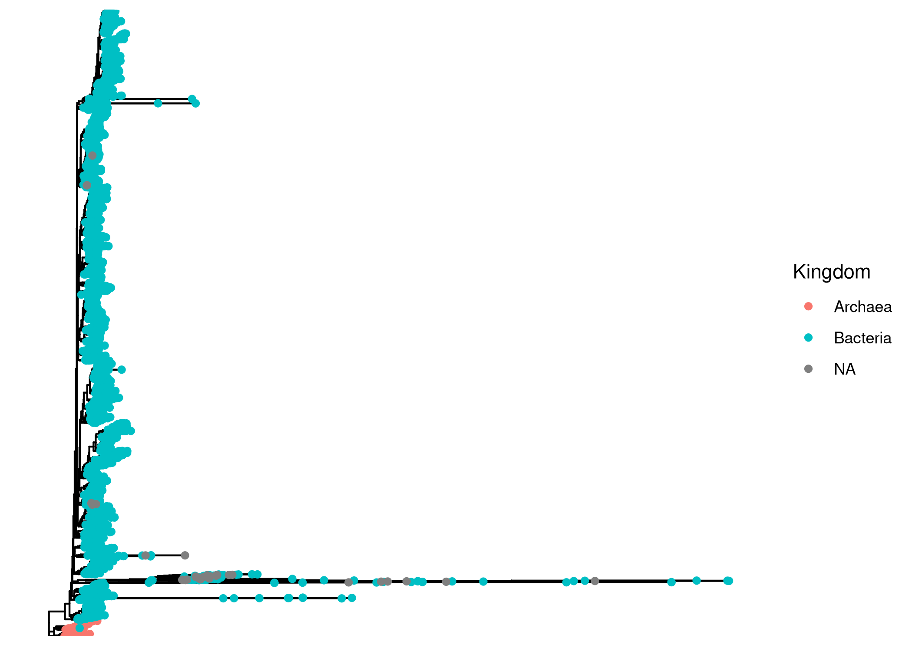
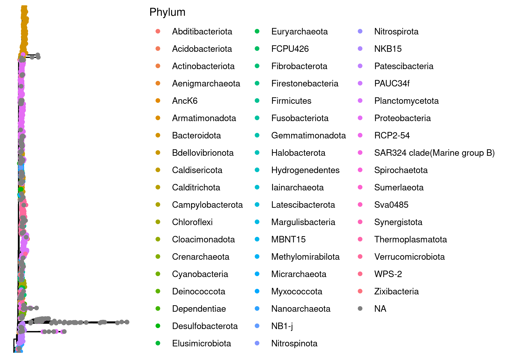
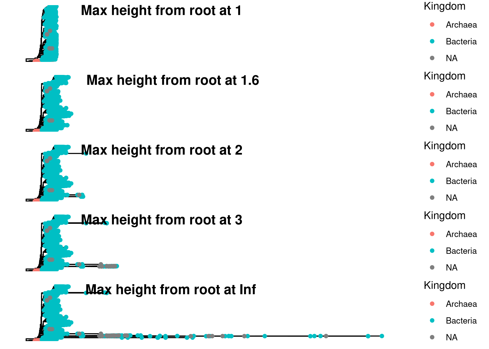
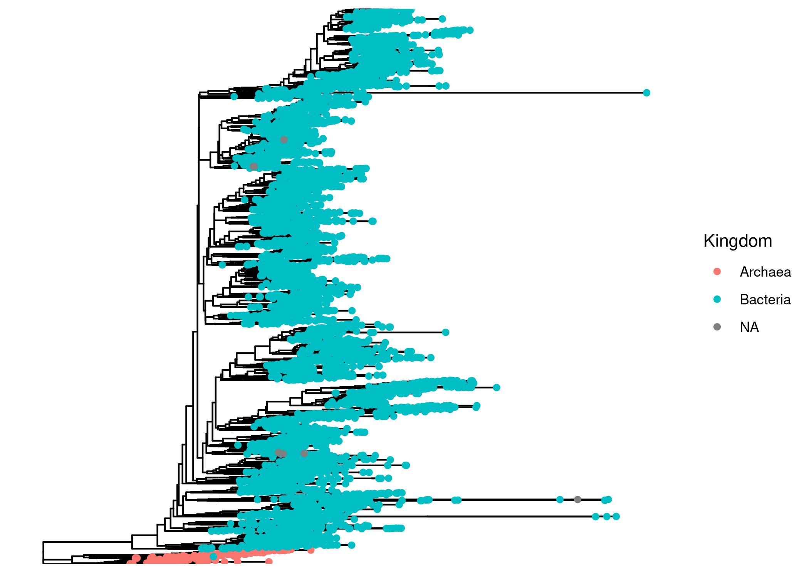

<style>
pre code, pre, code {
  white-space: pre !important;
  overflow-x: scroll !important;
  word-break: keep-all !important;
  word-wrap: initial !important;
}
</style>


# Purpose of this document

Here, I build a phylogenetic tree, for later use in phylogenetically weighted richness and distance measures. 

The goal of this document is to create a phylogenetic tree from the processed data and add it to the phyloseq object.

1. Load PhyloSeq_Preprocessing data
2. Create ASV file from PhyloSeq_Preprocessing
3. Upload ASV file to alignment (MAFFT) 
4. Run FastTree on aligned ASV file
5. Load FastTree unrooted tree
6. Add unrooted tree to preprocess_physeq object
7. Visualize with ggtree
8. Prune if needed
9. Save final tree with phyloseq object

# Load Packages and Functions

```r
# Load Packages
pacman::p_load(phyloseq, ggtree, ggpubr, tidytree, phytools, tidyverse, install = FALSE)

knitr::write_bib(file = "data/06_phylogeny_exports/packages.bib")

# load colors and shapes
source("code/R/plotting_aesthetics.R")
```


# Load data


```r
# Load in the raw_phyloseq data from DADA2_workflow.Rmd
load("data/03_preprocessing_exports/preprocessed_physeq.RData")

preprocessed_physeq
```

```
## phyloseq-class experiment-level object
## otu_table()   OTU Table:         [ 7674 taxa and 143 samples ]
## sample_data() Sample Data:       [ 143 samples by 47 sample variables ]
## tax_table()   Taxonomy Table:    [ 7674 taxa by 9 taxonomic ranks ]
```


# Write ASV Fasta file

```r
# first pull taxonomic table from phyloseq object
# contains ASV and sequences
tax_table <- preprocessed_physeq@tax_table %>% as.data.frame() %>% 
  select(ASV, ASVseqs)

# add > symbol to ASV names for file formatting
tax_table$ASV <- paste0(">",tax_table$ASV)

# bind ASVs and sequences together in one long character
seqs_fasta <- c(rbind(tax_table$ASV, tax_table$ASVseqs))

# write seqs_fasta out as a fasta file
write(seqs_fasta, file = "data/06_phylogeny_exports/preprocessed_asvs.fasta")
```


# Upload to MAFFT

This step aligns the ASV fasta from phyloseq_preprocessing and outputs an aligned fasta file. If you have more than 50,000 sequences, the method used is most likely FFT-large-NS-2. 

Always run any bash chunk from the project home directory.


```bash

# Run MAFFT on file
# I am using auto options for now (instead of specifying arguments)
# MAFFT automatically recognizes that it is a nucleotide alignment

# Set seed (not sure if relevant but not taking chances)
RANDOM=31491

/programs/mafft/bin/mafft --auto --quiet data/06_phylogeny_exports/preprocessed_asvs.fasta > data/06_phylogeny_exports/aligned_asvs.fasta 

```


# FastTree

This section of code takes the aligned fasta file and runs it through Fast Tree to output an unrooted tree. It also takes awhile. The end of the logfile will tell you relevant information on who the tree was built. 


```bash
#add to path
export PATH=/programs/FastTree-2.1.11:$PATH

# run command
# -nt indicates it is a nucleotide alignment 
# -gtr sets the model to a generalized time-reversible model 
# -fastest speeds up the process and reduces memory usage (recommended for >50,000 sequences) - check if gtr is neighbor-joining
# takes aligned_seqs fasta file as input and outputs unrooted.tree
# saves log file as fasttree.log (includes intermediate trees, settings, and model details)
# Again, setting seed, not sure that it's necessary

RANDOM=31491
FastTree -gtr -nt -fastest -quiet -log data/06_phylogeny_exports/fasttree.log data/06_phylogeny_exports/aligned_asvs.fasta  > data/06_phylogeny_exports/unrooted.tree

```

# Plot with ggtree

First load tree and add to phyloseq object

```r
# read tree file
tree <- read.tree("data/06_phylogeny_exports/unrooted.tree") 
```


# Rooting our tree


```r
# Find ASVs that are Archaea
arch_asvs <- tax_table(preprocessed_physeq) %>%
  as.data.frame() %>%
  filter(Kingdom == "Archaea") %>%
  pull(ASV)

# Find the node that encompasses all Archaea
arch_node <- findMRCA(tree, tips = arch_asvs, type = "node")

# Root the tree at that node
arch_root_tree <- ape::root(tree, node = arch_node, resolve.root = TRUE)
is.rooted(arch_root_tree)
```

```
## [1] TRUE
```

```r
# Merge with our physeq
arch_root_physeq <- merge_phyloseq(preprocessed_physeq, arch_root_tree)

# Plot
ggtree(arch_root_physeq) + 
  geom_tippoint(aes(color = Kingdom))
```



```r
ggtree(arch_root_physeq) + 
  geom_tippoint(aes(color = Phylum))
```



Okay, our tree looks pretty good. However, we see some very long bacterial outgroups that I am suspicious of. Let's explore three lines of evidence for each of these ASVs:

1. Their branch length
2. Their overall abundances

# Looking at their branch lengths


```r
# We can trim our trim by limiting how far branches are allow to be from the root
rootedTree <- phy_tree(arch_root_physeq)
is.rooted(rootedTree)
```

```
## [1] TRUE
```

```r
# Here, we find the node number of each tip
nodes <- purrr::map_dbl(rootedTree$tip.label, function(x,y)which(y==x),y=rootedTree$tip.label)

# We'll name it, just to stay consistent
names(nodes) <- rootedTree$tip.label

# Then, we'll calculate the height from the root for each tip (node)
heights <- purrr::map_dbl(nodes, nodeheight, tree = rootedTree, .progress = TRUE)

# We define some arbitrary heights to filter our tree be
cutoffs <- c(1, 1.6, 2,3, Inf)

# Find which ASVs would be disqualifed based on these heights
cut_asvs <- purrr::map(cutoffs, \(x)names(heights)[heights>x])

names(cut_asvs) <- paste0("RootHeight_", cutoffs)

# Now, produce multiple physeq objects which have had those long tips removed
subset_physeqs <- list()
for(cut_i in 1:length(cut_asvs)){
  subset_physeqs[[cut_i]] <- subset_taxa(arch_root_physeq, !ASV %in% cut_asvs[[cut_i]])
}

names(subset_physeqs) <- paste0("RootHeight_", cutoffs)

# Plot each tree
plots <- purrr::map(subset_physeqs, function(x)x%>%
               ggtree()+
               geom_tippoint(aes(color=Kingdom), size=1.5)+
                 xlim(c(0,12)))

# Visualize - which cutoff seems reasonable?
ggarrange(plotlist = plots, ncol = 1, labels = paste("Max height from root at", cutoffs))
```



To me, it looks like limiting distance from the root at length 2 seems the most reasonable. For the ASVs that we're dropping, what are their counts?

# Looking at feature counts


```r
arch_root_physeq %>%
  subset_taxa(., ASV %in% cut_asvs[["RootHeight_2"]]) %>%
  otu_table() %>%
  rowSums() %>% 
  sort
```

```
## ASV_2504 ASV_8097 ASV_7859 ASV_8370 ASV_7560 ASV_6410 ASV_7844 ASV_7591 ASV_7002 ASV_8497 ASV_6718 ASV_7290 ASV_6429 ASV_6432 ASV_7478 ASV_6449 ASV_7066 ASV_7130 ASV_8697 ASV_7085 ASV_7706 ASV_7279 ASV_7690 ASV_7885 ASV_6633 ASV_7985 ASV_7905 
##        0        2        2        2        2        2        2        2        2        2        2        2        2        2        2        2        2        2        2        2        2        2        2        2        2        2        2 
## ASV_8637 ASV_7157 ASV_7405 ASV_6456 ASV_6438 ASV_7698 ASV_7154 ASV_8701 ASV_6450 ASV_6714 ASV_7247 ASV_6777 ASV_8249 ASV_6884 ASV_7872 ASV_6528 ASV_6976 ASV_7882 ASV_6947 ASV_7310 ASV_7231 ASV_6827 ASV_7668 ASV_6442 ASV_8518 ASV_8509 ASV_8079 
##        2        2        2        2        2        2        2        2        2        2        2        2        2        2        2        2        2        2        2        2        2        2        2        2        2        2        2 
## ASV_6463 ASV_7039 ASV_6431 ASV_7564 ASV_7012 ASV_6439 ASV_7901 ASV_8182 ASV_8050 ASV_7090 ASV_7070 ASV_7976 ASV_8244 ASV_8680 ASV_7047 ASV_8255 ASV_8494 ASV_7633 ASV_7278 ASV_7568 ASV_7869 ASV_6874 ASV_7287 ASV_8088 ASV_7693 ASV_7197 ASV_6970 
##        2        2        2        2        2        2        2        2        2        2        2        2        2        2        2        2        2        2        2        2        2        2        2        2        2        2        2 
## ASV_7608 ASV_8493 ASV_5070 ASV_5847 ASV_5119 ASV_5286 ASV_5396 ASV_5658 ASV_5468 ASV_5661 ASV_5849 ASV_6125 ASV_5083 ASV_5309 ASV_6351 ASV_4917 ASV_5211 ASV_5038 ASV_5690 ASV_4740 ASV_4180 ASV_4659 ASV_4894 ASV_4248 ASV_3638 ASV_3633 ASV_4024 
##        2        2        3        3        3        3        3        3        3        3        3        3        3        3        3        3        3        3        3        4        4        4        4        4        5        5        5 
## ASV_3669 ASV_3559 ASV_3240 ASV_2819 ASV_2625 ASV_2092 ASV_2072 ASV_1930 
##        5        6        7        8        9       16       17       19
```

Okay, the taxa we're getting rid of are all very rare - makes me feel better.

# Final tree


```r
trim_tree_physeq <- subset_physeqs[["RootHeight_2"]]

# Can we re-root?
trim_tree <- phy_tree(trim_tree_physeq)

new_arch_asvs <- trim_tree_physeq %>%
  tax_table() %>%
  data.frame() %>%
  filter(Kingdom == "Archaea") %>%
  pull(ASV)


new_arch_node <- findMRCA(trim_tree, tips =  new_arch_asvs, type = "node")

# Root the tree at that node
new_arch_root_tree <- ape::root(trim_tree, node = new_arch_node, resolve.root = TRUE)

is.rooted(new_arch_root_tree)
```

```
## [1] TRUE
```

```r
# Merge with our physeq
trim_tree_physeq@phy_tree <- NULL

new_arch_root_physeq <- merge_phyloseq(trim_tree_physeq, new_arch_root_tree)

ggtree(new_arch_root_physeq) + 
  geom_tippoint(aes(color = Kingdom))
```



Looks great!
# Saving our final trimmed-up tree


```r
trim_tree_physeq <- new_arch_root_physeq

save(trim_tree_physeq, file = "data/06_phylogeny_exports/trim_tree_physeq.RData")
```

# Session Information 

```r
# Reproducibility
devtools::session_info()
```

```
## ─ Session info ─────────────────────────────────────────────────────────────────────────────────────────────────────────────────────────────────────────────────────────────────────────────────────────────────────────────────────────────────────────
##  setting  value
##  version  R version 4.3.3 (2024-02-29)
##  os       Rocky Linux 9.5 (Blue Onyx)
##  system   x86_64, linux-gnu
##  ui       X11
##  language (EN)
##  collate  en_US.UTF-8
##  ctype    en_US.UTF-8
##  tz       America/New_York
##  date     2025-06-26
##  pandoc   3.1.1 @ /usr/lib/rstudio-server/bin/quarto/bin/tools/ (via rmarkdown)
## 
## ─ Packages ─────────────────────────────────────────────────────────────────────────────────────────────────────────────────────────────────────────────────────────────────────────────────────────────────────────────────────────────────────────────
##  ! package           * version    date (UTC) lib source
##  P abind               1.4-5      2016-07-21 [?] CRAN (R 4.3.2)
##  P ade4                1.7-22     2023-02-06 [?] CRAN (R 4.3.2)
##  P ape               * 5.7-1      2023-03-13 [?] CRAN (R 4.3.2)
##  P aplot               0.2.2      2023-10-06 [?] CRAN (R 4.3.2)
##  P backports           1.4.1      2021-12-13 [?] CRAN (R 4.3.2)
##  P Biobase             2.62.0     2023-10-24 [?] Bioconductor
##  P BiocGenerics        0.48.1     2023-11-01 [?] Bioconductor
##  P BiocManager         1.30.22    2023-08-08 [?] CRAN (R 4.3.2)
##  P biomformat          1.30.0     2023-10-24 [?] Bioconductor
##  P Biostrings          2.70.1     2023-10-25 [?] Bioconductor
##  P bitops              1.0-7      2021-04-24 [?] CRAN (R 4.3.2)
##  P broom               1.0.5      2023-06-09 [?] CRAN (R 4.3.2)
##  P bslib               0.5.1      2023-08-11 [?] CRAN (R 4.3.2)
##  P cachem              1.0.8      2023-05-01 [?] CRAN (R 4.3.2)
##  P callr               3.7.3      2022-11-02 [?] CRAN (R 4.3.2)
##  P car                 3.1-2      2023-03-30 [?] CRAN (R 4.3.2)
##  P carData             3.0-5      2022-01-06 [?] CRAN (R 4.3.2)
##  P cli                 3.6.1      2023-03-23 [?] CRAN (R 4.3.2)
##  P cluster             2.1.4      2022-08-22 [?] CRAN (R 4.3.2)
##  P clusterGeneration   1.3.8      2023-08-16 [?] CRAN (R 4.3.2)
##  P coda                0.19-4.1   2024-01-31 [?] CRAN (R 4.3.2)
##  P codetools           0.2-19     2023-02-01 [?] CRAN (R 4.3.3)
##  P colorspace          2.1-0      2023-01-23 [?] CRAN (R 4.3.2)
##  P combinat            0.0-8      2012-10-29 [?] CRAN (R 4.3.2)
##  P cowplot             1.1.3      2024-01-22 [?] CRAN (R 4.3.2)
##  P crayon              1.5.2      2022-09-29 [?] CRAN (R 4.3.2)
##  P data.table          1.15.2     2024-02-29 [?] CRAN (R 4.3.2)
##  P devtools            2.4.4      2022-07-20 [?] CRAN (R 4.2.1)
##  P digest              0.6.33     2023-07-07 [?] CRAN (R 4.3.2)
##  P doParallel          1.0.17     2022-02-07 [?] CRAN (R 4.3.2)
##  P dplyr             * 1.1.3      2023-09-03 [?] CRAN (R 4.3.2)
##  P ellipsis            0.3.2      2021-04-29 [?] CRAN (R 4.3.2)
##  P evaluate            0.23       2023-11-01 [?] CRAN (R 4.3.2)
##  P expm                0.999-9    2024-01-11 [?] CRAN (R 4.3.2)
##  P fansi               1.0.5      2023-10-08 [?] CRAN (R 4.3.2)
##  P farver              2.1.1      2022-07-06 [?] CRAN (R 4.3.2)
##  P fastmap             1.1.1      2023-02-24 [?] CRAN (R 4.3.2)
##  P fastmatch           1.1-4      2023-08-18 [?] CRAN (R 4.3.2)
##  P forcats           * 1.0.0      2023-01-29 [?] CRAN (R 4.3.2)
##  P foreach             1.5.2      2022-02-02 [?] CRAN (R 4.3.2)
##  P fs                  1.6.3      2023-07-20 [?] CRAN (R 4.3.2)
##  P generics            0.1.3      2022-07-05 [?] CRAN (R 4.3.2)
##  P GenomeInfoDb        1.38.0     2023-10-24 [?] Bioconductor
##  P GenomeInfoDbData    1.2.11     2023-11-07 [?] Bioconductor
##  P ggfun               0.1.4      2024-01-19 [?] CRAN (R 4.3.2)
##  P ggplot2           * 3.5.0      2024-02-23 [?] CRAN (R 4.3.2)
##  P ggplotify           0.1.2      2023-08-09 [?] CRAN (R 4.3.2)
##  P ggpubr            * 0.6.0      2023-02-10 [?] CRAN (R 4.3.2)
##  P ggsignif            0.6.4      2022-10-13 [?] CRAN (R 4.3.2)
##  P ggtree            * 3.10.1     2024-02-25 [?] Bioconduc~
##  P glue                1.6.2      2022-02-24 [?] CRAN (R 4.3.2)
##  P gridGraphics        0.5-1      2020-12-13 [?] CRAN (R 4.3.2)
##  P gtable              0.3.4      2023-08-21 [?] CRAN (R 4.3.2)
##  P highr               0.10       2022-12-22 [?] CRAN (R 4.3.2)
##  P hms                 1.1.3      2023-03-21 [?] CRAN (R 4.3.2)
##  P htmltools           0.5.7      2023-11-03 [?] CRAN (R 4.3.2)
##  P htmlwidgets         1.6.2      2023-03-17 [?] CRAN (R 4.3.2)
##  P httpuv              1.6.12     2023-10-23 [?] CRAN (R 4.3.2)
##  P igraph              1.5.1      2023-08-10 [?] CRAN (R 4.3.2)
##  P IRanges             2.36.0     2023-10-24 [?] Bioconductor
##  P iterators           1.0.14     2022-02-05 [?] CRAN (R 4.3.2)
##  P jquerylib           0.1.4      2021-04-26 [?] CRAN (R 4.3.2)
##  P jsonlite            1.8.7      2023-06-29 [?] CRAN (R 4.3.2)
##  P knitr               1.45       2023-10-30 [?] CRAN (R 4.3.2)
##  P labeling            0.4.3      2023-08-29 [?] CRAN (R 4.3.2)
##  P later               1.3.1      2023-05-02 [?] CRAN (R 4.3.2)
##  P lattice             0.21-9     2023-10-01 [?] CRAN (R 4.3.2)
##  P lazyeval            0.2.2      2019-03-15 [?] CRAN (R 4.3.2)
##  P lifecycle           1.0.3      2022-10-07 [?] CRAN (R 4.3.2)
##  P lubridate         * 1.9.3      2023-09-27 [?] CRAN (R 4.3.2)
##  P magrittr            2.0.3      2022-03-30 [?] CRAN (R 4.3.2)
##  P maps              * 3.4.2      2023-12-15 [?] CRAN (R 4.3.2)
##  P MASS                7.3-60     2023-05-04 [?] CRAN (R 4.3.2)
##  P Matrix              1.6-1.1    2023-09-18 [?] CRAN (R 4.3.2)
##  P memoise             2.0.1      2021-11-26 [?] CRAN (R 4.3.2)
##  P mgcv                1.9-0      2023-07-11 [?] CRAN (R 4.3.2)
##  P mime                0.12       2021-09-28 [?] CRAN (R 4.3.2)
##  P miniUI              0.1.1.1    2018-05-18 [?] CRAN (R 4.3.2)
##  P mnormt              2.1.1      2022-09-26 [?] CRAN (R 4.3.2)
##  P multtest            2.58.0     2023-10-24 [?] Bioconductor
##  P munsell             0.5.0      2018-06-12 [?] CRAN (R 4.3.2)
##  P NatParksPalettes  * 0.2.0      2022-10-09 [?] CRAN (R 4.3.2)
##  P nlme                3.1-163    2023-08-09 [?] CRAN (R 4.3.2)
##  P numDeriv            2016.8-1.1 2019-06-06 [?] CRAN (R 4.3.2)
##  P optimParallel       1.0-2      2021-02-11 [?] CRAN (R 4.3.2)
##  P pacman              0.5.1      2019-03-11 [?] CRAN (R 4.3.2)
##  P patchwork           1.2.0.9000 2025-06-26 [?] Github (thomasp85/patchwork@d943757)
##  P permute             0.9-7      2022-01-27 [?] CRAN (R 4.3.2)
##  P phangorn            2.11.1     2023-01-23 [?] CRAN (R 4.3.2)
##  P phyloseq          * 1.46.0     2023-10-24 [?] Bioconductor
##  P phytools          * 2.1-1      2024-01-09 [?] CRAN (R 4.3.2)
##  P pillar              1.9.0      2023-03-22 [?] CRAN (R 4.3.2)
##  P pkgbuild            1.4.2      2023-06-26 [?] CRAN (R 4.3.2)
##  P pkgconfig           2.0.3      2019-09-22 [?] CRAN (R 4.3.2)
##  P pkgload             1.3.3      2023-09-22 [?] CRAN (R 4.3.2)
##  P plyr                1.8.9      2023-10-02 [?] CRAN (R 4.3.2)
##  P prettyunits         1.2.0      2023-09-24 [?] CRAN (R 4.3.2)
##  P processx            3.8.2      2023-06-30 [?] CRAN (R 4.3.2)
##  P profvis             0.3.8      2023-05-02 [?] CRAN (R 4.3.2)
##  P promises            1.2.1      2023-08-10 [?] CRAN (R 4.3.2)
##  P ps                  1.7.5      2023-04-18 [?] CRAN (R 4.3.2)
##  P purrr             * 1.0.2      2023-08-10 [?] CRAN (R 4.3.2)
##  P quadprog            1.5-8      2019-11-20 [?] CRAN (R 4.3.2)
##  P R6                  2.5.1      2021-08-19 [?] CRAN (R 4.3.2)
##  P Rcpp                1.0.11     2023-07-06 [?] CRAN (R 4.3.2)
##  P RCurl               1.98-1.13  2023-11-02 [?] CRAN (R 4.3.2)
##  P readr             * 2.1.5      2024-01-10 [?] CRAN (R 4.3.2)
##  P remotes             2.4.2.1    2023-07-18 [?] CRAN (R 4.3.2)
##    renv                1.0.5      2024-02-29 [1] CRAN (R 4.3.2)
##  P reshape2            1.4.4      2020-04-09 [?] CRAN (R 4.3.2)
##  P rhdf5               2.46.1     2023-11-29 [?] Bioconduc~
##  P rhdf5filters        1.14.1     2023-11-06 [?] Bioconductor
##  P Rhdf5lib            1.24.2     2024-02-07 [?] Bioconduc~
##  P rlang               1.1.2      2023-11-04 [?] CRAN (R 4.3.2)
##  P rmarkdown           2.25       2023-09-18 [?] CRAN (R 4.3.2)
##  P rstatix             0.7.2      2023-02-01 [?] CRAN (R 4.3.2)
##  P rstudioapi          0.15.0     2023-07-07 [?] CRAN (R 4.3.2)
##  P S4Vectors           0.40.1     2023-10-26 [?] Bioconductor
##  P sass                0.4.7      2023-07-15 [?] CRAN (R 4.3.2)
##  P scales              1.3.0      2023-11-28 [?] CRAN (R 4.3.2)
##  P scatterplot3d       0.3-44     2023-05-05 [?] CRAN (R 4.3.2)
##  P sessioninfo         1.2.2      2021-12-06 [?] CRAN (R 4.3.2)
##  P shiny               1.7.5.1    2023-10-14 [?] CRAN (R 4.3.2)
##  P stringi             1.7.12     2023-01-11 [?] CRAN (R 4.3.2)
##  P stringr           * 1.5.0      2022-12-02 [?] CRAN (R 4.3.2)
##  P survival            3.5-8      2024-02-14 [?] CRAN (R 4.3.3)
##  P tibble            * 3.2.1      2023-03-20 [?] CRAN (R 4.3.2)
##  P tidyr             * 1.3.1      2024-01-24 [?] CRAN (R 4.3.2)
##  P tidyselect          1.2.0      2022-10-10 [?] CRAN (R 4.3.2)
##  P tidytree          * 0.4.6      2023-12-12 [?] CRAN (R 4.3.2)
##  P tidyverse         * 2.0.0      2023-02-22 [?] CRAN (R 4.3.2)
##  P timechange          0.3.0      2024-01-18 [?] CRAN (R 4.3.2)
##  P treeio              1.27.0.002 2024-03-05 [?] Github (GuangchuangYu/treeio@f668633)
##  P tzdb                0.4.0      2023-05-12 [?] CRAN (R 4.3.2)
##  P urlchecker          1.0.1      2021-11-30 [?] CRAN (R 4.3.2)
##  P usethis             2.2.2      2023-07-06 [?] CRAN (R 4.3.2)
##  P utf8                1.2.4      2023-10-22 [?] CRAN (R 4.3.2)
##  P vctrs               0.6.4      2023-10-12 [?] CRAN (R 4.3.2)
##  P vegan               2.6-4      2022-10-11 [?] CRAN (R 4.3.2)
##  P withr               2.5.2      2023-10-30 [?] CRAN (R 4.3.2)
##  P xfun                0.52       2025-04-02 [?] CRAN (R 4.3.3)
##  P xtable              1.8-4      2019-04-21 [?] CRAN (R 4.3.2)
##  P XVector             0.42.0     2023-10-24 [?] Bioconductor
##  P yaml                2.3.7      2023-01-23 [?] CRAN (R 4.3.2)
##  P yulab.utils         0.1.4      2024-01-28 [?] CRAN (R 4.3.2)
##  P zlibbioc            1.48.0     2023-10-24 [?] Bioconductor
## 
##  [1] /local/workdir/arp277/Pendleton_2025_Ontario_Publication_Repo/renv/library/R-4.3/x86_64-pc-linux-gnu
##  [2] /home/arp277/.cache/R/renv/sandbox/R-4.3/x86_64-pc-linux-gnu/fd835031
## 
##  P ── Loaded and on-disk path mismatch.
## 
## ────────────────────────────────────────────────────────────────────────────────────────────────────────────────────────────────────────────────────────────────────────────────────────────────────────────────────────────────────────────────────────
```
