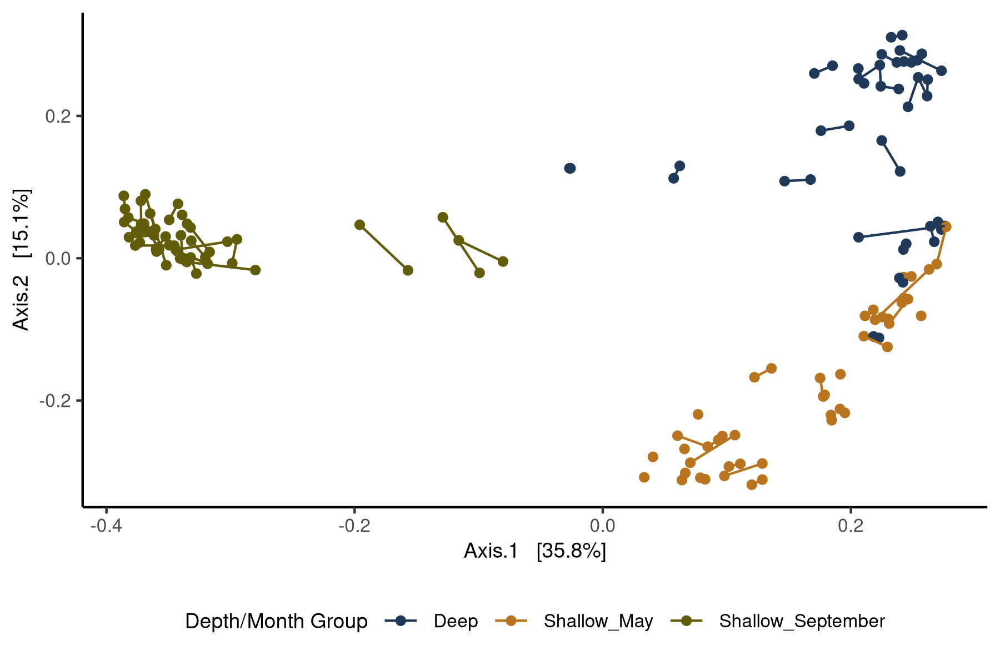
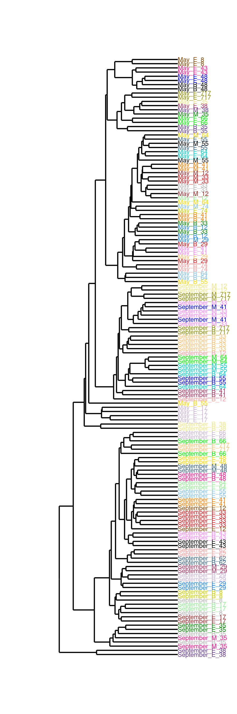
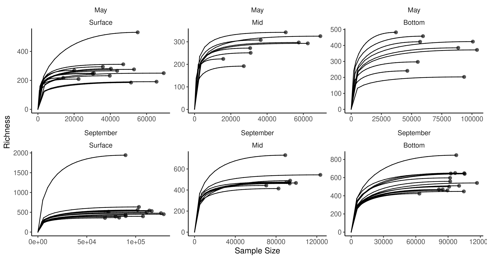

<style>
pre code, pre, code {
  white-space: pre !important;
  overflow-x: scroll !important;
  word-break: keep-all !important;
  word-wrap: initial !important;
}
</style>


# Load packages 

```r
# Efficiently load packages install.packages("hillR")
pacman::p_load(phyloseq, iNEXT, tidyverse, ggpubr, hillR, microViz, fun.gus, ggbeeswarm, randomForest, ggrepel, patchwork, ggdendro, install = FALSE)

knitr::write_bib(file = "data/07_biodiversity_exports/packages.bib")

source("code/R/plotting_aesthetics.R")

load("data/05_metadata_exports/full_meta.RData")
```

# Load data

This is a little tricky - the cut_table.RData object relies on work that we do in 08_Compositional_Analysis, which we need. Luckily, we already have this object saved, if you've cloned this Git repo. 


```r
load("data/06_phylogeny_exports/trim_tree_physeq.RData")

trim_tree_physeq
```

```
## phyloseq-class experiment-level object
## otu_table()   OTU Table:         [ 7558 taxa and 143 samples ]
## sample_data() Sample Data:       [ 143 samples by 47 sample variables ]
## tax_table()   Taxonomy Table:    [ 7558 taxa by 9 taxonomic ranks ]
## phy_tree()    Phylogenetic Tree: [ 7558 tips and 7557 internal nodes ]
```

```r
load("data/08_compositional_exports/cut_table.RData")
```

# The structure of this document

# Confirm replicates are close to each other


```r
new_sam_data <- trim_tree_physeq %>%
  ps_mutate(Rep_ID = paste(month, Station_ID, Depth_Class, sep = "_")) %>%
  samdat_tbl() %>%
  left_join(cut_table) %>%
  as.data.frame()

rownames(new_sam_data) <- new_sam_data$DNA_ID

rep_physeq <- merge_phyloseq(trim_tree_physeq, sample_data(new_sam_data))

plot_ordination(
  physeq = rep_physeq ,
  ordination = ordinate(rep_physeq , "bray", method = "PCoA", binary = TRUE),
  color = "Comp_Group_Hier") +
  geom_line(aes(group = Rep_ID,
                color = Comp_Group_Hier)) +
  scale_color_manual(values = comp_three_colors) + 
  labs(color = "Depth/Month Group") + 
  theme(axis.text = element_text(size = 8),
        axis.title = element_text(size = 9),
        legend.text = element_text(size = 8),
        legend.title = element_text(size = 9),
        legend.box.background = element_blank(),
        legend.position = "bottom")
```




```r
jac_dist_mat <- distance(rep_physeq, "bray", binary = TRUE)

jac_hclust <- jac_dist_mat %>%
  hclust(method = "average")

dendrogram <- jac_hclust %>%
  as.dendrogram() 

tip_groups <- data.frame(DNA_ID = dendro_data(dendrogram)$labels$label) %>%
   left_join(unique(select(data.frame(sample_data(trim_tree_physeq)), DNA_ID, Station_ID, month, Depth_Class)))

dend_data <- dendro_data(dendrogram)

ggplot(dend_data$segments) + 
  geom_segment(aes(x = x, y = y, xend = xend, yend = yend)) + 
  geom_text(data = dend_data$labels, aes(x, y, label = paste(tip_groups$month, tip_groups$Depth_Class, tip_groups$Station_ID, sep = "_"), color = paste(tip_groups$month, tip_groups$Depth_Class, tip_groups$Station_ID, sep = "_")),
            hjust = 0, size = 2) + 
  theme_void() +
  coord_flip() + 
  scale_y_reverse(expand = expansion(mult = .5)) + 
  scale_x_continuous(expand = expansion(mult = 0.1))+
  scale_color_manual(values = c(c25, c25, c25, c25, c25)) + 
  theme(legend.position = "none")
```



Generally replicates are most similar to each other!

# Merging my data

First, I merged replicates together, by summing their read counts. This also involves some cleaning up of the sample data, because categorical variables don't like to be combined. I also remove samples which provide unnecessary information (e.g. day vs. night samples). 

# Removing and merging samples


```r
rownames(full_meta) <- full_meta$DNA_ID

full_meta_physeq <- merge_phyloseq(trim_tree_physeq, sample_data(full_meta))

samples_to_remove <- c("AP_D1","AP_D2","AP_D151", "AP_D152", "AP_D147", "AP_D148", "AP_D149", "AP_D150") # These are our Stn 17 and Stn 33 stations

rm_sample_physeq <- full_meta_physeq %>%
  subset_samples(., !DNA_ID %in% samples_to_remove)%>% # Remove them from our phyloseq object
  prune_taxa(taxa_sums(.) > 0 , .) %>% # Get rid of taxa that now are completely absent
  ps_mutate(Rep_ID = paste(month, Station_ID, Depth_Class, sep = "_")) # Create new idea which combines replicates

merged_physeq <- rm_sample_physeq %>%
  merge_samples("Rep_ID") # Merge replicates based on Rep_ID. Counts are SUMMED, and numerical metadata is AVERAGED

# Confirm that we didn't add reads
stopifnot(sum(otu_table(merged_physeq)) == sum(otu_table(rm_sample_physeq)))

# For categorical variables, need to add that back separately

joined_vars <- full_meta_physeq %>%
  ps_mutate(Rep_ID = paste(month, Station_ID, Depth_Class, sep = "_"))%>% # Add Rep_ID column
  ps_select(month, Depth_Class, is_Fmax, is_stratified, transect, Depth_Range, Rep_ID) %>% # Grab our categorical variables
  samdat_tbl() %>% # Convert to tibble
  select(-.sample_name) %>% # Drop sample name
  unique() %>% # Combine replicates 
  left_join(cut_table)

full_merged_physeq <- merged_physeq %>%
  ps_select(!where(\(col)all(is.na(col)))) %>% # Drop all of the categorical columns that turned to NAs
  ps_select(!c(Depth_Range)) %>% # Drop factor columns that technically got averaged but lost their factor class
  ps_join(joined_vars, match_sample_names = "Rep_ID") # Join in our categorical data
```

# Run iNEXT on Merged Samples


```r
merged_iNEXT_input_df <- full_merged_physeq %>%
  otu_table() %>% 
  t() %>% # This is necessary if taxa_are_rows == FALSE
  data.frame()

#Run iNEXT on full merged dataset - slow!
# merge_iNEXT <- iNEXT(merged_iNEXT_input_df, datatype = "abundance", q = c(0,1,2))
# 
# save(merge_iNEXT, file = "data/07_biodiversity_exports/merge_iNEXT.RData")


load("data/07_biodiversity_exports/merge_iNEXT.RData")

# Just using size based estimation
size_based_data <- merge_iNEXT$iNextEst$size_based
```

We'll be using the size_based output. Coverage is inapplicable to DADA2 datasets, as they lack singletons (this is also why we can't use Amy Willis's breakaway approach). I am suspicious of the Asymptotic Estimator. Hence, we'll be using the size_based approach, with the caveat that we will very rigorously confirm that we've approached saturation for all of our samples!

Now, let's confirm we reach saturation for our samples (and so can use their observed values without fear of underestimation). 


```r
size_based_data %>%
  dplyr::rename(Rep_ID = Assemblage) %>%
  left_join(joined_vars) %>%
  filter(Order.q == 0, Method != "Extrapolation")  %>%
  mutate(Depth_Class = factor(Depth_Class, levels = c("E","M","B"), labels = c("Surface", "Mid","Bottom"))) %>%
  ggplot(aes(x = m, y = qD, group = Rep_ID)) + 
  geom_point(aes(size = Method), alpha = .6) + 
  geom_line() + 
  facet_wrap(month ~ Depth_Class, scales = "free") + 
  scale_size_discrete(range = c(2,0), guide = "none") + 
  labs(x = "Sample Size", y = "Richness")
```



This makes me feel good!

So moving forward, I will be using the observed richness values. I am also going to calculate the Phylogenetic Hill Diversity using the hillR package, without normalization.

# Calculating Phylogenetic Diversity


```r
hillR_input_df <- t(merged_iNEXT_input_df)

q_nums <- c("Phylo_Richness" = 0, "Phylo_Shannon" = 1, "Phylo_Simpson" = 2)

# This takes a little bit
hillR_res <- map_dfr(q_nums, \(.q)hill_phylo(hillR_input_df, phy_tree(full_merged_physeq), q = .q), .id = "Order.q")

hillR_for_join <- hillR_res %>%
  pivot_longer(!Order.q, names_to = "Rep_ID", values_to = "qD") %>%
  pivot_wider(names_from = Order.q, values_from = qD)
```

# Join in Diversity Measures and Save


```r
diversity_results <- size_based_data %>%
  dplyr::rename(Rep_ID = Assemblage) %>%
  dplyr::filter(Method == "Observed") %>%
  mutate(Alpha = case_match(Order.q, 0 ~ "Richness", 1 ~ "Shannon", 2 ~ "Simpson")) %>%
  select(Rep_ID, qD, Alpha) %>%
  pivot_wider(names_from = Alpha, values_from = qD) %>%
  left_join(hillR_for_join)

full_diversity_physeq <- full_merged_physeq %>%
  ps_join(diversity_results)

save(full_diversity_physeq, file = "data/07_biodiversity_exports/full_diversity_physeq.RData")
```


```r
sessioninfo::session_info()
```

```
## ─ Session info ─────────────────────────────────────────────────────────────────────────────────────────────────────────────────────────────────────────────────────────────────────────────────────────────────────────────────────────────────────────
##  setting  value
##  version  R version 4.3.3 (2024-02-29)
##  os       Rocky Linux 9.5 (Blue Onyx)
##  system   x86_64, linux-gnu
##  ui       X11
##  language (EN)
##  collate  en_US.UTF-8
##  ctype    en_US.UTF-8
##  tz       America/New_York
##  date     2025-06-26
##  pandoc   3.1.1 @ /usr/lib/rstudio-server/bin/quarto/bin/tools/ (via rmarkdown)
## 
## ─ Packages ─────────────────────────────────────────────────────────────────────────────────────────────────────────────────────────────────────────────────────────────────────────────────────────────────────────────────────────────────────────────
##  ! package           * version    date (UTC) lib source
##  P abind               1.4-5      2016-07-21 [?] CRAN (R 4.3.2)
##  P ade4                1.7-22     2023-02-06 [?] CRAN (R 4.3.2)
##  P ape                 5.7-1      2023-03-13 [?] CRAN (R 4.3.2)
##  P backports           1.4.1      2021-12-13 [?] CRAN (R 4.3.2)
##  P beeswarm            0.4.0      2021-06-01 [?] CRAN (R 4.3.2)
##  P Biobase             2.62.0     2023-10-24 [?] Bioconductor
##  P BiocGenerics        0.48.1     2023-11-01 [?] Bioconductor
##  P BiocManager         1.30.22    2023-08-08 [?] CRAN (R 4.3.2)
##  P biomformat          1.30.0     2023-10-24 [?] Bioconductor
##  P Biostrings          2.70.1     2023-10-25 [?] Bioconductor
##  P bitops              1.0-7      2021-04-24 [?] CRAN (R 4.3.2)
##  P broom               1.0.5      2023-06-09 [?] CRAN (R 4.3.2)
##  P bslib               0.5.1      2023-08-11 [?] CRAN (R 4.3.2)
##  P cachem              1.0.8      2023-05-01 [?] CRAN (R 4.3.2)
##  P car                 3.1-2      2023-03-30 [?] CRAN (R 4.3.2)
##  P carData             3.0-5      2022-01-06 [?] CRAN (R 4.3.2)
##  P cli                 3.6.1      2023-03-23 [?] CRAN (R 4.3.2)
##  P cluster             2.1.4      2022-08-22 [?] CRAN (R 4.3.2)
##  P clusterGeneration   1.3.8      2023-08-16 [?] CRAN (R 4.3.2)
##  P coda                0.19-4.1   2024-01-31 [?] CRAN (R 4.3.2)
##  P codetools           0.2-19     2023-02-01 [?] CRAN (R 4.3.3)
##  P colorspace          2.1-0      2023-01-23 [?] CRAN (R 4.3.2)
##  P combinat            0.0-8      2012-10-29 [?] CRAN (R 4.3.2)
##  P crayon              1.5.2      2022-09-29 [?] CRAN (R 4.3.2)
##  P cytolib             2.14.1     2024-01-18 [?] Bioconduc~
##  P data.table          1.15.2     2024-02-29 [?] CRAN (R 4.3.2)
##  P deSolve             1.40       2023-11-27 [?] CRAN (R 4.3.2)
##  P digest              0.6.33     2023-07-07 [?] CRAN (R 4.3.2)
##  P doParallel          1.0.17     2022-02-07 [?] CRAN (R 4.3.2)
##  P dplyr             * 1.1.3      2023-09-03 [?] CRAN (R 4.3.2)
##  P ellipsis            0.3.2      2021-04-29 [?] CRAN (R 4.3.2)
##  P evaluate            0.23       2023-11-01 [?] CRAN (R 4.3.2)
##  P expm                0.999-9    2024-01-11 [?] CRAN (R 4.3.2)
##  P fansi               1.0.5      2023-10-08 [?] CRAN (R 4.3.2)
##  P farver              2.1.1      2022-07-06 [?] CRAN (R 4.3.2)
##  P fastmap             1.1.1      2023-02-24 [?] CRAN (R 4.3.2)
##  P fastmatch           1.1-4      2023-08-18 [?] CRAN (R 4.3.2)
##  P flowCore            2.14.2     2024-03-18 [?] Bioconduc~
##  P forcats           * 1.0.0      2023-01-29 [?] CRAN (R 4.3.2)
##  P foreach             1.5.2      2022-02-02 [?] CRAN (R 4.3.2)
##  P fun.gus           * 0.3.1      2025-06-26 [?] Github (MarschmiLab/fun.gus@7daa3fa)
##  P furrr               0.3.1      2022-08-15 [?] CRAN (R 4.3.2)
##  P future              1.33.1     2023-12-22 [?] CRAN (R 4.3.3)
##  P geiger              2.0.11     2023-04-03 [?] CRAN (R 4.3.2)
##  P generics            0.1.3      2022-07-05 [?] CRAN (R 4.3.2)
##  P GenomeInfoDb        1.38.0     2023-10-24 [?] Bioconductor
##  P GenomeInfoDbData    1.2.11     2023-11-07 [?] Bioconductor
##  P ggbeeswarm        * 0.7.2      2023-04-29 [?] CRAN (R 4.3.2)
##  P ggdendro          * 0.2.0      2024-02-23 [?] CRAN (R 4.3.2)
##  P ggplot2           * 3.5.0      2024-02-23 [?] CRAN (R 4.3.2)
##  P ggpubr            * 0.6.0      2023-02-10 [?] CRAN (R 4.3.2)
##  P ggrepel           * 0.9.4      2023-10-13 [?] CRAN (R 4.3.2)
##  P ggsignif            0.6.4      2022-10-13 [?] CRAN (R 4.3.2)
##  P globals             0.16.2     2022-11-21 [?] CRAN (R 4.3.3)
##  P glue                1.6.2      2022-02-24 [?] CRAN (R 4.3.2)
##  P gtable              0.3.4      2023-08-21 [?] CRAN (R 4.3.2)
##  P highr               0.10       2022-12-22 [?] CRAN (R 4.3.2)
##  P hillR             * 0.5.2      2023-08-19 [?] CRAN (R 4.3.2)
##  P hms                 1.1.3      2023-03-21 [?] CRAN (R 4.3.2)
##  P htmltools           0.5.7      2023-11-03 [?] CRAN (R 4.3.2)
##  P httpuv              1.6.12     2023-10-23 [?] CRAN (R 4.3.2)
##  P igraph              1.5.1      2023-08-10 [?] CRAN (R 4.3.2)
##  P iNEXT             * 3.0.0      2022-08-29 [?] CRAN (R 4.3.2)
##  P IRanges             2.36.0     2023-10-24 [?] Bioconductor
##  P iterators           1.0.14     2022-02-05 [?] CRAN (R 4.3.2)
##  P jquerylib           0.1.4      2021-04-26 [?] CRAN (R 4.3.2)
##  P jsonlite            1.8.7      2023-06-29 [?] CRAN (R 4.3.2)
##  P knitr               1.45       2023-10-30 [?] CRAN (R 4.3.2)
##  P labeling            0.4.3      2023-08-29 [?] CRAN (R 4.3.2)
##  P later               1.3.1      2023-05-02 [?] CRAN (R 4.3.2)
##  P lattice             0.21-9     2023-10-01 [?] CRAN (R 4.3.2)
##  P lifecycle           1.0.3      2022-10-07 [?] CRAN (R 4.3.2)
##  P listenv             0.9.1      2024-01-29 [?] CRAN (R 4.3.2)
##  P lubridate         * 1.9.3      2023-09-27 [?] CRAN (R 4.3.2)
##  P magrittr            2.0.3      2022-03-30 [?] CRAN (R 4.3.2)
##  P maps                3.4.2      2023-12-15 [?] CRAN (R 4.3.2)
##  P MASS                7.3-60     2023-05-04 [?] CRAN (R 4.3.2)
##  P Matrix              1.6-1.1    2023-09-18 [?] CRAN (R 4.3.2)
##  P matrixStats         1.2.0      2023-12-11 [?] CRAN (R 4.3.2)
##  P mgcv                1.9-0      2023-07-11 [?] CRAN (R 4.3.2)
##  P microViz          * 0.12.1     2024-03-05 [?] https://d~
##  P mime                0.12       2021-09-28 [?] CRAN (R 4.3.2)
##  P mnormt              2.1.1      2022-09-26 [?] CRAN (R 4.3.2)
##  P multtest            2.58.0     2023-10-24 [?] Bioconductor
##  P munsell             0.5.0      2018-06-12 [?] CRAN (R 4.3.2)
##  P mvtnorm             1.2-4      2023-11-27 [?] CRAN (R 4.3.2)
##  P NatParksPalettes  * 0.2.0      2022-10-09 [?] CRAN (R 4.3.2)
##  P nlme                3.1-163    2023-08-09 [?] CRAN (R 4.3.2)
##  P numDeriv            2016.8-1.1 2019-06-06 [?] CRAN (R 4.3.2)
##  P optimParallel       1.0-2      2021-02-11 [?] CRAN (R 4.3.2)
##  P pacman              0.5.1      2019-03-11 [?] CRAN (R 4.3.2)
##  P parallelly          1.37.1     2024-02-29 [?] CRAN (R 4.3.3)
##  P patchwork         * 1.2.0.9000 2025-06-26 [?] Github (thomasp85/patchwork@d943757)
##  P permute             0.9-7      2022-01-27 [?] CRAN (R 4.3.2)
##  P phangorn            2.11.1     2023-01-23 [?] CRAN (R 4.3.2)
##  P phyloseq          * 1.46.0     2023-10-24 [?] Bioconductor
##  P phytools            2.1-1      2024-01-09 [?] CRAN (R 4.3.2)
##  P pillar              1.9.0      2023-03-22 [?] CRAN (R 4.3.2)
##  P pkgconfig           2.0.3      2019-09-22 [?] CRAN (R 4.3.2)
##  P plyr                1.8.9      2023-10-02 [?] CRAN (R 4.3.2)
##  P promises            1.2.1      2023-08-10 [?] CRAN (R 4.3.2)
##  P purrr             * 1.0.2      2023-08-10 [?] CRAN (R 4.3.2)
##  P quadprog            1.5-8      2019-11-20 [?] CRAN (R 4.3.2)
##  P R6                  2.5.1      2021-08-19 [?] CRAN (R 4.3.2)
##  P randomForest      * 4.7-1.1    2022-05-23 [?] CRAN (R 4.3.2)
##  P Rcpp                1.0.11     2023-07-06 [?] CRAN (R 4.3.2)
##  P RCurl               1.98-1.13  2023-11-02 [?] CRAN (R 4.3.2)
##  P readr             * 2.1.5      2024-01-10 [?] CRAN (R 4.3.2)
##    renv                1.0.5      2024-02-29 [1] CRAN (R 4.3.2)
##  P reshape2            1.4.4      2020-04-09 [?] CRAN (R 4.3.2)
##  P rhdf5               2.46.1     2023-11-29 [?] Bioconduc~
##  P rhdf5filters        1.14.1     2023-11-06 [?] Bioconductor
##  P Rhdf5lib            1.24.2     2024-02-07 [?] Bioconduc~
##  P rlang               1.1.2      2023-11-04 [?] CRAN (R 4.3.2)
##  P rmarkdown           2.25       2023-09-18 [?] CRAN (R 4.3.2)
##  P RProtoBufLib        2.14.1     2024-03-18 [?] Bioconduc~
##  P rstatix             0.7.2      2023-02-01 [?] CRAN (R 4.3.2)
##  P rstudioapi          0.15.0     2023-07-07 [?] CRAN (R 4.3.2)
##  P S4Vectors           0.40.1     2023-10-26 [?] Bioconductor
##  P sass                0.4.7      2023-07-15 [?] CRAN (R 4.3.2)
##  P scales              1.3.0      2023-11-28 [?] CRAN (R 4.3.2)
##  P scatterplot3d       0.3-44     2023-05-05 [?] CRAN (R 4.3.2)
##  P sessioninfo         1.2.2      2021-12-06 [?] CRAN (R 4.3.2)
##  P shiny               1.7.5.1    2023-10-14 [?] CRAN (R 4.3.2)
##  P stringi             1.7.12     2023-01-11 [?] CRAN (R 4.3.2)
##  P stringr           * 1.5.0      2022-12-02 [?] CRAN (R 4.3.2)
##  P subplex             1.8        2022-04-12 [?] CRAN (R 4.3.2)
##  P survival            3.5-8      2024-02-14 [?] CRAN (R 4.3.3)
##  P tibble            * 3.2.1      2023-03-20 [?] CRAN (R 4.3.2)
##  P tidyr             * 1.3.1      2024-01-24 [?] CRAN (R 4.3.2)
##  P tidyselect          1.2.0      2022-10-10 [?] CRAN (R 4.3.2)
##  P tidyverse         * 2.0.0      2023-02-22 [?] CRAN (R 4.3.2)
##  P timechange          0.3.0      2024-01-18 [?] CRAN (R 4.3.2)
##  P tzdb                0.4.0      2023-05-12 [?] CRAN (R 4.3.2)
##  P utf8                1.2.4      2023-10-22 [?] CRAN (R 4.3.2)
##  P vctrs               0.6.4      2023-10-12 [?] CRAN (R 4.3.2)
##  P vegan               2.6-4      2022-10-11 [?] CRAN (R 4.3.2)
##  P vipor               0.4.7      2023-12-18 [?] CRAN (R 4.3.2)
##  P withr               2.5.2      2023-10-30 [?] CRAN (R 4.3.2)
##  P xfun                0.52       2025-04-02 [?] CRAN (R 4.3.3)
##  P xtable              1.8-4      2019-04-21 [?] CRAN (R 4.3.2)
##  P XVector             0.42.0     2023-10-24 [?] Bioconductor
##  P yaml                2.3.7      2023-01-23 [?] CRAN (R 4.3.2)
##  P zlibbioc            1.48.0     2023-10-24 [?] Bioconductor
## 
##  [1] /local/workdir/arp277/Pendleton_2025_Ontario_Publication_Repo/renv/library/R-4.3/x86_64-pc-linux-gnu
##  [2] /home/arp277/.cache/R/renv/sandbox/R-4.3/x86_64-pc-linux-gnu/fd835031
## 
##  P ── Loaded and on-disk path mismatch.
## 
## ────────────────────────────────────────────────────────────────────────────────────────────────────────────────────────────────────────────────────────────────────────────────────────────────────────────────────────────────────────────────────────
```
