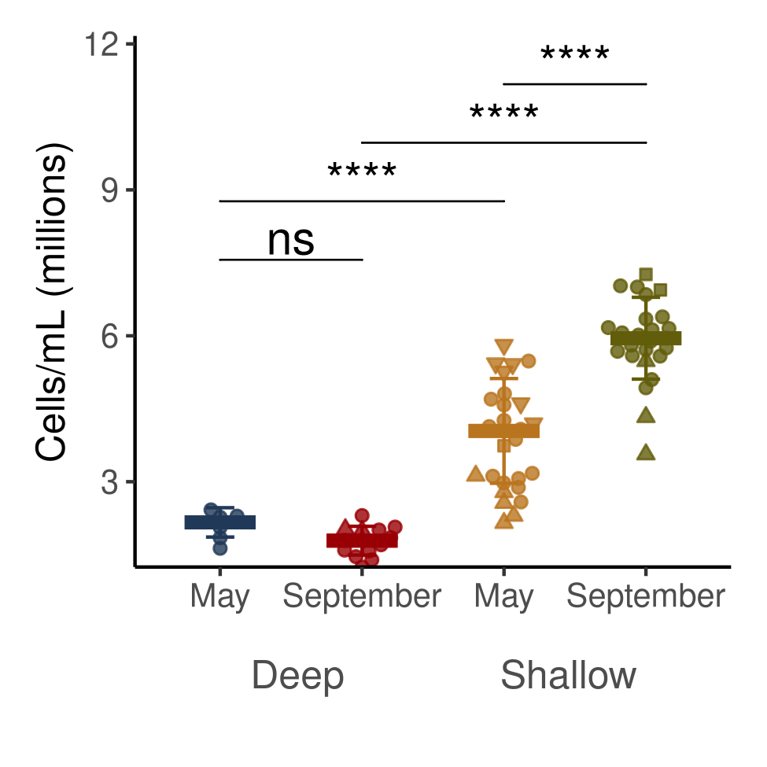

<style>
pre code, pre, code {
  white-space: pre !important;
  overflow-x: scroll !important;
  word-break: keep-all !important;
  word-wrap: initial !important;
}
</style>


# Load packages 

```r
# Efficiently load packages 
pacman::p_load(phyloseq, ggpubr, vegan, tidyverse, microViz, patchwork, ggrepel, combinat, ggdendro, GUniFrac, install = FALSE)

packageDescription("GUniFrac") # Make sure we're using the version from MarschmiLab!!!!
```

```
## Package: GUniFrac
## Type: Package
## Title: Generalized UniFrac Distances, Distance-Based Multivariate Methods and Feature-Based Univariate Methods for Microbiome Data Analysis
## Version: 1.8.1
## Date: 2023-09-13
## Author: Jun Chen, Xianyang Zhang, Lu Yang, Lujun Zhang
## Maintainer: Jun Chen <chen.jun2@mayo.edu>
## Description: A suite of methods for powerful and robust microbiome data analysis including data normalization, data simulation, community-level association testing and differential abundance analysis. It implements
##                          generalized UniFrac distances, Geometric Mean of Pairwise Ratios (GMPR) normalization, semiparametric data simulator, distance-based statistical methods, and feature-based statistical methods. The
##                          distance-based statistical methods include three extensions of PERMANOVA: (1) PERMANOVA using the Freedman-Lane permutation scheme, (2) PERMANOVA omnibus test using multiple matrices, and (3)
##                          analytical approach to approximating PERMANOVA p-value. Feature-based statistical methods include linear model-based methods for differential abundance analysis of zero-inflated high-dimensional
##                          compositional data.
## Depends: R (>= 3.5.0)
## Suggests: ade4, knitr, markdown, ggpubr
## Imports: Rcpp (>= 0.12.13), vegan, ggplot2, matrixStats, Matrix, ape, parallel, stats, utils, statmod, rmutil, dirmult, MASS, ggrepel, foreach, modeest, inline, methods
## LinkingTo: Rcpp
## NeedsCompilation: yes
## VignetteBuilder: knitr
## License: GPL-3
## Encoding: UTF-8
## Packaged: 2023-09-13 22:22:15 UTC; m123485
## Repository: CRAN
## Date/Publication: 2023-09-14 00:02:32 UTC
## Built: R 4.3.3; x86_64-pc-linux-gnu; 2025-04-30 16:54:23 UTC; unix
## RemoteType: github
## RemoteHost: api.github.com
## RemoteUsername: MarschmiLab
## RemoteRepo: GUniFrac
## RemoteRef: master
## RemoteSha: 91321d0d07a1584b962638f21584be72c6d15ff9
## GithubHost: api.github.com
## GithubRepo: GUniFrac
## GithubUsername: MarschmiLab
## GithubRef: master
## GithubSHA1: 91321d0d07a1584b962638f21584be72c6d15ff9
## 
## -- File: /home/arp277/.cache/R/renv/cache/v5/R-4.3/x86_64-pc-linux-gnu/GUniFrac/1.8.1/2e4669fa3920bb8d8fa791926436dd98/GUniFrac/Meta/package.rds
```

```r
knitr::write_bib(file = "data/08_compositional_exports/packages.bib")

# load in functions and color preferences
source("code/R/plotting_aesthetics.R")
```

# Load Data


```r
load("data/07_biodiversity_exports/full_diversity_physeq.RData")
```

This physeq already has unnecessary replicates removed, and samples merged, as described in 07_Biodiversity Analysis. 


```r
merge_raremax <- min(sample_sums(full_diversity_physeq)) # Find new limit for rarefaction
```

Our minimum number of reads is 1.3986\times 10^{4} reads

# Transforming counts to absolute abundance

Next, we are going to normalize each of our samples by their absolute cell abundance, by multiplying the relative abundance of each read in that sample by the cells/ml of that sample. 


```r
rel_abund_count_matrix <- full_diversity_physeq %>%
  transform_sample_counts(function(x) {x/sum(x)}) %>% # Convert to relative abundance
  otu_table() %>% # Pull OTU table
  as.matrix() # Convert to matrix
  
# Pull our cell counts and arrange to match row order of OTU table
cell_counts <- full_diversity_physeq %>%
  sample_data() %>%
  data.frame() %>%
  select(Rep_ID, avg_cells_per_ml) %>%
  arrange(match(Rep_ID, row.names(rel_abund_count_matrix)))

# NO NEWS IS GOOD NEWS
stopifnot(all(cell_counts$Rep_ID == row.names(rel_abund_count_matrix)))

# Multiply relative abundance by cells/mL
transformed_asv_counts <- cell_counts$avg_cells_per_ml * rel_abund_count_matrix

# Round to integer values
trans_data_mat <- round(transformed_asv_counts@.Data,0) 

diffs <- rowSums(trans_data_mat) - cell_counts$avg_cells_per_ml

hist(diffs)
```


Here, I'm looking at at how many cells I've "lost" or "gained" through rounding issues. This isn't necessarily trivial. For instance, if I want to make sure every single ASV remains in my dataset, I would use ceiling, which will round up. But then samples with higher richness "gain" abundances more than less-rich samples. In the end, I decided to use round, which while imperfect (and I do remove some rare ASVs from the dataset in this way), gives the most even distribution of cell count differences (centered around zero) than other methods.


```r
full_abs_physeq <- full_diversity_physeq

full_abs_physeq@otu_table <- otu_table(trans_data_mat, taxa_are_rows = FALSE)


#Confirm we have new sample sums in the millions (cells/mL)
head(sample_sums(full_abs_physeq), 10)
```

```
## May_12_B May_12_E May_12_M May_17_E May_29_B May_29_E May_29_M May_33_B May_33_E May_33_M 
##  2058850  4696825  4808348  3738732  2153099  3124901  2566158  2293159  5480867  3114432
```

```r
# Add new upwelling variable

full_abs_physeq <- full_abs_physeq %>%
  ps_mutate(Upwelling = case_when(
    Rep_ID %in% c("September_38_E","September_38_B", "September_35_E", "September_35_M", "September_35_B", "September_717_M", 
                  "May_29_M", "May_29_E", "May_48_B", "May_43_E", "May_29_B") ~ "Upwelling",
    Rep_ID %in% c("May_17_E", "September_17_E", "September_17_B") ~ "Welland Canal",
    Rep_ID %in% c("May_66_E","May_35_M","May_38_M","May_35_E","May_38_E","May_717_E") ~ "Downwelling",
    TRUE ~ "Other")
  )
```


```r
full_abs_physeq %>%
  sample_data() %>%
  data.frame() %>% 
  ggplot(aes(x = temperature, y = avg_cells_per_ml/1e6)) + 
  geom_point(size = 3, alpha = 0.8, stroke = 1,
             aes(
    color = Comp_Group_Hier_Colors, 
    fill = Comp_Group_Hier_Colors, 
    shape = Upwelling)) + 
  scale_color_manual(values = comp_group_colors_hier,
                   labels = c("Deep (May)",
                                "Deep (September)",
                                "Shallow May",
                                "Shallow September"),
                     name = "Depth and Month") + 
  scale_fill_manual(values = comp_group_colors_hier, guide = "none") + 
  scale_shape_manual(values = upwelling_shapes,
                     name = "Status",
                     breaks = c("Upwelling", "Downwelling", "Welland Canal")) + 
  guides(shape = guide_legend(order = 2),
         color = guide_legend(order = 1)) + 
  labs(x = "Temperature (°C)", y = "Cells/mL (millions)") + 
  theme(legend.justification.inside = c(1,0.01),
        legend.position = "inside",
        legend.spacing = unit(0,"cm"),
        #legend.margin = unit(0.02,"cm"),
        legend.key.spacing = unit(0,"cm"),
        legend.box.background = element_blank()) + 
  ggpubr::stat_cor(method = "spearman")
```


```r
diversity_df <- full_abs_physeq %>%
  sample_data() %>%
  data.frame()

comparisons <- combn(1:4, 2, simplify = FALSE)[c(1,2,5,6)]

# Testing differences
range(diversity_df$avg_cells_per_ml)
```

```
## [1] 1246414 7261861
```

```r
base_plot <- diversity_df %>%
  ggplot(aes(x = str_replace(Comp_Group_Hier_Colors, "_", "\n"), y = avg_cells_per_ml/1e6, color = Comp_Group_Hier_Colors, fill = Comp_Group_Hier_Colors)) + 
  stat_summary(geom = "errorbar", fun.min = median, fun.max = median, width = 0.5, linewidth = 2) + 
  stat_summary(geom ="errorbar", 
               fun.min = \(x)median(x)-sd(x), 
               fun.max = \(x)median(x) + sd(x),
               width = 0.2) + 
  ggbeeswarm::geom_beeswarm(alpha = 0.8, cex = 3, aes(shape = Upwelling)) + 
  scale_color_manual(values = comp_group_colors_hier, guide = "none") + 
  scale_fill_manual(values = comp_group_colors_hier, guide = "none") +  
   scale_shape_manual(values = upwelling_shapes,
                     breaks = c("Upwelling", "Downwelling", "Welland Canal")) +  
  scale_y_continuous(expand = expansion(mult = c(0,.1)), labels = scales::label_comma()) + 
  scale_x_discrete(labels = c("May","September","May","September")) + 
  labs(y = "Cells/mL (millions)") +
  theme(axis.title.x = element_blank(),
        strip.text = element_text(size = 12),
        legend.position = "none") + 
  stat_compare_means(comparisons = comparisons, label = "p.signif", size = 5, tip.length = 0, step.increase = .2)

label_plots <- ggplot() + scale_x_continuous(limits = c(0.5, 4.5), breaks = c(1.5, 3.5), labels = c("Deep","Shallow"), position = "top") + 
  theme(axis.line = element_blank(),
        axis.ticks = element_blank(),
        axis.text = element_text(size = 12))

cell_box_plots <- base_plot / ( label_plots) + 
  plot_layout(heights = c(20,1))

cell_box_plots
```



# Calculate Distance Matrix

The authors compared many distance matrices (if you're interested, feel free to contact us), but we settled on Generalized Unifrac (alpha = 0.5) using absolute abundances for most of our comparisons. This relies on a customized GUniFrac function, so make sure to install from the MarschmiLab source, rather than CRAN. 


```r
# Distance object derived from absolute abundances - need to use modified GUniFrac to do so!

absolute_wunifrac <- GUniFrac(otu.tab = as.matrix(otu_table(full_abs_physeq)), tree = phy_tree(full_diversity_physeq), alpha = c(0,0.5,1), normalize_counts = FALSE)
```

```
## Accumulate the abundance along the tree branches...
## Compute pairwise distances ...
## Completed!
```

```r
save(absolute_wunifrac, file = "data/08_compositional_exports/absolute_wunifrac.RData")

abs_unifrac_dist_0.5 <- as.dist(absolute_wunifrac$unifracs[, , "d_0.5"])
```

# Hierarchical clustering to define groups


```r
wun_hclust <- abs_unifrac_dist_0.5 %>%
  hclust(method = "average")

dendrogram <- wun_hclust %>%
  as.dendrogram() 

# These next four lines switch two branches, purely for aesthetic reasons
den_copy <- dendrogram
den_copy[[1]] <- dendrogram[[2]]
den_copy[[2]] <- dendrogram[[1]]
dendrogram <- den_copy

tip_annotation_df <- 
  full_abs_physeq %>%
  sample_data() %>%
  data.frame() %>%
  select(Comp_Group_Hier_Colors, Rep_ID, Upwelling)

tip_groups <- data.frame(Rep_ID = dendro_data(dendrogram)$labels$label) %>%
   left_join(tip_annotation_df)

dend_data <- dendro_data(dendrogram)

ggplot(dend_data$segments) + 
  geom_segment(aes(x = x, y = y, xend = xend, yend = yend)) + 
  geom_text(data = dend_data$labels, aes(x, y, label = label, color = tip_groups$Comp_Group_Hier_Colors),
            hjust = 0, size = 2) + 
    geom_point(data = dend_data$labels, aes(x, y = ifelse(tip_groups$Comp_Group_Hier_Colors == "Shallow_May", -0.5, -0.75), color = tip_groups$Comp_Group_Hier_Colors,fill = tip_groups$Comp_Group_Hier_Colors,  shape = tip_groups$Upwelling, alpha = tip_groups$Upwelling), size = 2) + 
  theme_void() +
  coord_flip() + 
  scale_y_reverse(expand = expansion(mult = .5)) + 
  scale_x_continuous(expand = expansion(mult = 0.1))+
  scale_color_manual(values = comp_group_colors_hier) + 
  scale_fill_manual(values = comp_group_colors_hier) + 
  scale_shape_manual(values = upwelling_shapes) + 
  scale_alpha_manual(values = c(0.8,0,0.8,0.8)) + 
  theme(legend.position = "none")
```


We'll also make a "blank" dendrogram that will be used to structure the compositional plot (Figure 2D)

```r
dendro_metadata <- full_diversity_physeq %>%
  sample_data() %>%
  data.frame() %>%
  select(Rep_ID, Comp_Group_Hier, Comp_Group_Hier_Colors)

dend_data_df <- dend_data$labels %>%
  dplyr::rename(Rep_ID = label) %>%
  left_join(dendro_metadata)
  

dendro_plot_for_barplots <- ggplot(dend_data$segments) + 
  geom_segment(aes(x = y, y = x, xend = yend, yend = xend)) + 
  geom_point(data = dend_data_df, aes(y, x, color = Comp_Group_Hier),
             pch = 15, size = 3) + 
  theme_void()+
  scale_y_continuous(expand = expansion(mult = 0.01)) + 
  scale_x_reverse(expand = expansion(mult = 0.02))+
  scale_color_manual(values = comp_three_colors, "Depth and Month") + 
  theme(legend.position = "none")
```

Let's define new comparative groups using this hierarchical tree


```r
cut_results <- wun_hclust %>%
  cutree(dendrogram, k = 3)
  
comp_cutresults <- case_match(cut_results, 1 ~ "Deep", 2 ~ "Shallow_May", 3 ~ "Shallow_September")

cut_table <- tibble(
  Rep_ID = names(cut_results),
  Comp_Group_Hier = comp_cutresults
) %>%
  mutate(Comp_Group_Hier_Colors = case_when(Comp_Group_Hier=="Deep"&str_detect(Rep_ID, "May") ~ "Deep (May)",
                                            Comp_Group_Hier=="Deep"&str_detect(Rep_ID, "September") ~ "Deep (September)",
                                            TRUE ~ Comp_Group_Hier))

save(cut_table, file = "data/08_compositional_exports/cut_table.RData")
```

By the time you'll read this...these comp groups will already be in our metadata dataframe (very meta, I know).

# Nice, publishable ordination


```r
w_unifrac_pcoa_abs_0.5 <- ordinate(
    physeq = full_abs_physeq,
    method = "PCoA",
    distance = abs_unifrac_dist_0.5
  )

wun_pcoa_abs_hier <- plot_ordination(
  physeq = full_abs_physeq,
  ordination = w_unifrac_pcoa_abs_0.5,
  color = "Comp_Group_Hier_Colors",
  shape= "Upwelling") +
  geom_point(size = 4, alpha = 0.8, aes(fill = Comp_Group_Hier_Colors)
             ) + 
  #stat_ellipse(aes(group = Comp_Group_Hier), linetype = 2) + 
    scale_fill_manual(values = comp_group_colors_hier, guide = "none") + 
    scale_shape_manual(values = upwelling_shapes) + 
    scale_color_manual(values = comp_group_colors_hier) +
  labs(color = "Depth and Month") + 
  theme(legend.justification.inside = c(1,0.01),
        legend.position = "inside",
        legend.spacing = unit(0, "cm"))

wun_pcoa_abs_hier
```


I do this plot first, and then I remake it from scratch with aesthetics that I like a little better:


```r
pcoa_theme <- ggplot2:::plot_theme(ggplot_build(wun_pcoa_abs_hier)$plot)
```


```r
ord_df<- plot_ordination(
  physeq = full_abs_physeq,
  ordination = w_unifrac_pcoa_abs_0.5,
  justDF = TRUE)


ggplot(data = ord_df, 
       aes(x = Axis.1, 
           y = Axis.2,
           fill = Comp_Group_Hier_Colors,
           color = Comp_Group_Hier_Colors,
           shape = Upwelling)) + 
  geom_point(size = 5, alpha = 0.8, stroke = 1) +
  pcoa_theme + 
  scale_shape_manual(values = upwelling_shapes,
                     breaks = c("Upwelling", "Downwelling","Welland Canal")) + 
  scale_fill_manual(values = comp_group_colors_hier, guide = "none") +
  scale_color_manual(values = comp_group_colors_hier) +
  labs(color = "Depth and Month",
       shape = "Status",
       x = "Axis.1 [43.2%]",
       y = "Axis.2 [19.9%]") + 
  theme(legend.justification.inside = c(1,0.01),
        legend.position = "inside",
        legend.spacing = unit(0, "cm"),
        legend.box.background = element_blank())
```


# PERMANOVA for our overall ordination

Now, let's include the permanova result that essentially "matches" this ordination, so that they are close to together. 


```r
set.seed(31491)

sam_data_for_adonis <- data.frame(sample_data(full_abs_physeq))

adonis2(abs_unifrac_dist_0.5 ~ Comp_Group_Hier, data = sam_data_for_adonis, by = "margin")
```

```
## Permutation test for adonis under reduced model
## Marginal effects of terms
## Permutation: free
## Number of permutations: 999
## 
## adonis2(formula = abs_unifrac_dist_0.5 ~ Comp_Group_Hier, data = sam_data_for_adonis, by = "margin")
##                 Df SumOfSqs      R2      F Pr(>F)    
## Comp_Group_Hier  2   5.0380 0.54602 41.495  0.001 ***
## Residual        69   4.1887 0.45398                  
## Total           71   9.2267 1.00000                  
## ---
## Signif. codes:  0 '***' 0.001 '**' 0.01 '*' 0.05 '.' 0.1 ' ' 1
```

Here, we explain 55.47% of variation using these three groups, with a p-value of 0.001. 


# Beta Dispersion for our overall ordination

Next, we can beta dispersion across these three groups


```r
betadispr <- betadisper(abs_unifrac_dist_0.5, sam_data_for_adonis$Comp_Group_Hier)

permutest(betadispr)
```

```
## 
## Permutation test for homogeneity of multivariate dispersions
## Permutation: free
## Number of permutations: 999
## 
## Response: Distances
##           Df   Sum Sq  Mean Sq      F N.Perm Pr(>F)    
## Groups     2 0.068177 0.034088 11.768    999  0.001 ***
## Residuals 69 0.199878 0.002897                         
## ---
## Signif. codes:  0 '***' 0.001 '**' 0.01 '*' 0.05 '.' 0.1 ' ' 1
```

```r
permutest(betadispr, pairwise = TRUE)$pairwise
```

```
## $observed
##              Deep-Shallow_May        Deep-Shallow_September Shallow_May-Shallow_September 
##                  6.098825e-01                  6.324350e-04                  3.172848e-05 
## 
## $permuted
##              Deep-Shallow_May        Deep-Shallow_September Shallow_May-Shallow_September 
##                         0.605                         0.002                         0.001
```

There is a significant difference in dispersion, in that Shallow September is highly clustered compared to the other two groups.

# Clustering Surface Communites (Figure 1D)


```r
# First, May
surf_may <- full_abs_physeq %>%
  ps_filter(month=="May", Depth_Class == "E")

# Identify May Samples
keeps <- sample_names(surf_may)

# Filter our distance matrix just for Surface May samples
temp_mat <- as.matrix(abs_unifrac_dist_0.5)

all(colnames(temp_mat) == rownames(temp_mat))
```

```
## [1] TRUE
```

```r
keep_i <- colnames(temp_mat) %in% keeps

surf_may_dist <- as.dist(temp_mat[keep_i, keep_i])

# Cluster
surf_may_hclust <- surf_may_dist %>%
  hclust(method = "average")

# Define a height at which to cut the tree
height = 0.32

may_surf_groups <- cutree(surf_may_hclust, h = height)

# Plot our dendrogram
may_surf_d <- as.dendrogram(surf_may_hclust)

data <- dendro_data(may_surf_d)

may_clust_df <- data.frame(cluster = factor(may_surf_groups[match(data$labels$label,names(may_surf_groups))]),
                           Rep_ID = data$labels$label)

ggplot(segment(data)) + 
  geom_segment(aes(x = x, y = y, xend = xend, yend = yend),
               linewidth = 1) + 
  coord_flip() + 
  geom_text(data = may_clust_df, aes(label = Rep_ID, color = cluster, y = 0, x = c(1:15)), size = 5, hjust = 0) + 
  scale_y_reverse(limits = c(.65, -.5)) +
  theme(axis.title.y  = element_blank(),
        axis.line.y = element_blank(),
        axis.ticks.y = element_blank(),
        axis.text.y = element_blank(),
        axis.title.x = element_blank(),
        axis.text.x = element_text(size = 10),
        axis.line.x = element_line(linewidth  = 1),
        axis.ticks.x = element_line(linewidth = 1),
        legend.position = "none") + 
  scale_color_manual(values = c("#211ed2","#ea8bb9","#79d3df","#ed8114")) + 
  geom_hline(yintercept = 0.32, linetype = 2, size = 1)
```


```r
surf_sep <- full_abs_physeq %>%
  ps_filter(month=="September", Depth_Class == "E")

keeps <- sample_names(surf_sep)

temp_mat <- as.matrix(abs_unifrac_dist_0.5)

all(colnames(temp_mat) == rownames(temp_mat))
```

```
## [1] TRUE
```

```r
keep_i <- colnames(temp_mat) %in% keeps

surf_sep_dist <- as.dist(temp_mat[keep_i, keep_i])

surf_sep_hclust <- surf_sep_dist %>%
  hclust(method = "average")

sep_surf_groups <- cutree(surf_sep_hclust, h = height)

sep_surf_d <- as.dendrogram(surf_sep_hclust)

data <- dendro_data(sep_surf_d)

sep_clust_df <- data.frame(cluster = factor(sep_surf_groups[match(data$labels$label,names(sep_surf_groups))]),
                           Rep_ID = data$labels$label)

ggplot(segment(data)) + 
  geom_segment(aes(x = x, y = y, xend = xend, yend = yend),
               linewidth = 1) + 
  coord_flip() + 
  geom_text(data = sep_clust_df, aes(label = Rep_ID, color = cluster, y = 0, x = c(1:15)), size = 5, hjust = 0) + 
  scale_y_reverse(limits = c(.65, -.5)) +
  theme(axis.title.y  = element_blank(),
        axis.line.y = element_blank(),
        axis.ticks.y = element_blank(),
        axis.text.y = element_blank(),
        axis.title.x = element_blank(),
        axis.text.x = element_text(size = 10),
        axis.line.x = element_line(linewidth = 1),
        axis.ticks.x = element_line(linewidth = 1),
        legend.position = "none") + 
  scale_color_manual(values = c("#64cb74","#f02fb3")) + 
  geom_hline(yintercept = 0.32, linetype = 2, size = 1)
```


# PCA of Environmental Metadata

How do our stations cluster based on metadata? Below, I select numerical metadata from each station and use a PCA to plot stations based on their environmental characteristics. 

It took a lot of work to make the PCA and PCoA look the same, haha, but I think it was worth it.


```r
# Select our environmental metadata
metadata_df <- full_abs_physeq %>%
  sample_data() %>%
  data.frame() %>%
  select(good_oxygen, upoly, par, fluorescence, temperature, NH4:chl_a, Rep_ID, Comp_Group_Hier_Colors, Upwelling) %>%
  dplyr::filter(!if_any(everything(), is.na))

# Filter just for numerical metadata for the PCA
numerical_metadata <- metadata_df %>%
  select_if(negate(is.factor)) %>%
  select_if(is.numeric)

# Run PCA - centering occurs by default
pca_res <- prcomp(numerical_metadata, scale. = TRUE)

# Run an envfit on PCA to identify significant vectors
ef <- envfit(pca_res, numerical_metadata)

# Filter for sig vectors, and make nice names
loading_df <- data.frame(ef$vectors$arrows) %>%
  cbind(r = ef$vectors$r) %>%
  cbind(p = ef$vectors$pvals) %>%
  filter(r > 0.5, p <0.05) %>%
  tibble::rownames_to_column("Variable") %>%
    mutate(Variable = c("Oxygen", 
                      "Turbidity",
                      "Fluorescence",
                      "Temperature",
                      "NOx",
                      "TN",
                      "Ca",
                      "Mg",
                      "Si",
                      "Chlorophyll-a"))

# Pull out sample points from PCA for manual plotting
point_df <- data.frame(x = pca_res$x[,1],
                       y = pca_res$x[,2],
                       Rep_ID = rownames(pca_res$x)) %>%
  left_join(metadata_df)

# Find variance fom each axis for axis labels

variance <- summary(pca_res)$importance[2,][1:2] * 100

variance <- round(variance, digits = 1)

# Plot PCA!
env_pca <- ggplot(data = point_df, aes(x=x, y=y, color = Comp_Group_Hier_Colors)) + 
  geom_segment(data = loading_df, aes(xend = PC1, yend = PC2, x = 0, y = 0), color = "grey80",
               arrow = arrow(length = unit(0.1, "inches"))) + 
  geom_text(data = loading_df, aes(x = PC1*1.6, y = PC2*1.6, label = Variable), color = "grey80", size = 3) + 
  geom_point(size = 5, alpha = 0.8, stroke = 1, aes(shape = Upwelling, fill = Comp_Group_Hier_Colors)) + 
  labs(x = paste0("Axis.1 [",variance[1],"%]"), y = paste0("Axis.2 [",variance[2],"%]"),
       color = "Depth and Month", shape = "Status") +
  pcoa_theme + 
  scale_shape_manual(values = upwelling_shapes,
                     breaks = c("Upwelling", "Downwelling","Welland Canal")) + 
  scale_fill_manual(values = comp_group_colors_hier, guide = "none") +
  scale_color_manual(values = comp_group_colors_hier) +
  theme(legend.justification.inside = c(1,0.01),
        legend.position = "inside",
        legend.spacing = unit(0, "cm"),
        legend.box.background = element_blank())

env_pca
```


# Absolute Abundance Plots

Here, we plot taxonomic abundance barplots at the class level


```r
class_df_abs <- 
  full_abs_physeq %>%
  speedyseq::relocate_tax_table(ASV, .after = last_col()) %>%
  speedyseq::tax_glom(taxrank = "Class") %>%      # Agglomerate/merge counts by class using faster function
  psmelt() %>%                                         # melt into long format data frame 
  mutate(Class = case_when(is.na(Class)~"Other",
                            TRUE ~ Class)) # Deal with NAs

# Here, I find which taxa are abundant enough that we can see them in the plot, and so are worth assigning colors
abund_taxa_abs <- class_df_abs %>%
  group_by(Class) %>%
  mutate(rare_c = max(Abundance) < 100000) %>%
  filter(!rare_c) %>%
  pull(Class) %>% unique()

# This is the order of samples in our dendrogram
rep_order <- dend_data$labels$label

class_barplot_abs <- class_df_abs %>%
  select(Class, Abundance, Comp_Group_Hier, Rep_ID) %>%
  mutate(Class = ifelse(Class %in% abund_taxa_abs, Class, "Rare"),
          Class = factor(Class, levels = names(class_colors))) %>%  # Mark rare taxa
  group_by(Class, Rep_ID, Comp_Group_Hier) %>%
  summarize(Abundance = sum(Abundance)) %>%
  ungroup() %>% 
  mutate(Rep_ID = factor(Rep_ID, levels = rep_order)) %>%
  ggplot(aes(y = Rep_ID, x = Abundance/1e6, fill = Class)) + 
  geom_bar(stat="identity") +
  scale_fill_manual(values = class_colors) + 
  scale_x_continuous(expand = expansion(mult = 0),
                     labels = scales::label_comma()) + 
  labs(x = "Abundance (million cells/mL)") + 
  theme(axis.line.y = element_blank(),
        axis.text.y = element_blank(),
        axis.ticks.y = element_blank(),
        axis.title.y = element_blank(),
        plot.margin = unit(c(0,0,0,0), "null"),
        axis.text.x = element_text(size = 10),
        axis.title.x = element_text(size = 12),
        legend.text = element_text(size = 14),
        legend.title = element_text(size = 20)) + 
  guides(fill = guide_legend(ncol = 1))

# This is the set of labels (Deep, Shallow May, Shallow September) which floats alongside
labels <- ggplot(data = data.frame(),
       aes(y = c(0, 37, 72),
           x = 0,
           label = c("Shallow September","Shallow May", "Deep"))) + 
  geom_text(color = comp_three_colors[c(2,1,3)],
            angle = 90,
            size = 6,
            fontface = "bold") + 
  theme_void() + 
  scale_y_continuous(expand = expansion(mult = .3))


# This puts together our labels, our dendrogram, and our barplot
class_abs_abund <- labels + dendro_plot_for_barplots + class_barplot_abs + 
  plot_layout(widths = c(.5,.5,8), ncol = 3)


class_abs_abund
```


# Absolute Most abundant ASVs


```r
# Make a dataframe with every ASV's abundance
asv_melted <- full_abs_physeq %>%
  psmelt()


annotations <- asv_melted %>%
  mutate(Species = case_when(!is.na(Species)~Species,
                             is.na(Species)&(!is.na(Genus))~paste(Genus, "sp."),
                             TRUE~paste("Unknown sp."))) %>% # Rename NAs
  select(ASV, Phylum, Class,Species) %>%
  unique() %>% # Collapse multiple zeros
  mutate(Species = case_when(ASV == "ASV_3"~"CL500-11", # We blasted this ASV and it matched CL500-11 the best
                             TRUE ~ Species))

asv_melted %>%
  select(ASV, Rep_ID, Abundance) %>%
  group_by(ASV) %>%
  summarize(Prevalence = sum(as.numeric(Abundance > 0)) / n(),
            Max_Abundance = max(Abundance)
            ) %>%
  left_join(annotations) %>%
  filter(Max_Abundance > 5e4) %>% # Zoom into the most abundance ASVs
  ggplot(aes(x = Prevalence, y = Max_Abundance, color = Class)) + 
  geom_point() + 
  geom_text_repel(aes(label = Species), size = 3)  +
  scale_y_continuous(transform = "log10", labels = scales::label_comma())+ 
  scale_x_continuous(limits = c(0, 1.25),
                     breaks = c(0,0.5, 1)) +
  scale_color_manual(values = class_colors) + 
  labs(y = "Maximum Cell Count (cells/mL)", y = "Prevalence") +
  theme(legend.position = "none")
```


Here I do the same thing as above, but without an abundance cutoff. This means that we can't really see specific species anymore, but can evalute the overall distributions of ASVs (and support our claim that we didn't observe very many conditionally rare taxa). 


```r
all_asvs <- asv_melted %>%
  select(ASV, Rep_ID, Abundance) %>%
  group_by(ASV) %>%
  summarize(Prevalence = sum(as.numeric(Abundance > 0)) / n(),
            Max_Abundance = max(Abundance)
            ) %>%
  left_join(annotations) %>%
  mutate(Class = ifelse(Max_Abundance > 10000, Class, "Rare"),
         Class = ifelse(is.na(Class), "Unidentified",Class)) %>%
  ggplot(aes(x = Prevalence, y = Max_Abundance, color = Class)) + 
  geom_point() +
  scale_y_continuous(transform = "log10", labels = scales::label_comma())+ 
  scale_x_continuous(limits = c(0, 1.25),
                     breaks = c(0,0.5, 1)) +
  scale_color_manual(values = class_colors) + 
  labs(y = "Maximum Cell Count (cells/mL)", y = "Prevalence") + 
  guides(color = guide_legend(
    title = "Class",
    ncol = 1,
    override.aes = aes(label = "")
  )) + 
  annotate(geom = "rect", xmin = -Inf, xmax = Inf, ymin = 5e4, ymax = Inf,
           fill = NA, color = "grey")

all_asvs
```


# Highlighting Specific Taxa (Figures S10A and S15)

## Highlighting acI-C2 (Fig. S15)

Quick digression - here we'll highlight how acI-C2 is only found in warm Shallow September.


```r
asv_melted %>%
  filter(Species == "acI-C2") %>%
  ggplot(aes(x = Comp_Group_Hier, y = Abundance, color = Comp_Group_Hier)) + 
  geom_boxplot() +
  ggbeeswarm::geom_beeswarm() + 
  scale_y_continuous(labels = scales::label_comma()) + 
  scale_color_manual(values = comp_three_colors) + 
  ggpubr::stat_compare_means(comparisons = list(c(1,2), c(1,3), c(2,3))) + 
  labs(x = "", y = "Abundance of acI-C2 (cells/mL") + 
  theme(legend.position = "none")
```


Now I remake the figure, without the actual stats values, which I report in the text.


```r
asv_melted %>%
  filter(Species == "acI-C2") %>%
  ggplot(aes(x = Comp_Group_Hier, y = Abundance, color = Comp_Group_Hier)) + 
  geom_boxplot() +
  ggbeeswarm::geom_beeswarm() + 
  scale_y_continuous(labels = scales::label_comma(),
                     expand = expansion(c(0.01,0.1))) + 
  scale_color_manual(values = comp_three_colors) + 
  ggpubr::stat_compare_means(comparisons = list(c(1,2), c(1,3), c(2,3)),
                             label = "p.signif") + 
  labs(x = "", y = "Abundance of acI-C2 (cells/mL)") + 
  theme(legend.position = "none")
```


## Highlighting Deep Taxa in Upwelling (Fig. S10A)


```r
asv_melted %>%
  filter(Comp_Group_Hier_Colors %in% c("Deep (September)", "Shallow_September")) %>%
  mutate(Comp_Group_Hier_Colors = ifelse(Rep_ID%in%c("September_38_E","September_35_E", "September_38_B", "September_35_M","September_35_B"), "Sept. Upwelling", Comp_Group_Hier_Colors)) %>%
  filter(Class %in% c("Nitrospiria","Anaerolineae", "Cyanobacteriia")) %>%
  group_by(Class, Rep_ID, Comp_Group_Hier_Colors) %>%
  summarize(Sum_Abund = sum(Abundance)) %>%
  ungroup() %>%
  ggplot(aes(x = Comp_Group_Hier_Colors, y = Sum_Abund, color = Comp_Group_Hier_Colors)) + 
  geom_boxplot() + 
  geom_jitter(size = 2, alpha = .5, width = 0.2) + 
  facet_wrap(~Class, scales = "free_y", ncol = 3) + 
  scale_y_log10(labels = scales::label_comma()) + 
  scale_color_manual(values = c("#990006","#864F8F", "#625D0A")) + 
  labs(y = "Absolute Abundance (cells / mL)") + 
  theme(legend.position = "none",
        axis.text.x = element_text(angle = -45, hjust= 0, vjust = 0),
        axis.title.x = element_blank()) + 
  ggpubr::stat_compare_means(comparisons = list(c(1,2),c(2,3)))
```


```r
asv_melted %>%
  filter(Comp_Group_Hier_Colors %in% c("Deep (September)", "Shallow_September")) %>%
  mutate(Comp_Group_Hier_Colors = ifelse(Rep_ID%in%c("September_38_E","September_35_E", "September_38_B", "September_35_M","September_35_B"), "Sept. Upwelling", Comp_Group_Hier_Colors)) %>%
  filter(Class %in% c("Nitrospiria","Anaerolineae", "Cyanobacteriia")) %>%
  group_by(Class, Rep_ID, Comp_Group_Hier_Colors) %>%
  summarize(Sum_Abund = sum(Abundance)) %>%
  ungroup() %>%
  ggplot(aes(x = Comp_Group_Hier_Colors, y = Sum_Abund, color = Comp_Group_Hier_Colors)) + 
  geom_boxplot() + 
  geom_jitter(size = 2, alpha = .5, width = 0.2) + 
  facet_wrap(~Class, scales = "free_y", ncol = 3) + 
  scale_y_log10(labels = scales::label_comma(),
                expand = expansion(0.1)) + 
  scale_color_manual(values = c("#990006","#864F8F", "#625D0A")) + 
  labs(y = "Absolute Abundance (cells / mL)") + 
  theme(legend.position = "none",
        axis.text.x = element_text(angle = -30, hjust= .5, vjust = .2, size = 8),
        axis.title.x = element_blank(),
        axis.title.y = element_text(size = 9),
        strip.text = element_text(size = 10)) + 
  ggpubr::stat_compare_means(comparisons = list(c(1,2),c(2,3)), label = "p.signif")
```


# Exploring Unique Taxa and Unique Interactions

First, we look at the ASV abundance distributions at different stations (near, or apart, from upwellings or the Welland Canal)


```r
asv_df_rel <- 
  full_abs_physeq %>%
  transform_sample_counts(function(x) {x/sum(x)}) %>% # Convert to relative abundances
  psmelt()

asv_df_rel %>%
  filter(Station_ID %in% c(12, 17, 35, 43, 29), 
         month == "May",
         Depth_Class == "E") %>%
  mutate(Station_ID = paste("Station", Station_ID),
         Station_ID = factor(Station_ID, levels = c("Station 17", "Station 29", "Station 43", "Station 12", "Station 35"))) %>%
  ggplot(aes(x = log10(Abundance))) + 
  geom_histogram() + 
  facet_wrap(~Station_ID, nrow = 1) + 
  labs(x = bquote(log[10]~(Relative~Abundance~of~ASV)), y = "Count")
```


Repeat for September


```r
asv_df_rel %>%
  filter(Station_ID %in% c(35, 38, 717, 41, 17), 
         month == "September",
         Depth_Class == "E") %>%
  mutate(Station_ID = paste("Station", Station_ID),
         Station_ID = factor(Station_ID, levels = c("Station 38", "Station 35", "Station 17", "Station 41", "Station 717"))) %>%
  ggplot(aes(x = log10(Abundance))) + 
  geom_histogram() + 
  facet_wrap(~Station_ID, nrow = 1) + 
  labs(x = bquote(log[10]~(Relative~Abundance~of~ASV)), y = "Count")
```


Now, I plot the taxonomic composition of the samples I showed above, but only of ASVs which had a relative abundance *less than 0.0001*! There's a lot of code to tweak the ordering and aesthetics.


```r
rare_physeq <- 
  full_abs_physeq %>%
  transform_sample_counts(function(x) {x/sum(x)}) %>% 
  psmelt() %>%
  filter(Abundance < 0.0001) %>%
  group_by(ASV) %>%
  filter(sum(Abundance) > 0) %>%
  ungroup()

rare_rel_abund <- rare_physeq %>%
  select(Station_ID, Rep_ID, month, Abundance, Depth_Class, Phylum:Species) %>%
  filter(Abundance > 0) %>%
  group_by(Rep_ID) %>%
  mutate(Rel_Rare_Abund = Abundance / sum(Abundance)) %>%
  ungroup() 

rare_rel_abund %>%
  filter(Depth_Class == "E", 
         month == "September" & Station_ID %in% c(35, 38, 717, 41, 17)|month == "May" & Station_ID %in% c(17, 35, 12, 29, 43)) %>%
  mutate(Phylum = ifelse(Phylum == "Proteobacteria",Class, Phylum)) %>%
  group_by(Phylum, Rep_ID, month) %>%
  summarize(Phyl_Abund = sum(Rel_Rare_Abund)) %>%
  mutate(Phylum = case_when(is.na(Phylum) ~"Unidentified",
                            Phyl_Abund < 0.02~"Rare",
                            TRUE ~ Phylum),
         Phylum = factor(Phylum),
         Phylum = fct_relevel(Phylum, "Rare", after = Inf),
         Phylum = fct_relevel(Phylum, "Unidentified", after = Inf),
         Rep_ID = factor(Rep_ID, levels = c("May_17_E",
                                            "May_29_E",
                                            "May_43_E",
                                            "May_12_E",
                                            "May_35_E",
                                            "September_38_E",
                                            "September_35_E",
                                            "September_717_E",
                                            "September_41_E",
                                            "September_17_E"))
              
)  %>% 
  ggplot(aes(y = Rep_ID, x = Phyl_Abund, fill = Phylum)) + 
  geom_col() + 
  scale_fill_manual(values = rare_phylum_colors) + 
  facet_wrap(~month, nrow = 2, scales = "free_y") + 
  labs(x = expression("Relative Abundance of Phylum"~italic(within~rare~taxa)),
       y = "Sample",
       fill = "Phylum (or Class)") + 
  theme(strip.text = element_blank()) + 
  guides(fill = guide_legend(ncol = 1))
```


# Identifying ASVs Unique to Upwelling Stations


```r
# The trans stands for "transient"
trans_taxa <- asv_melted %>%
  filter(Abundance > 0) %>%
  count(OTU) %>%
  filter(n <= 1) %>%  # Find ASVs which are only observed in one sample
  pull(OTU)

asv_melted %>%
  filter(Abundance > 0) %>%
  filter(OTU %in% trans_taxa) %>%
  count(Rep_ID) %>%
  arrange(desc(n)) %>%
  slice_head(n = 20) %>% # Only choose the top 20 samples with the most "unique" taxa
  mutate(Rep_ID = factor(Rep_ID),
         Rep_ID = fct_reorder(Rep_ID, n)) %>%
  ggplot(aes(x = n, y = Rep_ID, label = Rep_ID, xend = 0)) + 
  geom_segment(arrow = arrow(ends = "first", length = unit(0.1, "cm"))) + 
  geom_text(hjust = -0.1) + 
  scale_x_continuous(expand = expansion(c(0.1,0.5))) + 
  labs(x = "Number of ASVs Unique to Station") + 
  theme(axis.title.y = element_blank(),
        axis.text.y = element_blank(),
        axis.line.y = element_blank(),
        axis.ticks.y = element_blank())
```


Next, we look for unique interactions (pairs of ASVs only seen in one sample)


```r
pairs <- asv_melted %>%
  filter(Abundance > 1e3) %>% # Set a minimum abundance threshold
  select(Rep_ID, ASV) %>%
  group_by(Rep_ID) %>%
  reframe(A1 = t(combn(ASV, 2))) %>% # Make a row for EVERY combination of ASV in each Rep_ID
  rowwise() %>%
  mutate(pair_key = paste(sort(A1), collapse = ":")) %>% # Make a pair_key, which is each ASV name pasted together, but in alphabetical order (to prevent duplicates)
  ungroup()

trans_interactions <- pairs %>%
  count(pair_key) %>%
  filter(n == 1) %>% # Find interactions that only occur in one sample
  pull(pair_key)

pairs %>%
  filter(pair_key %in% trans_interactions) %>%
  count(Rep_ID) %>%
  arrange(desc(n)) %>%
  slice_head(n = 20) %>% # Same as above - select 20 samples with most unique interactions
  mutate(Rep_ID = factor(Rep_ID),
         Rep_ID = fct_reorder(Rep_ID, n)) %>%
  ggplot(aes(x = n, y = Rep_ID, label = Rep_ID, xend = 0)) + 
  geom_segment(arrow = arrow(ends = "first", length = unit(0.1, "cm"))) + 
  geom_text(hjust = -0.1) + 
  scale_x_continuous(expand = expansion(c(0.1,0.5))) + 
  labs(x = "Number of Co-occuring ASVs Unique to Sample") + 
  theme(axis.title.y = element_blank(),
        axis.text.y = element_blank(),
        axis.line.y = element_blank(),
        axis.ticks.y = element_blank())
```


# Saving out relevant objects for spatial analysis


```r
save(full_abs_physeq, file = "data/08_compositional_exports/full_abs_physeq.RData")
```


```r
sessioninfo::session_info()
```

```
## ─ Session info ─────────────────────────────────────────────────────────────────────────────────────────────────────────────────────────────────────────────────────────────────────────────────────────────────────────────────────────────────────────
##  setting  value
##  version  R version 4.3.3 (2024-02-29)
##  os       Rocky Linux 9.5 (Blue Onyx)
##  system   x86_64, linux-gnu
##  ui       X11
##  language (EN)
##  collate  en_US.UTF-8
##  ctype    en_US.UTF-8
##  tz       America/New_York
##  date     2025-06-27
##  pandoc   3.1.1 @ /usr/lib/rstudio-server/bin/quarto/bin/tools/ (via rmarkdown)
## 
## ─ Packages ─────────────────────────────────────────────────────────────────────────────────────────────────────────────────────────────────────────────────────────────────────────────────────────────────────────────────────────────────────────────
##  ! package          * version    date (UTC) lib source
##  P abind              1.4-5      2016-07-21 [?] CRAN (R 4.3.2)
##  P ade4               1.7-22     2023-02-06 [?] CRAN (R 4.3.2)
##  P ape                5.7-1      2023-03-13 [?] CRAN (R 4.3.2)
##  P backports          1.4.1      2021-12-13 [?] CRAN (R 4.3.2)
##  P beeswarm           0.4.0      2021-06-01 [?] CRAN (R 4.3.2)
##  P Biobase            2.62.0     2023-10-24 [?] Bioconductor
##  P BiocGenerics       0.48.1     2023-11-01 [?] Bioconductor
##  P BiocManager        1.30.22    2023-08-08 [?] CRAN (R 4.3.2)
##  P biomformat         1.30.0     2023-10-24 [?] Bioconductor
##  P Biostrings         2.70.1     2023-10-25 [?] Bioconductor
##  P bitops             1.0-7      2021-04-24 [?] CRAN (R 4.3.2)
##  P broom              1.0.5      2023-06-09 [?] CRAN (R 4.3.2)
##  P bslib              0.5.1      2023-08-11 [?] CRAN (R 4.3.2)
##  P cachem             1.0.8      2023-05-01 [?] CRAN (R 4.3.2)
##  P car                3.1-2      2023-03-30 [?] CRAN (R 4.3.2)
##  P carData            3.0-5      2022-01-06 [?] CRAN (R 4.3.2)
##  P cli                3.6.1      2023-03-23 [?] CRAN (R 4.3.2)
##  P clue               0.3-65     2023-09-23 [?] CRAN (R 4.3.2)
##  P cluster            2.1.4      2022-08-22 [?] CRAN (R 4.3.2)
##  P codetools          0.2-19     2023-02-01 [?] CRAN (R 4.3.3)
##  P colorspace         2.1-0      2023-01-23 [?] CRAN (R 4.3.2)
##  P combinat         * 0.0-8      2012-10-29 [?] CRAN (R 4.3.2)
##  P crayon             1.5.2      2022-09-29 [?] CRAN (R 4.3.2)
##  P data.table         1.15.2     2024-02-29 [?] CRAN (R 4.3.2)
##  P digest             0.6.33     2023-07-07 [?] CRAN (R 4.3.2)
##  P dplyr            * 1.1.3      2023-09-03 [?] CRAN (R 4.3.2)
##  P evaluate           0.23       2023-11-01 [?] CRAN (R 4.3.2)
##  P fansi              1.0.5      2023-10-08 [?] CRAN (R 4.3.2)
##  P farver             2.1.1      2022-07-06 [?] CRAN (R 4.3.2)
##  P fastmap            1.1.1      2023-02-24 [?] CRAN (R 4.3.2)
##  P fBasics            4032.96    2023-11-03 [?] CRAN (R 4.3.3)
##  P forcats          * 1.0.0      2023-01-29 [?] CRAN (R 4.3.2)
##  P foreach            1.5.2      2022-02-02 [?] CRAN (R 4.3.2)
##  P generics           0.1.3      2022-07-05 [?] CRAN (R 4.3.2)
##  P GenomeInfoDb       1.38.0     2023-10-24 [?] Bioconductor
##  P GenomeInfoDbData   1.2.11     2023-11-07 [?] Bioconductor
##  P ggbeeswarm         0.7.2      2023-04-29 [?] CRAN (R 4.3.2)
##  P ggdendro         * 0.2.0      2024-02-23 [?] CRAN (R 4.3.2)
##  P ggplot2          * 3.5.0      2024-02-23 [?] CRAN (R 4.3.2)
##  P ggpubr           * 0.6.0      2023-02-10 [?] CRAN (R 4.3.2)
##  P ggrepel          * 0.9.4      2023-10-13 [?] CRAN (R 4.3.2)
##  P ggsignif           0.6.4      2022-10-13 [?] CRAN (R 4.3.2)
##  P glue               1.6.2      2022-02-24 [?] CRAN (R 4.3.2)
##  P gtable             0.3.4      2023-08-21 [?] CRAN (R 4.3.2)
##  P GUniFrac         * 1.8.1      2023-09-14 [?] Github (MarschmiLab/GUniFrac@91321d0)
##  P highr              0.10       2022-12-22 [?] CRAN (R 4.3.2)
##  P hms                1.1.3      2023-03-21 [?] CRAN (R 4.3.2)
##  P htmltools          0.5.7      2023-11-03 [?] CRAN (R 4.3.2)
##  P igraph             1.5.1      2023-08-10 [?] CRAN (R 4.3.2)
##  P inline             0.3.21     2025-01-09 [?] CRAN (R 4.3.3)
##  P IRanges            2.36.0     2023-10-24 [?] Bioconductor
##  P iterators          1.0.14     2022-02-05 [?] CRAN (R 4.3.2)
##  P jquerylib          0.1.4      2021-04-26 [?] CRAN (R 4.3.2)
##  P jsonlite           1.8.7      2023-06-29 [?] CRAN (R 4.3.2)
##  P knitr              1.45       2023-10-30 [?] CRAN (R 4.3.2)
##  P labeling           0.4.3      2023-08-29 [?] CRAN (R 4.3.2)
##  P lattice          * 0.21-9     2023-10-01 [?] CRAN (R 4.3.2)
##  P lifecycle          1.0.3      2022-10-07 [?] CRAN (R 4.3.2)
##  P lubridate        * 1.9.3      2023-09-27 [?] CRAN (R 4.3.2)
##  P magrittr           2.0.3      2022-03-30 [?] CRAN (R 4.3.2)
##  P MASS               7.3-60     2023-05-04 [?] CRAN (R 4.3.2)
##  P Matrix             1.6-1.1    2023-09-18 [?] CRAN (R 4.3.2)
##  P matrixStats        1.2.0      2023-12-11 [?] CRAN (R 4.3.2)
##  P mgcv               1.9-0      2023-07-11 [?] CRAN (R 4.3.2)
##  P microViz         * 0.12.1     2024-03-05 [?] https://d~
##  P modeest            2.4.0      2019-11-18 [?] RSPM (R 4.3.3)
##  P multtest           2.58.0     2023-10-24 [?] Bioconductor
##  P munsell            0.5.0      2018-06-12 [?] CRAN (R 4.3.2)
##  P NatParksPalettes * 0.2.0      2022-10-09 [?] CRAN (R 4.3.2)
##  P nlme               3.1-163    2023-08-09 [?] CRAN (R 4.3.2)
##  P pacman             0.5.1      2019-03-11 [?] CRAN (R 4.3.2)
##  P patchwork        * 1.2.0.9000 2025-06-26 [?] Github (thomasp85/patchwork@d943757)
##  P permute          * 0.9-7      2022-01-27 [?] CRAN (R 4.3.2)
##  P phyloseq         * 1.46.0     2023-10-24 [?] Bioconductor
##  P pillar             1.9.0      2023-03-22 [?] CRAN (R 4.3.2)
##  P pkgconfig          2.0.3      2019-09-22 [?] CRAN (R 4.3.2)
##  P plyr               1.8.9      2023-10-02 [?] CRAN (R 4.3.2)
##  P purrr            * 1.0.2      2023-08-10 [?] CRAN (R 4.3.2)
##  P R6                 2.5.1      2021-08-19 [?] CRAN (R 4.3.2)
##  P Rcpp               1.0.11     2023-07-06 [?] CRAN (R 4.3.2)
##  P RCurl              1.98-1.13  2023-11-02 [?] CRAN (R 4.3.2)
##  P readr            * 2.1.5      2024-01-10 [?] CRAN (R 4.3.2)
##    renv               1.0.5      2024-02-29 [1] CRAN (R 4.3.2)
##  P reshape2           1.4.4      2020-04-09 [?] CRAN (R 4.3.2)
##  P rhdf5              2.46.1     2023-11-29 [?] Bioconduc~
##  P rhdf5filters       1.14.1     2023-11-06 [?] Bioconductor
##  P Rhdf5lib           1.24.2     2024-02-07 [?] Bioconduc~
##  P rlang              1.1.2      2023-11-04 [?] CRAN (R 4.3.2)
##  P rmarkdown          2.25       2023-09-18 [?] CRAN (R 4.3.2)
##  P rmutil             1.1.10     2022-10-27 [?] RSPM (R 4.3.3)
##  P rpart              4.1.23     2023-12-05 [?] CRAN (R 4.3.3)
##  P rstatix            0.7.2      2023-02-01 [?] CRAN (R 4.3.2)
##  P rstudioapi         0.15.0     2023-07-07 [?] CRAN (R 4.3.2)
##  P S4Vectors          0.40.1     2023-10-26 [?] Bioconductor
##  P sass               0.4.7      2023-07-15 [?] CRAN (R 4.3.2)
##  P scales             1.3.0      2023-11-28 [?] CRAN (R 4.3.2)
##  P sessioninfo        1.2.2      2021-12-06 [?] CRAN (R 4.3.2)
##  P spatial            7.3-17     2023-07-20 [?] CRAN (R 4.3.3)
##  P speedyseq          0.5.3.9018 2025-06-26 [?] Github (mikemc/speedyseq@ceb941f)
##  P stable             1.1.6      2022-03-02 [?] RSPM (R 4.3.3)
##  P stabledist         0.7-1      2016-09-12 [?] CRAN (R 4.3.3)
##  P statip             0.2.3      2019-11-17 [?] RSPM (R 4.3.3)
##  P statmod            1.5.0      2023-01-06 [?] RSPM (R 4.3.3)
##  P stringi            1.7.12     2023-01-11 [?] CRAN (R 4.3.2)
##  P stringr          * 1.5.0      2022-12-02 [?] CRAN (R 4.3.2)
##  P survival           3.5-8      2024-02-14 [?] CRAN (R 4.3.3)
##  P tibble           * 3.2.1      2023-03-20 [?] CRAN (R 4.3.2)
##  P tidyr            * 1.3.1      2024-01-24 [?] CRAN (R 4.3.2)
##  P tidyselect         1.2.0      2022-10-10 [?] CRAN (R 4.3.2)
##  P tidyverse        * 2.0.0      2023-02-22 [?] CRAN (R 4.3.2)
##  P timechange         0.3.0      2024-01-18 [?] CRAN (R 4.3.2)
##  P timeDate           4032.109   2023-12-14 [?] CRAN (R 4.3.3)
##  P timeSeries         4032.109   2024-01-14 [?] CRAN (R 4.3.3)
##  P tzdb               0.4.0      2023-05-12 [?] CRAN (R 4.3.2)
##  P utf8               1.2.4      2023-10-22 [?] CRAN (R 4.3.2)
##  P vctrs              0.6.4      2023-10-12 [?] CRAN (R 4.3.2)
##  P vegan            * 2.6-4      2022-10-11 [?] CRAN (R 4.3.2)
##  P vipor              0.4.7      2023-12-18 [?] CRAN (R 4.3.2)
##  P withr              2.5.2      2023-10-30 [?] CRAN (R 4.3.2)
##  P xfun               0.52       2025-04-02 [?] CRAN (R 4.3.3)
##  P XVector            0.42.0     2023-10-24 [?] Bioconductor
##  P yaml               2.3.7      2023-01-23 [?] CRAN (R 4.3.2)
##  P zlibbioc           1.48.0     2023-10-24 [?] Bioconductor
## 
##  [1] /local/workdir/arp277/Pendleton_2025_Ontario_Publication_Repo/renv/library/R-4.3/x86_64-pc-linux-gnu
##  [2] /home/arp277/.cache/R/renv/sandbox/R-4.3/x86_64-pc-linux-gnu/fd835031
## 
##  P ── Loaded and on-disk path mismatch.
## 
## ────────────────────────────────────────────────────────────────────────────────────────────────────────────────────────────────────────────────────────────────────────────────────────────────────────────────────────────────────────────────────────
```
