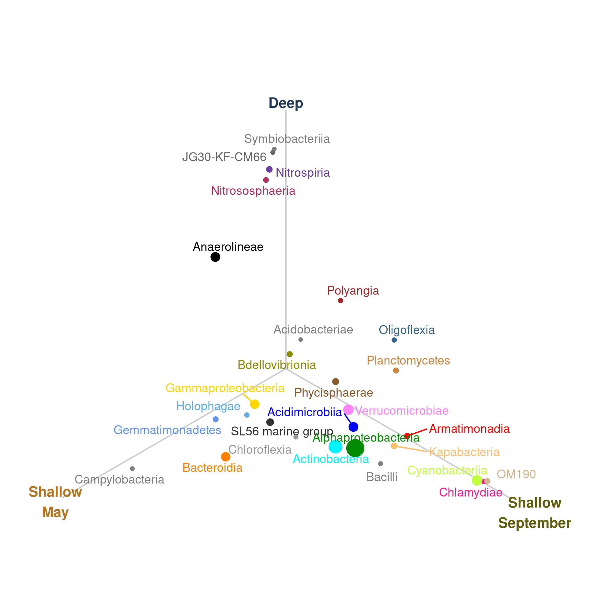

<style>
pre code, pre, code {
  white-space: pre !important;
  overflow-x: scroll !important;
  word-break: keep-all !important;
  word-wrap: initial !important;
}
</style>


# Load packages 


```r
# Efficiently load packages 
pacman::p_load(phyloseq, ggpubr, tidyverse, ANCOMBC, microViz, ggrepel, combinat, install = FALSE)

knitr::write_bib(file = "data/09_differential_exports/packages.bib")

# load in functions and color preferences
source("code/R/plotting_aesthetics.R")

load("data/08_compositional_exports/full_abs_physeq.RData")

# This bit is necessary because otherwise ASV is treated as a taxonomic level above Kingdom, which causes problems.
releveled_physeq <- full_abs_physeq %>%
  speedyseq::relocate_tax_table(ASV, .after = last_col()) %>%
  speedyseq::mutate_tax_table(Species = ASV)
```


# Running ANCOM

I similarly ran many ANCOMs in preparing this, at different taxonomic levels and using different Comp_Groups (Depth-Month groups). This is the one we settled on for the paper. 

Cleaning up the output of ANCOM is a bit of a pain, so there's a lot of code for rearranging, filtering, and cleaning in this block. ANCOM also takes awhile to run - hence the running and storing as an object. 


```r
# class_ancom_3g_output <- ancombc2(data = releveled_physeq,
#                                 tax_level = "Class", # Test for each ASV
#                                 fix_formula = "Comp_Group_Hier", # Use Comp_Group_Hier to estimate diff. abundance
#                                 p_adj_method = "holm", # Adjust with Holm-Bonferroni correction; recommended by authors
#                                 pseudo_sens = TRUE, # Run sensitivity test to make sure taxa isn't sensitive to psuedo-count choice
#                                 prv_cut = 0.10, # Prevalence filter of 10%
#                                 group = "Comp_Group_Hier", # Use Comp_Group_Hier as groups when doing pairwise comparisons
#                                 struc_zero = TRUE, # Detect structural zeroes
#                                 alpha = 0.05, # Significance threshold of 0.05
#                                 n_cl = 6, # Use 6 threads
#                                 verbose = FALSE, # Don't print verbose output
#                                 global = TRUE, # Run a global test (sorta like an ANOVA to first find if a given ASV is sig diff between at least two groups)
#                                 pairwise = TRUE) # Run pairwise tests between groups (sorta like a post-hoc test like Tukey)
# 
# save(class_ancom_3g_output, file = "data/09_differential_exports/class_ancom_3g_output.RData")

load( "data/09_differential_exports/class_ancom_3g_output.RData")


clean_class <- class_ancom_3g_output$res_pair %>%
  select(taxon, starts_with("lfc"), starts_with("diff"), starts_with("passed_ss")) %>%
  pivot_longer(cols = !taxon, names_to = "metric", values_to = "value") %>%
  separate_wider_delim(cols = metric, delim = "_", names = c("variable", "Comparison"), too_many = "merge") %>%
  mutate(Comparison = str_remove(Comparison, "ss_")) %>%
  pivot_wider(id_cols = c("taxon","Comparison"), names_from = variable, values_from = value) %>%
  mutate(Comparison = str_remove(Comparison, "Comp_Group_Hier"),
         Comparison = str_replace(Comparison, "_Comp_Group_Hier", ";")) %>%
  separate_wider_delim(Comparison, delim = ";", names = c("Ref1", "Ref2"), too_few = "align_start") %>%
  mutate(Ref2 = ifelse(is.na(Ref2), "Deep", Ref2),
         Comparison = paste0(Ref1, " : ",Ref2)) %>% 
  dplyr::filter(diff == 1,
         passed == 1) %>%
  separate(taxon, into = c("Kingdom","Phylum","Class"), sep = "_") %>%
  dplyr::filter(Class != "NA") %>%
  select(Phylum, Class, Comparison, lfc)

clean_structural_zeros <- class_ancom_3g_output$zero_ind %>%
  dplyr::rename(One = 2, Two = 3, Three = 4) %>%
  filter(2|3|4) %>%
  separate(taxon, into = c("Kingdom","Phylum","Class"), sep = "_") %>%
  dplyr::filter(Class != "NA")
  

melted_3group <- psmelt(releveled_physeq)
```

So I had this fun idea for how to plot these data. I want to express both how strongly a given ASV is present in one group vs. another, while also showing its overall general abundance. To do this, I am defining each group (Deep, Shallow_May, and Shallow_September) as an axis along the unit circle (at 0, 2/3pi, and 4/3pi). Then, the mean abundance of each Class along each of those axes forms a triangle. I then calculate the centroid of that triangle, and plot it. These allows us to see when a given class trends two just one group, or sorta both groups, or isn't really that strongly different. It was a fun dive back into Trig and the unit circle.


```r
centroid_data <- melted_3group %>%
  select(Class, Abundance, Comp_Group_Hier) %>%
  filter(Class %in% c(clean_class$Class, clean_structural_zeros$Class)) %>% # Select either differentially abundant or structural zero taxa
  group_by(Comp_Group_Hier, Class) %>%
  summarize(Mean_Abundance = mean(Abundance)) %>% # Find the mean absolute abundance of each class
  ungroup() %>%
  group_by(Class) %>%
  mutate(Rel_Abund = Mean_Abundance / sum(Mean_Abundance), # Find the mean relative abundance of each class within each group
         Theta = case_when(Comp_Group_Hier == "Deep"~.5 * pi, # This has to do with transforming points to polar space
                           Comp_Group_Hier == "Shallow_May"~(7/6) * pi,
                           Comp_Group_Hier == "Shallow_September" ~ (11/6) * pi),
         x = Rel_Abund * cos(Theta),
         y = Rel_Abund * sin(Theta)) %>%
  summarize(centr_x = mean(x),
            centr_y = mean(y))

# This next bit is to scale each class point by its maximum size (because they were ordinated by their mean abundance)

phy_and_abund <- melted_3group %>%
  select(Class, Abundance, Comp_Group_Hier, Phylum) %>%
  filter(Class %in%  c(clean_class$Class, clean_structural_zeros$Class)) %>%
  group_by(Phylum, Class) %>%
  summarize(Max_Abundance = max(Abundance)) %>%
  ungroup()

centroid_data %>% 
  left_join(phy_and_abund) %>%
  filter(Max_Abundance > 5000) %>%
  ggplot(aes(x = centr_x, y = centr_y)) + 
  annotate(geom = "segment", color = "grey80", 
           x = 0, y = 0, xend = .36 * cos(pi * c(.5, 7/6, 11/6)), yend = .36 * sin(pi * c(.5, 7/6, 11/6))) + 
  annotate(geom = "text", label = c("Deep","Shallow\nMay","Shallow\nSeptember"),
           x = c(.3,.37,.4) * cos(pi * c(.5, 7/6, 11/6)), y = c(0.37,0.37,0.4) * sin(pi * c(.5, 7/6, 11/6)),
           color = comp_three_colors[c(3,1,2)],
           fontface = "bold") + 
  geom_point(aes(size = Max_Abundance, color = Class)) + 
  geom_text_repel(aes(label = Class, color = Class), size = 3.3) + 
  coord_fixed(xlim = .4 * cos(pi * c(7/6, 11.5/6)), ylim = .4 * sin(pi * c(7/6, .5))) + 
  theme(axis.line = element_blank(),
        axis.text = element_blank(),
        axis.title = element_blank(),
        axis.ticks = element_blank())+
  scale_size(guide = "none") + 
  scale_color_manual(values= class_colors) + 
  theme(legend.background = element_rect(color = "white"),
        legend.key.size = unit(2.9, "mm"),
        legend.title = element_blank(),
        panel.margin = unit(c(0,0,0,0), "mm"),
        legend.position = "none")  
```




## Session Info


```r
sessioninfo::session_info()
```

```
## ─ Session info ─────────────────────────────────────────────────────────────────────────────────────────────────────────────────────────────────────────────────────────────────────────────────────────────────────────────────────────────────────────
##  setting  value
##  version  R version 4.3.3 (2024-02-29)
##  os       Rocky Linux 9.5 (Blue Onyx)
##  system   x86_64, linux-gnu
##  ui       X11
##  language (EN)
##  collate  en_US.UTF-8
##  ctype    en_US.UTF-8
##  tz       America/New_York
##  date     2025-07-01
##  pandoc   3.1.1 @ /usr/lib/rstudio-server/bin/quarto/bin/tools/ (via rmarkdown)
## 
## ─ Packages ─────────────────────────────────────────────────────────────────────────────────────────────────────────────────────────────────────────────────────────────────────────────────────────────────────────────────────────────────────────────
##  ! package                  * version    date (UTC) lib source
##  P abind                      1.4-5      2016-07-21 [?] CRAN (R 4.3.2)
##  P ade4                       1.7-22     2023-02-06 [?] CRAN (R 4.3.2)
##  P ANCOMBC                  * 2.4.0      2023-10-24 [?] Bioconductor
##  P ape                        5.7-1      2023-03-13 [?] CRAN (R 4.3.2)
##  P backports                  1.4.1      2021-12-13 [?] CRAN (R 4.3.2)
##  P base64enc                  0.1-3      2015-07-28 [?] CRAN (R 4.3.2)
##  P beachmat                   2.18.1     2024-02-14 [?] Bioconduc~
##  P beeswarm                   0.4.0      2021-06-01 [?] CRAN (R 4.3.2)
##  P Biobase                    2.62.0     2023-10-24 [?] Bioconductor
##  P BiocGenerics               0.48.1     2023-11-01 [?] Bioconductor
##  P BiocManager                1.30.22    2023-08-08 [?] CRAN (R 4.3.2)
##  P BiocNeighbors              1.20.2     2024-01-07 [?] Bioconduc~
##  P BiocParallel               1.36.0     2023-10-24 [?] Bioconductor
##  P BiocSingular               1.18.0     2023-10-24 [?] Bioconductor
##  P biomformat                 1.30.0     2023-10-24 [?] Bioconductor
##  P Biostrings                 2.70.1     2023-10-25 [?] Bioconductor
##  P bit                        4.0.5      2022-11-15 [?] CRAN (R 4.3.2)
##  P bit64                      4.0.5      2020-08-30 [?] CRAN (R 4.3.2)
##  P bitops                     1.0-7      2021-04-24 [?] CRAN (R 4.3.2)
##  P blob                       1.2.4      2023-03-17 [?] CRAN (R 4.3.2)
##  P bluster                    1.12.0     2023-10-24 [?] Bioconductor
##  P boot                       1.3-29     2024-02-19 [?] CRAN (R 4.3.3)
##  P broom                      1.0.5      2023-06-09 [?] CRAN (R 4.3.2)
##  P bslib                      0.5.1      2023-08-11 [?] CRAN (R 4.3.2)
##  P cachem                     1.0.8      2023-05-01 [?] CRAN (R 4.3.2)
##  P car                        3.1-2      2023-03-30 [?] CRAN (R 4.3.2)
##  P carData                    3.0-5      2022-01-06 [?] CRAN (R 4.3.2)
##  P cellranger                 1.1.0      2016-07-27 [?] CRAN (R 4.3.2)
##  P checkmate                  2.3.1      2023-12-04 [?] CRAN (R 4.3.2)
##  P class                      7.3-22     2023-05-03 [?] CRAN (R 4.3.3)
##  P cli                        3.6.1      2023-03-23 [?] CRAN (R 4.3.2)
##  P cluster                    2.1.4      2022-08-22 [?] CRAN (R 4.3.2)
##  P codetools                  0.2-19     2023-02-01 [?] CRAN (R 4.3.3)
##  P colorspace                 2.1-0      2023-01-23 [?] CRAN (R 4.3.2)
##  P combinat                 * 0.0-8      2012-10-29 [?] CRAN (R 4.3.2)
##  P crayon                     1.5.2      2022-09-29 [?] CRAN (R 4.3.2)
##  P CVXR                       1.0-12     2024-02-02 [?] CRAN (R 4.3.2)
##  P data.table                 1.15.2     2024-02-29 [?] CRAN (R 4.3.2)
##  P DBI                        1.2.2      2024-02-16 [?] CRAN (R 4.3.2)
##  P DECIPHER                   2.30.0     2023-10-24 [?] Bioconductor
##  P decontam                   1.22.0     2023-10-24 [?] Bioconductor
##  P DelayedArray               0.28.0     2023-10-24 [?] Bioconductor
##  P DelayedMatrixStats         1.24.0     2023-10-24 [?] Bioconductor
##  P DescTools                  0.99.54    2024-02-03 [?] CRAN (R 4.3.2)
##  P digest                     0.6.33     2023-07-07 [?] CRAN (R 4.3.2)
##  P DirichletMultinomial       1.44.0     2023-10-24 [?] Bioconductor
##  P doParallel                 1.0.17     2022-02-07 [?] CRAN (R 4.3.2)
##  P doRNG                      1.8.6      2023-01-16 [?] CRAN (R 4.3.2)
##  P dplyr                    * 1.1.3      2023-09-03 [?] CRAN (R 4.3.2)
##  P e1071                      1.7-14     2023-12-06 [?] CRAN (R 4.3.2)
##  P energy                     1.7-11     2022-12-22 [?] CRAN (R 4.3.2)
##  P evaluate                   0.23       2023-11-01 [?] CRAN (R 4.3.2)
##  P Exact                      3.2        2022-09-25 [?] CRAN (R 4.3.2)
##  P expm                       0.999-9    2024-01-11 [?] CRAN (R 4.3.2)
##  P fansi                      1.0.5      2023-10-08 [?] CRAN (R 4.3.2)
##  P farver                     2.1.1      2022-07-06 [?] CRAN (R 4.3.2)
##  P fastmap                    1.1.1      2023-02-24 [?] CRAN (R 4.3.2)
##  P forcats                  * 1.0.0      2023-01-29 [?] CRAN (R 4.3.2)
##  P foreach                    1.5.2      2022-02-02 [?] CRAN (R 4.3.2)
##  P foreign                    0.8-86     2023-11-28 [?] CRAN (R 4.3.3)
##  P Formula                    1.2-5      2023-02-24 [?] CRAN (R 4.3.2)
##  P fs                         1.6.3      2023-07-20 [?] CRAN (R 4.3.2)
##  P generics                   0.1.3      2022-07-05 [?] CRAN (R 4.3.2)
##  P GenomeInfoDb               1.38.0     2023-10-24 [?] Bioconductor
##  P GenomeInfoDbData           1.2.11     2023-11-07 [?] Bioconductor
##  P GenomicRanges              1.54.1     2023-10-29 [?] Bioconductor
##  P ggbeeswarm                 0.7.2      2023-04-29 [?] CRAN (R 4.3.2)
##  P ggplot2                  * 3.5.0      2024-02-23 [?] CRAN (R 4.3.2)
##  P ggpubr                   * 0.6.0      2023-02-10 [?] CRAN (R 4.3.2)
##  P ggrepel                  * 0.9.4      2023-10-13 [?] CRAN (R 4.3.2)
##  P ggsignif                   0.6.4      2022-10-13 [?] CRAN (R 4.3.2)
##  P gld                        2.6.6      2022-10-23 [?] CRAN (R 4.3.2)
##  P glue                       1.6.2      2022-02-24 [?] CRAN (R 4.3.2)
##  P gmp                        0.7-4      2024-01-15 [?] CRAN (R 4.3.2)
##  P gridExtra                  2.3        2017-09-09 [?] CRAN (R 4.3.2)
##  P gsl                        2.1-8      2023-01-24 [?] CRAN (R 4.3.2)
##  P gtable                     0.3.4      2023-08-21 [?] CRAN (R 4.3.2)
##  P gtools                     3.9.5      2023-11-20 [?] CRAN (R 4.3.2)
##  P highr                      0.10       2022-12-22 [?] CRAN (R 4.3.2)
##  P Hmisc                      5.1-1      2023-09-12 [?] CRAN (R 4.3.2)
##  P hms                        1.1.3      2023-03-21 [?] CRAN (R 4.3.2)
##  P htmlTable                  2.4.2      2023-10-29 [?] CRAN (R 4.3.2)
##  P htmltools                  0.5.7      2023-11-03 [?] CRAN (R 4.3.2)
##  P htmlwidgets                1.6.2      2023-03-17 [?] CRAN (R 4.3.2)
##  P httr                       1.4.7      2023-08-15 [?] CRAN (R 4.3.2)
##  P igraph                     1.5.1      2023-08-10 [?] CRAN (R 4.3.2)
##  P IRanges                    2.36.0     2023-10-24 [?] Bioconductor
##  P irlba                      2.3.5.1    2022-10-03 [?] CRAN (R 4.3.2)
##  P iterators                  1.0.14     2022-02-05 [?] CRAN (R 4.3.2)
##  P jquerylib                  0.1.4      2021-04-26 [?] CRAN (R 4.3.2)
##  P jsonlite                   1.8.7      2023-06-29 [?] CRAN (R 4.3.2)
##  P knitr                      1.45       2023-10-30 [?] CRAN (R 4.3.2)
##  P labeling                   0.4.3      2023-08-29 [?] CRAN (R 4.3.2)
##  P lattice                    0.21-9     2023-10-01 [?] CRAN (R 4.3.2)
##  P lazyeval                   0.2.2      2019-03-15 [?] CRAN (R 4.3.2)
##  P lifecycle                  1.0.3      2022-10-07 [?] CRAN (R 4.3.2)
##  P lme4                       1.1-35.1   2023-11-05 [?] CRAN (R 4.3.2)
##  P lmerTest                   3.1-3      2020-10-23 [?] CRAN (R 4.3.2)
##  P lmom                       3.0        2023-08-29 [?] CRAN (R 4.3.2)
##  P lubridate                * 1.9.3      2023-09-27 [?] CRAN (R 4.3.2)
##  P magrittr                   2.0.3      2022-03-30 [?] CRAN (R 4.3.2)
##  P MASS                       7.3-60     2023-05-04 [?] CRAN (R 4.3.2)
##  P Matrix                     1.6-1.1    2023-09-18 [?] CRAN (R 4.3.2)
##  P MatrixGenerics             1.14.0     2023-10-24 [?] Bioconductor
##  P matrixStats                1.2.0      2023-12-11 [?] CRAN (R 4.3.2)
##  P memoise                    2.0.1      2021-11-26 [?] CRAN (R 4.3.2)
##  P mgcv                       1.9-0      2023-07-11 [?] CRAN (R 4.3.2)
##  P mia                        1.10.0     2023-10-24 [?] Bioconductor
##  P microViz                 * 0.12.1     2024-03-05 [?] https://d~
##  P minqa                      1.2.6      2023-09-11 [?] CRAN (R 4.3.2)
##  P multcomp                   1.4-25     2023-06-20 [?] CRAN (R 4.3.2)
##  P MultiAssayExperiment       1.28.0     2023-10-24 [?] Bioconductor
##  P multtest                   2.58.0     2023-10-24 [?] Bioconductor
##  P munsell                    0.5.0      2018-06-12 [?] CRAN (R 4.3.2)
##  P mvtnorm                    1.2-4      2023-11-27 [?] CRAN (R 4.3.2)
##  P NatParksPalettes         * 0.2.0      2022-10-09 [?] CRAN (R 4.3.2)
##  P nlme                       3.1-163    2023-08-09 [?] CRAN (R 4.3.2)
##  P nloptr                     2.0.3      2022-05-26 [?] CRAN (R 4.3.2)
##  P nnet                       7.3-19     2023-05-03 [?] CRAN (R 4.3.3)
##  P numDeriv                   2016.8-1.1 2019-06-06 [?] CRAN (R 4.3.2)
##  P pacman                     0.5.1      2019-03-11 [?] CRAN (R 4.3.2)
##  P permute                    0.9-7      2022-01-27 [?] CRAN (R 4.3.2)
##  P phyloseq                 * 1.46.0     2023-10-24 [?] Bioconductor
##  P pillar                     1.9.0      2023-03-22 [?] CRAN (R 4.3.2)
##  P pkgconfig                  2.0.3      2019-09-22 [?] CRAN (R 4.3.2)
##  P plyr                       1.8.9      2023-10-02 [?] CRAN (R 4.3.2)
##  P proxy                      0.4-27     2022-06-09 [?] CRAN (R 4.3.2)
##  P purrr                    * 1.0.2      2023-08-10 [?] CRAN (R 4.3.2)
##  P R6                         2.5.1      2021-08-19 [?] CRAN (R 4.3.2)
##  P rbibutils                  2.2.16     2023-10-25 [?] CRAN (R 4.3.2)
##  P Rcpp                       1.0.11     2023-07-06 [?] CRAN (R 4.3.2)
##  P RCurl                      1.98-1.13  2023-11-02 [?] CRAN (R 4.3.2)
##  P Rdpack                     2.6        2023-11-08 [?] CRAN (R 4.3.2)
##  P readr                    * 2.1.5      2024-01-10 [?] CRAN (R 4.3.2)
##  P readxl                     1.4.3      2023-07-06 [?] CRAN (R 4.3.2)
##    renv                       1.0.5      2024-02-29 [1] CRAN (R 4.3.2)
##  P reshape2                   1.4.4      2020-04-09 [?] CRAN (R 4.3.2)
##  P rhdf5                      2.46.1     2023-11-29 [?] Bioconduc~
##  P rhdf5filters               1.14.1     2023-11-06 [?] Bioconductor
##  P Rhdf5lib                   1.24.2     2024-02-07 [?] Bioconduc~
##  P rlang                      1.1.2      2023-11-04 [?] CRAN (R 4.3.2)
##  P rmarkdown                  2.25       2023-09-18 [?] CRAN (R 4.3.2)
##  P Rmpfr                      0.9-5      2024-01-21 [?] CRAN (R 4.3.2)
##  P rngtools                   1.5.2      2021-09-20 [?] CRAN (R 4.3.2)
##  P rootSolve                  1.8.2.4    2023-09-21 [?] CRAN (R 4.3.2)
##  P rpart                      4.1.23     2023-12-05 [?] CRAN (R 4.3.3)
##  P RSQLite                    2.3.5      2024-01-21 [?] CRAN (R 4.3.2)
##  P rstatix                    0.7.2      2023-02-01 [?] CRAN (R 4.3.2)
##  P rstudioapi                 0.15.0     2023-07-07 [?] CRAN (R 4.3.2)
##  P rsvd                       1.0.5      2021-04-16 [?] CRAN (R 4.3.2)
##  P S4Arrays                   1.2.0      2023-10-24 [?] Bioconductor
##  P S4Vectors                  0.40.1     2023-10-26 [?] Bioconductor
##  P sandwich                   3.1-0      2023-12-11 [?] CRAN (R 4.3.2)
##  P sass                       0.4.7      2023-07-15 [?] CRAN (R 4.3.2)
##  P ScaledMatrix               1.10.0     2023-10-24 [?] Bioconductor
##  P scales                     1.3.0      2023-11-28 [?] CRAN (R 4.3.2)
##  P scater                     1.30.1     2023-11-16 [?] Bioconductor
##  P scuttle                    1.12.0     2023-10-24 [?] Bioconductor
##  P sessioninfo                1.2.2      2021-12-06 [?] CRAN (R 4.3.2)
##  P SingleCellExperiment       1.24.0     2023-10-24 [?] Bioconductor
##  P SparseArray                1.2.4      2024-02-11 [?] Bioconduc~
##  P sparseMatrixStats          1.14.0     2023-10-24 [?] Bioconductor
##  P speedyseq                  0.5.3.9018 2025-06-26 [?] Github (mikemc/speedyseq@ceb941f)
##  P stringi                    1.7.12     2023-01-11 [?] CRAN (R 4.3.2)
##  P stringr                  * 1.5.0      2022-12-02 [?] CRAN (R 4.3.2)
##  P SummarizedExperiment       1.32.0     2023-10-24 [?] Bioconductor
##  P survival                   3.5-8      2024-02-14 [?] CRAN (R 4.3.3)
##  P TH.data                    1.1-2      2023-04-17 [?] CRAN (R 4.3.2)
##  P tibble                   * 3.2.1      2023-03-20 [?] CRAN (R 4.3.2)
##  P tidyr                    * 1.3.1      2024-01-24 [?] CRAN (R 4.3.2)
##  P tidyselect                 1.2.0      2022-10-10 [?] CRAN (R 4.3.2)
##  P tidytree                   0.4.6      2023-12-12 [?] CRAN (R 4.3.2)
##  P tidyverse                * 2.0.0      2023-02-22 [?] CRAN (R 4.3.2)
##  P timechange                 0.3.0      2024-01-18 [?] CRAN (R 4.3.2)
##  P treeio                     1.27.0.002 2024-03-05 [?] Github (GuangchuangYu/treeio@f668633)
##  P TreeSummarizedExperiment   2.10.0     2023-10-24 [?] Bioconductor
##  P tzdb                       0.4.0      2023-05-12 [?] CRAN (R 4.3.2)
##  P utf8                       1.2.4      2023-10-22 [?] CRAN (R 4.3.2)
##  P vctrs                      0.6.4      2023-10-12 [?] CRAN (R 4.3.2)
##  P vegan                      2.6-4      2022-10-11 [?] CRAN (R 4.3.2)
##  P vipor                      0.4.7      2023-12-18 [?] CRAN (R 4.3.2)
##  P viridis                    0.6.5      2024-01-29 [?] CRAN (R 4.3.2)
##  P viridisLite                0.4.2      2023-05-02 [?] CRAN (R 4.3.2)
##  P withr                      2.5.2      2023-10-30 [?] CRAN (R 4.3.2)
##  P xfun                       0.52       2025-04-02 [?] CRAN (R 4.3.3)
##  P XVector                    0.42.0     2023-10-24 [?] Bioconductor
##  P yaml                       2.3.7      2023-01-23 [?] CRAN (R 4.3.2)
##  P yulab.utils                0.1.4      2024-01-28 [?] CRAN (R 4.3.2)
##  P zlibbioc                   1.48.0     2023-10-24 [?] Bioconductor
##  P zoo                        1.8-12     2023-04-13 [?] CRAN (R 4.3.2)
## 
##  [1] /local/workdir/arp277/Pendleton_2025_Ontario_Publication_Repo/renv/library/R-4.3/x86_64-pc-linux-gnu
##  [2] /home/arp277/.cache/R/renv/sandbox/R-4.3/x86_64-pc-linux-gnu/fd835031
## 
##  P ── Loaded and on-disk path mismatch.
## 
## ────────────────────────────────────────────────────────────────────────────────────────────────────────────────────────────────────────────────────────────────────────────────────────────────────────────────────────────────────────────────────────
```
