```{=html}
<style>
pre code, pre, code {
  white-space: pre !important;
  overflow-x: scroll !important;
  word-break: keep-all !important;
  word-wrap: initial !important;
}
</style>
```


# Load packages


```r
# Efficiently load packages 
pacman::p_load(tmap, terra, tmaptools, phyloseq, tidyverse, fun.gus, patchwork, sf, units, install = FALSE)

source("code/R/plotting_aesthetics.R")

load("data/07_biodiversity_exports/full_diversity_physeq.RData")

load("data/08_compositional_exports/full_abs_physeq.RData")
```

# Load data

First, we need to connect our Rep_IDs with spatial information from our station log.


```r
sample_sf <- full_diversity_physeq %>%
  sample_data() %>%
  data.frame() %>%
  st_as_sf(coords = c("Longitude","Latitude"), crs = "EPSG:4326")

# We use this object for surface interpolation
full_station_list_bio <- sample_sf %>%
  group_by(Station_ID) %>%
  slice_sample(n = 1) %>%
  ungroup() %>%
  select(Station_ID) %>%
  st_transform(crs = "EPSG:3174")

sample_sf_abs <- full_abs_physeq %>%
  sample_data() %>%
  data.frame() %>%
  st_as_sf(coords = c("Longitude","Latitude"), crs = "EPSG:4326")
```

I also need to read in a Lake Ontario outline I found from the USGS, [here](https://www.sciencebase.gov/catalog/item/530f8a0ee4b0e7e46bd300dd).


```r
raw_ont <- read_sf("data/10_spatial_imports/hydro_p_LakeOntario/hydro_p_LakeOntario.shp") %>%
  st_transform(crs = "EPSG:4326")

ont_outline <- raw_ont %>%
  st_union()

raw_eri <- read_sf("data/10_spatial_imports/hydro_p_LakeErie/hydro_p_LakeErie.shp")

all_outlines <- list(raw_eri, raw_ont)
```

# Reading in bathymetry

Downloaded my bathymetry from [here](https://www.ncei.noaa.gov/maps/grid-extract/)


```r
bathy <- terra::rast("data/10_spatial_imports/ontario_bath.tiff")

bathy_cropped <- mask(-bathy, vect(ont_outline))
```

I decided to use EPSG:3174 - NAD83/Great Lakes Albers. This is partially because sometime this data is combined with other Great Lakes data, and I want to use a projection that's fairly good for all five lakes in the long term. 


```r
proj_bathy <- project(bathy_cropped, "EPSG:3174", method = "bilinear")

proj_ont <- st_transform(ont_outline, crs = "EPSG:3174") %>% st_sf()
```

# Working with Enviromental Data from Metadata Exports

## Reading in ctd data and converting to spatial object


```r
load("data/05_metadata_exports/all_may_stations.RData")
load("data/05_metadata_exports/all_sep_stations.RData")
load("data/05_metadata_exports/clean_epa_chem.RData")

may_all_sp <- may_all_stations %>%
  group_by(Station_ID ) %>%
  summarize(Latitude = mean(latitude),
            Longitude = mean(longitude)) %>% 
  st_as_sf(coords = c("Longitude", "Latitude"), crs = "EPSG:4326") %>%
  ungroup()

sep_all_sp <- sep_all_stations %>%
  group_by(Station_ID) %>%
  summarize(Latitude = mean(latitude),
            Longitude = mean(longitude)) %>%
  st_as_sf(coords = c("Longitude", "Latitude"), crs = "EPSG:4326") %>%
  ungroup()
```

This next section is a little tricky. We want to show our transects as lines, and we'll use this for our vertical cross sections of temperature (Figure S5). Everything below is me makes these nice transect lines and extracting bathymetry along those transects. 


```r
shoreline_spots_both <- sep_all_sp %>%
  filter(Station_ID%in% c(8,17,29, 35, 38, 43, 48, 717, 62, 66)) %>%
  mutate(Station_ID = Station_ID + .5) %>%
  st_nearest_points(ont_outline) %>%
  st_cast("POINT") %>%
  st_transform(crs = "EPSG:3174")
  
shoreline_spots <- st_sf(Station_ID = .5 + c(8,17,29, 35, 38, 43, 48, 62,66, 717),
        geometry = shoreline_spots_both[seq(2,20,2)])

may_lines <- may_all_sp %>%
  filter(!Station_ID %in% c(71,74)) %>%
  st_transform(crs = "EPSG:3174") %>%
  rbind(shoreline_spots) %>%
  mutate(Transect = case_when(Station_ID %in%c(8:19, 8.5, 17.5)~"T1",
                            Station_ID %in%c(27:35, 29.5, 35.5)~"T2",
                            Station_ID %in%c(38:45, 43.5, 38.5)~"T3",
                            Station_ID %in%c(48:58, 716, 717, 48.5, 717.5)~"T4",
                            Station_ID %in% c(62:67,715, 66.5, 62.5)~"T5")) %>% 
  mutate(lat = st_coordinates(.)[,2]) %>%
  arrange(Transect, lat) %>% 
  group_by(Transect) %>%
  summarize(Stations = n(),
            do_union = FALSE) %>%
  st_cast(to = "LINESTRING") %>%
  st_transform(crs = "EPSG:3174")


samples <- st_line_sample(may_lines, sample = seq(from = 0, to = 1, length.out = 100)) %>% st_sf() %>% st_cast("POINT")

lengths <- st_length(may_lines)

sep_lines <- sep_all_sp %>%
  filter(!Station_ID %in% c(71,74)) %>%
  st_transform(crs = "EPSG:3174") %>%
  rbind(shoreline_spots) %>%
  mutate(Transect = case_when(Station_ID %in%c(8:19, 8.5, 17.5)~"T1",
                            Station_ID %in%c(27:35, 29.5, 35.5)~"T2",
                            Station_ID %in%c(38:45, 43.5, 38.5)~"T3",
                            Station_ID %in%c(48:58, 716, 717, 48.5, 717.5)~"T4",
                            Station_ID %in% c(62:67,715, 66.5, 62.5)~"T5")) %>%
  mutate(lat = st_coordinates(.)[,2]) %>%
  arrange(lat) %>% 
  group_by(Transect) %>%
  summarize(Stations = n(),
            do_union = FALSE) %>%
  st_cast(to = "LINESTRING") %>%
  st_transform(crs = "EPSG:3174")

samples_sep <- st_line_sample(sep_lines, sample = seq(from = 0, to = 1, length.out = 100)) %>% st_sf() %>% st_cast("POINT")
lengths_sep <- st_length(sep_lines)

tm_shape(proj_ont) + 
  tm_borders() + 
tm_shape(sep_lines) +
  tm_lines(col = "Transect",
           col.scale = tm_scale_categorical(values = "set1"),
           col.legend = tm_legend(title = "",
                                  text.size = 12,
                                  position = tm_pos_out("right","center"),
                                  frame = FALSE))+
  tm_layout(frame = FALSE)
```

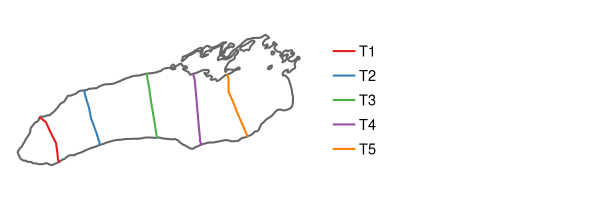

We also map the GLATOs buoy locations on top of these transect lines, for the inset map in Figure S6A. 


```r
buoys <- data.frame(buoy = c("LNR314","WLO003","PPW016", "LON024", "LOJ038", "LOH024", "Lake Erie at Buffalo"),
           lat = c(43.3408, 43.51568, 43.77682, 43.41419,43.67258,43.81907, 42.887067),
           lon = c(-79.08577,-79.44942, -77.17267, -77.7472,-76.43503,-77.72727, -78.908267)) %>%
  st_as_sf(coords = c("lon", "lat"), crs = "EPSG:4326") %>%
  st_transform(crs = "EPSG:3174")

st_bbox(buoys)
```

```
##      xmin      ymin      xmax      ymax 
## 1404091.9  717197.3 1644997.4  827839.1
```

```r
uni_outlines <- map(all_outlines, st_union)

uni_proj <- map(uni_outlines, st_transform, crs = "EPSG:3174")

com_outlines <- st_combine(do.call("c", uni_proj))

tm_shape(com_outlines, bbox = st_bbox(buoys) * c(.96, .98, 1.02, 1.08)) + 
  tm_borders() + 
  tm_shape(sep_lines) + 
  tm_lines(col = "grey") + 
  tm_shape(buoys) + 
  tm_symbols(fill = "black", size = .5, shape = 21
            ) +
  tm_text(text = "buoy", size = 1, ymod = 1, xmod = 1, col.legend = tm_legend(show = FALSE)) + 
  tm_compass(position = c(0,.8), size = 2, text.size = 1) + 
  tm_scalebar(breaks = c(0,25, 50), position = c(.8,0), text.size = 1)
```

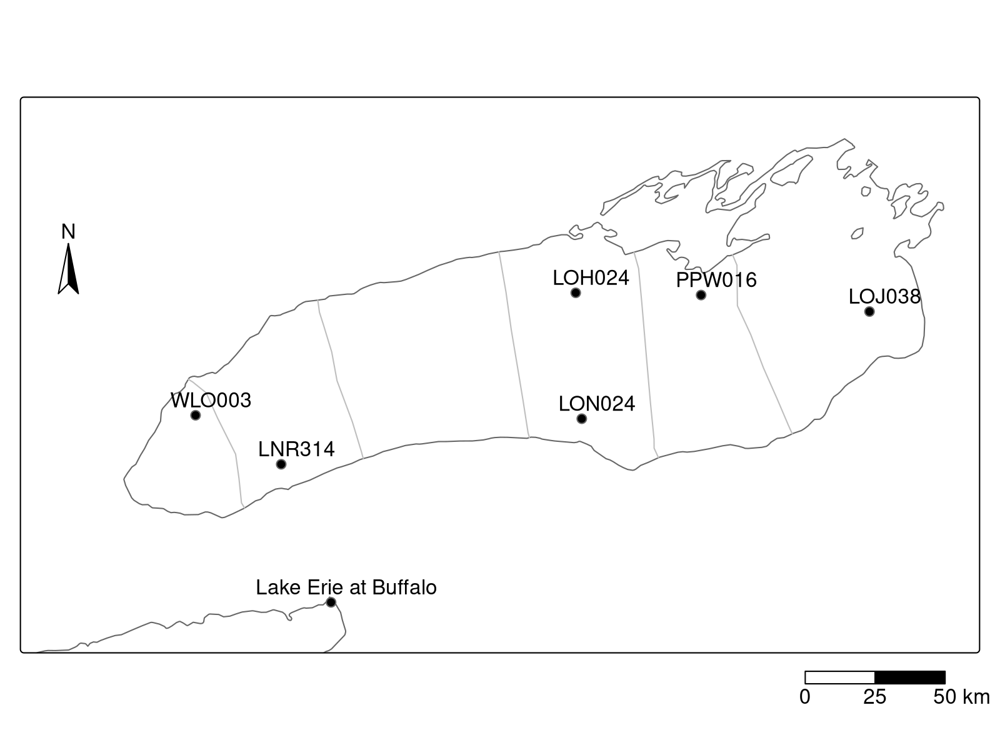

Here, we extract the bathymetry along our transects in May and September. We also transformed our CTD casts and sampling points to "Distance Along Transect", rather than Lat/Long.


```r
# Extract bathymetry
may_bath_values <- terra::extract(proj_bathy, samples, xy = TRUE) %>%
  mutate(Transect = rep(c("T1","T2","T3","T4","T5"), each = 100),
         index_along_transect = rep(seq(from = 0, to = 1, length.out = 100), 5),
         transect_length = rep(lengths, each = 100),
         dist_along_transect = as.numeric(index_along_transect * transect_length)) %>%
  dplyr::select(ontario_bath, Transect, dist = dist_along_transect) %>%
  mutate(ontario_bath = ifelse(is.na(ontario_bath), 0, ontario_bath))

may_station_dists <- may_all_sp %>%
  filter(!Station_ID %in% c(71,74)) %>%
  st_transform(crs = "EPSG:3174") %>%
  rbind(shoreline_spots) %>%
  mutate(Transect = case_when(Station_ID %in%c(8:19, 8.5, 17.5)~"T1",
                            Station_ID %in%c(27:35, 29.5, 35.5)~"T2",
                            Station_ID %in%c(38:45, 43.5, 38.5)~"T3",
                            Station_ID %in%c(48:58, 716, 717, 48.5, 717.5)~"T4",
                            Station_ID %in% c(62:67,715, 66.5, 62.5)~"T5")) %>% 
  mutate(x = st_coordinates(.)[,1],
         y = st_coordinates(.)[,2]) %>%
  group_by(Transect) %>%
  arrange(y, .by_group = TRUE) %>%
  mutate(lag_x = lag(x),
         lag_y = lag(y),
         dist = sqrt((lag_x - x)^2 + (lag_y - y)^2),
         dist = ifelse(is.na(dist),0,dist),
         cum_dist = cumsum(dist)) %>%
  dplyr::select(Station_ID, dist = cum_dist, Transect)

may_with_dist <- may_all_stations %>%
  left_join(may_station_dists)


sep_bath_values <- terra::extract(proj_bathy, samples_sep, xy = TRUE) %>%
  mutate(Transect = rep(c("T1","T2","T3","T4","T5"), each = 100),
         index_along_transect = rep(seq(from = 0, to = 1, length.out = 100), 5),
         transect_length = rep(lengths_sep, each = 100),
         dist_along_transect = as.numeric(index_along_transect * transect_length)) %>%
  dplyr::select(ontario_bath, Transect, dist = dist_along_transect)

sep_station_dists <- sep_all_sp %>%
  filter(!Station_ID %in% c(71,74)) %>%
  st_transform(crs = "EPSG:3174") %>%
  rbind(shoreline_spots) %>%
  mutate(Transect = case_when(Station_ID %in%c(8:19, 8.5, 17.5)~"T1",
                            Station_ID %in%c(27:35, 29.5, 35.5)~"T2",
                            Station_ID %in%c(38:45, 43.5, 38.5)~"T3",
                            Station_ID %in%c(48:58, 716, 717, 48.5, 717.5)~"T4",
                            Station_ID %in% c(62:67,715, 66.5, 62.5)~"T5")) %>%
  mutate(x = st_coordinates(.)[,1],
         y = st_coordinates(.)[,2]) %>%
  group_by(Transect) %>%
  arrange(y, .by_group = TRUE) %>%
  mutate(lag_x = lag(x),
         lag_y = lag(y),
         dist = sqrt((lag_x - x)^2 + (lag_y - y)^2),
         dist = ifelse(is.na(dist),0,dist),
         cum_dist = cumsum(dist)) %>%
  dplyr::select(Station_ID, dist = cum_dist, Transect)

sep_with_dist <- sep_all_stations %>%
  left_join(sep_station_dists)

sep_sam_points <- sample_sf_abs %>%
  as.data.frame() %>%
  filter(month == "September")%>%
  select(depth = Deployment_Depth_m, Transect = transect, Station_ID, Upwelling) %>%
  left_join(sep_station_dists)

may_sam_points <- sample_sf_abs %>%
  as.data.frame() %>%
  filter(month == "May")%>%
  select(depth = Deployment_Depth_m, Transect = transect, Station_ID, Upwelling) %>%
  left_join(may_station_dists)
```

Finally, we'll inteprolat and plot those vertical transects, each as its own little panel, which we'll combine together with patchwork. 


```r
trans <- c("T1","T2","T3","T4","T5")

ODV_colours <- c( "#d31f2a", "#ffc000", "#0db5e6", "#7139fe")

temp_limits <- range(c(may_with_dist$temperature, sep_with_dist$temperature)) * c(0.7, 1.2)

temp_limit_may <- range(may_with_dist$temperature) * c(0.7, 1.2)

depth_limit <- max(c(may_with_dist$depth, sep_with_dist$depth)) + 10

title_cols <- RColorBrewer::brewer.pal(5, "Set1")

may_plots <- map2(trans, title_cols, function(trans,title_col){
  t1 <- may_with_dist %>%
    dplyr::filter(Transect == trans) %>%
    mutate(dist = dist/1000)
  
  ctd_mba <- MBA::mba.surf(t1[c("dist", "depth", "temperature")], no.X = 300, no.Y = 300, extend = T, sp = TRUE, b.box = c(0,75,0,300), h = 4)
  
  inter_temp <- data.frame(ctd_mba$xyz.est@coords, ctd_mba$xyz.est@data) %>%
    dplyr::rename(dist = x, depth = y, temperature = z)

  bottoms <- may_bath_values %>%
    dplyr::filter(Transect == trans) %>%
    dplyr::select(depth = ontario_bath, dist) %>%
    rbind(data.frame(depth = c(depth_limit, depth_limit),
                      dist = c(max(.$dist), min(.$dist)))) %>%
    mutate(dist = dist / 1000)
  

  ggplot(inter_temp, aes(x = dist, y = depth, fill = temperature)) +
    geom_raster() +
    geom_contour(aes(z = temperature), breaks = 6, color = "white", linetype = 2) + 
    geom_line(data = t1, aes(group = Station_ID), alpha = 1)  +
    geom_polygon(data = bottoms, fill = "grey40") +
    geom_point(data = filter(may_sam_points, Transect == trans), aes(y = depth, x = dist/1000, shape = Upwelling), color = "black", fill = "white", size = 2.5) + 
    scale_shape_manual(values = upwelling_shapes, guide = "none") + 
    scale_y_reverse() +
    scale_fill_gradientn(colors = rev(ODV_colours), limits = temp_limit_may) + 
    coord_cartesian(xlim = range(bottoms$dist), 
                    ylim = c(depth_limit,0),
                    expand = FALSE) +
    labs(x = "Distance Along Transect (km)", y = "Depth (m)", fill = "Temperature (°C)", title = paste0("May Transect: ", trans)) +
    theme(plot.title = element_text(color = title_col))
})
 
sep_plots <- map2(trans, title_cols, function(trans, title_col){
  t1 <- sep_with_dist %>%
    dplyr::filter(Transect == trans) %>%
    mutate(dist = dist/1000)
  
  ctd_mba <- MBA::mba.surf(t1[c("dist", "depth", "temperature")], no.X = 300, no.Y = 300, extend = T, sp = TRUE, b.box = c(0,75,0,300), h = 4)
  
  inter_temp <- data.frame(ctd_mba$xyz.est@coords, ctd_mba$xyz.est@data) %>%
    dplyr::rename(dist = x, depth = y, temperature = z)
  
  bottoms <- sep_bath_values %>%
    dplyr::filter(Transect == trans) %>%
    dplyr::select(depth = ontario_bath, dist) %>%
    rbind(data.frame(depth = c(depth_limit, depth_limit),
                     dist = c(max(.$dist), min(.$dist)))) %>%
    mutate(dist = dist / 1000)
 
  ggplot(inter_temp, aes(x = dist, y = depth, fill = temperature)) +
    geom_raster() + 
    geom_contour(aes(z = temperature), breaks = 12, color = "white", linetype = 2) + 
    geom_line(data = t1, aes(group = Station_ID), alpha = 1) + 
    geom_polygon(data = bottoms, fill = "grey40") + 
    geom_point(data = filter(sep_sam_points, Transect == trans), aes(y = depth, x = dist/1000, shape = Upwelling), color = "black", fill = "white", size = 2.5) + 
    scale_shape_manual(values = upwelling_shapes, guide = "none") + 
    scale_y_reverse() +
    scale_fill_gradientn(colors = rev(ODV_colours), limits = temp_limits)+
    coord_cartesian(xlim = range(bottoms$dist), ylim = c(max(bottoms$depth), 0 ), expand = FALSE) + 
    labs(x = "Distance Along Transect (km)", y = "Depth (m)", fill = "Temperature (°C)", title = paste0("Sept Transect: ", trans)) +
    theme(plot.title = element_text(color = title_col))
})

all_plots <- wrap_plots(may_plots, guides = "collect", ncol = 5) / wrap_plots(sep_plots, ncol = 5, guides = "collect")


all_plots
```

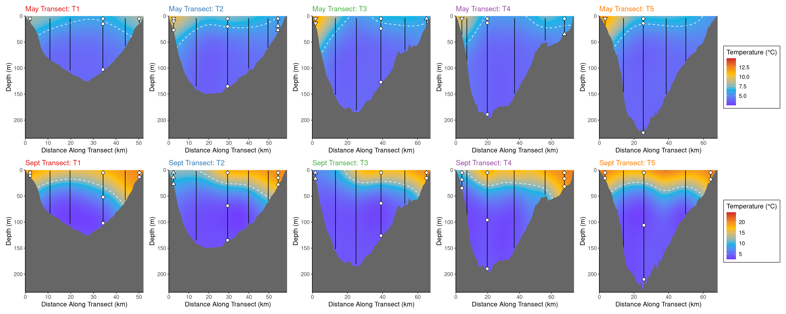

# Writing out data for interpolation in QGIS

In the next sections, we write out geopackages which we then visualize in QGIS. 

## Writing out data for nutrient interpolation


```r
surface <- rbind(may_all_stations,sep_all_stations) %>%
  group_by(Station_ID, month) %>%
  mutate(max_depth = max(depth)) %>%
  dplyr::filter(abs(depth - 5) == min(abs(depth - 5))) %>%
  slice_min(order_by = depth) %>%
  ungroup() %>%
  st_as_sf(coords = c("longitude","latitude"), crs = "EPSG:4326") %>%
  st_transform(crs = "EPSG:3174") %>%
  left_join(
    filter(clean_epa_chem, Depth_Class == "E")
    ) %>%
  mutate(TN_TP = TN/TP * 2.21)

full_station_list <- surface %>%
  select(Station_ID) %>% 
  group_by(Station_ID) %>%
  slice_sample(n = 1)

# Plotting Nutrients
split_nutrients <- surface %>%
  select(Station_ID, month, NH4:TN_TP) %>%
  group_by(month) %>%
  group_split()

st_write(split_nutrients[[1]], "analysis/QGIS_Work/may_all_nutrients.gpkg", append = FALSE)
```

```
## Deleting layer `may_all_nutrients' using driver `GPKG'
## Writing layer `may_all_nutrients' to data source `analysis/QGIS_Work/may_all_nutrients.gpkg' using driver `GPKG'
## Writing 31 features with 17 fields and geometry type Point.
```

```r
st_write(split_nutrients[[2]], "analysis/QGIS_Work/sept_all_nutrients.gpkg", append = FALSE)
```

```
## Deleting layer `sept_all_nutrients' using driver `GPKG'
## Writing layer `sept_all_nutrients' to data source `analysis/QGIS_Work/sept_all_nutrients.gpkg' using driver `GPKG'
## Writing 30 features with 17 fields and geometry type Point.
```

## Writing out data for cell count interpolation


```r
may_cells <- sample_sf %>%
  filter(month=="May", Depth_Class == "E") %>%
  select(Richness, avg_cells_per_ml) %>%
  st_transform(crs = "EPSG:3174")

 st_write(may_cells, 
          "analysis/QGIS_Work/May_Cells.gpkg",
          append = FALSE)
```

```
## Deleting layer `May_Cells' using driver `GPKG'
## Writing layer `May_Cells' to data source `analysis/QGIS_Work/May_Cells.gpkg' using driver `GPKG'
## Writing 15 features with 2 fields and geometry type Point.
```

```r
sept_cells <- sample_sf %>%
  filter(month=="September", Depth_Class == "E") %>%
  select(Richness, avg_cells_per_ml) %>%
  st_transform(crs = "EPSG:3174")

st_write(sept_cells, 
          "analysis/QGIS_Work/September_Cells.gpkg", 
          append = FALSE)
```

```
## Deleting layer `September_Cells' using driver `GPKG'
## Writing layer `September_Cells' to data source `analysis/QGIS_Work/September_Cells.gpkg' using driver `GPKG'
## Writing 15 features with 2 fields and geometry type Point.
```

```r
cell_count_sp <- sample_sf %>%
  st_transform(crs = "EPSG:3174")
```

# Plotting Harmful Algae (Figure S13)


```r
melted <- full_abs_physeq %>%
  psmelt()

dol_df <- melted %>%
  select(Rep_ID, Genus, Species, Abundance, Comp_Group_Hier) %>%
  filter(str_detect(Genus, "Dolichospermum")) %>% 
  group_by(Rep_ID, Genus, Comp_Group_Hier) %>%
  summarize(Dol_Abund = sum(Abundance)) %>% ungroup()

micro_df <- melted %>%
  select(Rep_ID, Genus, Species, Abundance, Comp_Group_Hier) %>%
  filter(str_detect(Genus, "Microcystis")) %>% 
  group_by(Rep_ID, Genus, Comp_Group_Hier) %>%
  summarize(Mic_Abund = sum(Abundance)) %>% ungroup()

dol_df %>% 
  ggplot(aes(x = Comp_Group_Hier, y = Dol_Abund, color = Comp_Group_Hier)) + 
  geom_boxplot(outliers = FALSE) + 
  ggbeeswarm::geom_beeswarm() + 
  ggpubr::stat_compare_means(comparison = list(c(1,2), c(1,3), c(2,3)),
                             label = "p.signif") + 
  scale_color_manual(values = comp_three_colors) + 
  scale_x_discrete(labels = c("Deep", "Shallow\nMay","Shallow\nSeptember")) +
    scale_y_continuous(expand = expansion(mult = c(0.1,.1)))+
  theme(legend.position = "none") + 
  labs(x = "", y = "Dolichospermum NIES41 sp.\n(cells/mL)")
```

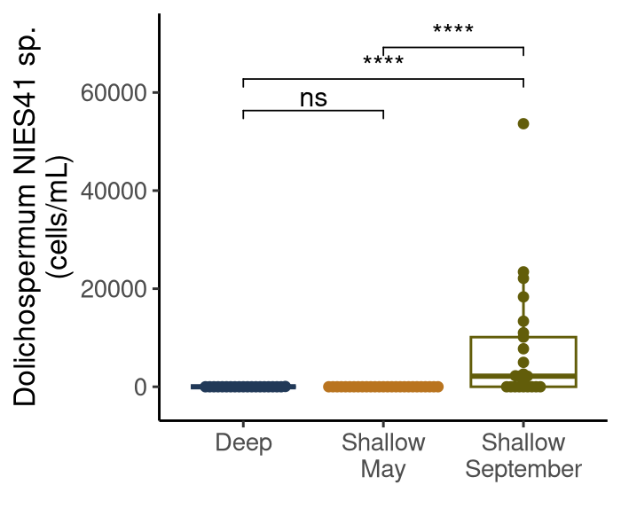


```r
micro_df %>% 
  ggplot(aes(x = Comp_Group_Hier, y = Mic_Abund, color = Comp_Group_Hier)) + 
  geom_boxplot(outliers = FALSE) + 
  ggbeeswarm::geom_beeswarm() + 
  ggpubr::stat_compare_means(comparison = list(c(1,2), c(1,3), c(2,3)),
                             label = "p.signif") + 
  scale_color_manual(values = comp_three_colors) + 
  scale_x_discrete(labels = c("Deep", "Shallow\nMay","Shallow\nSeptember")) +
  scale_y_continuous(expand = expansion(mult = c(0.1,.1)),
                     labels = scales::label_comma())+
  theme(legend.position = "none") + 
  labs(x = "", y = "Microcystis PCC-7914 sp.\n(cells/mL)")
```

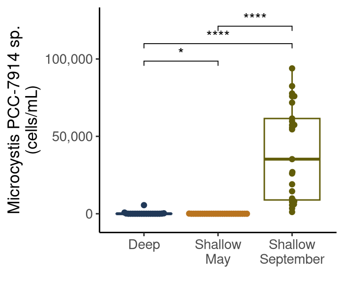

Then we write out values for spatial interpolation in QGIS


```r
harmful_sp <- dol_df %>%
  left_join(cell_count_sp) %>%
  filter(month == "September", Depth_Class == "E") %>%
  left_join(select(micro_df, Rep_ID, Mic_Abund)) %>%
  select(Rep_ID, Dol_Abund, Mic_Abund, geometry)

st_write(harmful_sp, "analysis/QGIS_Work/harmful_algae.gpkg", append = FALSE)
```

```
## Deleting layer `harmful_algae' using driver `GPKG'
## Writing layer `harmful_algae' to data source `analysis/QGIS_Work/harmful_algae.gpkg' using driver `GPKG'
## Writing 15 features with 3 fields and geometry type Point.
```

# Distance Decays and Average Dissimilarities

This section uses distance matrices defined in 08_Compositional_Analysis to test relationships between distance and depth decay, as well as variance partitioning. 


```r
load("data/08_compositional_exports/absolute_wunifrac.RData")

abs_unifrac_dist_0.5 <- absolute_wunifrac$unifracs[, , "d_0.5"]

unweighted_unifrac_dist <- absolute_wunifrac$unifracs[, , "d_UW"]
```


```r
diag(abs_unifrac_dist_0.5) <- NA # We don't want identical comparisons

mat_df <- as.data.frame(abs_unifrac_dist_0.5) # Convert to data.frame

# Pivot to long format where each row is a pairwise comparison
tidy_dist_wun <- mat_df %>%
    mutate(item1 = rownames(mat_df)) %>%
    pivot_longer(!item1, names_to = "item2", values_to = "dist") %>%
  filter(!is.na(dist))

# Repeat for unweighted unifrac

diag(unweighted_unifrac_dist) <- NA

mat_df_un <- as.data.frame(unweighted_unifrac_dist)

tidy_dist_un <- mat_df_un %>%
    mutate(item1 = rownames(mat_df_un)) %>%
    pivot_longer(!item1, names_to = "item2", values_to = "un_dist") %>%
  filter(!is.na(un_dist))

# Join our distances

tidy_dist <- inner_join(tidy_dist_wun, tidy_dist_un)

# Select metadata for comparisons

rep_to_comp <- sample_data(full_abs_physeq) %>%
    data.frame() %>%
    dplyr::select(Rep_ID,
           Comp_Group_Hier,
           Station_ID,
           Latitude,
           Longitude,
           month,
           Depth_Class)
  
# Find average dissimilarities for each sample within it's Comp Group

avg_dists <- tidy_dist %>%
    mutate(
      item1_group = rep_to_comp$Comp_Group_Hier[match(item1, rep_to_comp$Rep_ID)],
      item2_group = rep_to_comp$Comp_Group_Hier[match(item2, rep_to_comp$Rep_ID)]
    ) %>%
    dplyr::filter(item1_group == item2_group) %>%
    group_by(item1) %>%
    summarize(avg.dist = mean(dist, na.rm = TRUE),
              avg.un_dist =mean(un_dist, na.rm = TRUE)) %>%
    rename(Rep_ID = item1)
```

We write out these values, for possible visualization in QGIS (I don't think that made it into the paper tho)


```r
split_dists <- 
  avg_dists %>% 
    left_join(rep_to_comp) %>%
  filter(Depth_Class == "E") %>% 
    st_as_sf(coords = c("Longitude", "Latitude"), crs = "EPSG:4326") %>%
    st_transform(crs = "EPSG:3174") %>%
  select(Rep_ID, AVG_W_DIST = avg.dist, AVG_UW_DIST = avg.un_dist, month) %>% # For some ungodly reason, QGIS HATES the avg.* name
  group_split(month)

st_write(split_dists[[1]], "analysis/QGIS_Work/May_Avg_Dists.gpkg" , append = FALSE)
```

```
## Deleting layer `May_Avg_Dists' using driver `GPKG'
## Writing layer `May_Avg_Dists' to data source `analysis/QGIS_Work/May_Avg_Dists.gpkg' using driver `GPKG'
## Writing 15 features with 4 fields and geometry type Point.
```

```r
st_write(split_dists[[2]], "analysis/QGIS_Work/Sept_Avg_Dists.gpkg", append = FALSE)
```

```
## Deleting layer `Sept_Avg_Dists' using driver `GPKG'
## Writing layer `Sept_Avg_Dists' to data source `analysis/QGIS_Work/Sept_Avg_Dists.gpkg' using driver `GPKG'
## Writing 15 features with 4 fields and geometry type Point.
```

Now, we calculate other pairwise distances, including geographic distance and depth difference.


```r
geo_dist_mat <- sample_sf %>%
  st_distance()

row.names(geo_dist_mat) <- sample_sf$Rep_ID
colnames(geo_dist_mat) <- sample_sf$Rep_ID

diag(geo_dist_mat) <- NA

geo_dist_mat[upper.tri(geo_dist_mat)] <- NA

geo_mat_df <- as.data.frame(geo_dist_mat)

tidy_geo_dist <- geo_mat_df %>%
    mutate(item1 = rownames(geo_mat_df)) %>%
    pivot_longer(!item1, names_to = "item2", values_to = "geo_dist") %>%
  filter(!is.na(geo_dist))
```


```r
just_depth <- sample_sf %>%
  dplyr::select(Rep_ID, Deployment_Depth_m)

depth_dist_mat <- abs(outer(just_depth$Deployment_Depth_m, just_depth$Deployment_Depth_m, "-"))


row.names(depth_dist_mat) <- sample_sf$Rep_ID
colnames(depth_dist_mat) <- sample_sf$Rep_ID

diag(depth_dist_mat) <- NA
depth_dist_mat[upper.tri(depth_dist_mat)] <- NA

depth_mat_df <- as.data.frame(depth_dist_mat)

tidy_depth_dist <- depth_mat_df %>%
    mutate(item1 = rownames(depth_mat_df)) %>%
    pivot_longer(!item1, names_to = "item2", values_to = "depth_dist") %>%
  filter(!is.na(depth_dist))
```


```r
for_join <- sample_sf %>%
  as.data.frame() %>%
  dplyr::select(Rep_ID, Comp_Group_Hier, month, -geometry)

stopifnot(all(tidy_geo_dist$item1 == tidy_depth_dist$item1))
stopifnot(all(tidy_geo_dist$item2 == tidy_depth_dist$item2))


tidy_dist_decay <- tidy_dist %>%
  full_join(tidy_geo_dist) %>%
  full_join(tidy_depth_dist) %>%
  filter(!is.na(geo_dist)) %>%
  left_join(for_join, by = c("item1" = "Rep_ID")) %>%
  left_join(for_join, by = c("item2" = "Rep_ID"))
```

Next, we make many different distance decays, based on either unweighted vs. weighted, and deep vs. shallow samples. Note that we make the linear models first and then use them to annotate the plots


```r
geo_models <- tidy_dist_decay %>%
  filter(month.x == month.y,
         str_detect(Comp_Group_Hier.x, "Shallow"),
         str_detect(Comp_Group_Hier.y, "Shallow")) %>%
  mutate(geo_dist = as.numeric(geo_dist)) %>%
  nest_by(month.x) %>%
  mutate(lms = list(lm(1-dist ~ geo_dist, data = data))) %>%
  pull(lms)

labs <- map(geo_models, \(x){
  r <-summary(x)$adj.r.squared
  p <- summary(x)$coefficients[2,4]
  r.lab <- ifelse(r < 0.01,
        "R[adj]^2 < 0.01~~~",
        paste("R[adj]^2 ==", round(r,2), "~~~")
        )
  
  p.lab <- ifelse(p < 0.01,
                  "p < 0.01",
                  paste("p == ", round(p, 2))
                  )
  paste0(r.lab, p.lab)
  }
  )

dist_decay_weighted_surface <-
  tidy_dist_decay %>%
  filter(month.x == month.y,
         str_detect(Comp_Group_Hier.x, "Shallow"),
         str_detect(Comp_Group_Hier.y, "Shallow")) %>%
  mutate(geo_dist = as.numeric(geo_dist)) %>%
  ggplot(aes(x = geo_dist/1000, y = 1-dist, color = month.x)) + 
  geom_point(alpha = 0.2) + 
  scale_y_continuous(limits = c(0, 1)) + 
  labs(x = "Geographic Distance (km)", y = "Similarity (Weighted)", color = "Month") + 
  geom_smooth(method = "lm", se = FALSE) + 
  scale_color_manual(values = triglav[c(1,5)]) + 
  annotate(geom = "text",
           x = 0, 
           y = c(.33,1),
           color = triglav[c(1,5)],
           hjust = 0,
           label = labs,
           parse = TRUE)
```


```r
geo_models <- tidy_dist_decay %>%
  filter(month.x == month.y,
         str_detect(Comp_Group_Hier.x, "Shallow"),
         str_detect(Comp_Group_Hier.y, "Shallow")) %>%
  mutate(geo_dist = as.numeric(geo_dist)) %>%
  nest_by(month.x) %>%
  mutate(lms = list(lm(1-un_dist ~ geo_dist, data = data))) %>%
  pull(lms)

labs <- map(geo_models, \(x){
  r <-summary(x)$adj.r.squared
  p <- summary(x)$coefficients[2,4]
  r.lab <- ifelse(r < 0.01,
        "R[adj]^2 < 0.01~~~",
        paste("R[adj]^2 ==", round(r,2), "~~~")
        )
  
  p.lab <- ifelse(p < 0.01,
                  "p < 0.01",
                  paste("p == ", round(p, 2))
                  )
  paste0(r.lab, p.lab)
  }
  )

dist_decay_unweighted_shallow <- 
  tidy_dist_decay %>%
  filter(month.x == month.y,
         str_detect(Comp_Group_Hier.x, "Shallow"),
         str_detect(Comp_Group_Hier.y, "Shallow")) %>%
  mutate(geo_dist = as.numeric(geo_dist)) %>%
  ggplot(aes(x = geo_dist/1000, y = 1-un_dist, color = month.x)) + 
  geom_point(alpha = 0.2) + 
  scale_y_continuous(limits = c(0, 1)) + 
  labs(x = "Geographic Distance (km)", y = "Similarity (Unweighted)", color = "Month") + 
  geom_smooth(method = "lm", se = FALSE) + 
  scale_color_manual(values = triglav[c(1,5)]) + 
  annotate(geom = "text",
           x = 0, 
           y = c(0.25,1),
           color = triglav[c(1,5)],
           hjust = 0,
           label = labs,
           parse = TRUE)
```


```r
geo_models <- tidy_dist_decay %>%
  filter(month.x == month.y,
         Comp_Group_Hier.x == "Deep",
         Comp_Group_Hier.y == "Deep") %>%
  mutate(geo_dist = as.numeric(geo_dist)) %>%
  nest_by(month.x) %>%
  mutate(lms = list(lm(1-dist ~ geo_dist, data = data))) %>%
  pull(lms)

labs <- map(geo_models, \(x){
  r <-summary(x)$adj.r.squared
  p <- summary(x)$coefficients[2,4]
  r.lab <- ifelse(r < 0.01,
        "R[adj]^2 < 0.01~~~",
        paste("R[adj]^2 ==", round(r,2), "~~~")
        )
  
  p.lab <- ifelse(p < 0.01,
                  "p < 0.01",
                  paste("p == ", round(p, 2))
                  )
  paste0(r.lab, p.lab)
  }
  )

dist_decay_weighted_deep <- 
  tidy_dist_decay %>%
  filter(month.x == month.y,
         str_detect(Comp_Group_Hier.x, "Deep"),
         str_detect(Comp_Group_Hier.y, "Deep")) %>%
  mutate(geo_dist = as.numeric(geo_dist)) %>%
  ggplot(aes(x = geo_dist/1000, y = 1-dist, color = month.x)) + 
  geom_point(alpha = 0.2) + 
  scale_y_continuous(limits = c(0, 1)) + 
  labs(x = "Geographic Distance (km)", y = "Similarity (Weighted)", color = "Month") + 
  geom_smooth(method = "lm", se = FALSE) + 
  scale_color_manual(values = triglav[c(1,5)]) + 
  annotate(geom = "text",
           x = 0, 
           y = c(1,0.33),
           color = triglav[c(1,5)],
           hjust = 0,
           label = labs,
           parse = TRUE)
```


```r
geo_models <- tidy_dist_decay %>%
  filter(month.x == month.y,
         str_detect(Comp_Group_Hier.x, "Deep"),
         str_detect(Comp_Group_Hier.y, "Deep")) %>%
  mutate(geo_dist = as.numeric(geo_dist)) %>%
  nest_by(month.x) %>%
  mutate(lms = list(lm(1-un_dist ~ geo_dist, data = data))) %>%
  pull(lms)

labs <- map(geo_models, \(x){
  r <-summary(x)$adj.r.squared
  p <- summary(x)$coefficients[2,4]
  r.lab <- ifelse(r < 0.01,
        "R[adj]^2 < 0.01~~~",
        paste("R[adj]^2 ==", round(r,2), "~~~")
        )
  
  p.lab <- ifelse(p < 0.01,
                  "p < 0.01",
                  paste("p == ", round(p, 2))
                  )
  paste0(r.lab, p.lab)
  }
  )

dist_decay_unweighted_deep <- 
  tidy_dist_decay %>%
  filter(month.x == month.y,
         str_detect(Comp_Group_Hier.x, "Deep"),
         str_detect(Comp_Group_Hier.y, "Deep")) %>%
  mutate(geo_dist = as.numeric(geo_dist)) %>%
  ggplot(aes(x = geo_dist/1000, y = 1-un_dist, color = month.x)) + 
  geom_point(alpha = 0.2) + 
  scale_y_continuous(limits = c(0, 1)) + 
  labs(x = "Geographic Distance (km)", y = "Similarity (Unweighted)", color = "Month") + 
  geom_smooth(method = "lm", se = FALSE) + 
  scale_color_manual(values = triglav[c(1,5)]) + 
  annotate(geom = "text",
           x = 0, 
           y = c(1,0.15),
           color = triglav[c(1,5)],
           hjust = 0,
           label = labs,
           parse = TRUE)
```


```r
(dist_decay_unweighted_shallow + dist_decay_weighted_surface) / (dist_decay_unweighted_deep +dist_decay_weighted_deep) + 
  plot_layout(guides = "collect")
```

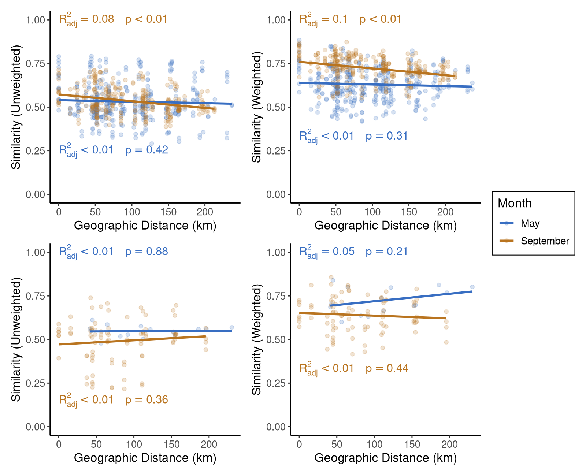


```r
depth_models <- tidy_dist_decay %>%
  filter(month.x == month.y) %>%
  nest_by(month.x) %>%
  mutate(lms = list(lm(1-un_dist ~ depth_dist, data = data))) %>%
  pull(lms)

labs <- map(depth_models, \(x){
  r <-summary(x)$adj.r.squared
  p <- summary(x)$coefficients[2,4]
  r.lab <- ifelse(r < 0.01,
        "R[adj]^2 < 0.01~~~",
        paste("R[adj]^2 ==", round(r,2), "~~~")
        )
  
  p.lab <- ifelse(p < 0.01,
                  "p < 0.01",
                  paste("p == ", round(p, 2))
                  )
  paste0(r.lab, p.lab)
  }
  )

depth_decay_unweighted <- tidy_dist_decay %>%
  filter(month.x == month.y) %>%
  ggplot(aes(x = depth_dist, y = 1-un_dist, color = month.x)) + 
  geom_point(alpha = 0.2) + 
  scale_y_continuous(limits = c(0, 1)) + 
  labs(x = "Depth Difference (m)", y = "Similarity (Unweighted)", color = "Month") + 
  geom_smooth(method = "lm", se = FALSE) + 
  scale_color_manual(values = triglav[c(1,5)]) + 
  annotate(geom = "text",
           x = 0, 
           y = c(1,0),
           color = triglav[c(1,5)],
           hjust = 0,
           label = labs,
           parse = TRUE)


depth_decay_unweighted
```

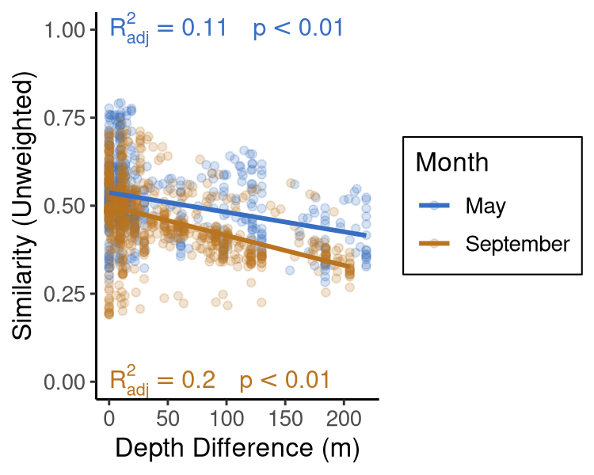

Now we do the decay relationships for the main text, which use weighted distance and don't separate by depths. 


```r
geo_models <- tidy_dist_decay %>%
  filter(month.x == month.y) %>%
  mutate(geo_dist = as.numeric(geo_dist)) %>%
  nest_by(month.x) %>%
  mutate(lms = list(lm(1-dist ~ geo_dist, data = data))) %>%
  pull(lms)

labs <- map(geo_models, \(x){
  r <-summary(x)$adj.r.squared
  p <- summary(x)$coefficients[2,4]
  r.lab <- ifelse(r < 0.01,
        "R[adj]^2 < 0.01~~~",
        paste("R[adj]^2 ==", round(r,2), "~~~")
        )
  
  p.lab <- ifelse(p < 0.01,
                  "p < 0.01",
                  paste("p == ", round(p, 2))
                  )
  paste0(r.lab, p.lab)
  }
  )

dist_decay <- tidy_dist_decay %>%
  filter(month.x == month.y) %>%
  mutate(geo_dist = as.numeric(geo_dist)) %>%
  ggplot(aes(x = geo_dist/1000, y = 1-dist, color = month.x)) + 
  geom_point(alpha = 0.2) + 
  scale_y_continuous(limits = c(0, 1)) + 
  labs(x = "Geographic Distance (km)", y = "Similarity", color = "Month") + 
  geom_smooth(method = "lm", se = FALSE) + 
  scale_color_manual(values = triglav[c(1,5)]) + 
  annotate(geom = "text",
           x = 0, 
           y = c(1,0.15),
           color = triglav[c(1,5)],
           hjust = 0,
           label = labs,
           parse = TRUE)
```

Now we do depth decay


```r
depth_models <- tidy_dist_decay %>%
  filter(month.x == month.y) %>%
  nest_by(month.x) %>%
  mutate(lms = list(lm(1-dist ~ depth_dist, data = data))) %>%
  pull(lms)

labs <- map(depth_models, \(x){
  r <-summary(x)$adj.r.squared
  p <- summary(x)$coefficients[2,4]
  r.lab <- ifelse(r < 0.01,
        "R[adj]^2 < 0.01~~~",
        paste("R[adj]^2 ==", round(r,2), "~~~")
        )
  
  p.lab <- ifelse(p < 0.01,
                  "p < 0.01",
                  paste("p == ", round(p, 2))
                  )
  paste0(r.lab, p.lab)
  }
  )

depth_decay <- tidy_dist_decay %>%
  filter(month.x == month.y) %>%
  ggplot(aes(x = depth_dist, y = 1-dist, color = month.x)) + 
  geom_point(alpha = 0.2) + 
  scale_y_continuous(limits = c(0, 1)) + 
  labs(x = "Depth Difference (m)", y = "Similarity", color = "Month") + 
  geom_smooth(method = "lm", se = FALSE) + 
  scale_color_manual(values = triglav[c(1,5)]) + 
  annotate(geom = "text",
           x = 0, 
           y = c(1,0.15),
           color = triglav[c(1,5)],
           hjust = 0,
           label = labs,
           parse = TRUE)
```


```r
combined <- ggpubr::ggarrange(dist_decay, depth_decay, 
                              nrow = 2,
                  common.legend = TRUE,
                  legend = "bottom")

combined
```

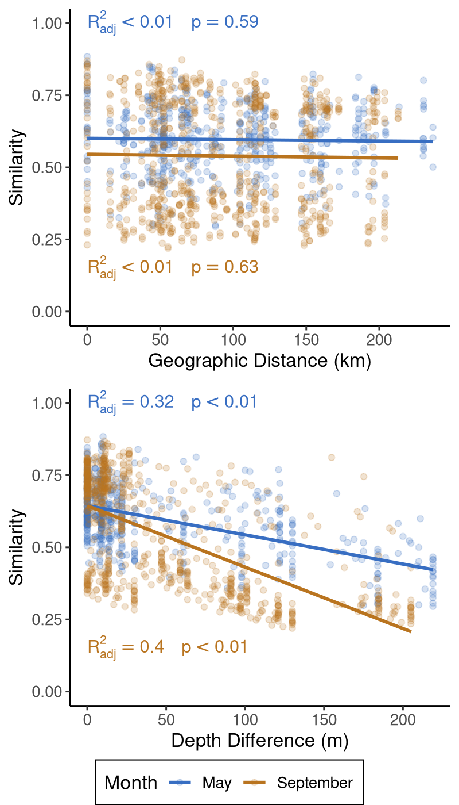

Next, we run variance partitioning, including testing for significance. 


```r
full_records <- full_abs_physeq %>%
  sample_data() %>%
  data.frame() %>%
  dplyr::select(par, temperature, TN, TP, Na, SO4, DOC, chl_a, Rep_ID) %>%
  drop_na() %>%
  pull(Rep_ID)

no_na_physeq <- full_abs_physeq %>%
  microViz::ps_filter(Rep_ID %in%full_records)

metadata <- no_na_physeq %>%
  sample_data() %>%
  data.frame()

month <- metadata["month"]
depth <- metadata["Deployment_Depth_m"]
geo <- dplyr::select(metadata, Longitude, Latitude)
env <- dplyr::select(metadata, NH4:chl_a,temperature,good_oxygen,par) %>% scale()

missing <- rownames(abs_unifrac_dist_0.5)[!rownames(abs_unifrac_dist_0.5) %in% rownames(month)]

missing
```

```
## [1] "May_41_M"
```

```r
abs_wun <- as.dist(abs_unifrac_dist_0.5[setdiff(rownames(abs_unifrac_dist_0.5),missing),setdiff(rownames(abs_unifrac_dist_0.5),missing)])
abs_un <- as.dist(unweighted_unifrac_dist[setdiff(rownames(unweighted_unifrac_dist),missing),setdiff(rownames(unweighted_unifrac_dist),missing)])

metadata <- no_na_physeq %>%
  sample_data() %>%
  data.frame()


env_variables <- paste(colnames(env), collapse = "+")

env_form <- as.formula(paste0("abs_wun ~ ", env_variables))

env_d_form <- as.formula(paste0("abs_wun ~ ", env_variables, "+ Condition(Deployment_Depth_m)"))

env_m_form <- as.formula(paste0("abs_wun ~ ", env_variables, "+ Condition(month)"))

env_g_form <- as.formula(paste0("abs_wun ~ ", env_variables, "+ Condition(Latitude + Longitude)"))

m_form <- as.formula(paste0("abs_wun ~ ", "month"))

d_form <- as.formula(paste0("abs_wun ~ ", "Deployment_Depth_m"))

g_form <- as.formula(paste0("abs_wun ~ ", "Latitude + Longitude"))

formulas <- list(Env = env_form, 
                 Env_x_Depth = env_d_form, 
                 Env_x_Month = env_m_form, 
                 Env_x_Geo = env_g_form, 
                 Month = m_form,
                 Depth = d_form,
                 Geo = g_form)

varpart_results <- vegan::varpart(Y = abs_wun, month, depth, geo, env)

plot(varpart_results, Xnames = c("Month","Depth","Geo. Distance","Env."))
```

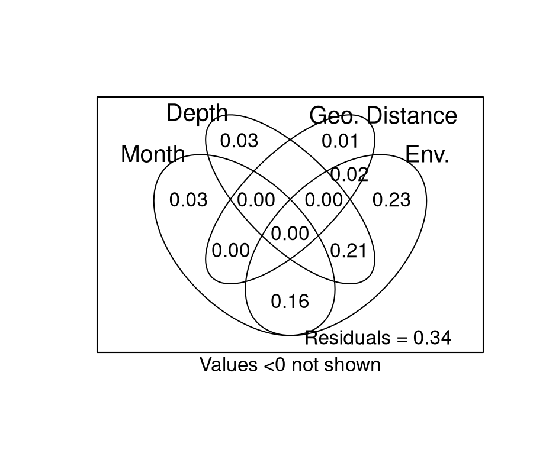

```r
# Test the significance
map(formulas, \(form){
  dbrda <- vegan::dbrda(form, data = as.data.frame(cbind(env, geo, depth, month)))
  cca_res <- vegan::anova.cca(dbrda)
  cca_res$`Pr(>F)`[1]
})
```

```
## $Env
## [1] 0.001
## 
## $Env_x_Depth
## [1] 0.001
## 
## $Env_x_Month
## [1] 0.001
## 
## $Env_x_Geo
## [1] 0.001
## 
## $Month
## [1] 0.001
## 
## $Depth
## [1] 0.001
## 
## $Geo
## [1] 0.075
```

Then, we remake this figure, to be simpler and clearer:


```r
vars <- c("Env.", 
          "Env. + Depth", 
          "Env. + Month", 
          "Depth", 
          "Month", 
          "Env. + Location",
          "Location",
          "Residuals")

var_df <- data.frame(Label = factor(vars, levels = rev(vars)),
           Variance = c(.24,
                        .22,
                        .15,
                        .03,
                        .03,
                        .02,
                        .01,
                        .32),
           Sig = factor(c(1,1,1,1,1,1,0,1)))

var_plot <- ggplot(var_df, 
       aes(y = Label,
           x = Variance,
           color = Sig)) + 
  geom_point() +
  geom_segment(aes(xend = 0, yend= Label)) + 
  scale_x_continuous(expand = expansion(mult = c(0,.15))) + 
  geom_text(aes(label = Variance,
                x = Variance + .01),
            hjust = 0) + 
  scale_color_manual(values = c("grey70","black"), guide = "none") + 
  theme(axis.title.y = element_blank())

var_plot
```


Then, we do variance partitioning with unweighted Unifrac.


```r
full_records <- full_abs_physeq %>%
  sample_data() %>%
  data.frame() %>%
  dplyr::select(par, temperature, TN, TP, Na, SO4, DOC, chl_a, Rep_ID) %>%
  drop_na() %>%
  pull(Rep_ID)

env_form <- as.formula(paste0("abs_wun ~ ", env_variables))

env_d_form <- as.formula(paste0("abs_wun ~ ", env_variables, "+ Condition(Deployment_Depth_m)"))

env_m_form <- as.formula(paste0("abs_wun ~ ", env_variables, "+ Condition(month)"))

env_g_form <- as.formula(paste0("abs_wun ~ ", env_variables, "+ Condition(Latitude + Longitude)"))

m_form <- as.formula(paste0("abs_wun ~ ", "month"))

d_form <- as.formula(paste0("abs_wun ~ ", "Deployment_Depth_m"))

formulas <- list(Env = env_form, 
                 Env_x_Depth = env_d_form, 
                 Env_x_Month = env_m_form, 
                 Env_x_Geo = env_g_form, 
                 Month = m_form,
                 Depth = d_form)


varpart_results <- vegan::varpart(Y = abs_un, month, depth, geo, env)

plot(varpart_results, Xnames = c("Month","Depth","Geo. Distance","Env."))
```

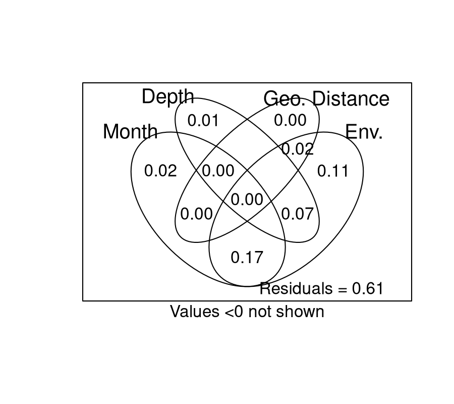

I love this plot so I'm keeping it in here, but we don't use it in the paper. 


```r
mat_df_wun <- as.data.frame(abs_unifrac_dist_0.5)

mat_df_un <- as.data.frame(unweighted_unifrac_dist)

tidy_dist_wun <- mat_df_wun %>%
    mutate(item1 = rownames(mat_df_wun)) %>%
    pivot_longer(!item1, names_to = "item2", values_to = "wunifrac") %>%
  filter(!is.na(wunifrac))

tidy_dist_un <- mat_df_un %>%
    mutate(item1 = rownames(mat_df_un)) %>%
    pivot_longer(!item1, names_to = "item2", values_to = "unifrac") %>%
  filter(!is.na(unifrac))

both_dists <- full_join(tidy_dist_wun, tidy_dist_un)

metadata <- no_na_physeq %>%
  sample_data() %>%
  data.frame()

env <- dplyr::select(metadata, NH4:chl_a,temperature,good_oxygen,par) %>% scale()

tidy_euc <- 
  env %>%
  dist() %>% 
  as.matrix() %>% 
  data.frame() %>% 
  mutate(item1 = rownames(.)) %>% 
  mutate(across(everything(), \(x)ifelse(x == 0, NA, x))) %>%
  pivot_longer(!item1, names_to = "item2", values_to = "euc_dist") %>%
  filter(!is.na(euc_dist))

wun_and_euc <- full_join(both_dists, tidy_euc) %>%
  full_join(tidy_geo_dist) %>%
  filter(!is.na(geo_dist)) %>%
  transmute(across(where(is.numeric), scale))


wun_and_euc %>%
  pivot_longer(c(wunifrac,unifrac), names_to = "Community_Metric", values_to = "Community_Distance") %>%
  pivot_longer(c(euc_dist, geo_dist), names_to = "Independent_Metric",values_to = "Independent_Distance") %>%
  ggplot(aes(x = Independent_Distance, y = Community_Distance)) + 
  geom_point(alpha = 0.1) + 
  geom_smooth(method = "lm", se = FALSE) +
  facet_grid(Independent_Metric ~ Community_Metric)
```

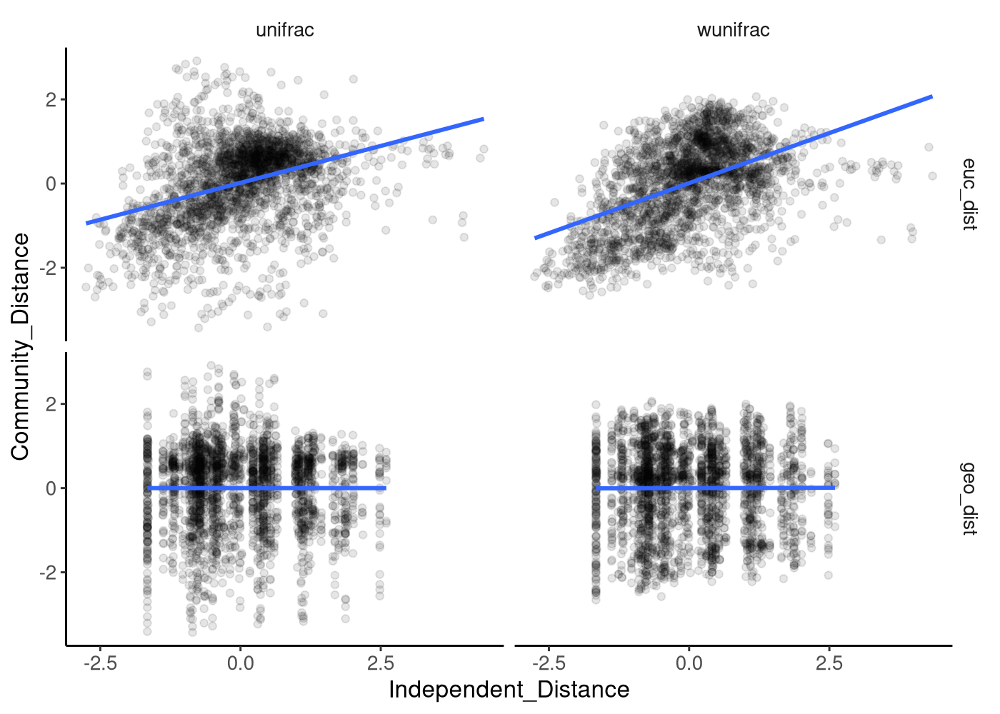

```r
wun_and_euc %>%
  select(-unifrac) %>%
  pivot_longer(euc_dist:geo_dist, names_to = "Metric", values_to = "Distance") %>%
  ggplot(aes(x = Distance, y = wunifrac, color = Metric)) + 
  geom_point(alpha = 0.1) + 
  geom_smooth(method = "lm", se = FALSE, linewidth = 2,
              linetype = 2) + 
  labs(x = "Scaled Geographic or Environmental Distance", y = "Weighted Unifrac Distance",
       color = "Distance") + 
  scale_color_manual(labels = c("Environmental","Geographical"),
                     values = triglav[c(1,4)])
```

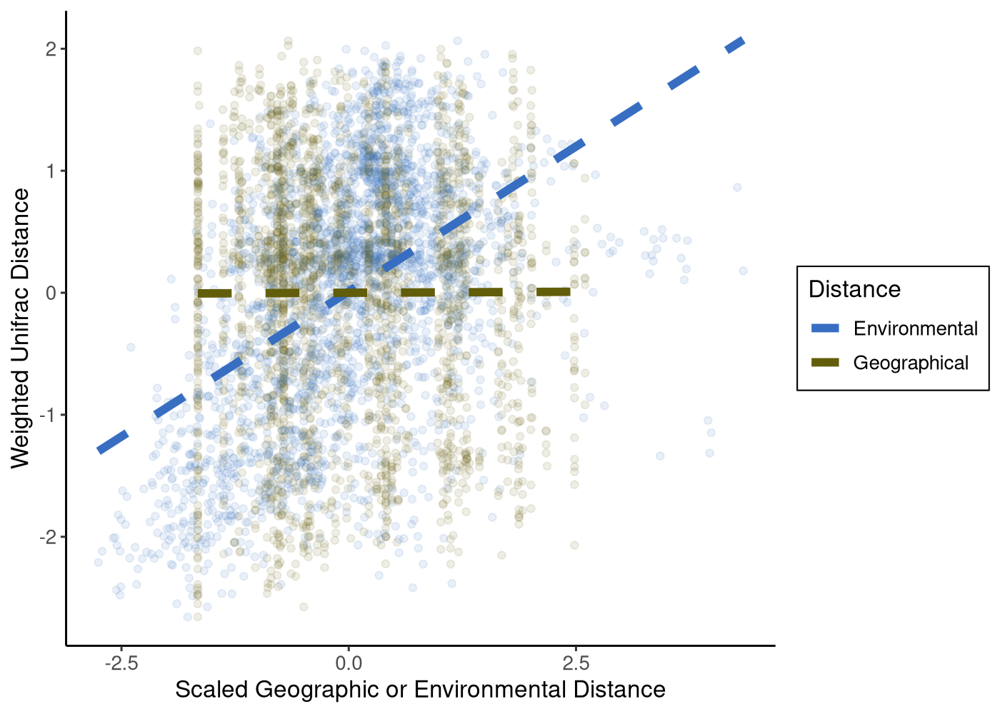

# Session Info


```r
sessioninfo::session_info()
```

```
## ─ Session info ─────────────────────────────────────────────────────────────────────────────────────────────────────────────────────────────────────────────────────────────────────────────────────────────────────────────────────────────────────────
##  setting  value
##  version  R version 4.3.3 (2024-02-29)
##  os       Rocky Linux 9.5 (Blue Onyx)
##  system   x86_64, linux-gnu
##  ui       X11
##  language (EN)
##  collate  en_US.UTF-8
##  ctype    en_US.UTF-8
##  tz       America/New_York
##  date     2025-07-01
##  pandoc   3.1.1 @ /usr/lib/rstudio-server/bin/quarto/bin/tools/ (via rmarkdown)
## 
## ─ Packages ─────────────────────────────────────────────────────────────────────────────────────────────────────────────────────────────────────────────────────────────────────────────────────────────────────────────────────────────────────────────
##  ! package           * version     date (UTC) lib source
##  P abind               1.4-5       2016-07-21 [?] CRAN (R 4.3.2)
##  P ade4                1.7-22      2023-02-06 [?] CRAN (R 4.3.2)
##  P ape                 5.7-1       2023-03-13 [?] CRAN (R 4.3.2)
##  P backports           1.4.1       2021-12-13 [?] CRAN (R 4.3.2)
##  P base64enc           0.1-3       2015-07-28 [?] CRAN (R 4.3.2)
##  P beeswarm            0.4.0       2021-06-01 [?] CRAN (R 4.3.2)
##  P Biobase             2.62.0      2023-10-24 [?] Bioconductor
##  P BiocGenerics        0.48.1      2023-11-01 [?] Bioconductor
##  P BiocManager         1.30.22     2023-08-08 [?] CRAN (R 4.3.2)
##  P biomformat          1.30.0      2023-10-24 [?] Bioconductor
##  P Biostrings          2.70.1      2023-10-25 [?] Bioconductor
##  P bitops              1.0-7       2021-04-24 [?] CRAN (R 4.3.2)
##  P broom               1.0.5       2023-06-09 [?] CRAN (R 4.3.2)
##  P bslib               0.5.1       2023-08-11 [?] CRAN (R 4.3.2)
##  P cachem              1.0.8       2023-05-01 [?] CRAN (R 4.3.2)
##  P car                 3.1-2       2023-03-30 [?] CRAN (R 4.3.2)
##  P carData             3.0-5       2022-01-06 [?] CRAN (R 4.3.2)
##  P class               7.3-22      2023-05-03 [?] CRAN (R 4.3.3)
##  P classInt            0.4-10      2023-09-05 [?] CRAN (R 4.3.2)
##  P cli                 3.6.1       2023-03-23 [?] CRAN (R 4.3.2)
##  P cluster             2.1.4       2022-08-22 [?] CRAN (R 4.3.2)
##  P codetools           0.2-19      2023-02-01 [?] CRAN (R 4.3.3)
##  P colorspace          2.1-0       2023-01-23 [?] CRAN (R 4.3.2)
##  P cols4all            0.7-1       2024-03-12 [?] CRAN (R 4.3.3)
##  P cowplot             1.1.3       2024-01-22 [?] CRAN (R 4.3.2)
##  P crayon              1.5.2       2022-09-29 [?] CRAN (R 4.3.2)
##  P crosstalk           1.2.1       2023-11-23 [?] CRAN (R 4.3.2)
##  P cytolib             2.14.1      2024-01-18 [?] Bioconduc~
##  P data.table          1.15.2      2024-02-29 [?] CRAN (R 4.3.2)
##  P DBI                 1.2.2       2024-02-16 [?] CRAN (R 4.3.2)
##  P dichromat           2.0-0.1     2022-05-02 [?] CRAN (R 4.3.2)
##  P digest              0.6.33      2023-07-07 [?] CRAN (R 4.3.2)
##  P dplyr             * 1.1.3       2023-09-03 [?] CRAN (R 4.3.2)
##  P e1071               1.7-14      2023-12-06 [?] CRAN (R 4.3.2)
##  P ellipsis            0.3.2       2021-04-29 [?] CRAN (R 4.3.2)
##  P evaluate            0.23        2023-11-01 [?] CRAN (R 4.3.2)
##  P fansi               1.0.5       2023-10-08 [?] CRAN (R 4.3.2)
##  P farver              2.1.1       2022-07-06 [?] CRAN (R 4.3.2)
##  P fastmap             1.1.1       2023-02-24 [?] CRAN (R 4.3.2)
##  P flowCore            2.14.2      2024-03-18 [?] Bioconduc~
##  P forcats           * 1.0.0       2023-01-29 [?] CRAN (R 4.3.2)
##  P foreach             1.5.2       2022-02-02 [?] CRAN (R 4.3.2)
##  P fun.gus           * 0.3.1       2025-06-26 [?] Github (MarschmiLab/fun.gus@7daa3fa)
##  P furrr               0.3.1       2022-08-15 [?] CRAN (R 4.3.2)
##  P future              1.33.1      2023-12-22 [?] CRAN (R 4.3.3)
##  P generics            0.1.3       2022-07-05 [?] CRAN (R 4.3.2)
##  P GenomeInfoDb        1.38.0      2023-10-24 [?] Bioconductor
##  P GenomeInfoDbData    1.2.11      2023-11-07 [?] Bioconductor
##  P ggbeeswarm          0.7.2       2023-04-29 [?] CRAN (R 4.3.2)
##  P ggplot2           * 3.5.0       2024-02-23 [?] CRAN (R 4.3.2)
##  P ggpubr              0.6.0       2023-02-10 [?] CRAN (R 4.3.2)
##  P ggsignif            0.6.4       2022-10-13 [?] CRAN (R 4.3.2)
##  P globals             0.16.2      2022-11-21 [?] CRAN (R 4.3.3)
##  P glue                1.6.2       2022-02-24 [?] CRAN (R 4.3.2)
##  P gridExtra           2.3         2017-09-09 [?] CRAN (R 4.3.2)
##  P gtable              0.3.4       2023-08-21 [?] CRAN (R 4.3.2)
##  P highr               0.10        2022-12-22 [?] CRAN (R 4.3.2)
##  P hms                 1.1.3       2023-03-21 [?] CRAN (R 4.3.2)
##  P htmltools           0.5.7       2023-11-03 [?] CRAN (R 4.3.2)
##  P htmlwidgets         1.6.2       2023-03-17 [?] CRAN (R 4.3.2)
##  P httpuv              1.6.12      2023-10-23 [?] CRAN (R 4.3.2)
##  P igraph              1.5.1       2023-08-10 [?] CRAN (R 4.3.2)
##  P IRanges             2.36.0      2023-10-24 [?] Bioconductor
##  P isoband             0.2.7       2022-12-20 [?] CRAN (R 4.3.2)
##  P iterators           1.0.14      2022-02-05 [?] CRAN (R 4.3.2)
##  P jquerylib           0.1.4       2021-04-26 [?] CRAN (R 4.3.2)
##  P jsonlite            1.8.7       2023-06-29 [?] CRAN (R 4.3.2)
##  P KernSmooth          2.23-22     2023-07-10 [?] CRAN (R 4.3.3)
##  P knitr               1.45        2023-10-30 [?] CRAN (R 4.3.2)
##  P labeling            0.4.3       2023-08-29 [?] CRAN (R 4.3.2)
##  P later               1.3.1       2023-05-02 [?] CRAN (R 4.3.2)
##  P lattice             0.21-9      2023-10-01 [?] CRAN (R 4.3.2)
##  P leafem              0.2.3       2023-09-17 [?] CRAN (R 4.3.2)
##  P leaflegend          1.2.0       2024-01-10 [?] CRAN (R 4.3.3)
##  P leaflet             2.2.1       2023-11-13 [?] CRAN (R 4.3.2)
##  P leaflet.providers   2.0.0       2023-10-17 [?] CRAN (R 4.3.2)
##  P leafsync            0.1.0       2019-03-05 [?] CRAN (R 4.3.2)
##  P lifecycle           1.0.3       2022-10-07 [?] CRAN (R 4.3.2)
##  P listenv             0.9.1       2024-01-29 [?] CRAN (R 4.3.2)
##  P lubridate         * 1.9.3       2023-09-27 [?] CRAN (R 4.3.2)
##  P lwgeom              0.2-14      2024-02-21 [?] CRAN (R 4.3.2)
##  P magrittr            2.0.3       2022-03-30 [?] CRAN (R 4.3.2)
##  P MASS                7.3-60      2023-05-04 [?] CRAN (R 4.3.2)
##  P Matrix              1.6-1.1     2023-09-18 [?] CRAN (R 4.3.2)
##  P matrixStats         1.2.0       2023-12-11 [?] CRAN (R 4.3.2)
##  P MBA                 0.1-0       2022-11-29 [?] CRAN (R 4.3.2)
##  P mgcv                1.9-0       2023-07-11 [?] CRAN (R 4.3.2)
##  P microViz            0.12.1      2024-03-05 [?] https://d~
##  P mime                0.12        2021-09-28 [?] CRAN (R 4.3.2)
##  P multtest            2.58.0      2023-10-24 [?] Bioconductor
##  P munsell             0.5.0       2018-06-12 [?] CRAN (R 4.3.2)
##  P NatParksPalettes  * 0.2.0       2022-10-09 [?] CRAN (R 4.3.2)
##  P nlme                3.1-163     2023-08-09 [?] CRAN (R 4.3.2)
##  P pacman              0.5.1       2019-03-11 [?] CRAN (R 4.3.2)
##  P parallelly          1.37.1      2024-02-29 [?] CRAN (R 4.3.3)
##  P patchwork         * 1.2.0.9000  2025-06-26 [?] Github (thomasp85/patchwork@d943757)
##  P permute             0.9-7       2022-01-27 [?] CRAN (R 4.3.2)
##  P phyloseq          * 1.46.0      2023-10-24 [?] Bioconductor
##  P pillar              1.9.0       2023-03-22 [?] CRAN (R 4.3.2)
##  P pkgconfig           2.0.3       2019-09-22 [?] CRAN (R 4.3.2)
##  P plyr                1.8.9       2023-10-02 [?] CRAN (R 4.3.2)
##  P png                 0.1-8       2022-11-29 [?] CRAN (R 4.3.2)
##  P promises            1.2.1       2023-08-10 [?] CRAN (R 4.3.2)
##  P proxy               0.4-27      2022-06-09 [?] CRAN (R 4.3.2)
##  P purrr             * 1.0.2       2023-08-10 [?] CRAN (R 4.3.2)
##  P R6                  2.5.1       2021-08-19 [?] CRAN (R 4.3.2)
##  P raster              3.6-26      2023-10-14 [?] CRAN (R 4.3.2)
##  P RColorBrewer        1.1-3       2022-04-03 [?] CRAN (R 4.3.2)
##  P Rcpp                1.0.11      2023-07-06 [?] CRAN (R 4.3.2)
##  P RCurl               1.98-1.13   2023-11-02 [?] CRAN (R 4.3.2)
##  P readr             * 2.1.5       2024-01-10 [?] CRAN (R 4.3.2)
##    renv                1.0.5       2024-02-29 [1] CRAN (R 4.3.2)
##  P reshape2            1.4.4       2020-04-09 [?] CRAN (R 4.3.2)
##  P rhdf5               2.46.1      2023-11-29 [?] Bioconduc~
##  P rhdf5filters        1.14.1      2023-11-06 [?] Bioconductor
##  P Rhdf5lib            1.24.2      2024-02-07 [?] Bioconduc~
##  P rlang               1.1.2       2023-11-04 [?] CRAN (R 4.3.2)
##  P rmarkdown           2.25        2023-09-18 [?] CRAN (R 4.3.2)
##  P RProtoBufLib        2.14.1      2024-03-18 [?] Bioconduc~
##  P rstatix             0.7.2       2023-02-01 [?] CRAN (R 4.3.2)
##  P rstudioapi          0.15.0      2023-07-07 [?] CRAN (R 4.3.2)
##  P s2                  1.1.6       2023-12-19 [?] CRAN (R 4.3.2)
##  P S4Vectors           0.40.1      2023-10-26 [?] Bioconductor
##  P sass                0.4.7       2023-07-15 [?] CRAN (R 4.3.2)
##  P scales              1.3.0       2023-11-28 [?] CRAN (R 4.3.2)
##  P sessioninfo         1.2.2       2021-12-06 [?] CRAN (R 4.3.2)
##  P sf                * 1.0-15      2023-12-18 [?] CRAN (R 4.3.2)
##  P shiny               1.7.5.1     2023-10-14 [?] CRAN (R 4.3.2)
##  P sp                  2.1-3       2024-01-30 [?] CRAN (R 4.3.3)
##  P spacesXYZ           1.3-0       2024-01-23 [?] CRAN (R 4.3.3)
##  P stars               0.6-4       2023-09-11 [?] CRAN (R 4.3.2)
##  P stringi             1.7.12      2023-01-11 [?] CRAN (R 4.3.2)
##  P stringr           * 1.5.0       2022-12-02 [?] CRAN (R 4.3.2)
##  P survival            3.5-8       2024-02-14 [?] CRAN (R 4.3.3)
##  P terra             * 1.7-71      2024-01-31 [?] CRAN (R 4.3.2)
##  P tibble            * 3.2.1       2023-03-20 [?] CRAN (R 4.3.2)
##  P tidyr             * 1.3.1       2024-01-24 [?] CRAN (R 4.3.2)
##  P tidyselect          1.2.0       2022-10-10 [?] CRAN (R 4.3.2)
##  P tidyverse         * 2.0.0       2023-02-22 [?] CRAN (R 4.3.2)
##  P timechange          0.3.0       2024-01-18 [?] CRAN (R 4.3.2)
##  P tmap              * 3.99.9000   2025-06-26 [?] Github (r-tmap/tmap@bd12c21)
##  P tmaptools         * 3.1-1       2025-06-26 [?] Github (mtennekes/tmaptools@0c8b0b1)
##  P tzdb                0.4.0       2023-05-12 [?] CRAN (R 4.3.2)
##  P units             * 0.8-5       2023-11-28 [?] CRAN (R 4.3.2)
##  P utf8                1.2.4       2023-10-22 [?] CRAN (R 4.3.2)
##  P vctrs               0.6.4       2023-10-12 [?] CRAN (R 4.3.2)
##  P vegan               2.6-4       2022-10-11 [?] CRAN (R 4.3.2)
##  P vipor               0.4.7       2023-12-18 [?] CRAN (R 4.3.2)
##  P viridisLite         0.4.2       2023-05-02 [?] CRAN (R 4.3.2)
##  P widgetframe         0.3.1       2017-12-20 [?] CRAN (R 4.3.2)
##  P withr               2.5.2       2023-10-30 [?] CRAN (R 4.3.2)
##  P wk                  0.9.1       2023-11-29 [?] CRAN (R 4.3.2)
##  P xfun                0.52        2025-04-02 [?] CRAN (R 4.3.3)
##  P XML                 3.99-0.16.1 2024-01-22 [?] CRAN (R 4.3.2)
##  P xtable              1.8-4       2019-04-21 [?] CRAN (R 4.3.2)
##  P XVector             0.42.0      2023-10-24 [?] Bioconductor
##  P yaml                2.3.7       2023-01-23 [?] CRAN (R 4.3.2)
##  P zlibbioc            1.48.0      2023-10-24 [?] Bioconductor
## 
##  [1] /local/workdir/arp277/Pendleton_2025_Ontario_Publication_Repo/renv/library/R-4.3/x86_64-pc-linux-gnu
##  [2] /home/arp277/.cache/R/renv/sandbox/R-4.3/x86_64-pc-linux-gnu/fd835031
## 
##  P ── Loaded and on-disk path mismatch.
## 
## ────────────────────────────────────────────────────────────────────────────────────────────────────────────────────────────────────────────────────────────────────────────────────────────────────────────────────────────────────────────────────────
```
