<style>
pre code, pre, code {
  white-space: pre !important;
  overflow-x: scroll !important;
  word-break: keep-all !important;
  word-wrap: initial !important;
}
</style>


# Goals of this Document

In this analysis, we use the iCAMP package to infer the evolutionary processes governing community assembly both within our Comp groups and across them. This is the most computationally demanding section of our analysis - be aware that it takes a long time! Hence, many of these outputs are saved on disk, rather than being run afresh with each render. 

# Load packages 

```r
pacman::p_load(phyloseq, patchwork, iCAMP, tidyverse, ggside,  install = FALSE)

knitr::write_bib(file = "data/12_ecological_drivers/packages.bib")

# load in functions and color preferences
source("code/R/plotting_aesthetics.R")
```


# Load Data


```r
load("data/08_compositional_exports/full_abs_physeq.RData")
```


# Prepare data objects

First, we format and export different objects from our physeq which we'll feed into iCAMP.


```r
# Environmental variables to test
env <- full_abs_physeq %>%
  sample_data %>%
  data.frame %>%
  dplyr::select(where(is.numeric)) %>%
  dplyr::select(NH4:temperature,good_oxygen,par) %>% 
  na.omit()

# We can only use samples with complete values
samples_w_env <- rownames(env)

env_physeq <- full_abs_physeq %>%
  prune_samples(samples_w_env, .) %>%
  prune_taxa(taxa_sums(.) > 0, .)

# We'll combine results using Comp_Group_Hier
pool_groups_env <- env_physeq %>%
  sample_data() %>%
  data.frame() %>%
  dplyr::select(Rep_ID, Comp_Group_Hier)

# Pull out our OTU table
asv_mat_env <- env_physeq %>%
  otu_table %>%
  as.matrix()

# Pull out our tree
tree_env <- env_physeq %>%
  phy_tree()

# Pull out and clean-up our tax table
tax_table_raw <- tax_table(env_physeq) %>% as.data.frame

tax_for_icamp <- tax_table_raw[,2:7]

# Set the working directory for our phylogenetic dist matrix

icamp_wd_env <- "data/12_ecological_drivers/pd_wd_env/"

# Make sure our Comp-Group_Hier groups match our OTU table
pools_env <- pool_groups_env$Comp_Group_Hier[match(row.names(asv_mat_env), pool_groups_env$Rep_ID)] %>%
  data.frame() %>%
  dplyr::rename(Comp_Group_Hier = 1)

row.names(pools_env) <- row.names(asv_mat_env)

# One for four-group comparison
pool_groups_env4 <- env_physeq %>%
  sample_data() %>%
  data.frame() %>%
  dplyr::select(Rep_ID, Comp_Group_Hier_Colors)

pools_env4 <- pool_groups_env4$Comp_Group_Hier_Colors[match(row.names(asv_mat_env), pool_groups_env4$Rep_ID)] %>%
  data.frame() %>%
  dplyr::rename(Comp_Group_Hier_Colors = 1)

row.names(pools_env4) <- row.names(asv_mat_env)
```


# Phylogenetic dist matrix

This is an important step where we create a distance matrix which tracks the phylogenetic distance between each ASV.

```r
pd.big=iCAMP::pdist.big(tree = tree_env, 
                        wd=icamp_wd_env, 
                        nworker = 50)

save(pd.big, file = "data/12_ecological_drivers/pd.big.RData")
```


# Environmental dist matrix

In this step, we create a dist matrix using our environmental variables, comparing each sample to every other sample. This will then be used later to correlate changes in our abundance within our bins to changes in environmental conditions. 


```r
niche.dif<-iCAMP::dniche(env = env,
                        comm = asv_mat_env,
                        method = "niche.value",
                        nworker = 30,
                        out.dist=FALSE,
                        bigmemo=TRUE,
                        nd.wd="data/12_ecological_drivers/output_env")

save(niche.dif, file = "data/12_ecological_drivers/niche.dif.RData")
```


# Optimizing our phylogenetic binning

One of the biggest choices we need to make when running iCAMP is how we define our phylogenetic bins. We can modulate this across two parameters:

1. The ds = the max phylogenetic distance at which to test phylogenetic signal strength

2. bin.size.limit = the minimum number of ASVs in each bin; bins smaller than this will get merged

We also test using both the RowSums and the RowMeans to aggregate the data across our environmental variables.


```r
load("data/12_ecological_drivers/pd.big.RData")
load("data/12_ecological_drivers/niche.dif.RData")

dss <- c(0.1, 0.3, 0.5)
bin.size.limits <- c(24, 48)

combos <- expand_grid(dss, bin.size.limits)

test_binning <- function(ds, bin.size.limit){
    phylobin=taxa.binphy.big(tree = tree_env, 
                         pd.desc = pd.big$pd.file,
                         pd.spname = pd.big$tip.label,
                         pd.wd = pd.big$pd.wd, 
                         ds = ds, 
                         bin.size.limit = bin.size.limit,
                         nworker = 50)
    
    sp.bin=phylobin$sp.bin[,3,drop=FALSE]
    
    sp.ra=colMeans(asv_mat_env/rowSums(asv_mat_env))
    
    binps=ps.bin(sp.bin = sp.bin,
                    sp.ra = sp.ra,
                    pd.desc = pd.big$pd.file, 
                    pd.spname = pd.big$tip.label,
                    pd.wd = pd.big$pd.wd,
                    nd.list = niche.dif$nd,
                    nd.spname = niche.dif$names,
                    ndbig.wd = niche.dif$nd.wd,
                    cor.method = "pearson",
                    r.cut = 0.1, 
                    p.cut = 0.05
                    )
    sum_summaries <- binps$Index %>%
      dplyr::select(NH4.pearson:par.pearson) %>%
      rowSums
    
    mean_summaries <- binps$Index %>%
      dplyr::select(NH4.pearson:par.pearson) %>%
      rowMeans
    
    summaries <- data.frame(Summary = rep(c("Sum","Mean"), each = 4),
                            tested_ds = ds,
                            tested_bin.size.limit = bin.size.limit,
                            Metric = rep(binps$Index$index, 2),
                            Value = c(sum_summaries, mean_summaries)
               )
    
    return(summaries)
    
}


binning_tests <- map2(
  combos$dss,
  combos$bin.size.limits,
  possibly(\(x,y)test_binning(ds = x, bin.size.limit = y),
           otherwise = "ERRORED")
  )


final_results <- list_rbind(binning_tests)

save(final_results, file = "data/12_ecological_drivers/final_results.RData")
```


```r
load("data/12_ecological_drivers/final_results.RData")

final_results %>%
  filter(Metric %in% c("RAsig.adj","MeanR"),
         Summary == "Sum") %>%
  ggplot(aes(x = tested_ds, 
             y = Value,
             color = factor(tested_bin.size.limit))) + 
  geom_line() + 
  geom_point() + 
  facet_wrap(~Metric,
             scales = "free_y") +
  labs(color = "bin.size.limit", x ="ds") + 
  theme_classic(base_size = 16)
```

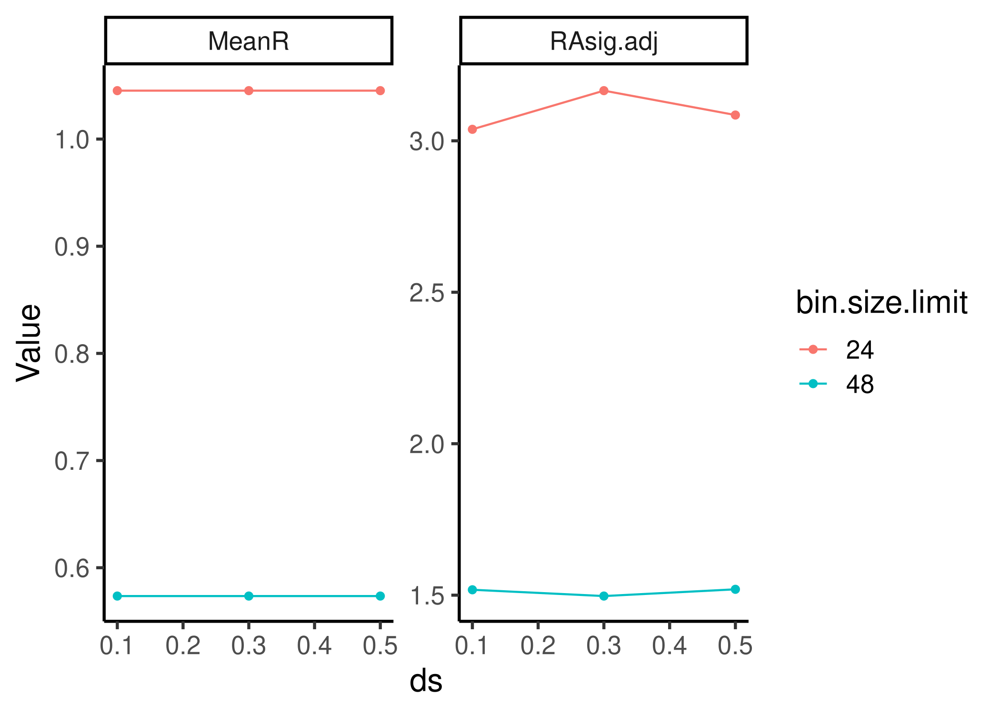

# Run iCAMP

Okay, the reviewers brought up a good point in that we should test how much the choice of these parameters may affect our findings. I would like to do a shorter sensitivity analyses to confirm this is possible. However, we simply cannot do 1000 iterations for each of them (it would take over a week). As such, we're doing a "quick pass", after which we'll do a "final" analysis with suffificient randomization.


```r
icamp_results_ds1_bsl24 <- icamp.big(comm = asv_mat_env,
                           tree = tree_env,
                           pd.desc = pd.big$pd.file, 
                           pd.spname=pd.big$tip.label,
                           pd.wd = pd.big$pd.wd,
                           rand = 100,
                           prefix = "icamp_ds1_bsl24_",
                           ds = .1,
                           bin.size.limit = 24,
                           nworker = 20,
                           detail.save = TRUE,
                           qp.save = TRUE,
                           detail.null = TRUE,
                           output.wd = "data/12_ecological_drivers/output_ds1_bsl24",
                           omit.option = "no",
                           taxo.metric = "bray",
                           sig.index = "Confidence",
                           conf.cut=0.975,
                           transform.method = NULL)

save(icamp_results_ds1_bsl24, file = "data/12_ecological_drivers/output_ds1_bsl24.RData")

icamp_results_ds3_bsl24 <- icamp.big(comm = asv_mat_env,
                           tree = tree_env,
                           pd.desc = pd.big$pd.file, 
                           pd.spname=pd.big$tip.label,
                           pd.wd = pd.big$pd.wd,
                           rand = 100,
                           prefix = "icamp_ds3_bsl24_",
                           ds = .3,
                           bin.size.limit = 24,
                           nworker = 20,
                           detail.save = TRUE,
                           qp.save = TRUE,
                           detail.null = TRUE,
                           output.wd = "data/12_ecological_drivers/output_ds3_bsl24",
                           omit.option = "no",
                           taxo.metric = "bray",
                           sig.index = "Confidence",
                           conf.cut=0.975,
                           transform.method = NULL)

save(icamp_results_ds3_bsl24, file = "data/12_ecological_drivers/output_ds3_bsl24.RData")

icamp_results_ds5_bsl24 <- icamp.big(comm = asv_mat_env,
                           tree = tree_env,
                           pd.desc = pd.big$pd.file, 
                           pd.spname=pd.big$tip.label,
                           pd.wd = pd.big$pd.wd,
                           rand = 100,
                           prefix = "icamp_ds5_bsl24_",
                           ds = .5,
                           bin.size.limit = 24,
                           nworker = 20,
                           detail.save = TRUE,
                           qp.save = TRUE,
                           detail.null = TRUE,
                           output.wd = "data/12_ecological_drivers/output_ds5_bsl24",
                           omit.option = "no",
                           taxo.metric = "bray",
                           sig.index = "Confidence",
                           conf.cut=0.975,
                           transform.method = NULL)

save(icamp_results_ds5_bsl24, file = "data/12_ecological_drivers/output_ds5_bsl24.RData")

icamp_results_ds1_bsl48 <- icamp.big(comm = asv_mat_env,
                           tree = tree_env,
                           pd.desc = pd.big$pd.file, 
                           pd.spname=pd.big$tip.label,
                           pd.wd = pd.big$pd.wd,
                           rand = 100,
                           prefix = "icamp_ds1_bsl48_",
                           ds = .1,
                           bin.size.limit = 48,
                           nworker = 20,
                           detail.save = TRUE,
                           qp.save = TRUE,
                           detail.null = TRUE,
                           output.wd = "data/12_ecological_drivers/output_ds1_bsl48",
                           omit.option = "no",
                           taxo.metric = "bray",
                           sig.index = "Confidence",
                           conf.cut=0.975,
                           transform.method = NULL)

save(icamp_results_ds1_bsl48, file = "data/12_ecological_drivers/output_ds1_bsl48.RData")

icamp_results_ds3_bsl48 <- icamp.big(comm = asv_mat_env,
                           tree = tree_env,
                           pd.desc = pd.big$pd.file, 
                           pd.spname=pd.big$tip.label,
                           pd.wd = pd.big$pd.wd,
                           rand = 100,
                           prefix = "icamp_ds3_bsl48_",
                           ds = .3,
                           bin.size.limit = 48,
                           nworker = 20,
                           detail.save = TRUE,
                           qp.save = TRUE,
                           detail.null = TRUE,
                           output.wd = "data/12_ecological_drivers/output_ds3_bsl48",
                           omit.option = "no",
                           taxo.metric = "bray",
                           sig.index = "Confidence",
                           conf.cut=0.975,
                           transform.method = NULL)

save(icamp_results_ds3_bsl48, file = "data/12_ecological_drivers/output_ds3_bsl48.RData")

icamp_results_ds5_bsl48 <- icamp.big(comm = asv_mat_env,
                           tree = tree_env,
                           pd.desc = pd.big$pd.file, 
                           pd.spname=pd.big$tip.label,
                           pd.wd = pd.big$pd.wd,
                           rand = 100,
                           prefix = "icamp_ds5_bsl48_",
                           ds = .5,
                           bin.size.limit = 48,
                           nworker = 20,
                           detail.save = TRUE,
                           qp.save = TRUE,
                           detail.null = TRUE,
                           output.wd = "data/12_ecological_drivers/output_ds5_bsl48",
                           omit.option = "no",
                           taxo.metric = "bray",
                           sig.index = "Confidence",
                           conf.cut=0.975,
                           transform.method = NULL)

save(icamp_results_ds5_bsl48, file = "data/12_ecological_drivers/output_ds5_bsl48.RData")
```

# Examining over-all differences


```r
load("data/12_ecological_drivers/output_ds1_bsl24.RData")
load("data/12_ecological_drivers/output_ds3_bsl24.RData")
load("data/12_ecological_drivers/output_ds5_bsl24.RData")
load("data/12_ecological_drivers/output_ds1_bsl48.RData")
load("data/12_ecological_drivers/output_ds3_bsl48.RData")
load("data/12_ecological_drivers/output_ds5_bsl48.RData")

results_list <- 
  list(icamp_results_ds1_bsl24,
     icamp_results_ds1_bsl48,
     icamp_results_ds3_bsl24,
     icamp_results_ds3_bsl48,
     icamp_results_ds5_bsl24,
     icamp_results_ds5_bsl48)

bin_results <- map(results_list, \(x){
  icamp.bins(icamp.detail = x$detail,
                        treat = pools_env,
                        clas=tax_for_icamp,
                        silent=FALSE, 
                        boot = FALSE,
                        rand.time = 100,
                        between.group = TRUE)
})

names(bin_results) <- c("1_24",
                       "1_48",
                       "3_24",
                       "3_48",
                       "5_24",
                       "5_48")

map(bin_results, \(x)x$Pt) %>%
  bind_rows(.id = "Settings") %>%
  separate_wider_delim(Settings, delim = "_", names = c("ds", "bsl")) %>%
  pivot_longer(HeS:DR, names_to = "Process",
               values_to = "Importance") %>%
  mutate(Process = factor(Process, 
                          levels = c("HoS", "HeS","HD","DL","DR"),
                          labels = c("Homogenizing\nSelection",
                                     "Heterogeneous\nSelection",
                                     "Homogenizing\nDispersal",
                                     "Dispersal\nLimitation",
                                     "Drift")),
         Group = factor(Group,
                        levels = c("Deep",
                                   "Shallow_May",
                                   "Shallow_September",
                                   "Deep_vs_Shallow_May",
                                   "Deep_vs_Shallow_September",
                                   "Shallow_May_vs_Shallow_September"),
                        labels = c("Deep",
                                   "Shallow May",
                                   "Shallow September",
                                   "Deep vs\nShallow May",
                                   "Deep vs\nShallow September",
                                   "Shallow May vs\nShallow September")))%>%
  ggplot(aes(x = ds, y = as.numeric(Importance), color = bsl)) + 
  facet_grid(Process ~ Group) + 
  geom_point() + 
  geom_hline(yintercept = -Inf) + 
  geom_vline(xintercept = -Inf) + 
  scale_y_continuous(limits = c(0,1), breaks = c(0,0.5,1))+
  scale_x_discrete(labels = c("0.1", "0.3", "0.5")) + 
  labs(x = "ds", color = "bin.size.limit", y = "% Importance") + 
  theme(axis.line = element_blank())
```

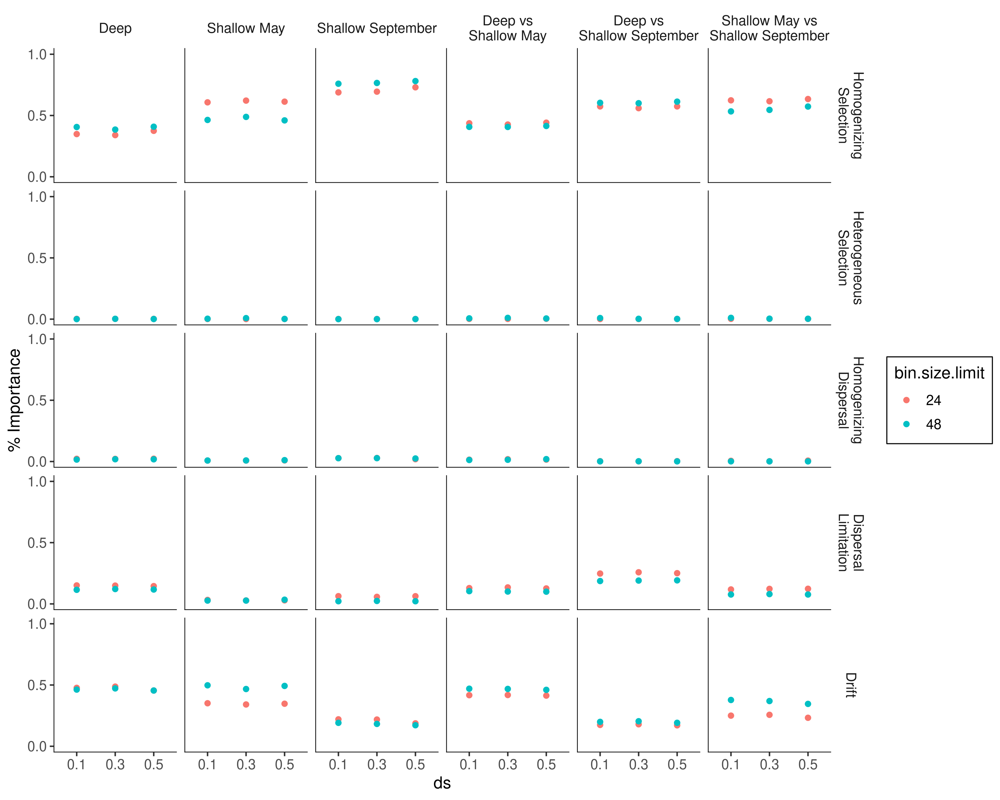

# Full-official one


```r
icamp_results_official <- icamp.big(comm = asv_mat_env,
                           tree = tree_env,
                           pd.desc = pd.big$pd.file, 
                           pd.spname=pd.big$tip.label,
                           pd.wd = pd.big$pd.wd,
                           rand = 1000,
                           prefix = "icamp_ds5_bsl48_",
                           ds = .5,
                           bin.size.limit = 24,
                           nworker = 20,
                           detail.save = TRUE,
                           qp.save = TRUE,
                           detail.null = TRUE,
                           output.wd = "data/12_ecological_drivers/official_output",
                           omit.option = "no",
                           taxo.metric = "bray",
                           sig.index = "Confidence",
                           conf.cut=0.975,
                           transform.method = NULL)

save(icamp_results_official, file = "data/12_ecological_drivers/official_output.RData")
```


# Calculating bin-level statistics

Now, we feed our icamp results into a function that will do several things at once, namely:

1. Summarize the dominant processes across our pools
2. Summarize which bins are most important for each sample's turnover
3. Summarize which processes are most important in each bin for each sample's turnover


```r
icamp_bin_ds5_bsl24 <- icamp.bins(icamp.detail = icamp_results_official$detail,
                        treat = pools_env,
                        clas=tax_for_icamp,
                        silent=FALSE, 
                        boot = TRUE,
                        rand.time = 1000,
                        between.group = TRUE)

icamp_bin_four_groups <- 
  icamp.bins(icamp.detail = icamp_results_official$detail,
                        treat = pools_env4,
                        clas=tax_for_icamp,
                        silent=FALSE, 
                        boot = TRUE,
                        rand.time = 1000,
                        between.group = TRUE)

save(icamp_bin_four_groups,
     file = "data/12_ecological_drivers/icamp_bin_four_groups.rda")

save(icamp_bin_ds5_bsl24,
     file = "data/12_ecological_drivers/icamp_bin_ds5_bsl24.rda")
```

## Analysis

Now let's analyze some of these results


```r
load("data/12_ecological_drivers/icamp_bin_ds5_bsl24.rda")
load("data/12_ecological_drivers/icamp_bin_four_groups.rda")
```

## Compare 3 vs. 4 Groups


```r
list(three_groups = icamp_bin_ds5_bsl24$Pt,
     four_groups = icamp_bin_four_groups$Pt) %>%
  bind_rows(.id = "groups") %>%
  filter(Group %in% c("Deep", "Deep (May)", "Deep (September)")) %>%
  pivot_longer(HeS:DR) %>%
  ggplot(aes(x = Group, y = as.numeric(value))) + 
  geom_col() + 
  facet_wrap(~name)
```

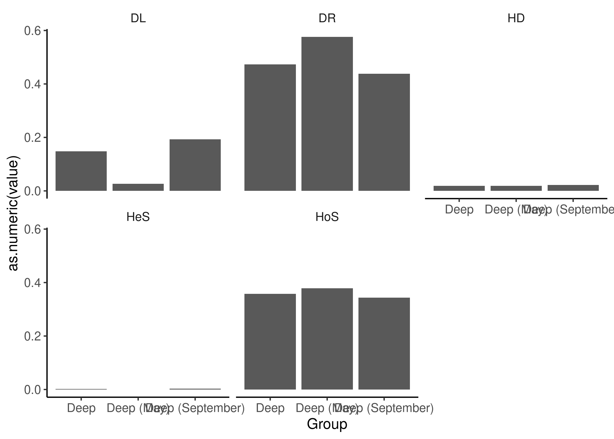

```r
list(three_groups = icamp_bin_ds5_bsl24$Pt,
     four_groups = icamp_bin_four_groups$Pt) %>%
  bind_rows(.id = "groups") %>%
  filter(Group %in% c("Deep_vs_Shallow_May", "Deep (May)_vs_Shallow_May", "Deep (September)_vs_Shallow_September", "Deep_vs_Shallow_September")) %>%
  pivot_longer(HeS:DR) %>%
  ggplot(aes(y = Group, x = as.numeric(value))) + 
  geom_col() + 
  facet_grid(~name) + 
  coord_cartesian(xlim = c(0,1))
```

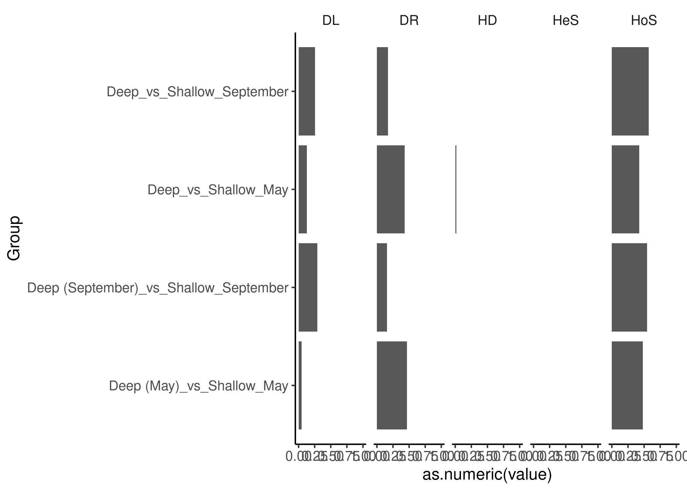

Okay, these results have convinced me. There is enough difference between the Deep (May) results and the Deep (September) results for me to want to show them separately. It doesn't really change the comparisons between the Deep and Shallow, but I understand the reviewer's comments. I'm going to remake the tree diagram to have one more major row (bummer, but I think it's good work to do!). Homogenizing dispersal and HeS are still not relevant so I won't worry about them.

## Figure 3A/B

In this figure, we make treemap plots for the relative contribution of each class to each process within each group. We also scale the area of each process by its relative importance. There isn't a very good way to do this in R. So what I've done is exported each of the mini treemaps as its own separate plot into a folder call tree_panels, and then scaled and arranged them in Illustrator to produce Figure 3A.


```r
icamp_bin <- icamp_bin_four_groups

bptk <- icamp_bin$BPtk

bin_classes <- icamp_bin$Bin.TopClass %>% 
  dplyr::select(Bin, Class.maxNamed) %>%
  mutate(Bin = tolower(Bin))


labeled_bptk <- bptk %>%
  pivot_longer(bin1:bin130, names_to = "Bin", values_to = "Contribution") %>%
  left_join(bin_classes) %>%
  dplyr::rename(Class = Class.maxNamed)
  
important_class <- labeled_bptk %>%
  group_by(Class) %>%
  summarize(max_cont = max(Contribution)) %>%
  filter(max_cont > 0.01) %>%
  pull(Class)
```

Here, we export panels for across-group comparisons, which together create Figure 3B


```r
tree_plots <- labeled_bptk %>%
  mutate(Class = ifelse(Class %in% important_class, Class, "Rare")) %>%
  filter((Group %in% c("Deep (May)_vs_Shallow_May", "Deep (September)_vs_Shallow_September", "Shallow_May_vs_Shallow_September", "Deep (May)_vs_Deep (September)")),
         Process %in% c("HoS","DR","DL")) %>%
  group_by(Group, Process, Class) %>%
  summarize(Contribution = sum(Contribution)) %>%
  mutate(Process = case_match(Process,
                              "DL" ~ "Dispersal Limitation",
                              "HoS" ~ "Homogenizing Selection",
                              "DR" ~ "Drift")) %>%
  ungroup() %>%
  nest_by(Process, Group) %>%
  mutate(plots = 
           list(ggplot(data = data, aes(area = Contribution, fill = Class)) + 
  treemapify::geom_treemap(start = "topleft") + 
  scale_fill_manual(values = class_colors, guide = "none") +
    theme_void()
           )
  )

# These are the panels which go into Figure 3B
for(i in 1:nrow(tree_plots)){
  ggsave(tree_plots$plots[[i]], 
         filename = paste("figures/12_Ecological_Drivers/tree_panels/",
                          paste(tree_plots$Process[i], tree_plots$Group[i], sep = "_"),
         ".png"),
         width = 1, height = 1, units = "in", create.dir = TRUE)
}

# Finding average heights

labeled_bptk %>%
  mutate(Class = ifelse(Class %in% important_class, Class, "Rare")) %>%
  filter((Group %in% c("Deep (May)_vs_Shallow_May", "Deep (September)_vs_Shallow_September", "Shallow_May_vs_Shallow_September", "Deep (May)_vs_Deep (September)")),
         Process %in% c("HoS","DR","DL")) %>%
  group_by(Group, Process) %>%
  summarize(Contribution = sum(Contribution)) %>%
  mutate(Process = case_match(Process,
                              "DL" ~ "Dispersal Limitation",
                              "HoS" ~ "Homogenizing Selection",
                              "DR" ~ "Drift")) %>%
   ungroup() %>%
   mutate(Ratio = Contribution / max(Contribution),
          Side_Adjustment = sqrt(Ratio))
```

```
## # A tibble: 12 × 5
##    Group                                 Process                Contribution  Ratio Side_Adjustment
##    <chr>                                 <chr>                         <dbl>  <dbl>           <dbl>
##  1 Deep (May)_vs_Deep (September)        Dispersal Limitation         0.121  0.188            0.434
##  2 Deep (May)_vs_Deep (September)        Drift                        0.492  0.767            0.876
##  3 Deep (May)_vs_Deep (September)        Homogenizing Selection       0.369  0.576            0.759
##  4 Deep (May)_vs_Shallow_May             Dispersal Limitation         0.0458 0.0714           0.267
##  5 Deep (May)_vs_Shallow_May             Drift                        0.468  0.731            0.855
##  6 Deep (May)_vs_Shallow_May             Homogenizing Selection       0.481  0.751            0.866
##  7 Deep (September)_vs_Shallow_September Dispersal Limitation         0.291  0.454            0.674
##  8 Deep (September)_vs_Shallow_September Drift                        0.157  0.245            0.495
##  9 Deep (September)_vs_Shallow_September Homogenizing Selection       0.548  0.855            0.925
## 10 Shallow_May_vs_Shallow_September      Dispersal Limitation         0.115  0.179            0.423
## 11 Shallow_May_vs_Shallow_September      Drift                        0.240  0.375            0.612
## 12 Shallow_May_vs_Shallow_September      Homogenizing Selection       0.641  1                1
```

Here, we export panels for within-group turnovers, which together create Figure 3A


```r
tree_plots <- labeled_bptk %>%
  mutate(Class = ifelse(Class %in% important_class, Class, "Rare")) %>%
  filter((Group %in% c("Deep (May)", "Deep (September)", "Shallow_September","Shallow_May")),
         Process %in% c("HoS","DR","DL")) %>%
  group_by(Group, Process, Class) %>%
  summarize(Contribution = sum(Contribution)) %>%
  mutate(Process = case_match(Process,
                              "DL" ~ "Dispersal Limitation",
                              "HoS" ~ "Homogenizing Selection",
                              "DR" ~ "Drift")) %>%
  ungroup() %>%
  nest_by(Process, Group) %>%
  mutate(plots = 
           list(ggplot(data = data, aes(area = Contribution, fill = Class)) + 
  treemapify::geom_treemap(start = "topleft") + 
  scale_fill_manual(values = class_colors, guide = "none") +
    theme_void()
           )
  )

for(i in 1:nrow(tree_plots)){
  ggsave(tree_plots$plots[[i]], 
         filename = paste("figures/12_Ecological_Drivers/tree_panels_within_group/",
                          paste(tree_plots$Process[i], tree_plots$Group[i], sep = "_"),
         ".png"),
         width = 1, height = 1, units = "in", create.dir = TRUE)
}

# Finding average heights

labeled_bptk %>%
  mutate(Class = ifelse(Class %in% important_class, Class, "Rare")) %>%
  filter((Group %in% c("Deep (May)", "Deep (September)", "Shallow_September","Shallow_May")),
         Process %in% c("HoS","DR","DL")) %>%
  group_by(Group, Process) %>%
  summarize(Contribution = sum(Contribution)) %>%
  mutate(Process = case_match(Process,
                              "DL" ~ "Dispersal Limitation",
                              "HoS" ~ "Homogenizing Selection",
                              "DR" ~ "Drift")) %>%
   ungroup() %>%
   mutate(Ratio = Contribution / max(Contribution),
          Side_Adjustment = sqrt(Ratio)) 
```

```
## # A tibble: 12 × 5
##    Group             Process                Contribution  Ratio Side_Adjustment
##    <chr>             <chr>                         <dbl>  <dbl>           <dbl>
##  1 Deep (May)        Dispersal Limitation         0.0264 0.0384           0.196
##  2 Deep (May)        Drift                        0.576  0.840            0.917
##  3 Deep (May)        Homogenizing Selection       0.377  0.550            0.741
##  4 Deep (September)  Dispersal Limitation         0.191  0.279            0.528
##  5 Deep (September)  Drift                        0.438  0.639            0.799
##  6 Deep (September)  Homogenizing Selection       0.342  0.498            0.706
##  7 Shallow_May       Dispersal Limitation         0.0328 0.0478           0.219
##  8 Shallow_May       Drift                        0.367  0.534            0.731
##  9 Shallow_May       Homogenizing Selection       0.592  0.864            0.929
## 10 Shallow_September Dispersal Limitation         0.0641 0.0934           0.306
## 11 Shallow_September Drift                        0.223  0.326            0.571
## 12 Shallow_September Homogenizing Selection       0.686  1                1
```

## Figure 3B: Relating bin abundance/variation to assembly process

In this section, I look at the overall abundance of each bin, and its coefficient of variation, and relate that to the dominant process which influences assembly within that bin. 


```r
Ptk <- icamp_bin$Ptk 

dps <- Ptk %>% 
  filter(Index == "DominantProcess") %>%
  pivot_longer(bin1:bin130, names_to = "Bin", values_to = "DominantProcess") %>% 
  select(Group : DominantProcess) %>%
  group_by(Bin) %>%
  count(DominantProcess)  %>% 
  ungroup()

bin_dom_procsses <- dps %>%
  group_by(Bin) %>%
  slice_max(n = 1, order_by = n) %>%
  mutate(Vals = n()) %>%
  ungroup()
  
bins_w_one_dom <- bin_dom_procsses %>%
  filter(Vals == 1) %>% 
  select(Bin, DominantProcess)

all_bin_process <- bin_dom_procsses %>%
  filter(Vals != 1) %>% 
  pivot_wider(names_from = DominantProcess, values_from = DominantProcess) %>%
  unite(DR:DL, col = "DominantProcess", sep = "/", na.rm = TRUE) %>%
  select(Bin, DominantProcess) %>%
  rbind(bins_w_one_dom)
```

Now, let's calculate the average and maximum total abundance of each bin


```r
bin_assignments <- icamp_bin$Class.Bin %>%
  select(Bin) %>%
  rownames_to_column("ASV") %>%
  mutate(Bin = tolower(Bin))

melted_asv <- full_abs_physeq %>%
  psmelt() %>%
  select(ASV, Abundance, Rep_ID)

bin_sample_abunds <- melted_asv %>%
  left_join(bin_assignments) %>% 
  filter(!is.na(Bin)) %>%
  group_by(Bin, Rep_ID) %>%
  summarize(bin_sample_abund = sum(Abundance)) %>%
  ungroup()

bin_summarized_abunds <- bin_sample_abunds %>%
  group_by(Bin) %>%
  summarize(max_abund = max(bin_sample_abund),
            mean_abund = mean(bin_sample_abund),
            median_abund = median(bin_sample_abund),
            variance = sd(bin_sample_abund) / mean_abund)
```


```r
bin_summarized_abunds %>%
  left_join(all_bin_process) %>%
  filter(DominantProcess %in% c("DL", "DR/DL","DR","HoS")) %>%
  ggplot(aes(x = variance, y = max_abund, color = DominantProcess, fill = DominantProcess)) + 
  geom_point(size = 1.5, alpha = 0.7) + 
  geom_ysidedensity(alpha = 0.2, show.legend = FALSE) + 
  scale_x_continuous(transform = "log10", labels = scales::label_comma()) +
  scale_y_continuous(transform = "log10", labels = scales::label_comma()) +
  guides(x = guide_axis(check.overlap = TRUE)) + 
  scale_color_manual(values = process_colors,
                     breaks = c("HoS","DR","DR/DL","DL"),
                     labels = c("Homogenizing\nSelection",
                                "Drift",
                                "Dispersal Limitation/\nDrift",
                                "Dispersal Limitation")) + 
  scale_fill_manual(values = process_colors,
                    breaks = c("HoS","DR","DR/DL","DL"),
                     labels = c("Homogenizing\nSelection",
                                "Drift",
                                "Dispersal Limitation/\nDrift",
                                "Dispersal Limitation")) + 
  labs(x = "Coefficient of Variation",
       y = "Max Abundance",
       fill = "Dominant Process",
       color = "Dominant Process") + 
  theme(legend.position = "inside",
        legend.position.inside = c(0.6, 0.85),
        ggside.panel.scale = 0.2) + 
  scale_ysidex_continuous(labels = NULL) + 
  theme(axis.title = element_text(size = 9),
        axis.text = element_text(size = 8),
        strip.text = element_text(size = 8),
        legend.text= element_text(size = 7,
                                  margin = margin(0)),
        legend.title = element_text(size = 9),
        legend.key.size = unit(.5, "cm"),
        legend.box.background = element_blank())
```

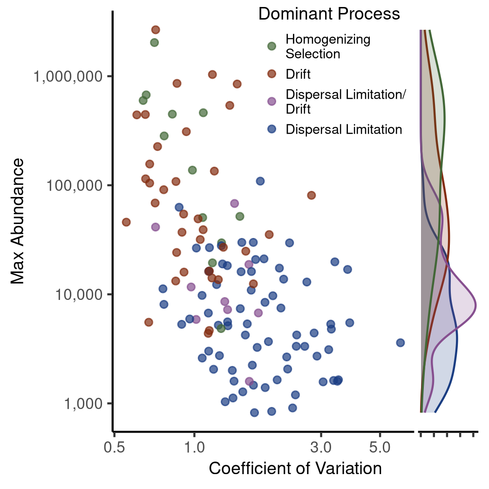

```r
filt_bin <- bin_summarized_abunds %>%
  left_join(all_bin_process) %>%
  filter(DominantProcess %in% c("DL", "DR/DL","DR","HoS"))

cor.test(filt_bin$max_abund,
       filt_bin$variance,
       method = "spearman")
```

```
## 
## 	Spearman's rank correlation rho
## 
## data:  filt_bin$max_abund and filt_bin$variance
## S = 572792, p-value < 2.2e-16
## alternative hypothesis: true rho is not equal to 0
## sample estimates:
##        rho 
## -0.5643857
```

## Looking at upwelling turnovers specifically


```r
icamp_bin$Ptuv %>%
  left_join(pool_groups_env, by = c("samp1" = "Rep_ID")) %>%
    left_join(pool_groups_env, by = c("samp2" = "Rep_ID")) %>%
    rowwise() %>%
    ungroup() %>%
  filter(samp1 == "September_38_E"|samp2=="September_38_E",
         Comp_Group_Hier.x %in% c("Deep","Shallow_September")) %>%
  select(HeS:DR, Comp_Group_Hier.x) %>%
  pivot_longer(HeS:DR, names_to = "Process", values_to = "Percent") %>%
  ggplot(aes(x = Process, y = Percent)) + 
  geom_boxplot() + 
  geom_jitter() + 
  facet_wrap(~Comp_Group_Hier.x)
```

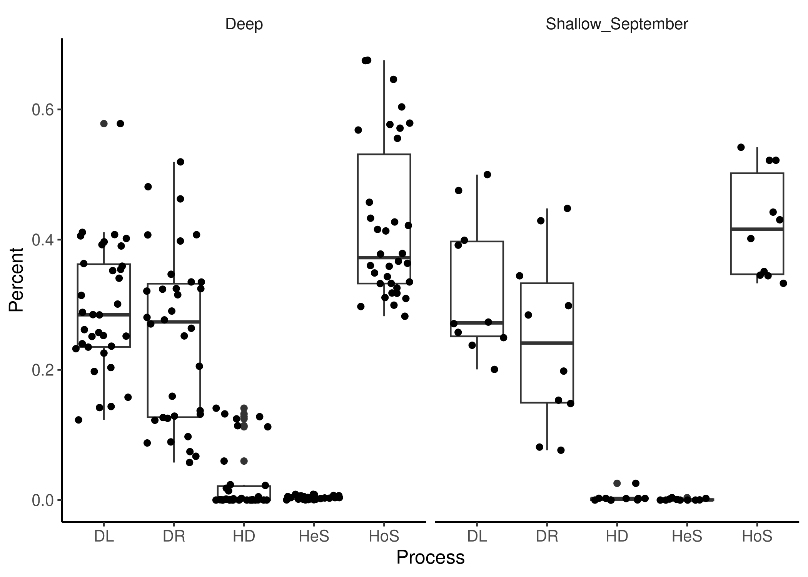

```r
icamp_bin$Ptuv %>%
  left_join(pool_groups_env, by = c("samp1" = "Rep_ID")) %>%
    left_join(pool_groups_env, by = c("samp2" = "Rep_ID")) %>%
    rowwise() %>%
    ungroup() %>%
  filter(samp1 == "September_38_E"|samp2=="September_38_E",
         Comp_Group_Hier.x %in% c("Deep","Shallow_September")) %>%
  arrange(desc(HD))
```

```
## # A tibble: 44 × 10
##    Method       samp1          samp2                HeS   HoS    DL     HD    DR Comp_Group_Hier.x Comp_Group_Hier.y
##    <chr>        <chr>          <chr>              <dbl> <dbl> <dbl>  <dbl> <dbl> <chr>             <chr>            
##  1 CbMPDiCbraya May_55_B       September_38_E  0.00314  0.318 0.406 0.141  0.132 Deep              Deep             
##  2 CbMPDiCbraya September_38_E September_717_B 0.00405  0.335 0.402 0.132  0.127 Deep              Deep             
##  3 CbMPDiCbraya September_12_M September_38_E  0.00889  0.413 0.198 0.128  0.252 Deep              Deep             
##  4 CbMPDiCbraya September_38_E September_64_M  0.00854  0.349 0.392 0.125  0.126 Deep              Deep             
##  5 CbMPDiCbraya September_38_E September_55_M  0.00878  0.343 0.411 0.114  0.123 Deep              Deep             
##  6 CbMPDiCbraya September_38_E September_717_M 0.00406  0.367 0.253 0.113  0.264 Deep              Deep             
##  7 CbMPDiCbraya May_41_B       September_38_E  0.00293  0.333 0.123 0.0599 0.481 Deep              Deep             
##  8 CbMPDiCbraya September_12_E September_38_E  0.000912 0.345 0.475 0.0258 0.153 Shallow_September Deep             
##  9 CbMPDiCbraya September_38_E September_66_E  0.00368  0.422 0.144 0.0236 0.407 Deep              Shallow_September
## 10 CbMPDiCbraya September_33_B September_38_E  0.00701  0.326 0.354 0.0225 0.290 Deep              Deep             
## # ℹ 34 more rows
```

# Looking at four-group comparisons


```r
icamp_bin_four_groups$Pt %>%
  filter(Group == "Deep (May)_vs_Shallow_May"|Group == "Deep (September)_vs_Shallow_September") %>%
  pivot_longer(HeS:DR) %>%
  ggplot(aes(y=Group, x = as.numeric(value))) + 
  geom_col() + 
  facet_wrap(~name)
```

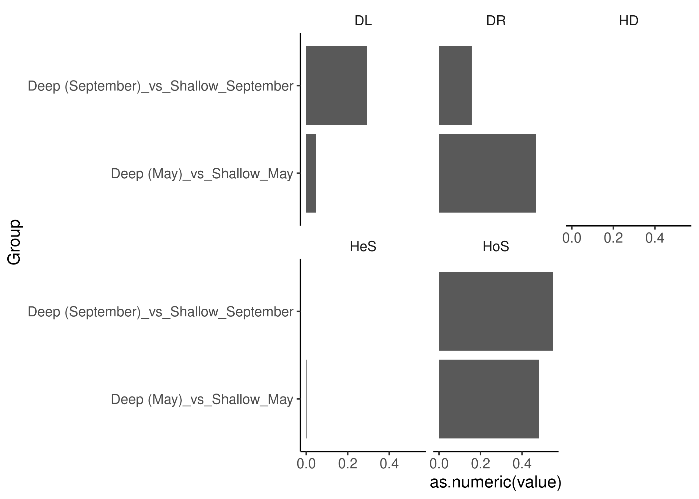
# Calculating Base Metrics

iCAMP relies on measures of phylogenetic relatedness (here, bMPD) and taxonomic similarity (here, Raup-Crick based on Bray-Curtis). These metrics, and their interpretation, are well established in the literature. iCAMP's addition is the phylogenetic binning and subsequent averaging. But it seems useful to also test these metrics more simply, without the added steps of phylogenetic binning. 


```r
plain_pd <- iCAMP::pdist.p(tree = tree_env, 
                        nworker = 30,
                        memory.G = 200)

save(plain_pd, file = "data/12_ecological_drivers/plain_pd.RData", compress = TRUE)
```

Calculate bNTI and bNRI


```r
bnri_conf <- 
  bNRIn.p(comm = rel_mat,
        dis = plain_pd, 
        nworker = 30,
        memo.size.GB = 200,
        weighted = TRUE,
        rand = 1000, 
        output.bMPD = TRUE,
        sig.index = "Confidence"
        )

bnri_bnri <- 
  bNRIn.p(comm = rel_mat,
        dis = plain_pd, 
        nworker = 30,
        memo.size.GB = 200,
        weighted = TRUE,
        rand = 1000, 
        output.bMPD = TRUE,
        sig.index = "bNRI"
        )

bnti_bnti <- 
  bNTIn.p(comm = rel_mat,
        dis = plain_pd, 
        nworker = 30,
        memo.size.GB = 200,
        weighted = TRUE,
        rand = 1000, 
        output.bMNTD = TRUE,
        sig.index = "bNTI")

bnti_conf <- 
  bNTIn.p(comm = rel_mat,
        dis = plain_pd, 
        nworker = 30,
        memo.size.GB = 200,
        weighted = TRUE,
        rand = 1000, 
        output.bMNTD = TRUE,
        sig.index = "Confidence")
```

Okay, now looking at taxonomic similarities


```r
rc_conf <- 
  RC.pc(comm = rel_mat,
      rand = 1000, 
      na.zero = TRUE, 
      nworker = 30,
      memory.G = 200,
      weighted = TRUE,
      unit.sum = NULL,
      sig.index = "Confidence",
      taxo.metric = "bray"
)

rc_rc <- 
  RC.pc(comm = rel_mat,
      rand = 1000, 
      na.zero = TRUE, 
      nworker = 30,
      memory.G = 200,
      weighted = TRUE,
      unit.sum = NULL,
      sig.index = "RC",
      taxo.metric = "bray"
)


measures <- list(bNRI_ses = bnri_bnri,
                 bNRI_conf = bnri_conf,
                 bNTI_ses = bnti_bnti,
                 bNTI_conf = bnti_conf,
                 rc_ses = rc_rc,
                 rc_conf = rc_conf)

save(measures, file = "data/12_ecological_drivers/measures.RData")
```

Cleaning and comparing our measures


```r
load("data/12_ecological_drivers/measures.RData")

clean_dfs <- 
  map2(measures, names(measures), \(x, y) {
  mat <- x$index %>%
    as.matrix()
  
  mat[upper.tri(mat, diag = TRUE)] <- NA
  
  clean_df <-
    mat %>%
    as.data.frame() %>%
    mutate(Sam1 = row.names(.)) %>%
    pivot_longer(cols = !Sam1,
                 names_to = "Sam2",
                 values_to = y) %>%
    filter(!is.na(!!as.symbol(y))) %>%
    left_join(pool_groups_env, by = c("Sam1" = "Rep_ID")) %>%
    left_join(pool_groups_env, by = c("Sam2" = "Rep_ID")) %>%
    rowwise() %>%
    mutate(Comparison = paste(sort(
      c(Comp_Group_Hier.x, Comp_Group_Hier.y)
    ), collapse = ":\n")) %>%
    ungroup() %>%
    select(-Comp_Group_Hier.x, -Comp_Group_Hier.y)
})

single_df <- 
  reduce(clean_dfs, left_join, by = c("Sam1", "Sam2","Comparison"))

single_df %>%
  select(where(is.numeric)) %>%
  cor()
```

```
##              bNRI_ses    bNRI_conf     bNTI_ses  bNTI_conf    rc_ses    rc_conf
## bNRI_ses   1.00000000  0.830339428 -0.032051473 -0.1816686 0.1931284 0.18581247
## bNRI_conf  0.83033943  1.000000000  0.001131055 -0.1264407 0.1120989 0.09942743
## bNTI_ses  -0.03205147  0.001131055  1.000000000  0.7488793 0.2701077 0.26686592
## bNTI_conf -0.18166856 -0.126440749  0.748879294  1.0000000 0.1243886 0.12055752
## rc_ses     0.19312840  0.112098943  0.270107736  0.1243886 1.0000000 0.91855853
## rc_conf    0.18581247  0.099427431  0.266865924  0.1205575 0.9185585 1.00000000
```

```r
save(single_df, file = "data/12_ecological_drivers/single_df.RData")
```

It's really important to note there that bNRI and bNTI are NOT well correlated -> this is actually fairly consistent with already discussed issues with using bNRI across broad phylogenetic groups (see Stegen 2012, 2013, and Ning 2020). Since we're not binning, it's reasonable to only think about bNTI (even though we use bNRI within iCAMP itself).


```r
data.frame(x = c(0, 1, 2, 1, 1),
           y = c(1, 1, 1, 0, 2),
           Process = c("Homogenizing\nSelection",
                       "Drift",
                       "Heterogeneous\nSelection",
                       "Homogenizing\nDispersal",
                       "Dispersal\nLimitation")) %>%
  ggplot(aes(x = x, y = y, label = Process)) + 
  annotate(geom = "rect", 
           xmin = -Inf, xmax = 0.5, ymin = -Inf, ymax = Inf,
           fill = "chartreuse4", alpha = 0.8) + 
  annotate(geom = "rect", 
           xmin = Inf, xmax = 1.5, ymin = -Inf, ymax = Inf,
           fill = "olivedrab", alpha = 0.6) + 
  annotate(geom = "rect", 
           xmin = 1.5, xmax = 0.5, ymin = 1.5, ymax = Inf,
           fill = "dodgerblue3", alpha = 0.7) + 
  annotate(geom = "rect", 
           xmin = 1.5, xmax = 0.5, ymin = -Inf, ymax = 0.5,
           fill = "dodgerblue4", alpha = 0.7) +
  geom_text() + 
  coord_fixed(xlim = c(-0.5, 2.5),
                  ylim = c(-0.5, 2.5),
              expand = FALSE) +
  scale_y_continuous(breaks = c(0.5, 1.5),
                     labels = c(-0.95, 0.95)) + 
  scale_x_continuous(breaks = c(0.5, 1.5),
                     labels = c(-2, 2)) + 
  labs(x = expression(beta*NTI), y = expression(RC[bray])) + 
  theme(axis.line = element_blank())
```

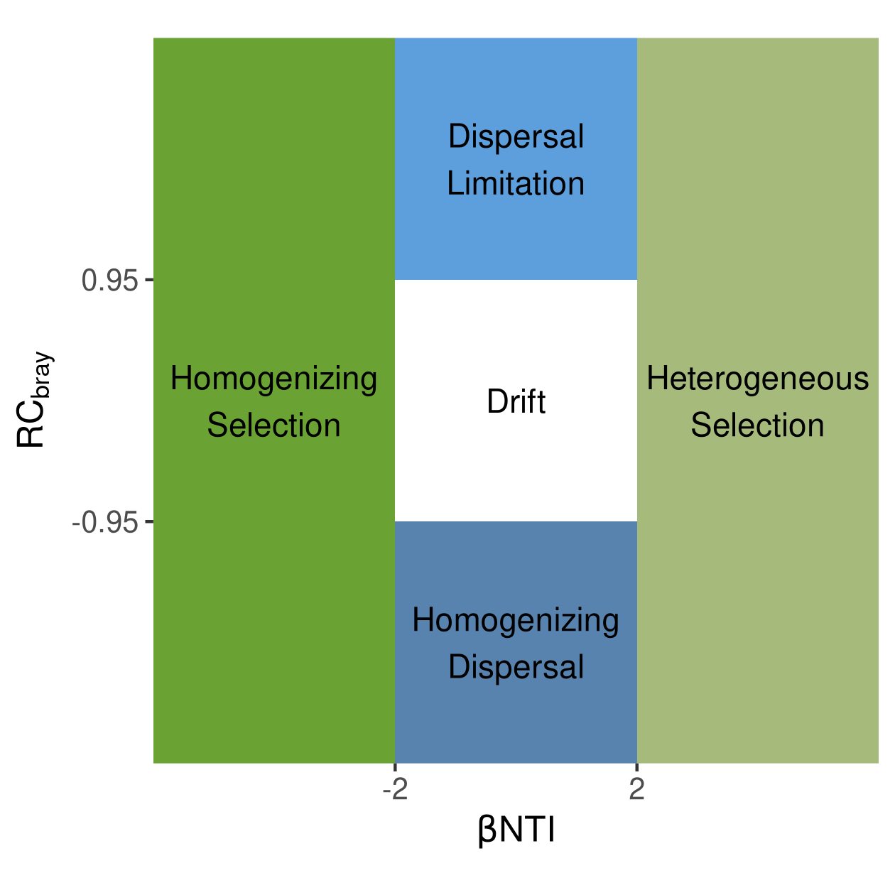


```r
single_df %>%
  mutate(Process = case_when(bNTI_ses < -2 ~ "Homogenizing Selection",
                             bNTI_ses > 2 ~ "Heterogeneous Selection",
                             rc_ses < -0.95 ~ "Homogenizing Dispersal",
                             rc_ses > 0.95 ~ "Dispersal Limitation",
                             TRUE ~ "Drift")) %>%
  count(Comparison, Process)
```

```
## # A tibble: 15 × 3
##    Comparison                              Process                     n
##    <chr>                                   <chr>                   <int>
##  1 "Deep:\nDeep"                           Homogenizing Selection    190
##  2 "Deep:\nShallow_May"                    Drift                      45
##  3 "Deep:\nShallow_May"                    Heterogeneous Selection     6
##  4 "Deep:\nShallow_May"                    Homogenizing Selection    469
##  5 "Deep:\nShallow_September"              Drift                      64
##  6 "Deep:\nShallow_September"              Heterogeneous Selection    20
##  7 "Deep:\nShallow_September"              Homogenizing Selection    416
##  8 "Shallow_May:\nShallow_May"             Drift                      17
##  9 "Shallow_May:\nShallow_May"             Homogenizing Dispersal      1
## 10 "Shallow_May:\nShallow_May"             Homogenizing Selection    307
## 11 "Shallow_May:\nShallow_September"       Drift                      76
## 12 "Shallow_May:\nShallow_September"       Heterogeneous Selection    34
## 13 "Shallow_May:\nShallow_September"       Homogenizing Selection    540
## 14 "Shallow_September:\nShallow_September" Homogenizing Dispersal      1
## 15 "Shallow_September:\nShallow_September" Homogenizing Selection    299
```

```r
single_df %>%
  mutate(Process = case_when(bNTI_ses < -2 ~ "Homogenizing Selection",
                             bNTI_ses > 2 ~ "Heterogeneous Selection",
                             rc_ses < -0.95 ~ "Homogenizing Dispersal",
                             rc_ses > 0.95 ~ "Dispersal Limitation",
                             TRUE ~ "Drift")) %>%
  count(Comparison, Process) %>%
  ungroup() %>%
  group_by(Comparison) %>%
  mutate(perc = round(n / sum(n), 3)) %>%
  mutate(x = case_when(Process == "Homogenizing Selection" ~ 0,
                       Process == "Heterogeneous Selection" ~ 2,
                       TRUE ~ 1),
         y = case_when(Process == "Dispersal Limitation" ~ 2,
                       Process == "Homogenizing Dispersal" ~ 0,
                       TRUE ~ 1),
         Comparison = factor(Comparison, 
                             levels = c("Deep:\nDeep",
                                        "Shallow_May:\nShallow_May",
                                        "Shallow_September:\nShallow_September",
                                        "Deep:\nShallow_May",
                                        "Deep:\nShallow_September",
                                        "Shallow_May:\nShallow_September"))) %>%
  ggplot(aes(x = x, y = y, label = perc)) + 
  annotate(geom = "rect", 
           xmin = -Inf, xmax = 0.5, ymin = -Inf, ymax = Inf,
           fill = "chartreuse4", alpha = 0.8) + 
  annotate(geom = "rect", 
           xmin = Inf, xmax = 1.5, ymin = -Inf, ymax = Inf,
           fill = "olivedrab", alpha = 0.6) + 
  annotate(geom = "rect", 
           xmin = 1.5, xmax = 0.5, ymin = 1.5, ymax = Inf,
           fill = "dodgerblue3", alpha = 0.7) + 
  annotate(geom = "rect", 
           xmin = 1.5, xmax = 0.5, ymin = -Inf, ymax = 0.5,
           fill = "dodgerblue4", alpha = 0.7) +
  geom_text() + 
  facet_wrap(~Comparison) + 
  coord_fixed(xlim = c(-0.5, 2.5),
                  ylim = c(-0.5, 2.5)) +
  labs(x = expression(beta*NTI), y = expression(RC[bray])) + 
  theme(axis.text = element_blank(),
        axis.ticks = element_blank(),
        axis.line = element_blank())
```

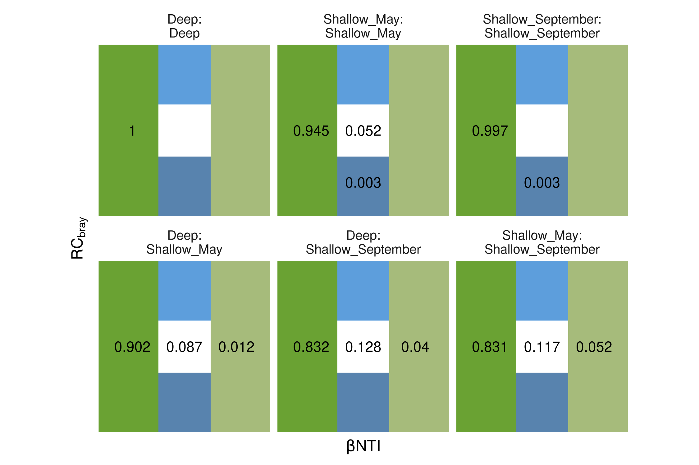


```r
single_df %>%
  mutate(Process = case_when(bNTI_conf < -0.95 ~ "Homogenizing Selection",
                             bNTI_conf > 0.95 ~ "Heterogeneous Selection",
                             rc_conf < -0.95 ~ "Homogenizing Dispersal",
                             rc_conf > 0.95 ~ "Dispersal Limitation",
                             TRUE ~ "Drift")) %>%
  count(Comparison, Process)
```

```
## # A tibble: 17 × 3
##    Comparison                              Process                     n
##    <chr>                                   <chr>                   <int>
##  1 "Deep:\nDeep"                           Homogenizing Selection    190
##  2 "Deep:\nShallow_May"                    Drift                      23
##  3 "Deep:\nShallow_May"                    Heterogeneous Selection     7
##  4 "Deep:\nShallow_May"                    Homogenizing Dispersal      2
##  5 "Deep:\nShallow_May"                    Homogenizing Selection    488
##  6 "Deep:\nShallow_September"              Drift                      38
##  7 "Deep:\nShallow_September"              Heterogeneous Selection    26
##  8 "Deep:\nShallow_September"              Homogenizing Dispersal      1
##  9 "Deep:\nShallow_September"              Homogenizing Selection    435
## 10 "Shallow_May:\nShallow_May"             Drift                       3
## 11 "Shallow_May:\nShallow_May"             Homogenizing Dispersal      9
## 12 "Shallow_May:\nShallow_May"             Homogenizing Selection    313
## 13 "Shallow_May:\nShallow_September"       Drift                      53
## 14 "Shallow_May:\nShallow_September"       Heterogeneous Selection    39
## 15 "Shallow_May:\nShallow_September"       Homogenizing Dispersal      3
## 16 "Shallow_May:\nShallow_September"       Homogenizing Selection    555
## 17 "Shallow_September:\nShallow_September" Homogenizing Selection    300
```

```r
single_df %>%
  mutate(Process = case_when(bNTI_conf < -0.95 ~ "Homogenizing Selection",
                             bNTI_conf > 0.95 ~ "Heterogeneous Selection",
                             rc_conf < -0.95 ~ "Homogenizing Dispersal",
                             rc_conf > 0.95 ~ "Dispersal Limitation",
                             TRUE ~ "Drift")) %>%
  count(Comparison, Process) %>%
  ungroup() %>%
  group_by(Comparison) %>%
  mutate(perc = round(n / sum(n), 3)) %>%
  mutate(x = case_when(Process == "Homogenizing Selection" ~ 0,
                       Process == "Heterogeneous Selection" ~ 2,
                       TRUE ~ 1),
         y = case_when(Process == "Dispersal Limitation" ~ 2,
                       Process == "Homogenizing Dispersal" ~ 0,
                       TRUE ~ 1)) %>%
  ggplot(aes(x = x, y = y, label = perc)) + 
  annotate(geom = "rect", 
           xmin = -Inf, xmax = 0.5, ymin = -Inf, ymax = Inf,
           fill = "chartreuse4", alpha = 0.8) + 
  annotate(geom = "rect", 
           xmin = Inf, xmax = 1.5, ymin = -Inf, ymax = Inf,
           fill = "olivedrab", alpha = 0.6) + 
  annotate(geom = "rect", 
           xmin = 1.5, xmax = 0.5, ymin = 1.5, ymax = Inf,
           fill = "dodgerblue3", alpha = 0.7) + 
  annotate(geom = "rect", 
           xmin = 1.5, xmax = 0.5, ymin = -Inf, ymax = 0.5,
           fill = "dodgerblue4", alpha = 0.7) +
  geom_text() + 
  facet_wrap(~Comparison) + 
  coord_fixed(xlim = c(-0.5, 2.5),
                  ylim = c(-0.5, 2.5)) +
  labs(x = expression(beta*NTI), y = expression(RC[bray])) + 
  theme(axis.text = element_blank(),
        axis.ticks = element_blank(),
        axis.line = element_blank())
```

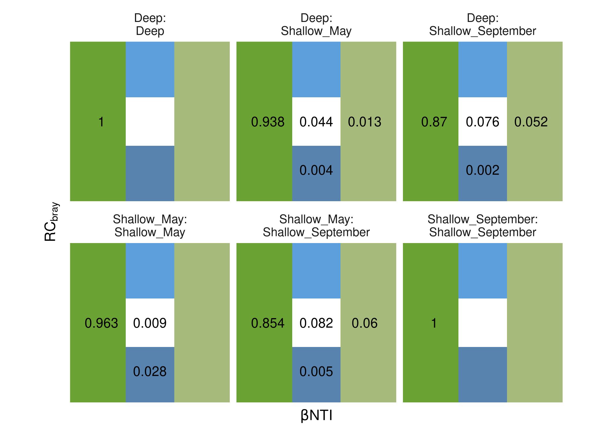

# Supplement Figure looking at upwelling environment

Pls don't ask why this figure is made in this place specifically - it's just the document I had open when I was finishing up reviews.


```r
full_abs_physeq %>%
  sample_data %>%
  data.frame() %>% 
  filter(Comp_Group_Hier_Colors %in% c("Deep (September)", "Shallow_September")) %>%
  mutate(Comp_Group_Hier_Colors = ifelse(
    Rep_ID %in% c(
      "September_38_E",
      "September_35_E",
      "September_38_B",
      "September_35_M",
      "September_35_B"
    ),
    "Sept. Upwelling",
    Comp_Group_Hier_Colors
  )) %>%
  select(
    Comp_Group_Hier_Colors,
    NH4:chl_a,
    temperature,
    fluorescence,
    conductivity,
    salinity,
    good_oxygen,
    beamTransmission
  ) %>% 
  pivot_longer(NH4:beamTransmission, names_to = "Variable", values_to = "Value") %>%
  mutate(
    Comp_Group_Hier_Colors = factor(Comp_Group_Hier_Colors, 
                                    levels = c("Deep (September)","Sept. Upwelling", "Shallow_September"),
                                    labels = c("Deep (September)", "Sept. Upwelling", "Shallow September")),
    Variable = factor(
    Variable,
    levels = c(
      "Na",
      "K",
      "Ca",
      "Mg",
      "Si",
      "SO4",
      "Cl",
      "DOC",
      "conductivity",
      "salinity",
      "TN",
      "NOx",
      "NH4",
      "TP",
      "SRP",
      "temperature",
      "good_oxygen",
      "beamTransmission",
      "chl_a",
      "fluorescence"
    ),
    labels = c(
      "Na (mg/L)",
      "K (mg/L)",
      "Ca (mg/L)",
      "Mg (mg/L)",
      "Si (mg SiO2/L)",
      "SO4 (mg/L)",
      "Cl (mg/L)",
      "DOC (mg C/L)",
      "Conductivity (µS/cm)",
      "Salinity (psu)",
      "Total Nitrogen (µg N/L)",
      "NOx (µg N/L)",
      "NH4 (µg N/L)",
      "Total Phosphorus (µg P/L)",
      "SRP (µg P/L)",
      "Temperature (°C)",
      "Oxygen (mg/L)",
      "Beam Transmission (%)",
      "Chlorophyll-a (µg/L)",
      "Fluorescence (rfu)"
    )
  )) %>%
  ggplot(aes(x = Comp_Group_Hier_Colors, y = Value)) +
  facet_wrap(~ Variable, scales = "free_y") +
  ggbeeswarm::geom_beeswarm(alpha = 0.5, cex = 2) +
  stat_summary(
    geom = "point",
    size = 5,
    alpha = 1,
    fun = mean,
    pch = 3
  ) +
  stat_summary(
    geom = "errorbar",
    width = 0,
    fun.min = \(x)mean(x) - sd(x),
    fun.max = \(x)mean(x) + sd(x)
  ) +
  labs(x = "", y = "Measure (units in header)") + 
  theme(axis.text.x = element_text(angle = 45, hjust = 1, vjust = 1))
```

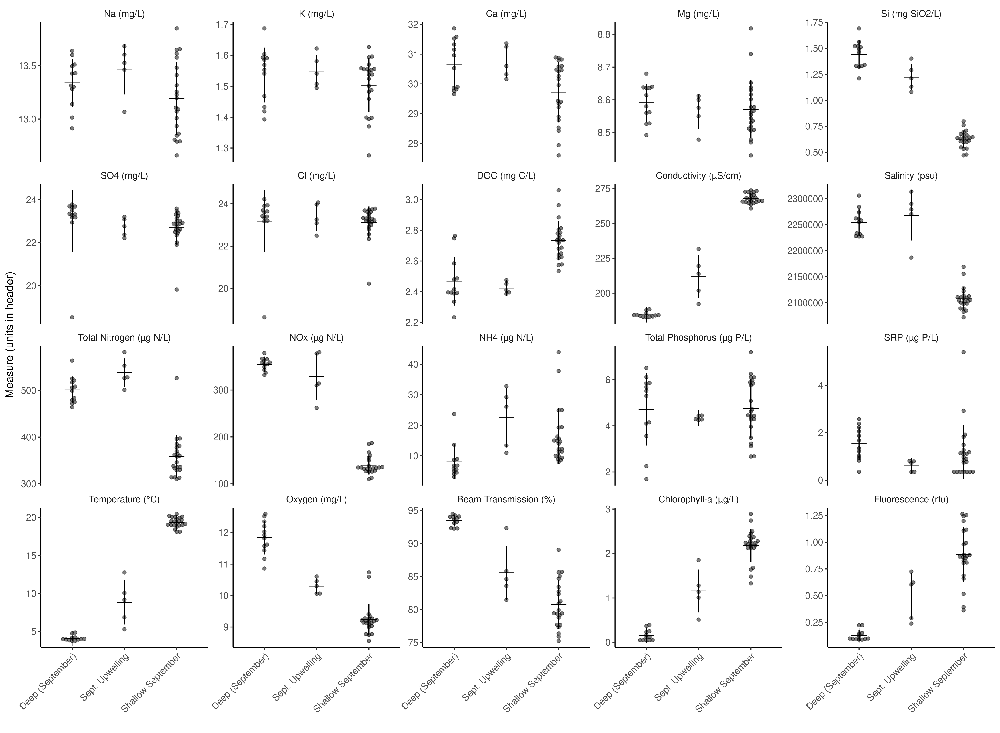
