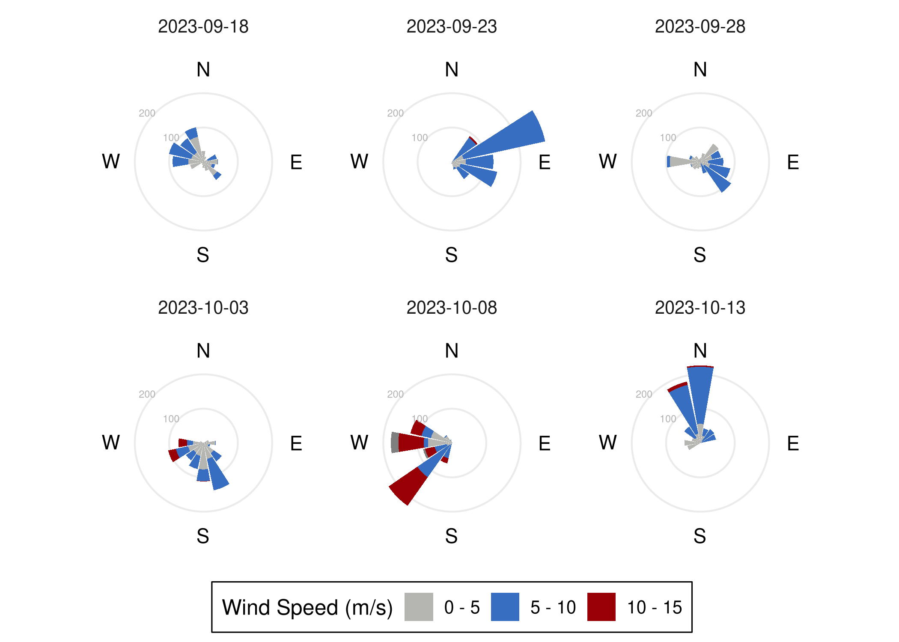
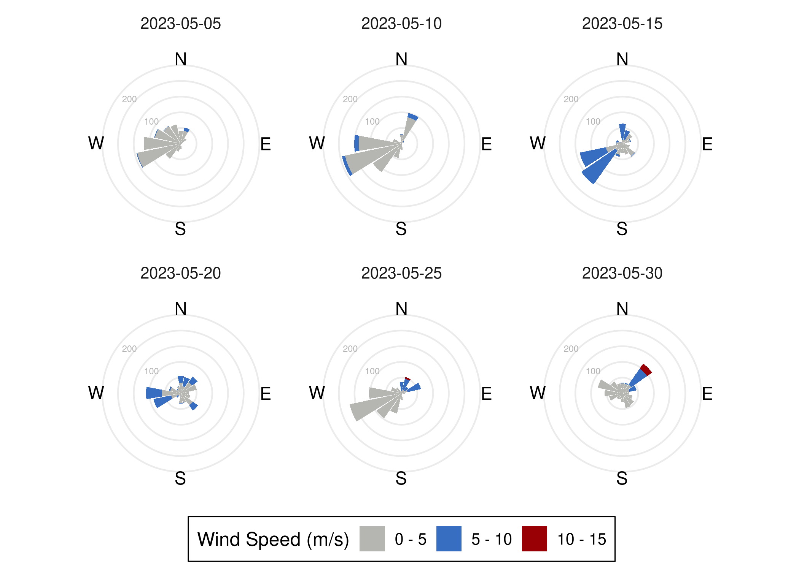
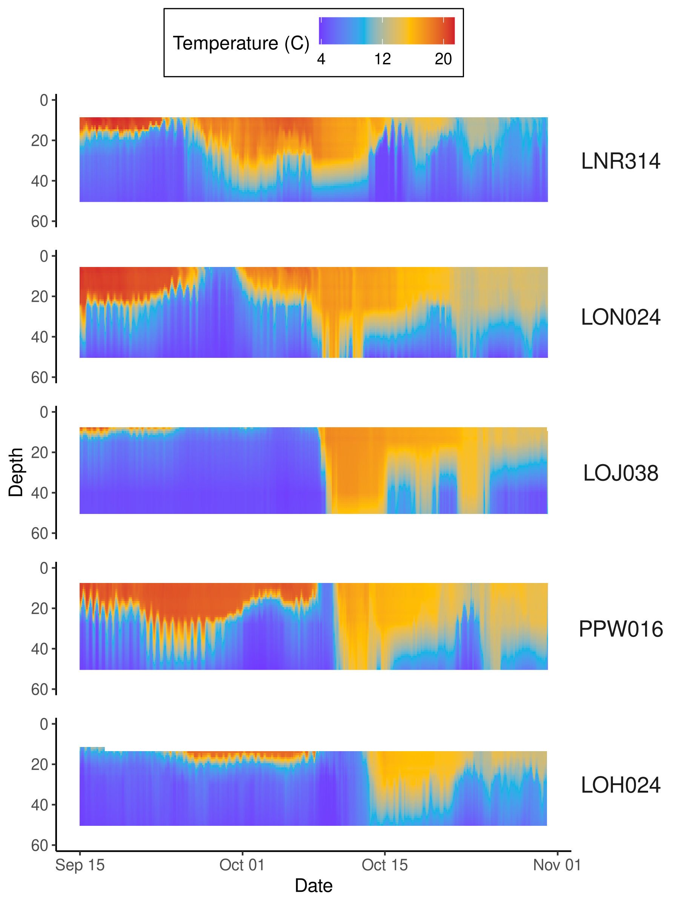
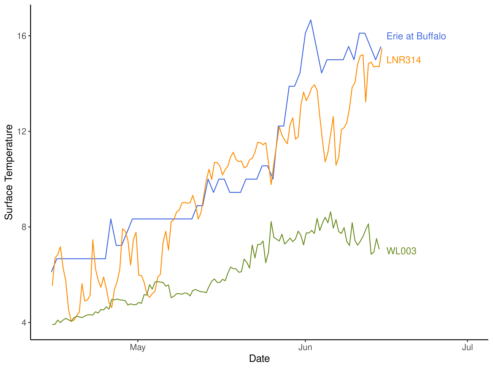

<style>
pre code, pre, code {
  white-space: pre !important;
  overflow-x: scroll !important;
  word-break: keep-all !important;
  word-wrap: initial !important;
}
</style>


# Goals of this Document

Here, I work to integrate meteorological and hydrological (hopefully) data which helps us understand how circulation impacted bacterial community composition.

# Load packages 

```r
# Efficiently load packages 

pacman::p_load(tidyverse, lubridate, install = FALSE)

knitr::write_bib(file = "data/13_hydrodynamics/packages.bib")

# load in functions and color preferences
source("code/R/plotting_aesthetics.R")
```

# Wind Rosettes (Figures S2B and S2D)

I downloaded meteorological data from [NOAA Buoy 45012, here](https://www.ndbc.noaa.gov/station_history.php?station=45012). 


```r
buoy_names <- read_delim("data/13_hydrodynamics/buoy_45012_meteorological_data.txt") %>%
  colnames()

clean_buoy_names <- buoy_names[!str_detect(buoy_names, "\\.\\.\\.")] %>%
  str_remove("\\#")

buoy_data <- read_fwf("data/13_hydrodynamics/buoy_45012_meteorological_data.txt", skip = 2)

colnames(buoy_data) <- clean_buoy_names
```


```r
may_long_int <- interval(ymd("2023-05-05"), ymd("2023-06-03"))
sept_long_int <- interval(ymd("2023-09-18"), ymd("2023-10-17"))

buoy_data %>%
  mutate(Date = ymd(paste(YY, MM, DD)),
         Sample_Month = case_when(Date %within% may_long_int ~ "May",
                                  Date %within% sept_long_int ~ "September")) %>%
  filter(Sample_Month == "September",
         WSPD < 50) %>%
  mutate(Bin = cut(WSPD, breaks = c(0,5,10,15,20,25,30)),
         Time_Bin = cut(Date, breaks = '5 days')) %>%
  filter(!is.na(Bin)) %>%
  mutate(WDIR = ifelse(WDIR > 348.75, WDIR - 360, WDIR),
         Bin = fct_rev(Bin)) %>%
  ggplot(aes(x = WDIR, fill = Bin)) + 
  geom_bar() +
  facet_wrap(~Time_Bin, nrow = 2) + 
  scale_x_binned(breaks = -11.25 + (22.5 * c(0:15))) + 
  coord_radial() + 
  scale_fill_manual(labels = c("0 - 5","5 - 10","10 - 15"),
                    breaks = c("(0,5]","(5,10]","(10,15]"),
                    values = triglav[c(2,1,3,4)]) + 
  labs(fill = "Wind Speed (m/s)") + 
  coord_radial(start = -(0.03125 * 2 * pi), end = (2 * pi) - (0.03125 * 2 * pi), expand = FALSE) +
  theme(panel.grid.major.y  = element_line(),
        axis.line.x = element_blank(),
        axis.line.r = element_blank(),
        axis.text.r = element_blank(),
        axis.ticks.r = element_blank(),
        axis.title.y = element_blank(),
        axis.text.x = element_blank(),
        axis.ticks.x = element_blank(),
        axis.title.x = element_blank()) +
  theme(legend.position = "bottom")+ 
  annotate(geom = "text", y = 270, x = 0, label = c("N"), hjust = .5, vjust = .5) + 
  annotate(geom = "text", y = 270, x = 90, label = c("E"), hjust = .5, vjust = .5) + 
  annotate(geom = "text", y = 270, x = 180, label = c("S"), hjust = .5, vjust = .5) + 
  annotate(geom = "text", y = 270, x = 270, label = c("W"), hjust = .5, vjust = .5) + 
  annotate(geom = "text", y = 100, x = 305, label = "100", hjust = 1, size = 2, color = "grey70") +
  annotate(geom = "text", y = 200, x = 305, label = "200", hjust = 1, size = 2, color = "grey70")
```




```r
buoy_data %>%
  mutate(Date = ymd(paste(YY, MM, DD)),
         Sample_Month = case_when(Date %within% may_long_int ~ "May",
                                  Date %within% sept_long_int ~ "September")) %>%
  filter(Sample_Month == "May",
         WSPD < 50) %>%
  mutate(Bin = cut(WSPD, breaks = c(0,5,10,15,20,25,30)),
         Time_Bin = cut(Date, breaks = '5 days')) %>%
  filter(!is.na(Bin)) %>%
  mutate(WDIR = ifelse(WDIR > 348.75, WDIR - 360, WDIR),
         Bin = fct_rev(Bin)) %>%
  ggplot(aes(x = WDIR, fill = Bin)) + 
  geom_bar() +
  facet_wrap(~Time_Bin, nrow = 2) + 
  scale_x_binned(breaks = -11.25 + (22.5 * c(0:15))) + 
  coord_radial() + 
  scale_fill_manual(labels = c("0 - 5","5 - 10","10 - 15"),
                    breaks = c("(0,5]","(5,10]","(10,15]"),
                    values = triglav[c(2,1,3,4)]) + 
  labs(fill = "Wind Speed (m/s)") + 
  coord_radial(start = -(0.03125 * 2 * pi), end = (2 * pi) - (0.03125 * 2 * pi), expand = FALSE) +
  theme(panel.grid.major.y  = element_line(),
        axis.line.x = element_blank(),
        axis.line.r = element_blank(),
        axis.text.r = element_blank(),
        axis.ticks.r = element_blank(),
        axis.title.y = element_blank(),
        axis.text.x = element_blank(),
        axis.ticks.x = element_blank(),
        axis.title.x = element_blank()) +
  theme(legend.position = "bottom")+ 
  annotate(geom = "text", y = 270, x = 0, label = c("N"), hjust = .5, vjust = .5) + 
  annotate(geom = "text", y = 270, x = 90, label = c("E"), hjust = .5, vjust = .5) + 
  annotate(geom = "text", y = 270, x = 180, label = c("S"), hjust = .5, vjust = .5) + 
  annotate(geom = "text", y = 270, x = 270, label = c("W"), hjust = .5, vjust = .5) + 
  annotate(geom = "text", y = 100, x = 305, label = "100", hjust = 1, size = 2, color = "grey70") +
  annotate(geom = "text", y = 200, x = 305, label = "200", hjust = 1, size = 2, color = "grey70")
```




# Working with GLOS buoys

Via collaborating with Mathew Wells, we downloaded thermistor data associated with the [GLATOS project](https://glatos.glos.us/), via the [GLOS data portal](https://seagull.glos.org/data-console-datasets/3290c009a7ba4595b6ebef2df6ae4a07). 


```r
first_files <- list.files("data/13_hydrodynamics/glatos_moorings/First_Half/", pattern = "csv", full.names = TRUE)

all_together_firsts <- map(first_files, read_csv) %>%
  bind_rows()

second_files <- list.files("data/13_hydrodynamics/glatos_moorings/Second_Half/", pattern = "csv", full.names = TRUE)

all_together_seconds <- map(second_files, read_csv) %>%
  bind_rows()

all_together <- rbind(all_together_firsts, all_together_seconds) %>%
  filter(sea_water_temperature < 30,
         depth > 5) %>%
  filter(!is.na(sea_water_temperature)) %>%
  mutate(station_id = ifelse(station_id == "WLO010", "OON003", station_id))
```

## Depth profiles in September (Figure S2E)

First, we'll bin and clean data from the GLATOS moorings, and interpolate vertically (not temporally). 


```r
september_2023 <- all_together %>%
  filter(timestamp_utc%within%interval(ymd("2023-09-15"), ymd("2023-10-31")))

binned_sept <- september_2023 %>% 
  mutate(Time_Bin = cut(timestamp_utc, breaks = '2 hours')) %>% 
  group_by(station_id, depth, Time_Bin) %>%
  summarize(bin_temp = mean(sea_water_temperature)) %>%
  ungroup()


xouts <- seq(5, 50, by = 1)

interpolated_profiles_sept <- 
  binned_sept %>%
  filter(!is.na(bin_temp)) %>%
  nest_by(station_id, Time_Bin) %>% 
  mutate(obs = nrow(data)) %>%
  filter(obs>1) %>%
  mutate(
    interpolated = list(
      data.frame(int_temp = approx(data$depth, data$bin_temp, xout = xouts)$y,
                 int_depth = xouts)
    
  )) %>%
  unnest(interpolated)
```

Then, we plot these depth profiles over time to track the progression of the Kelvin wave. 


```r
ODV_colours <- c( "#d31f2a", "#ffc000", "#0db5e6", "#7139fe")

interpolated_profiles_sept %>%
  filter(station_id %in% c("LON024","LNR314","LOJ038", "PPW016", "LOH024")) %>%
  mutate(Time_Bin_Date = as.POSIXct(Time_Bin),
         station_id = factor(station_id, levels = c("LNR314", "LON024", "LOJ038", "PPW016", "LOH024"))) %>%
  ggplot(aes(x = Time_Bin_Date, y = int_depth, fill = int_temp)) + 
  geom_raster(na.rm = TRUE) +
  facet_wrap(~station_id, ncol = 1, strip.position = "right") + 
  scale_y_reverse(limits = c(60,0)) + 
  scale_fill_gradientn(colors = rev(ODV_colours), na.value = "white",
                      breaks = c(4,12,20)) +
  labs(x = "Date", y = "Depth", fill = "Temperature (C)") + 
  theme(panel.spacing.y = unit(1, "lines"),
        strip.text.y.right = element_text(angle = 0, size = 14),
        legend.position = "top")
```



## Erie inputs in May

Here, we're making the case that relatively warmer water is flowing in from Erie, partially explaining the warm thermal bar/downwelling we see along the southern shore in May. 


```r
may_2023 <- all_together %>%
  filter(timestamp_utc%within%interval(ymd("2023-04-15"), ymd("2023-06-15")))

binned_may <- may_2023 %>% 
  mutate(Time_Bin = cut(timestamp_utc, breaks = '12 hours')) %>% 
  group_by(station_id, depth, Time_Bin) %>%
  summarize(bin_temp = mean(sea_water_temperature, na.rm = TRUE)) %>%
  ungroup()

xouts <- seq(5, 60, by = 1)

interpolated_profiles_may <- 
  binned_may %>%
  filter(!is.na(bin_temp)) %>%
  nest_by(station_id, Time_Bin) %>% 
  mutate(obs = nrow(data)) %>%
  filter(obs>1) %>%
  mutate(
    interpolated = list(
      data.frame(int_temp = approx(data$depth, data$bin_temp, xout = xouts)$y,
                 int_depth = xouts)
    
  )) %>%
  unnest(interpolated)
```

I downloaded temperature data for Lake Erie, where it enters the [Niagara River, here](https://www.weather.gov/buf/LakeErieMay). It was only in tabular form that I could copy and paste (not download as a csv), so I apologize for the very funny, manual data entry you see below. 


```r
buff_temps <- c(38,	38,	40,	39,	40,	40,	41,	40,	40,	40,	41,	41,	41,	42,	43,	44,	44,	44,	44,	44,	44,	44,	44,	44,	44,	47,	45,	45,	46,	47,
47,	47,	47,	47,	47,	47,	47,	47,	47,	47,	47,	48,	48,	50,	49,	50,	50,	49,	49,	49,	50,	50,	50,	51,	51,	50,	54,	54,	57,	57,	58,
61,	62,	60,	58,	59,	59,	59,	59,	60,	59,	61,	61,	60,	59,	60,	60,	60,	61,	62,	63,	63,	64,	63,	65,	64,	65,	65,	65,	65,	65)

days <- seq(ymd("2023-04-01"), ymd("2023-06-30"), by = "day")

river_temps <- data.frame(temp = buff_temps,
                          Date = days)

WL_vals <- interpolated_profiles_may %>% 
  filter(station_id %in% c("WLO003")) %>%
  mutate(Time_Bin_Date = as.POSIXct(Time_Bin)) %>%
  filter(int_depth > 11, int_depth < 13) %>%
  summarize(int_temp = mean(int_temp, na.rm = TRUE),
            Time_Bin_Date = Time_Bin_Date) %>%
  select(Location = station_id, Time_Bin_Date, int_temp)

LN_vals <- interpolated_profiles_may %>% 
  filter(station_id %in% c("LNR314")) %>%
  mutate(Time_Bin_Date = as.POSIXct(Time_Bin)) %>%
  filter(int_depth > 11, int_depth < 13) %>%
  summarize(int_temp = mean(int_temp, na.rm = TRUE),
            Time_Bin_Date = Time_Bin_Date) %>%
  select(Location = station_id, Time_Bin_Date, int_temp)

riv_vals <- river_temps %>%
  mutate(int_temp =  (temp - 32) * (5/9)) %>%
  filter(Date%within%interval(ymd("2023-04-15"), ymd("2023-06-15"))) %>%
  mutate(Location = "Lake Erie at Buffalo", 
         Time_Bin_Date = as_datetime(Date)) %>%
  select(Location, Time_Bin_Date, int_temp)

rbind(WL_vals, LN_vals) %>%
  rbind(riv_vals) %>%
  ggplot(aes(x = Time_Bin_Date, y = int_temp, color = Location)) + 
  geom_line() + 
  labs(x = "Date", y = "Surface Temperature") + 
  coord_cartesian(xlim = as_datetime(c("2023-04-15 00:00:00", "2023-07-01 00:00:00"))) + 
  theme(legend.position = "none") + 
  scale_color_manual(values = c("royalblue","darkorange","olivedrab")) + 
  annotate(geom = "text", label = c("Erie at Buffalo", "LNR314", "WL003"),
           x = as_datetime("2023-06-16 00:00:00"), y = c(16, 15, 7), 
           color = c("royalblue","darkorange","olivedrab"),
           hjust = 0)
```


